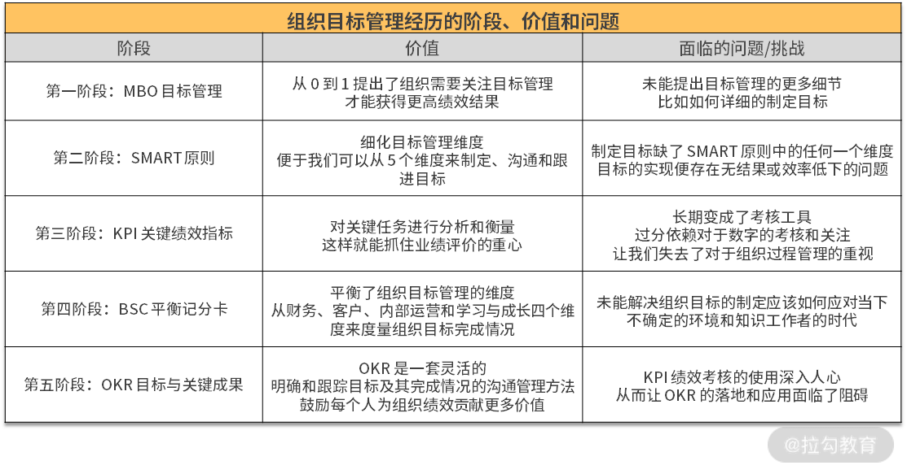
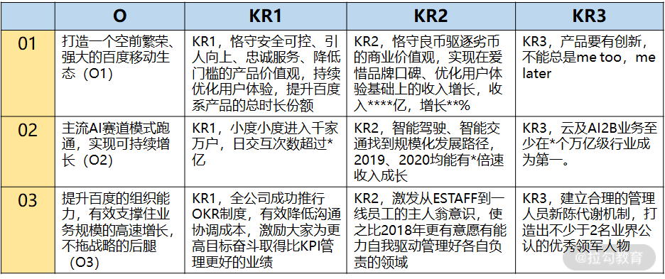
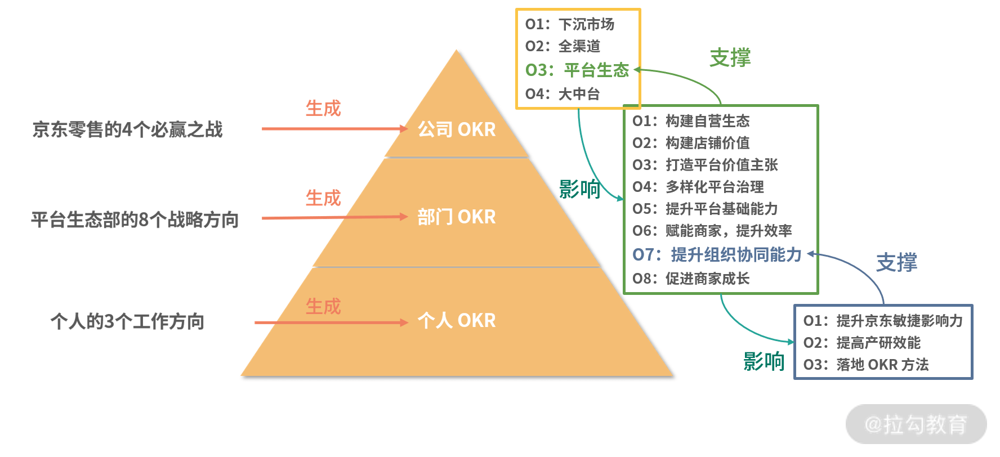
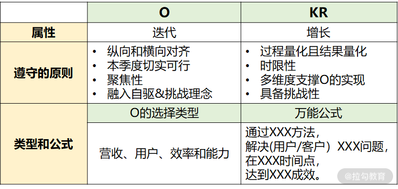
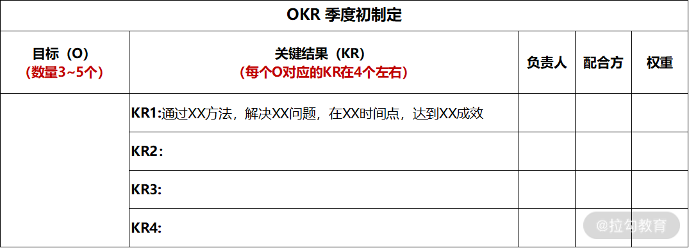
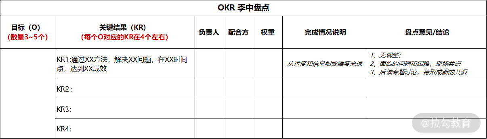
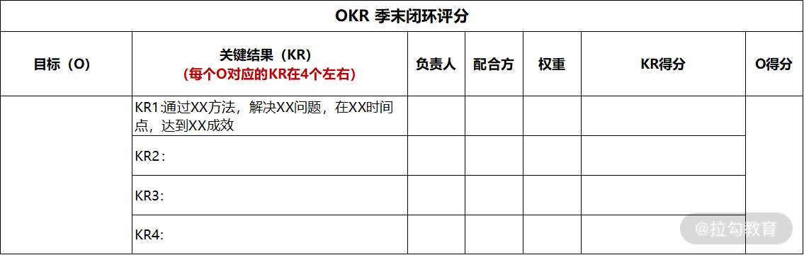

# 00 OKR工作法：组织目标管理的神器

OKR是一套目标管理方法论，一个包括了从目标制定，目标实现过程的管理，再到目标完成的效果评价的系统工程。
也可以用来管理学习、生活。

1. 解决“唯 KPI 论”难题，灵活获得组织绩效
2. 解决组织增长问题，保证组织目标落地执行
3. 提升组织文化建设和领导力，激活组织中的人

# 01 目标管理发展：OKR 之前，大家都在用什么管理组织目标？

- 第一阶段：MBO(Management by Objectives, 目标管理)
- 第二阶段：SMART原则。Specific, Measurable, Attainable, RFelevant, Time-bound
- 第三阶段：KPI 关键绩效指标。二八原理
- 第四阶段：BSC平衡记分卡
- 第五阶段：目标与关键成果(Objectives and Key Results)
  - 我要去哪？答案就是目标(Objective)
  - 我如何能达到那里？答案就是关键结果(Key Results)

# 02 OKR 价值：为什么互联网公司都在用 OKR？
- 对业务：OKR 可以推动业务变革并支撑业务长期成功发展
- 对经营：OKR 可以灵活应对组织经营环境的 VUCA 化。VUCA 指什么？就是不稳定（Volatile）、不确定（Uncertain）、复杂（Complex）和模糊（Ambiguous）。
- 对组织能力：OKR 可以全面提升组织能力，制胜互联网下半场。 领导、激励、文化三个维度的建设
- 对个人：OKR 可以激活组织中的知识工作者，助力组织绩效突破和创新。(目标感、成长、自主性)

# 03 OKR 与战略：OKR 如何解决组织增长问题？
组织的目标是如何确定的？
组织经营者在从事一项事业时都应该有自己的经营理论，这个经营理论首先需要解决三个基本问题：

- 一是组织的愿景是什么？
- 二是组织的特殊使命是什么？
- 三是完成组织使命所需的核心能力是什么？

由战略确定的组织目标，需要帮助组织解决增长的问题，并把增长反映在多维度的指标上。(交易额、收入、用户、利润)

Objective 就是目标，Key Results 就是多个关键结果。结合本课时上两个小节的分析，OKR 中的 O 对应的其实是战略确定的组织目标，KR 则对应的是所选战略方向的增长指标

OKR = 战略方向（O） + 多个增长指标（KRs）

李彦宏2019 OKR:

# 04 OKR 生成：各层级的 OKR 要遵循什么规律？

公司 -> 部门 -> 个人

个人 OKR 生成规律：上下对齐；自驱；外部支撑三种来源。

这就是生成个人 OKR 的规律，当工作中个人去制定 OKR 时，需要注意从上往下的对齐拆解以及横向的支持，
并能基于自己的能力自驱给组织创造额外的绩效价值，通过个人自驱型 OKR 的设立，就能把 OKR 鼓励挑战和自驱的理念落地。

# 05 O：什么样的 O 得领导赏识？
2019 快手OKR

- O：通过“K3”战役，在 2020 年春节前后，快手达 3 亿 DAU。
- KR1：依靠极速版，春节前 DAU 峰值突破3 亿。
- KR2：通过丰富垂类内容、大量签约 MCN、进行活动策划和运营、给予流量扶持等做法来保持留存率，保证春节前 DAU 峰值突破3 亿。
- KR3：依靠春晚红包，春节后三个月 DAU 平均值达到3 亿。

O的迭代属性。

接下来，我通过列举个人 2020 年 Q1、Q2 和 Q3 季度某个 O 的 3 种写法来说明 O 的迭代属性。

- Q1 该 O 的描述：京东 OKR 工作法落地和执行，帮助全部门高质量完成业务目标。
- Q2 该 O 的描述：京东 OKR 工作法落地和执行，高质量完成业务目标，灵活进行组织绩效管理。
- Q3 该 O 的描述：京东 OKR 工作法落地和执行，高质量完成业务目标，灵活进行组织绩效管理，并激活组织中的个体。

写好 O 遵循 4 个原则：

1. 纵向和横向对齐
2. 本季度切实可行
3. 聚焦性。每个人的 O 的数量在 2-5 个是合理的，不能不饱和，也不能太分散没聚焦
4. 融入自驱&挑战理念。自发挑战一些额外的对组织有价值有突破的工作

O 遵循了这四个原则，就确保了我们在组织中制定 OKR 的有效性。

- 注意纵向和横向对齐，不仅关注组织战略目标落地，也要支撑外部目标的协作和完成；
- 遵守切实可行的原则，确保 O 实现的合理性，杜绝“虚荣目标”；
- 把控 O 的数量，聚焦高质量的产出，以防什么都做却什么都做不好；
- 在 O 中融入自驱&挑战理念，让每个人都能发挥价值，创造出更多绩效。

O 的 4 种类型(按照优先级排序)：

1. 营收型。比如提升商家 GMV 和 ISV 商业化金额
2. 用户型。比如提升用户购物体验、页面的使用体验
3. 效率性。开发效率
4. 能力提升型：提升业务能力、提升员工能力

# 06 KR ：写好 KR 的万能公式

KR 的增长属性，KR 要能回到组织增长。

写好 KR 需要遵守 4 个原则：

1. 过程量化且结果量化。 时间+产出的形式进行量化，比如 XX 月完成 XX 功能的上线； XX 月底完成项目方案的讨论和制定
  - 案例1：通过每两周拍摄 1.5 个短视频的方式来记录所有敏捷团队的敏捷过程，在微信领域每个视频平均阅读和传播达到 UV300 以上 
  - 案例2：Q2 通过京粉为京东主站拉新 1000 万 
  - 案例3：依靠快手极速版，春节前 DAU 峰值突破 3 亿
2. 时限性。不要超过一个季度。时限是为了效率
3. 多维度支撑 O 的实现。多维度体现在 KR 的数量，一个 O 包含 3-5 个左右 KR。产出关键的成效作为 KR，可以两周或者月为周期带
   来的产出或者效果进行制定。
4. 具备挑战性。一个和行业比，一个和自己比

### 写好 KR 的万能公式

案例：

- 业务案例1：通过极简入驻的方法，Q3缩短商家平均入驻时长达10天。 
- 技术案例2：通过实践骨架屏技术，Q3让商家满意度达85分。

万能公式：通过 XXX 方法，在 XXX 时间点，达到 XXX 成效。

- “通过XXX方法”，就是指具体实现目标的路径、措施或是手段。
- “在XXX时间点”，意味着要有时限的概念。
- “达成XXX成效”，说的就是要有获得结果的量化效果。

目标的制定，必须首先考虑给用户/客户带来什么价值，解决什么问题，这是企业经营能立足的根本。

升级后的万能公式：通过XXX方法， 解决(用户/客户)XXX问题， 在XXX时间点， 达到XXX成效。

- 业务案例 1：通过极简入驻的方法，解决商家入驻流程复杂，学习成本高的问题，Q3 缩短商家平均入驻时长达10天。 
- 技术案例 2：通过实践骨架屏技术，解决前后端分离中页面加载白屏过长导致用户体验差的问题，Q3 让商家满意度达 85 分。

# 07 案例实战：教你写出高质量的 OKR

# 08 流程：你应该这样制定、管理 OKR!

在以季度运营 OKR 的节奏中，每个季度，我们都需要让个人、团队和部门都能基于 OKR 的工作流程来展开工作。这个工作流程包含了三个阶段：

1. 季度初的 OKR 制定；
  - KR 要有负责人
  - 涉及到外部依赖，需要及时和依赖方、配合方去人可行性
  - leader 尽可能及早参与
  - KR 需要多次讨论和梳理完善

2. 季度过程中的 OKR 检视和调整；以 日、周、季为单位
  - 日：每日站会。1.昨天进度 2.今天计划做什么 3.遇到的困难和阻碍，需要谁协助
  - 周：周会、周报。
    - 关注每个 O 下的 KR 进度和风险
    - 说明每个 KR 以周为单位，具体拆分出来的工作任务项完成情况
    - 跟进变化和新增的 OKR
  - 季中：整体 OKR 盘点
    - 讨论既定 OKR 的完成进度，以及存在的变化、问题和风险。
    - 共识新出现的 OKR 推进情况，以及在季末的阶段性 KR。
    - 对识别出的重大问题和风险，共识后续专题讨论的时间。

3. 季度末的 OKR 闭环管理。在京东内部，季末我们会对每个 KR 进行评分，评分维度分为了“远超预期：1分”“优秀：0.7分”“一般：0.3分”“无进展：0分”4 种
  - 自评的方式，就是自己给自己依托 4 个评分维度对每个 KR 进行完成结果的选择。
  - 他人评价的方式，就是让完成该 OKR 的相关方从 4 个评分维度进行评价。
  - KR的打分是结合完成进度和 KR 的挑战难度综合的评分

# 09 OKR 与 KPI 的区别和联系
关于年度带孩子成长目标的 OKR 和 KPI 写法:

- O：让孩子快乐、健康的成长到10 岁
- KR1： 今年陪伴孩子至少出去旅游一次，让孩子了解大千世界。
- KR2： 今年让孩子掌握游泳体育运动，并和宝宝每个月能一起去游泳馆游一次。
- KR3： 今年鼓励宝宝读 3 本关于名人传记的书，开拓宝宝的思维和认知。

KPI: 孩子长到 10 岁

KPI 过于偏向数字结果，OKR 展现形式既有过程，也有结果。

经营假设：OKR 灵活实现绩效方式，基于对经营环境不确定，是需要探索式前行的假设。

# 10 激励：如何用 OKR 激活你的团队

如果组织中导入了 OKR，HR 就要表态整个绩效评估必须要转移到 OKR 上来进行，管理者也是参考 OKR 中的实际绩效产出及 OKR 闭环管理时的评分来给下属打绩点，
这样的激励机制才能起到利用 OKR 来引导组织中的群体产生更高绩效。

### 通过 OKR 让个人目标和组织目标合二为一

在 OKR 的制定过程中，个人的 OKR 生成主要来自 3 个方面：

1、和上级对齐 2、自身岗位职责自驱 3、外部支撑相关

### 通过 OKR 激发工作的内在动力

明确的目标、工作更加自主、人能够获得成长、做事情有明显的推动进展感，这些内在动力都能极大地促成人对工作的热情，从而更好去完成工作目标，取得更高绩效结果。
内在激励的应用一定要围绕组织目标的制定和工作过程展开，也就是围绕 OKR 制定和实现过程来做，激发出真正能让人产生工作意愿、更好产生绩效结果的内在动力，才是有效内激励。

在京东内部，基于 OKR 工作方式的内激励，我们做了如下实践：

- OKR 制定好后，会让团队进行“OKR 解码”，发起 OKR 整体解读和共识会，让每个人都能非常清晰地知道团队的所有工作目标。（明确的目标）
- 让团队所有的 OKR 都通晒在内部的 OKR 系统上，还会建议把 OKR 打印贴出，直接透明在团队工作周围的物理看板上。（明确的目标）
- 在物理看板上，会结合纵向泳道 to do | doing | done，把 OKR 拆解出来的工作任务进展透明出来，并做及时更新。（管理 OKR 实现过程且带来进展感）
- 让团队自主建立基于 OKR 工作的每日站会，但不干涉具体会议内容，更关心团队在实现目标过程的问题和阻碍解决。（更自主、推动问题解决带来的进展感）
- 在打绩效时，综合考虑 OKR 中个人的方法论沉淀和影响力情况，这一点甚至纳入在京东高职级晋升的汇报 PPT 模板中。（个人成长）

### 通过 OKR 建立上下级良好的工作关系

除了早会，还有按周开展的周会，按重要项目开展的月会，开这些会的目的，是给了上下级能够正式沟通的机会，互相探讨问题，交换意见，保持信息上下流动，从而带来工作过程的信任。

尤其在 O 的选择中，聚焦营收、用户、效率和能力维度，就是在让制定的目标都是以价值导向，因为这些就是组织绩效的构成维度。所以， OKR 所有的理念和相关实践都是为了更好地获得绩效而在努力。

只有基于绩效的公平的激励，才能让人真正满意，让人更有持续的工作动力。

# 11 文化：OKR 文化的塑造和沉淀

### 什么是文化

- 人工饰物: 初进一个群体，看见、听见与感受到的一切事物
- 外显价值观: 理解并感受到的价值判断、信奉的理念
- 基本假设: 潜意识的、视为理所当然的

### 塑造 OKR 文化

- 调思维: 在组织内部，我们可以采用持续的培训、分享、讲座、思维大赛等方式来传播 OKR 思想。
  - 对环境：未来充满不确定性，需要拥抱变化，不断迭代试验前行。
  - 对人：每个人都能被激活，发挥作用，才能抓住更多机会。
  - 对业务：战略不仅仅是制定，更重要的是如何落地执行拿到增长结果。
  - 对组织：组织目标实现过程中的管理、领导、激励和文化建设的能力影响着绩效完成。

- 做管理。管理聚焦的这四个维度的具体 OKR 实践，背后都遵循着 OKR 所代表的拥抱不确定性、以人为本、增长导向、重视过程的理念，是 OKR 理念在管理实践维度的具象化。
  - 目标： 短期小目标、员工参与 OKR 制定、含有增长量化指标。
  - 事： 优先级、周会把控 OKR 变化情况、透明事的物理看板。
  - 人： 可随时更新 OKR、鼓励自驱型目标的设立。
  - 结果： 考核以实际增长绩效导向、OKR 结果通晒、互相评分。

- 定规则: 建立两个核心机制
  - 流程机制：基于 OKR 打造组织中目标管理的流程。
  - 激励机制：基于 OKR 来进行组织中的激励设计。

### 如何沉淀 OKR 文化

- 人物标杆
- 事迹和故事
- 工具和产品
- 书籍和文章
- 装饰和符号

# 12 变革：OKR 转型难点及解决方案

### OKR 转型的顶层设计

1. 这是一个组织系统
2. 考虑系统中的人
3. 考虑人与人的交互

难点与挑战：

- 如何以组织的形式落地 OKR？
- 如何让人能更容易产生应用 OKR的行为？
- 如何让 OKR更有效地扩散开？

### 如何以组织的形式落地 OKR

在正式组织里做任何事情，我们都是回到目标以及相匹配的职责上。

- OKR 覆盖度
- OKR NPS
- OKR 实现过程管理能力水平

### 如何让人更容易产生应用 OKR 的行为

个体的行为受到动机、能力和触发三个变量的综合影响。那么，在组织里，我们就需要从这三个变量切入，来解决人怎么才能更容易产生应用 OKR 的行为。

### 如何让 OKR 更有效地扩散开？
在做变革时，为了避免上来就“一刀切”给组织带来的风险，我们需要先做试点，然后总结试点的成功经验，继而再规模化铺开。

首先在组织中要成立 OKR 变革小组，由变革小组来牵头做 OKR 试点，试点运营 OKR 一段时间后，需要基于试点总结提炼 OKR 解决的组织问题和带来的价值，
然后设立 OKR 变革小组的工作目标，把 OKR 工作法推向全公司。

# 13 加餐 OKR 填写模板及案例

