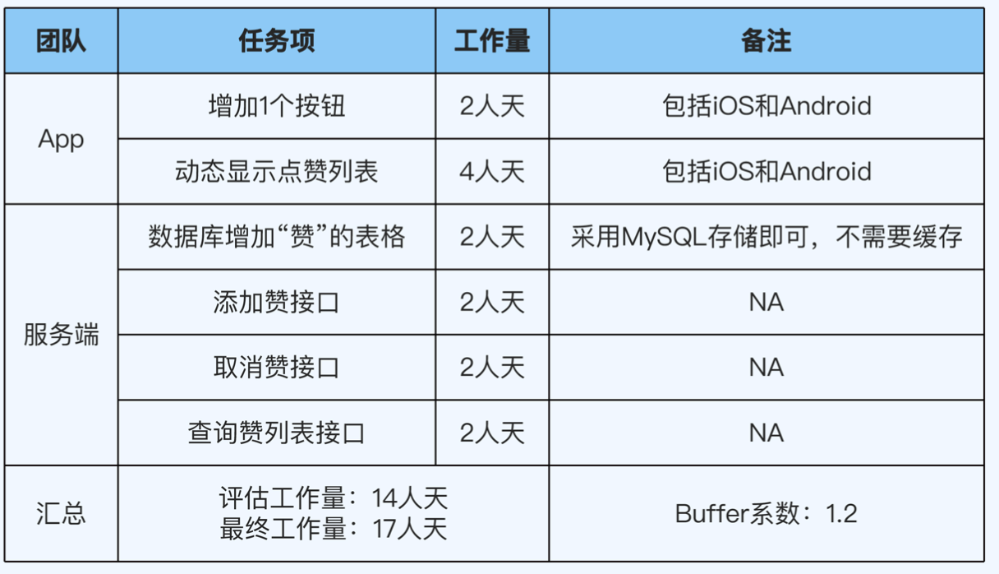
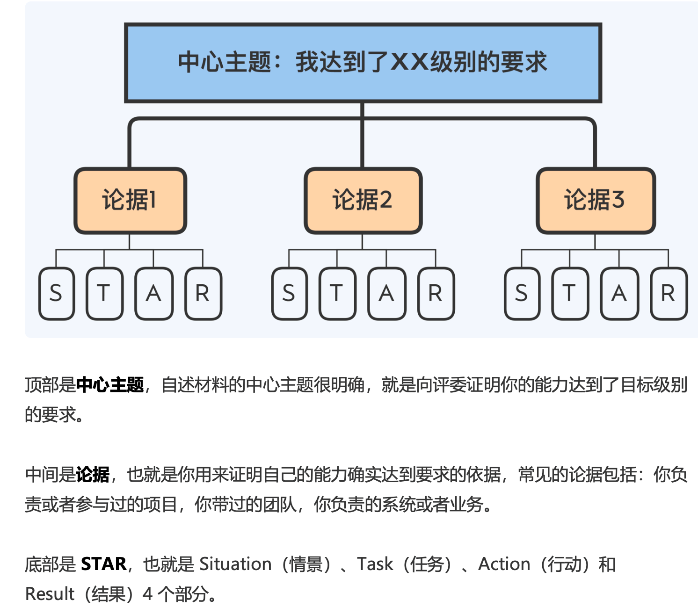
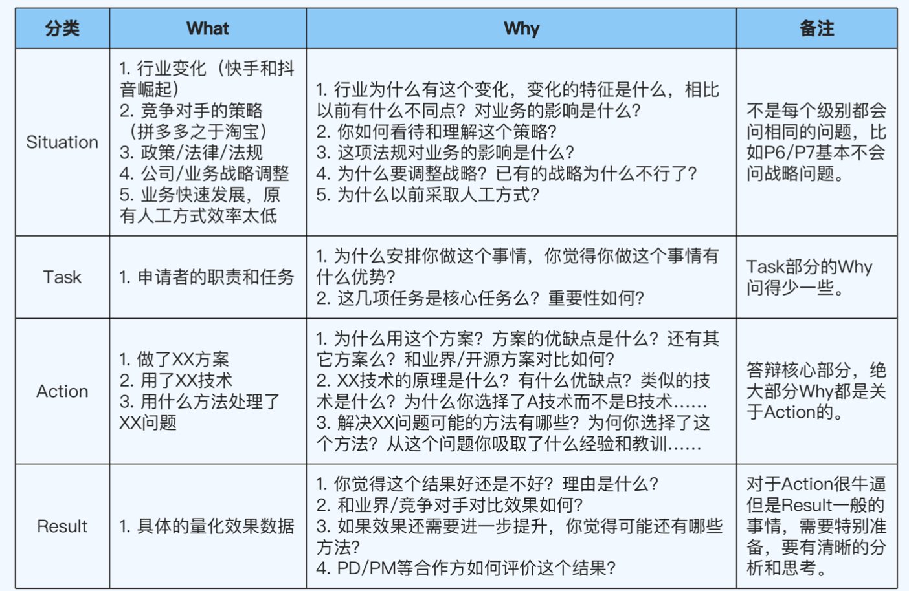
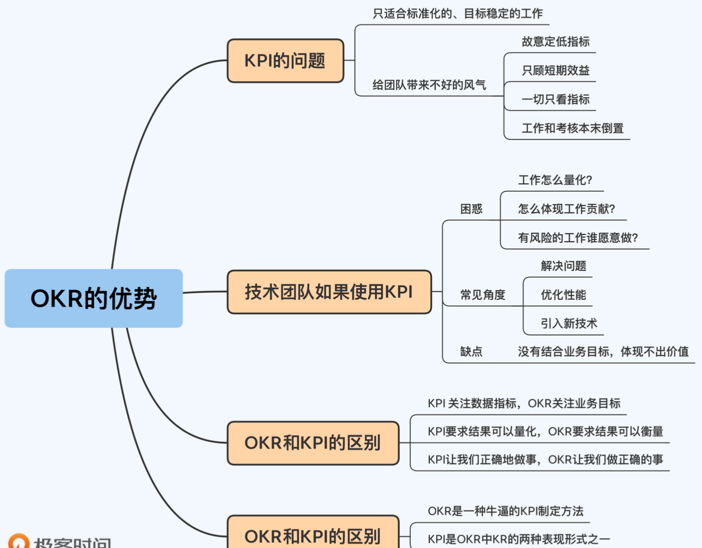
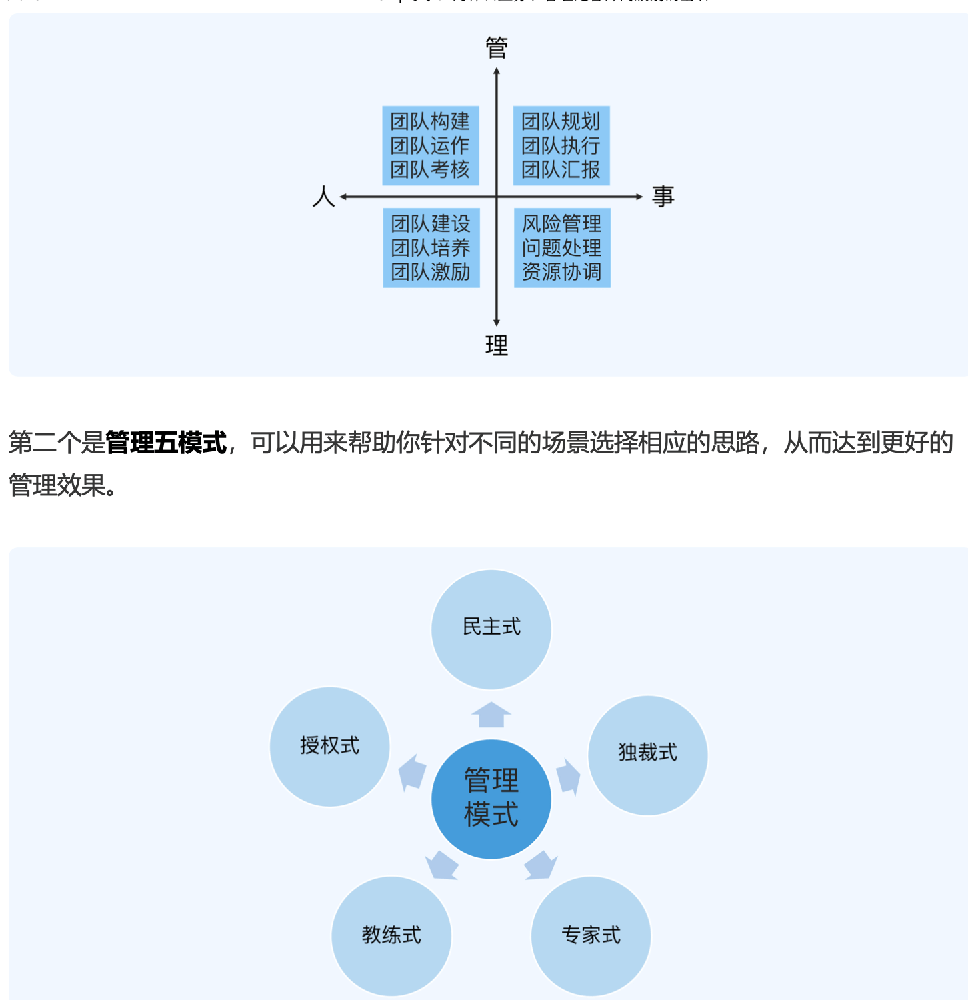
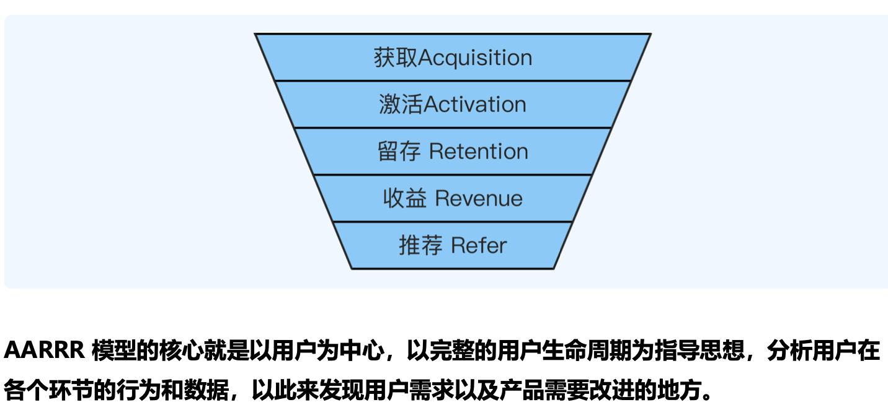

# 01 职级体系
阿里代表的跨越式；腾讯代表的阶梯式

# 02 晋升流程

1. 提名阶段
2. 预审阶段
3. 评审阶段
4. 复审阶段
5. 审批阶段
6. 沟通阶段

# 03 晋升原则： 什么样的人容易晋升?

## 1. 主动原则。主动做事。 
- 不好的习惯1：认为主管肯定会帮你搞晋升。不要等着当工具人
- 不好的习惯2：被动接受信息。业务上线后效果如何？不好的原因可能是什么？整体业务机房部署结构是什么样的？

如何做？

1. 主动找主管沟通工作
2. 主动找别人沟通了解更多信息

## 2. 成长原则：不断挖掘成长点
陷阱：

- 以为事情做得多就能晋升
- 以为事情做的好就能晋升。不光要看功劳和苦劳，更要看成长
- 一边做事，一边挖掘成长点，提升自己能力的人，比光顾做事的人更容易晋升
- 如果做业务已经效率高质量好，就试着完成方案设计、架构设计、架构重构和系统优化等工作
- 多复盘总结，找出来可以提升优化的点

跳出心理舒适区，尝试更高难度和更高复杂度的事情。

## 3. 价值原则：学习为公司产出价值的技能。能力级别和公司价值
你学这个，能为公司带来什么？(不要盲目去啃一些可能帮助不大的事情，比如编译原理等)。优先学习能为公司产出价值的技能

# 04 晋升逻辑: 别人怎么判断你有没有达到晋升要求？

1. 提前做下一级别的事。才有机会晋升
2. 做好当前级别的事。(当前级别精通)

- 基础：会做。独立自主完成
- 熟练: 做好。最佳实践
- 精通: 优化(创造新的经验)。不同的方式、思维和工具来做同样的事情，并取得突破。

通用晋升步骤：

1. 按照晋升原则指导，在当前级别拿到好的结果。提升到精通的程度
2. 精通后，对照下一级别要求提升自己能力
3. 主动寻找工作机会，尝试做下一个级别事情(成为负责人，主导事情的推进和落地等)，继续拿到好的结果
4. 拿到工作结果之后申请晋升。介绍你做的事情，相关能力和结果已经具备下一级别要求的能力

# 05 COMD能力模型：怎么把抽象的能力要求具体化？

## 公司统一的能力描述：抽象：

- P7 : 具备系统思考能力，能够全面掌握某个技术领域
- P8 : 具备前瞻判断能力，能够规划技术领域的发展方向

## 面向复杂度 的多维度能力模型(Complexity-Oriented & Multi-Dimension Capability Model)， 简称 COMD 能力模型。

技术、业务、管理三个维度和规模、时间、环境、创新四种复杂度。

1. 规模复杂度
  - 技术: 代码量、系统数据
  - 管理: 团队人数、涉及团队数量
  - 业务: 功能数量、关联业务方数量

2. 时间复杂度。时间跨度
3. 环境复杂度。环境不确定性： 稳定性、透明性、可预见性
4. 创新复杂度。
  - 理论创新: FLP, CAP
  - 思想创新: 批处理和流式处理
  - 技巧创新: 实现 Exactly Once 特性属于技巧创新, Flink 使用 Chandy-Lamport 算法

从 0 到1 创造系统 > 架构重构 > 项目方案设计 > 编码实现

## COMD 与抽象描述的对比：

- 系统思考：不同职级思考的范围也就是规模复杂度不同。
  - p6: 某个需求。需求合理性，设计可扩展性，上线后稳定性
  - p7: 单个系统。架构设计、重构、技术选型
  - p8: 某个领域。领域发展趋势、架构演进、团队组织结构等问题
  - p9: 多个关联业务领域组成的业务线。需要考虑业务发展趋势、架构演进、团队组织结构等问题

- 前瞻判断。
  - p6: 单个需求功能。事件跨度 1-3 个月。单个需求场景
  - p7: 单个子系统。6-12个月。用户特征、喜好等
  - p8: 多个子系统组成的业务域。1-2年。竞争对手的策略
  - p9: 多个业务域组成的业务线。2-3年。竞争对手的战略、行业发展趋势

# 06 职级档次：你现在应该具备的核心能力

- P5/P6: 专业工匠
- P7/P8: 乐团指挥
  - 分析阶段: 对目标进行深入细致的研究分析，识别和标注重点、难点和风险点
  - 计划阶段: 明确投入资源制定计划
  - 落地阶段: 拆解步骤，抓好每一个关键环节落实，做好风险预防措施，推动团队完成目标
- P9/P10: 电影导演

# 07 P5提升攻略：从学生到打工人

- 技术：重点积累基础技术
  - 基础是和工作内容相关的基础。(不是直接编译原理这种计算机基础)
  - 碎片化时间，系统化学习。对照一本经典的书籍循序渐进地学习，技术课程
- 业务：熟悉业务的处理逻辑
  - 广义：提供的功能和服务
  - 处理逻辑：实现功能和服务的步骤
  - 2c熟悉业务最有效的方法：让自己成为产品的深度用户。亲测体验、关心用户反馈。尽早换一个感兴趣的业务
  - 2b熟悉业务最有效的方法：多和客户交流，客户真实需求、痛点和想法
- 管理：了解公司的管理制度和项目流程。知道自己在项目流程中的职责和任务，熟悉上下游依赖和如何推进项目

# 08 P6提升攻略：怎么成为独立自主的项目能手

独立负责端到端任务。

- 技术。熟练掌握端到端的工作流技术。知道 what，还要知道 why
- 业务。掌握所有功能并深度理解处理逻辑
- 管理。推进项目中的子任务

工作量评估: WBS 分解法 (Work breakdown Structure)，工作分解结构。
把项目工作按照阶段分解成更小的、更易于管理的组成部分，提升项目管理的效率。
buffer 系数一般是在 1.2-1.6 浮动。全新业务一般 buffer 高一些，已有功能修改会低一些。

# 09 P7提升攻略：怎么成为让人信服的团队专家

- 技术：
  - 精通团队相关技术。指导p6/p7；制定技术规划
    - 规模复杂度：精通团队相关技术
    - 时间复杂度：能够规划团队 1 年内技术发展
    - 环境复杂度：对团队相关业界技术有一定理解
    - 创新复杂度：引入新技术和新方法
  - 不要因为管理丢掉技术
  - 提升技术宽度。链式学习法。多考虑引入新技术
  - 拒绝生搬硬套。不要盲目拷贝大厂技术；不要盲目追求新技术
  - 不要盲目追求新技术

- 业务：关注业务整体
  - 规模复杂度：掌握单个业务整体情况
  - 时间复杂度：规划业务整体 6-12 个月可能变化
  - 环境复杂度：熟悉竞品整体情况
  - 创新复杂度：能够提出一些新需求

从 4 个方面提升业务理解能力：用户特征、用户价值、获客方式和获利方式

1. 用户特征。我们的用户是谁。属性(学历、收入、年龄和地域)和场景(网购、唱歌、外卖和游戏等)
2. 用户价值。用户为什么要用我们的产品。满足需求或者竞品优势
3. 获客方式。怎么让用户用我们的产品。品牌广告、社交推荐、事件营销、SEO、线下地推和红包返利等
4. 获利方式。我们怎么赚钱。常见方式有广告费、会员会费、增值服务、服务费和销售产品等

从这 4 个方面进行拆解，P7 级别对业务的理解至少要达到以下 4 点要求，并且要能够量 化到具体的数据:

1. 知道行业总的用户规模，自己的业务总的用户量，用户的特征分布。
2. 熟悉行业的竞品，包括行业的排名、竞品的数据以及竞品间的差异和对比。
3. 熟悉常见的获客手段和效果指标(ROI、转换率和留存率等)，知道对自己的业务来说 效果最好的 3~5 个获客手段以及原因。
4. 熟悉常见的获利手段和效果指标(数值和比例等)，知道对自己的业务来说最核心的 3 ~5 个获利来源。如果负责的是用户子系统这种不直接产生收入的业务，则可以了解自 己的业务对收入会有什么影响。AARRR漏斗模型

- 管理。指挥 10 人以内小团队
  - 管理维度
    - 规模复杂度：单个团队管理
    - 时间复杂度：制定项目计划或者团队规划
    - 环境复杂度：熟悉上下游团队。与上下游团队的 team leader 搞好关系
    - 创新复杂度：团队级别的优化。引入新的管理方法或者措施提升团队效率和能力
  - 不要事必躬亲
  - 不要当甩手掌柜
  - 平衡点：三七比例法。平均下来管理 30%，技术工作时间占 70%。灵活变化。 PDCA 执行法

# 10 P8 提升攻略：怎么成为有影响力的“领域专家”
指挥多个团队达成目标。

- 横向模式
- 纵向模式

技术深度 + 领域相关的技术宽度

- 研究业界开源项目
- 参加业界技术大会

管理：核心是抓重点
  - 团队管理：搭建梯度。每个核心人员都至少有一个备份人员
  - 目标管理：参与制定，保证理解
  - 技术管理；关注演进

# 11 P9提升攻略 ： 跨域整合的“业务导演”

中层管理。 整合跨领域技术方案打造成熟落地产品上。

环式学习法。关注和学习新技术

- 业务: 从理解规划到亲自导演
  - 独立的一个或者一类产品
  - 某个行业中的一个或者一类产品
  - 某个中台的一个或者一类业务域

- 管理。授权但不要放羊

# 12 PPT 框架
误区：

- PPT 形式越炫酷越好
- 列举事情越多越好
- 内容越详细越好

标准框架：

- 结构清晰: 思维导图、时间线模型、架构图、流程图、UML 等
- 重点突出: 核心内容提炼 3-5点
- 与实际讲述内容匹配

三个部分：

- 自我介绍。(1-2页)
  - 基本信息：姓名、团队、职级和晋升职级
  - 当前职责
  - 工作经历
- 自述材料。(10-15页)
  - 金字塔原理：一个中心主题，设计 3-5 个核心论据。每个论据分为背景、任务、行动和结果 4 个部分

- 辅助内容(1-3页)
  - 自我总结
  - 发展规划

# 13 PPT写作：怎么写才能展示自己的真正实力

金字塔原理

技巧：

- 把 PPT 当成提词器
- 围绕能力要求提炼论据。核心论据和辅助论据
- STAR 方法描述论据
  - Situation(背景): 提炼 1-3 条关键内容概要
  - Task(任务)： 你在项目中发挥的作用
  - Action（行动）：1. 尽量用图，然后提炼几个关键内容展现 2. 写做了什么
  - Result(结果)： 虚实结合。效率、效果、质量和成本4 个维度量化评估
    - 先有基数后有比例
    - 用绝对值而不是相对值
    - 数值转化为钱(收入、支出、成本、人力等)

# 14 PPT讲解：如何让评委印象深刻

1. 做一个演讲者，而不是一个复读机
2. 有效页 1-3 分钟，总时间 20-30 分钟
3. 自述讲 what，答辩讲 why
4. 无论多忙都要安排模拟面评

# 15 答辩技巧

1. 明确提问类型，回答关键内容
  - what 类问题。结果。事情+结果
  - how 类问题。过程。方法+步骤
  - why 类问题。原因。原理+思考
    - 技术相关的。原理、原则方法论等
    - 决策相关的。背后思考，分析过程、方法、框架和决策标准等
  - 综合类问题。原理+思考。为什么用 memcache 而不是 redis

2. 答不上来想办法回到熟悉的领域
3. 发生争执就及时终止话题

# 16 导学

- 时间从哪来
- 学什么。 确定目标：三段分解法
- 怎么学: 提升技术深度（链式学习法）; 提升技术宽度（比较学习法）; 提升技术广度(环式学习法)
- 怎么保证学习效果。 学以致玩(Play 学习法)； 教学相长（Teach学习法）

# 17 海绵学习法
早起 30 分钟；通勤 2 小时；上班第一个 30 分钟；睡前 30 分钟；周末 2 小时

# 18 三段分解法：怎么利用一万小时
先定一个小目标（正反馈）

1. 分解等级。 p5-p10
2. 分解技能。为了下一个等级需求，需要哪些技能提升。哪里不懂补哪里。专项提升一般 6 个月左右
3. 分解行动。把二阶段目标细化为 1-2 个月三段目标。具体执行的时候分解到周

比如作者举例：

1. 1.5 个月:通读《UNIX 环境高级编程》
2. 1.5 个月:通读《Linux 系统编程》
3. 2 个月:通读《UNIX 网络编程 卷 1》
4. 1 个月:Linux 常用命令实战，包括 tcpdump、ps 和 top 等

# 19 链式、比较、环式学习法：多维度提升技术能力

链式学习法：

1. 一项技术深度可以分为哪些层
2. 明确你要学习到哪一层
3. 每一层应该怎么学

比较学习法：

1. 先用链式学习法掌握某个领域的一项技术，将这个领域的关键技术点整理成表格。
2. 基于整理好的技术点，学习这个领域的另一项技术，将它们在技术点上的差异整理成思 维导图。
3. 找出差异较大的技术点，将背后的原理和对应用场景的影响整理成表格。

环式学习法：提升技术广度

1. 画出来闭环
2. 由近及远、逐步攻克闭环上的各个节点

# 20 Play & Teach 摆脱入门到忘记的困境

Play学习法：

学以致用。通过模拟实践中的场景来学习和训练

1. 按照链式学习法的方式学习某项技术。
2. 列举常见的场景，搭建模拟场景。
3. 在模拟场景进行测试、体验和练习。(比如模拟线上故障场景，拔网线、杀进程、删文件)

Teach学习法:

- 写作。有助于整理技术体系；有助于了解细节
- 培训

# 21 导学：应该掌握哪些做事方法

做事能力的判断标准：

1. 具备闭环思维。不只是完成任务，从端到端的角度思考和落地。事前规划、事中执行、事后总结

以开发人员为例，虽然你只负责开发环节，但是如果按照闭环思维来做事，在做之前你除了理解需求之外，还应该去了解“为什么做这个需求”“需求的价值是什么”(事前规划)，
需求上线之后，你还应该去了解“需求上线后的结果怎么样?”“具体的业务数据是多少?”“我通过做这件事情收获了什么”(事后总结)等等。

2. 有方法论指导。有一套系统的流程或者模板
3. 能拿到好的结果。

思维要闭环，做事有方法，结果是关键。

# 22 OKR 的优势

# 23 OKR规划法：team leader 怎么做团队规划

### 阶段1：业务规划

1. 聚焦业务目标(O)
2. 分解关键结果(KR) 3-5个

### 阶段2：团队规划

1. 对齐业务 OKR
2. 补充专业 OKR

# 24 3C方案设计法: 怎么让方案有理有据
至少设计 3 (choices) 个方案，选最优的一个或者几个执行。

1. 预研阶段，设计 3-5 个备选方案
2. 讨论阶段。上级汇报或者同行评审
3. 决策阶段。挑选最终方案

# 25 PDCA 执行法。怎么推动落地

所谓 PDCA 执行法，就是把事情的执行过程分成四个环节:计划(Plan)、执行 (Do)、检查(Check)和行动(Act)，从而把控执行过程，
保证具体事项高效高质量落地。

1. 计划(Plan): 确定具体任务、阶段目标、时间节点和具体责任人
  - 处理紧急事情要长短结合
  - 重要不紧急事情要拆分多个小项目
  - 学会利用上级力量协调资源

2. 执行(Do)
  - 根据情况采取相应管理风格
  - 做好信息同步

3. 检查(Check)
  - 使用5W分析问题根因

4. 行动(Act)
  - 做好总结汇报
  - 每次最多挑选 3 个改进点落实到流程

# 26 5W根因分析法

5个为什么，不断追问，思考根本原因

1. 问题数量不是关键，找到根本原因才是。下一个问题是对上一个问题的进一步深入
2. 首先明确问题本身
3. 避免变成大型撕逼现场

# 27 5S问题处理法：怎么应对问题才能转危为机

明确问题(Specify)、拆解问题(Split)、定位问题(Seek)、解决问题 (Solve)和落地行动(Sort)

1. 明确问题
  - 量化问题：确认数据是否准确，多方关联验证。
  - 非量化问题：能量化的补上，不能量化的调查问卷

2. 拆解问题
   - 不要单打独斗，利用团队力量
   - 3-5 个问题，尽量相互独立，明确责任人，组成工作组定期向上汇报进展

3. 定位问题 (5W根因分析)
4. 解决问题 (3C方案设计法)
5. 落地行动。排序优先级，然后用 PDCA 执行法

# 48 4D总结法：怎么展示工作亮点？

4D总结法：结果、数据、技术和成长四个维度。

1. 结果
  - 业务开发项目。日活
  - 技术优化方案：故障次数
  - 管理措施：效率和质量提升，同样的人支撑了更多业务

2. 数据
3. 技术。领域分层图、细节分层图和方案对比图
4. 成长。
  - 业务适应场景是什么
  - 目标用户是谁
  - 目标用户有什么特点
  - 解决了目标用户什么问题
  - 实际效果如何
  - 用户为什么喜欢/不喜欢这个功能

# 29 金字塔汇报法。怎么汇报才能让领导认可你的成果

核心思想是任何事情都可以归纳出一个中心思想，中心思想可由三至七个论点 支持，每个论点可以由三至七个论据支撑，这样延伸下去，形状像一个金字塔。

1. 结论先行
  - 1. 先重要(结论)后次要(结论)
  - 2. 先全局后细节
  - 3. 先总体(结论)后细分(结论)
  - 4. 先论点后论据
  - 5. 先结论后原因
  - 6. 先结果后过程

2. 自顶向下
3. 归类分组。相似论点抽象、归纳、提炼、总结成一组，最后形成 5 个左右分组
4. 逻辑递进

金字塔汇报法: 总体结论、具体分析、关键事项、总结改进

1. 总体结论
2. 具体分析。具体的数据和证据
3. 关键事项。全局大图、演进路径、时间轴等
4. 总结改进。业务、技术、管理

# 30 四线复盘法：如何避免成为背锅侠
复盘：事实、分析、定责、改进

1. 讲清楚事实
2. 全面且深入分析
3. 各方心服口服的定责结论
4. 制定可以落地的改进措施

四线：

1. 时间线。问题发生经过。发现、处理中的各种措施、恢复时间和影响结果等
2. 问题链。问题传导路径
3. 责任链。
  - 违反公司规章制度、流程承担主责
  - 出现重大纰漏的承担主责
  - 问题源头承担主责
  - 问题放大者承担主责
4. 改进线。改进计划、措施、责任人和时间点等

# 31 导学：为什么业务和管理是晋升高级别的基石

为什么要懂业务？

1. 更好理解需求
2. 更好地设计方案。性能、高可用、扩展，结合业务特点设计
3. 更好地做团队规划

怎么提升业务能力？

- P5/P6 的要求的范围是业务功能，你需要熟悉自己的系统(比如交易中心的订单管理子系 统)提供的功能，相关功能的作用和实际的业务数据等。
- P7/P8 的要求的范围是业务领域，你需要熟悉业务端到端的流程(比如某次秒杀活动)， 整体业务的作用，实际的业务数据，业务的发展历史，业务经验和教训以及理解每年的业务规划和总结等。
- P8+/P9 要求的范围是业务战略，你需要熟悉行业情况(比如淘宝、拼多多、京东的电商 直播业务)，竞争对手情况，可能的业务方向，行业的发展趋势和动向等，制定或参与制定业务规划。

快速入门：

- P8+/P9 : 保洁战略模型
- P7/P8 : AARRR
- P5/P6 : 5W1H8C1D

管理真正的作用式整合团队的力量

提升管理能力的挑战：

1. 管理技能积累不多
2. 管理知识多样性
3. 管理的不确定性

管理的四象限和五模式:

# 32 5W1H8C1D: P5/P6 怎么理解业务功能？

### 5W 

When(何时)、Where(何地)、 Who(何人)、What(何事)、Why(何因)，代表需求产生的背景和功能上线后的运 行环境，类似于操作系统上下文(Context)的概念。

1. When: 时间相关信息。季节、日期、作息时间等
2. Where: 地点相关信息。国家地区、室内外、建筑物、街道
3. Who: 参与者。投资者、管理者；使用者、维护者；监督者、评估者；交互者
4. What: 客户想要的输出结果。 
5. Why: 客户遇到的问题

### 1H 

How : 业务需求的处理逻辑

### 8C

质量属性。功能属性是否满足需求，也要看质量属性是否符合要求。

约束条件(Constraint)。业务需求的 8 个 C:

1. 性能(Performance)。系统提供相应服务的效率，响应时间和吞吐量
2. 成本(Cost)。为了实现系统付出的代价。
3. 时间(Time)。交付时间
4. 技术(Technology): 客户指定的技术
5. 可靠性(Reliability): 系统长时间正确运行的能力
6. 安全性(Security): 信息安全的保护能力。涉及到钱、身份证号等隐私
7. 合规性(Complicance): 满足行业标准、法律法规、规范等
8. 兼容性(Compatibility): 与已有系统兼容能力

### 1D (Data)
数据，反应上线后的效果(Result)。

1. 业务效果，比如 DAU、MAU、活动参与人数、订单数、成交量、成交额、运营效率等
2. 系统效果。峰值TPS、接口性能、响应时间、崩溃率、可用性、成本和开发效率等

# 33 AARRR漏斗模型：P7/P8 怎么掌握业务领域？

AARRR 这 5 个字母分别代表 Acquisition、Activation、Retention、Revenue 和 Refer 五个英文单词，
它们分别对应用户生命周期中的 5 个重要环节:获取(Acquisition)、 激活(Activation)、留存(Retention)、收益(Revenue)和推荐(Refer)。

1. 获取(Acquisition)。触达用户，渠道：广告、社交推广、老用户推荐、主播推荐等。吸引用户进入产品
2. 激活(Activiation)。获取的用户转化为产品真实用户。
3. 留存(Retention)。激活的用户转化为产品长期用户。产品粘性(满足用户真正需求或者解决问题)
4. 收益(Revenue): 留存的用户转化为收益。购买产品、vip 服务、广告点击、平台佣金等
5. 推荐(Refer): 以老带新实现用户增长。病毒式传播

学习和使用技巧：

1. 业务相关的漏斗手段。掌握业务相关的常见的漏斗手段和优缺点 
2. 核心业务的漏斗数据。掌握核心业务的漏斗数据。选择业务量排名前3-5 名，访问量、成交量、成交额和活跃用户数等
3. 团队业务的详细漏斗数据。当前团队业务的详细漏斗数据
4. 竞争对手的漏斗

渠道：

1. 业务内的各种统计分析平台
2. 业务总结会议和规划会议
3. 行业分析、三方分析、公司财报等
4. 和产品运营人员聊聊

# 34 宝洁战略模型：P8+/P9 怎么看懂业务战略？
《宝洁制胜战略》 核心思想就是 “战略就是选择”。包括想做什么、能做什么、要做什么和不做什么。

愿景&使命；定位；策略；能力；组织

1. 愿景&使命。要做的事情的范围和目标
2. 定位。企业进军哪一类市场
3. 策略。何种方式和手段赢得竞争。总成本领先和差异化
4. 能力。企业能否真正将策略落地并取得成果
5. 组织。各个团队能否协同一致高效落地策略

应用：

- 愿景和使命。宣传口号，主要还是价值观要求
- 定位和策略。理解业务定位和策略
- 能力。技术可行性、可选技术方案、所需技术成本
- 组织。专项团队；横向团队；纵向团队；负责人制

# 如何画好领域分层图

领域分层图和细节分层图。

其中细节分层图基本上可以按照固定的模板去画(接口设计、设计原理、设计方案和实现源码)，
但是领域分层图并没有统一的模板，因为不同技术领域的分层方式可能会有很大差异。

1. 搜集资料。权威资料，官方文档，经典书籍论文等
2. 挖掘技术点。关键名词技术点
3. 针对技术点学习
4. 画初稿
5. 迭代优化

探索试错和学习的过程比拿到结果更有价值。

# 不同公司职级体系如何对标？

# 提名词：怎么夸自己

4 个错误：

1. 罗列事项
2. 写的太虚
3. 没有条理
4. 画蛇添足

三大要点：

1. 提炼重点。3-5 个和晋升强相关的关键能力点
2. 虚实结合。提炼关键能力后， 必须给出 1-2 个案例证明
3. 条理分明。排版让成果和亮点一目了然

# 一万小时定律：成为大牛的秘密是什么？

布鲁姆：长期大量练习。 大多数成功人士来说，最重要的因素是家人的鼎力支持、长期大量的练习和专业老师指导。

埃里克森：一万小时练习时间。

格拉德威尔：一万小时定律。必要条件，而不是充分条件

丹尼尔科伊尔《一万小时天才理论》

1. 精深练习。设定努力的目标，然后挑战自己的能力极限，不断重复练习更高要求的技能才能提升自己。
2. 激情。个人激情作为持续投入的动力。你要喜欢这件事情，从中感受到快乐和满足
3. 伯乐。需要伯乐对学员进行观察，然后指出需要改正的地方和练习方法，这样才能快速提升

互联网技术领域如何落地?

1. 没有伯乐？同事中的高手；看书和学习线上课程；行业会议；线下训练营
2. 技术变化太快怎么办？基础技术不会变；新技术往往是在老技术进化而来

如果只是想熟练掌握某个技能，20 小时学习法更合适：

1. 分解步骤:把技能最大程度地细分，分成若干小步骤。
2. 充分学习:基于分解步骤得到的小步骤，逐一练习。
3. 克服困难:克服练习过程中的各种困难，包括生理、心理、情绪、工具、环境等。 
4. 集中练习:至少用 20 小时集中学习最重要的小步骤。

# 学习基础技术：你对基础的理解准确么？

典型错误观点：

1. 基础=底层
2. 基础=源码
3. 基础=不变

我的观点是“基础能力是指工作任务相关的基础能力，不是整个计算机技术的基础能 力”，核心就是“工作相关”，
千万不要单纯照搬别人口中的基础能力。

1. 基础!=底层。如果底层技术和当前工作无关，就不是工作要求的基础能力
2. 基础!=源码。如果当前的工作并不需要我们去修改其源码或者理解其源码细节，那就不是工作要求的基础能力。
3. 基础!=不变。 SICP 课程(停课了)不是为今天的程序员准备的，而是为 20 世纪 80~90 年代的程 序员准备的。

细化基础范围：技能图谱

1. 工具:工作中常用的工具，比如 IDE、编程语言、问题定位工具和版本管理工具等。
2. 生态:系统或者产品运行时依赖的所有组件或者系统，比如第三方库、中间件、数据 库、文件系统和游戏引擎等。
3. 容器:系统或者产品在哪里运行，比如 Android、iOS、Linux、浏览器和云服务器等。
4. 原理:需要掌握的原理知识，常见的有计算机网络会让数据结构等。

提升技术的技巧: 有限的时间和精力用在更有价值的地方，投入产出效率最大化
