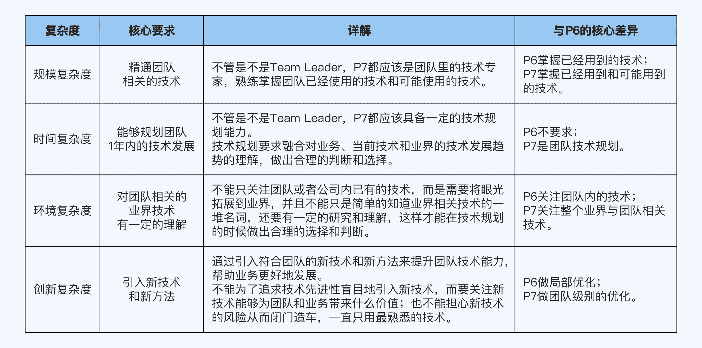

# 01 职级体系
阿里代表的跨越式；腾讯代表的阶梯式

# 02 晋升流程

1. 提名阶段
2. 预审阶段
3. 评审阶段
4. 复审阶段
5. 审批阶段
6. 沟通阶段

# 03 晋升原则： 什么样的人容易晋升?

## 1. 主动原则。主动做事。
- 不好的习惯1：认为主管肯定会帮你搞晋升。不要等着当工具人
- 不好的习惯2：被动接受信息。业务上线后效果如何？不好的原因可能是什么？整体业务机房部署结构是什么样的？

如何做？

1. 主动找主管沟通工作
2. 主动找别人沟通了解更多信息

## 2. 成长原则：不断挖掘成长点
陷阱：

- 以为事情做得多就能晋升
- 以为事情做的好就能晋升。不光要看功劳和苦劳，更要看成长
- 一边做事，一边挖掘成长点，提升自己能力的人，比光顾做事的人更容易晋升
- 如果做业务已经效率高质量好，就试着完成方案设计、架构设计、架构重构和系统优化等工作
- 多复盘总结，找出来可以提升优化的点

跳出心理舒适区，尝试更高难度和更高复杂度的事情。

## 3. 价值原则：学习为公司产出价值的技能。能力级别和公司价值
你学这个，能为公司带来什么？(不要盲目去啃一些可能帮助不大的事情，比如编译原理等)。优先学习能为公司产出价值的技能

# 04 晋升逻辑: 别人怎么判断你有没有达到晋升要求？

1. 提前做下一级别的事。才有机会晋升
2. 做好当前级别的事。(当前级别精通)

- 基础：会做。独立自主完成
- 熟练: 做好。最佳实践
- 精通: 优化(创造新的经验)。不同的方式、思维和工具来做同样的事情，并取得突破。

通用晋升步骤：

1. 按照晋升原则指导，在当前级别拿到好的结果。提升到精通的程度
2. 精通后，对照下一级别要求提升自己能力
3. 主动寻找工作机会，尝试做下一个级别事情(成为负责人，主导事情的推进和落地等)，继续拿到好的结果
4. 拿到工作结果之后申请晋升。介绍你做的事情，相关能力和结果已经具备下一级别要求的能力

# 05 COMD能力模型：怎么把抽象的能力要求具体化？

## 公司统一的能力描述：抽象：

- P7 : 具备系统思考能力，能够全面掌握某个技术领域
- P8 : 具备前瞻判断能力，能够规划技术领域的发展方向

## 面向复杂度 的多维度能力模型(Complexity-Oriented & Multi-Dimension Capability Model)， 简称 COMD 能力模型。

技术、业务、管理三个维度和规模、时间、环境、创新四种复杂度。

1. 规模复杂度
  - 技术: 代码量、系统数量
  - 管理: 团队人数、涉及团队数量
  - 业务: 功能数量、关联业务方数量

2. 时间复杂度。时间跨度
3. 环境复杂度。环境不确定性： 稳定性、透明性、可预见性
4. 创新复杂度。理论>思想>技巧
  - 理论创新: FLP, CAP定理
  - 思想创新: 批处理和流式处理
  - 技巧创新: 实现 Exactly Once 特性属于技巧创新, Flink 使用 Chandy-Lamport 算法
  - 管理和业务创新：开发memcache/redis；引入设计模式优化代码；微服务拆分系统；优化项目流程；提出新的业务模式

复杂度排序：从 0 到1 创造系统 > 架构重构 > 项目方案设计 > 编码实现

## COMD 与抽象描述的对比：

- 系统思考：不同职级思考的范围也就是规模复杂度不同。
  - p6: 某个需求。需求合理性，设计可扩展性，上线后稳定性
  - p7: 单个系统。架构设计、重构、技术选型
  - p8: 某个领域。领域发展趋势、架构演进、团队组织结构等问题
  - p9: 多个关联业务领域组成的业务线。需要考虑业务发展趋势、架构演进、团队组织结构等问题

- 前瞻判断。
  - p6: 单个需求功能。事件跨度 1-3 个月。单个需求场景
  - p7: 单个子系统。6-12个月。用户特征、喜好等
  - p8: 多个子系统组成的业务域。1-2年。竞争对手的策略
  - p9: 多个业务域组成的业务线。2-3年。竞争对手的战略、行业发展趋势

技术、业务、管理。规模复杂度、时间复杂度、环境复杂度、创新复杂度

# 06 职级档次：你现在应该具备的核心能力

- P5/P6: 专业工匠。是否能独立完成任务
- P7/P8: 乐团指挥。指挥单个还是多个团队
  - 分析阶段: 对目标进行深入细致的研究分析，识别和标注重点、难点和风险点
  - 计划阶段: 明确投入资源，根据团队情况制定计划
  - 落地阶段: 拆解步骤，抓好每一个关键环节落实，做好风险预防措施，推动团队完成目标
- P9/P10: 电影导演

# 07 P5提升攻略：从学生到打工人

COMD 能力模型：技术、业务、管理三个维度和规模、时间、环境、创新四种复杂度

- 技术：重点积累基础技术
  - 基础是和工作内容相关的基础。(不是直接编译原理这种计算机基础)
  - 碎片化时间，系统化学习。对照一本经典的书籍循序渐进地学习，技术课程
- 业务：熟悉业务的处理逻辑
  - 广义：提供的功能和服务
  - 处理逻辑：实现功能和服务的步骤
  - 2c熟悉业务最有效的方法：让自己成为产品的深度用户。亲测体验、关心用户反馈。尽早换一个感兴趣的业务
  - 2b熟悉业务最有效的方法：多和客户交流，客户真实需求、痛点和想法
- 管理：了解公司的管理制度和项目流程。知道自己在项目流程中的职责和任务，熟悉上下游依赖和如何推进项目

# 08 P6提升攻略：怎么成为独立自主的项目能手

独立负责端到端任务。

- 技术。熟练掌握端到端的工作流技术。知道 what，还要知道 why
- 业务。掌握所有功能并深度理解处理逻辑
- 管理。推进项目中的子任务

工作量评估: WBS 分解法 (Work breakdown Structure)，工作分解结构。
把项目工作按照阶段分解成更小的、更易于管理的组成部分，提升项目管理的效率。
buffer 系数一般是在 1.2-1.6 浮动。全新业务一般 buffer 高一些，已有功能修改会低一些。

# 09 P7提升攻略：怎么成为让人信服的团队专家
指挥单个团队达成目标

- 技术：
  - 精通团队相关技术。指导p6/p7；制定技术规划
    - 规模复杂度：精通团队相关技术
    - 时间复杂度：能够规划团队 1 年内技术发展
    - 环境复杂度：对团队相关业界技术有一定理解
    - 创新复杂度：引入新技术和新方法
  - 不要因为管理丢掉技术
  - 提升技术宽度。链式学习法。多考虑引入新技术
  - 拒绝生搬硬套。不要盲目拷贝大厂技术；不要盲目追求新技术

- 业务：关注业务整体
  - 规模复杂度：掌握单个业务整体情况
  - 时间复杂度：规划业务整体 6-12 个月可能变化
  - 环境复杂度：熟悉竞品整体情况
  - 创新复杂度：能够提出一些新需求

从 4 个方面提升业务理解能力：用户特征、用户价值、获客方式和获利方式

1. 用户特征。我们的用户是谁。属性(学历、收入、年龄和地域)和场景(网购、唱歌、外卖和游戏等)
2. 用户价值。用户为什么要用我们的产品。满足需求或者竞品优势
3. 获客方式。怎么让用户用我们的产品。品牌广告、社交推荐、事件营销、SEO、线下地推和红包返利等
4. 获利方式。我们怎么赚钱。常见方式有广告费、会员会费、增值服务、服务费和销售产品等

从这 4 个方面进行拆解，P7 级别对业务的理解至少要达到以下 4 点要求，并且要能够量 化到具体的数据:

1. 知道行业总的用户规模，自己的业务总的用户量，用户的特征分布。
2. 熟悉行业的竞品，包括行业的排名、竞品的数据以及竞品间的差异和对比。
3. 熟悉常见的获客手段和效果指标(ROI、转换率和留存率等)，知道对自己的业务来说 效果最好的 3~5 个获客手段以及原因。
4. 熟悉常见的获利手段和效果指标(数值和比例等)，知道对自己的业务来说最核心的 3 ~5 个获利来源。如果负责的是用户子系统这种不直接产生收入的业务，则可以了解自 己的业务对收入会有什么影响。AARRR漏斗模型

AARRR漏斗模型

- 管理。指挥 10 人以内小团队
  - 管理维度
    - 规模复杂度：单个团队管理
    - 时间复杂度：制定项目计划或者团队规划
    - 环境复杂度：熟悉上下游团队。与上下游团队的 team leader 搞好关系
    - 创新复杂度：团队级别的优化。引入新的管理方法或者措施提升团队效率和能力
  - 管理避免走极端。系统化掌握管理基本技能
    - 不要事必躬亲
    - 不要当甩手掌柜
  - 平衡点：三七比例法。平均下来管理 30%，技术工作时间占 70%。灵活变化。 PDCA 执行法

# 10 P8 提升攻略：怎么成为有影响力的“领域专家”
指挥多个团队达成目标。

- 横向模式
- 纵向模式

- 技术：精通领域相关技术
  - 技术深度 + 领域相关的技术宽度
  - 领域的划分和边界。架构师技能图谱 https://github.com/TeamStuQ/skill-map/blob/master/data/designbyStuQ/png-Architect-by-StuQ.png
    - 研究业界开源项目。《如何高效学习开源项目》
    - 参加业界技术大会

- 业务：熟悉多个业务或者精通多个端到端业务
  - 任务是从过程角度衡量的，而目标是从结果的角度来衡量的
  - 业务发展有不可控因素，快速发展的团队更容易出结果。晋升要考虑自我奋斗，但也要考虑历史进程

- 管理：核心是抓重点
  - 团队管理：搭建梯度。每个核心人员都至少有一个备份人员
  - 目标管理：参与制定，保证理解
  - 技术管理；关注演进。 532标准，技术 50%， 管理 30%，业务 20%

# 11 P9提升攻略 ： 跨域整合的“业务导演”
机遇和运气

中层管理。 整合跨领域技术方案打造成熟落地产品上。

- 技术:跨领域整合能力
  - 整合跨领域的技术方案来打造成熟落地的作品上
  - 案例：面向业务的立体化高可用架构设计
  - 宏观层面熟悉多个领取的技术，包括技术原理、优缺点、适应场景和业界应用等
  - 环式学习法。关注和学习新技术

- 业务: 从理解规划到亲自导演
  - 业务范围
    - 独立的一个或者一类产品
    - 某个行业中的一个或者一类产品
    - 某个中台的一个或者一类业务域
  - 规划和突破
  - 业务能否突破，运气成分很大

- 管理。授权但不要放羊

# 12 PPT 框架
晋升ppt常见误区：

- PPT 形式越炫酷越好
- 列举事情越多越好
- 内容越详细越好

标准框架：

- 结构清晰: 金字塔原理，思维导图讲解思路，时间线模型讲解发展历程，架构图讲解系统，流程图讲解业务，UML讲解代码等
- 重点突出: 核心内容提炼 3-5点
- 与实际讲述内容匹配

三个部分：

- 自我介绍。(1-2页)
  - 基本信息：姓名、团队和业务、职级和晋升职级
  - 当前职责, 主要职责，参与或者负责的业务、是否带团队、团队规模多大、担任关键岗位
  - 工作经历。哪里待过、做过哪些重要项目。 比如： 在岗时间/业务线/最高职位/关键项目

- 自述材料。(10-15页)
    - 金字塔原理：1个中心主题，设计 3-5 个核心论据。每个论据分为背景、任务、行动和结果 4 个部分展开
      - 中心主题: 论据 1(STAR)， 论据 2(STAR)， 论据 3(STAR)

- 辅助内容(1-3页)
  - 自我总结。能力矩阵或者区块
  - 发展规划。自己的发展目标、业务的发展趋势、自己的不足(更高的要求)

# 13 PPT写作：怎么写才能展示自己的真正实力

金字塔原理

技巧：

- 把 PPT 当成提词器，而不是讲话稿。提示你自己，也提示评委
- 围绕能力要求提炼论据。
  - 核心论据，和目标级别的能力要求强相关，一般 3-5 项
  - 辅助论据。锦上添花，1-3 条
- STAR 方法描述论据
  - Situation(背景): 提炼 1-3 条关键内容概要
  - Task(任务)： 你在项目中发挥的作用，而不是整个项目多牛
  - Action（行动）：自己做了什么，展现了哪些能力， 这是最关键部分。
    - 1. 尽量用图，然后提炼几个关键内容展现
    - 2. 写做了什么，而不是为什么这么做
  - Result(结果)： 虚实结合，重点在实。效率、效果、质量和成本4 个维度量化评估
    - 量化评估的原则：
      - 先有基数后有比例
      - 用绝对值而不是相对值
      - 数值转化为钱(收入、支出、成本、人力等)

- 常见疑问？
  - 背景庞大要不要介绍。要介绍，但是要根据不同级别不同方式。p8/p9产业链图，p7/p8/p9 业务大图
  - 技术难度高，但是效果不好要不要讲？不可控因素可以讲，如果是自己导致的不要讲
  - 技术难度不高但是效果特别好，可不可以讲？建议不讲。不是证明绩效而是证明能力达到要求，评委会认为“只有苦劳没有功劳”
  - 做了 10 件事情但是没有一件出彩的，可不可以讲。若果是核心工作这样子就比较危险了，辅助类还可以补救

# 14 PPT讲解：如何让评委印象深刻

1. 做一个演讲者，而不是一个复读机。ppt 布局，根据从左到右，从上往下的顺序
2. 有效页 1-3 分钟，总时间 20-30 分钟。ppt 有效页数是 10-15 页，多裁少补
3. 自述讲 what，答辩讲 why
4. 无论多忙都要安排模拟面评。自己试讲，注意发声不要默念和计时。内部模拟面屏

# 15 答辩技巧
面评三个环节：准备、自述和答辩。 答辩是直接决定是否晋升的关键

核心思想：只需要展示核心能力。

1. 明确提问类型，回答关键内容。哪种类型，关注点是什么
  - what 类问题。结果。事情+结果
  - how 类问题。过程。方法+步骤
  - why 类问题。原因。原理+思考
    - 技术相关的。原理、原则方法论等
    - 决策相关的。背后思考，分析过程、方法、框架和决策标准等
    - 综合类问题。原理+思考。为什么用 memcache 而不是 redis，核心差异和原因

2. 答不上来想办法回到熟悉的领域。不要编，不要蒙，老实承认不会，引导评委关注自己其他的技能，回到自己熟悉的领域。
3. 发生争执就及时终止话题。 “做这部分还没有研究透彻，后面再深入研究一下”。

# 16 导学: 你应该掌握哪些学习方法？

指导原则和关键问题：

- 总原则：一万小时定律
- 找时间：海绵学习法
- 学什么: 确定学习目标和计划：三段分解法
- 怎么学: 保证投入产出比。
  - 提升技术深度（链式学习法）; 自顶向下逐步深入的方式，将关联技术逐一掌握
  - 提升技术宽度（比较学习法）; 比较相似的知识或者技能，全面掌握单个领域的技术
  - 提升技术广度 (环式学习法) ; 学习业务闭环流程中的相关技术，全面掌握多个领域的技术
- 怎么保证学习效果。 解决学了用不上，学了就忘。 学以致玩(Play 学习法)； 教学相长（Teach学习法）

# 17 海绵学习法: 怎么找到你的10000小时

一万小时定律意味着什么？

- 成为专家需要 10 年。
- 5000+5000 不等于 10000
- 工作时间外也要主动提升。不断主动学习新的、复杂度更高的技能，工作中抓住机会练习，得到经验教训，进一步加深对技能的理解和掌握，循环往复提升能力

海绵学习法，解决时间不够的问题

- 早起 30 分钟
- 通勤 2 小时。线上课程或者如果有座位看纸质书
- 上班第一个 30 分钟
- 睡前 30 分钟
- 周末 2 小时

关键还是意志力

# 18 三段分解法：怎么利用一万小时成为大牛

目的：把宏达的目标分解成短期小目标。先定一个能达到的小目标（正反馈）

1. 分解等级。p5-p10
2. 分解技能。为了下一个等级需求，需要哪些技能提升。哪里不懂补哪里。专项提升一般 6 个月左右
3. 分解行动。6个月左右的技能提升目标，细化为 1-2 个月三段目标。具体执行的时候一步步分解到周

比如作者举例：

1. 1.5 个月:通读《UNIX 环境高级编程》
2. 1.5 个月:通读《Linux 系统编程》
3. 2 个月:通读《UNIX 网络编程 卷 1》
4. 1 个月:Linux 常用命令实战，包括 tcpdump、ps 和 top 等

# 19 链式、比较、环式学习法：怎么多维度提升技术能力
p5/p6/p7 主要提升技术深度，p7/p8提升技术宽度，p8/p9主要提升技术广度

### 链式学习法：提升技术深度

打破砂锅问到底。环环相扣方式有讲究：
- 自顶向下、层层关联，打通一项技术的领域分层
- 由表及里、层层深入，打通一项技术的细节分层

链式学习法步骤：

1. 一项技术深度可以分为哪些层。画出领域分层图和细节分层图
2. 明确你要学习到哪一层
3. 每一层应该怎么学

链式学习法优点：
- 促使我们主动提升
- 知识和技能系统化

### 比较学习法：提升技术宽度
步骤：

1. 先用链式学习法掌握某个领域的一项技术，将这个领域的关键技术点整理成表格。
2. 基于整理好的技术点，学习这个领域的另一项技术，将它们在技术点上的差异整理成思 维导图。
3. 找出差异较大的技术点，将背后的原理和对应用场景的影响整理成表格。

优点：学得快；学得全；学得深
构建一个完整的闭环过程，多个领域一网打尽。

### 环式学习法：提升技术广度

1. 画出来闭环。完整闭环的关键环节，然后标出每个环节关键内容
2. 由近及远、逐步攻克闭环上的各个节点。如果数量太多，可以先学习接口设计、设计原理、设计方案3 层就行了，合适的时候再去学习源码加深理解。

优点：
- 培养全局视野；流程涉及到哪些系统和模块，每个模块的关键技术
- 避免广撒网却捞不到鱼。

# 20 Play & Teach 怎么摆脱入门到忘记的困境

### Play学习法：

学以致用。通过模拟实践中的场景来学习和训练。步骤

1. 按照链式学习法的方式学习某项技术。
2. 列举常见的场景，搭建模拟场景。
3. 在模拟场景进行测试、体验和练习。(比如模拟线上故障场景，拔网线、杀进程、删文件)

### Teach学习法:
学得不深，理解不透彻。通过教别人来提升自己。

四个主要学习方法：read、write、Do、teach

- 培训。为晋升答辩积累现场经验
- 写作。有助于整理技术体系；有助于了解细节。 看技术和自己工作相关度，强相关的核心技术，自己写文章来学；弱相关通过阅读资料学习

# 21 导学：应该掌握哪些做事方法
做事态度和能力不是等价的。

做事能力的判断标准：(闭环思维、方法论和结果)

1. 具备闭环思维。不只是完成任务，从端到端的角度思考和落地。事前规划、事中执行、事后总结，大部分人只关注执行，前后两个阶
   段并不在意。

以开发人员为例，虽然你只负责开发环节，但是如果按照闭环思维来做事，在做之前你除了理解需求之外，还应该去了解“为什么做这个需求”“需求的价值是什么”(事前规划)，
需求上线之后，你还应该去了解“需求上线后的结果怎么样?”“具体的业务数据是多少?”“我通过做这件事情收获了什么”(事后总结)等等。
学会事后复盘、给领导汇报的技巧，而不是做完事情之后被动等别人问结果。

2. 有方法论指导。有一套系统的流程或者模板
3. 能拿到好的结果。给公司带来多少价值

事前规划
- OKR 规划法。注重聚焦和逻辑

事中执行
- 3c方案设计法 
- PDCA 执行法
- 5w 根因分析法
- 5s 问题处理法

事后总结
- 4d总结法
- 金字塔汇报法
- 四线复盘法

思维要闭环，做事有方法，结果是关键。

# 22 OKR 的优势: 为什么要用 OKR 取代 KPI 做团队规划

KPI让我们正确地做事，OKR 让我们做正确的事。

# 23 OKR规划法：team leader 怎么做团队规划

第一个阶段是p9/p10级别的业务负责人针对整条业务线做业务规划。
第二个阶段是p7/p8级别的 team leader 针对专业团队做团队规划

### 阶段1：业务规划

1. 聚焦业务目标(O)
2. 分解关键结果(KR) 3-5个

### 阶段2：团队规划

1. 对齐业务 OKR
2. 补充专业 OKR

比如业务的OKR

- O：总用户达到行业第一
- KR1: 新增用户2000万
- KR2: 投入资金不超过1亿
- Kr3: 新用户月留存率不低于40%

如果你是技术团队的 TL，要怎么对齐呢？

针对KR1: 技术团队能做的包括 降低 app 包大小，seo 优化、开发某某新业务和开发小程序等。
针对KR2: 技术能做的不多，可以把解决问题作为团队目标
针对KR3: 技术能做的包括优化用户体验、新用户连续签到奖励和新用户引导等。

要通过数据分析和调研结果来证明逻辑关系。比如用户体验是否真的是影响留存的关键因素

### 常见问题
- OKR 规划法，怎么做绩效考核呢？ 360 度环评
- OKR 规划法可以用来个人规划么？ 没有带团队的人来说，使用 OKR 比较别扭

自上而下传导业务目标，自下而上提炼专业目标。

# 24 3C方案设计法: 怎么让方案有理有据
设计出有理有据的方案，让被人更加理解支持和配合你。

至少设计 3 (choices) 个方案，选最优的一个或者几个执行。

1. 预研阶段，设计 3-5 个备选方案。避免思维狭隘，系统理解。同时也是自我提升
2. 讨论阶段。上级汇报或者同行评审
3. 决策阶段。挑选最终方案

1个方案是陷阱，2 个方案是困境，3 个方案是选择。

# 25 PDCA 执行法。怎么推动落地才能"步步为赢"

所谓 PDCA 执行法，就是把事情的执行过程分成四个环节:计划(Plan)、执行 (Do)、检查(Check)和行动(Act)，从而把控执行过程，
保证具体事项高效高质量落地。
完成制定计划、拆解任务、协调资源、安排负责人和检查结果等工作，适合负责人的角色， 比如TL, 虚拟团队或者领域负责人。

1. 计划(Plan): 确定具体任务、阶段目标、时间节点和具体责任人。 OKR制定整体规划，3c选择实现，PDCA 落实具体任务。
  - 处理紧急事情要长短结合
  - 重要不紧急事情要拆分多个小项目
  - 学会利用上级力量协调资源

2. 执行(Do)
  - 根据情况采取相应管理风格。管的太少或者管太多。
  - 做好信息同步。问题立即同步；任务进度定期同步；里程碑及时同步

3. 检查(Check)
  - 使用5W分析问题根因

4. 行动(Act)，明确下一步要采取的措施
  - 做好总结汇报
  - 每次最多挑选 3 个改进点落实到流程。关注重复发生的、影响大的问题

# 26 5W根因分析法:怎么找准问题源头才能治标又治本

5个为什么，不断追问，思考根本原因。 用于 生产过程；业务分析；技术学习；管理改进。

1. 问题数量不是关键，找到根本原因才是。下一个问题是对上一个问题的进一步深入
2. 首先明确问题本身
3. 避免变成大型撕逼现场

# 27 5S问题处理法：怎么应对问题才能转危为机

5s问题处理法：明确问题(Specify)、拆解问题(Split)、定位问题(Seek)、解决问题 (Solve)和落地行动(Sort)

1. 明确问题
  - 量化问题：确认数据是否准确，多方关联验证。
  - 非量化问题：能量化的补上，不能量化的调查问卷

2. 拆解问题
   - 不要单打独斗，利用团队力量
   - 3-5 个问题，尽量相互独立，明确责任人，组成工作组定期向上汇报进展

3. 定位问题 (5W根因分析)
4. 解决问题 (3C方案设计法)。资源投入、组织调整、系统增强等，需要上级认可和支持。提供多个方案
5. 落地行动。排序优先级topN，然后用 PDCA 执行法

# 48 4D总结法：怎么展示你的工作亮点？

4D总结法：结果、数据、技术和成长四个维度。

1. 结果
  - 业务开发项目。日活
  - 技术优化方案：故障次数
  - 管理措施：效率和质量提升，同样的人支撑了更多业务
  - 中间件开发团队：系统的性能、可用性和成本
  - 技术支撑（运维和测试）：质量、效率和成本

2. 数据。搜集和养成使用数据的习惯
3. 技术。领域分层图、细节分层图和方案对比图
4. 成长。 业务理解能力、项目组织能力、带领团队的能力、沟通能力和做事方法。以业务理解能力为例：
  - 业务适应场景是什么
  - 目标用户是谁
  - 目标用户有什么特点
  - 解决了目标用户什么问题
  - 实际效果如何
  - 用户为什么喜欢/不喜欢这个功能

# 29 金字塔汇报法。怎么汇报才能让领导认可你的成果

金字塔原理：核心思想是任何事情都可以归纳出一个中心思想，中心思想可由三至七个论点 支持，每个论点可以由三至七个论据支撑，
这样延伸下去，形状像一个金字塔。

4 个基本原则；

1. 结论先行
  - 1. 先重要(结论)后次要(结论)
  - 2. 先全局后细节
  - 3. 先总体(结论)后细分(结论)
  - 4. 先论点后论据
  - 5. 先结论后原因
  - 6. 先结果后过程

2. 自顶向下
3. 归类分组。相似论点抽象、归纳、提炼、总结成一组，最后形成 5 个左右分组。极限是 7个，最好 5 个以内
4. 逻辑递进。同级别内容具备关联性，主要是一致性和顺序性。
  - 一致性：同一级别的内容必须属于同一逻辑范围
  - 顺序性：同级别的内容按照某种顺序排列，比如北上广深（按照地理位置或者 gdp排名）

金字塔汇报法: 总体结论、具体分析、关键事项、总结改进

1. 总体结论
2. 具体分析。具体的数据和证据
3. 关键事项。这部分不需要金字塔原理，一般通过全局大图、演进路径、时间轴等
  - 全局大图：展示整体情况，常见的有业务大图、技术大图、组织大图等。
    - 整体结构。组成部分、各部分关系层级，和其他领域的边界和关系是什么
    - 个体状态：各个部分当前的状态或者取得什么成就
  - 演进路径：展示个体情况。各个阶段最好是阶梯图来表达，寓意步步提升
  - 时间轴：展示全过程。里程碑以及每个里程碑的关键事项或者进展
4. 总结改进。业务、技术、管理，每种类型列举三五条

# 30 四线复盘法：如何避免成为背锅侠
复盘：事实、分析、定责、改进

1. 讲清楚事实
2. 全面且深入分析
3. 各方心服口服的定责结论
4. 制定可以落地的改进措施

四线：

1. 时间线。问题发生经过。发现、处理中的各种措施、恢复时间和影响结果等
2. 问题链。问题传导路径
  - 业务流程
  - 项目流程
3. 责任链。
  - 违反公司规章制度、流程承担主责
  - 出现重大纰漏的承担主责
  - 问题源头承担主责
  - 问题放大者承担主责
4. 改进线。改进计划、措施、责任人和时间点等

# 31 导学：为什么业务和管理是晋升高级别的基石

为什么要懂业务？

1. 更好理解需求
2. 更好地设计方案。性能、高可用、可扩展，结合业务特点设计
3. 更好地做团队规划

怎么提升业务能力？

- P5/P6 的要求的范围是业务功能，你需要熟悉自己的系统(比如交易中心的订单管理子系 统)提供的功能，相关功能的作用和实际的业务数据等。
- P7/P8 的要求的范围是业务领域，你需要熟悉业务端到端的流程(比如某次秒杀活动)， 整体业务的作用，实际的业务数据，业务的发展历史，业务经验和教训以及理解每年的业务规划和总结等。
- P8+/P9 要求的范围是业务战略，你需要熟悉行业情况(比如淘宝、拼多多、京东的电商 直播业务)，竞争对手情况，可能的业务方向，行业的发展趋势和动向等，制定或参与制定业务规划。

快速入门：

- P8+/P9 : 保洁战略模型
- P7/P8 : AARRR
- P5/P6 : 5W1H8C1D

为什么要懂管理？管理真正的作用是整合团队的力量

提升管理能力的挑战：

1. 管理技能积累不多
2. 管理知识多样性
3. 管理的不确定性

管理的四象限和五模式:

# 32 5W1H8C1D: P5/P6 怎么理解业务功能？

### 5W

When(何时)、Where(何地)、 Who(何人)、What(何事)、Why(何因)，代表需求产生的背景和功能上线后的运 行环境，类似于操作系统上下文(Context)的概念。

1. When: 时间相关信息。季节、日期、作息时间等
2. Where: 地点相关信息。国家地区、室内外、建筑物、街道
3. Who: 参与者。投资者、管理者；使用者、维护者；监督者、评估者；交互者
4. What: 客户想要的输出结果。
5. Why: 客户遇到的问题

### 1H

How : 业务需求的处理逻辑

### 8C

质量属性。功能属性是否满足需求，也要看质量属性是否符合要求。

约束条件(Constraint)。业务需求的 8 个 C:

1. 性能(Performance)。系统提供相应服务的效率，响应时间和吞吐量
2. 成本(Cost)。为了实现系统付出的代价。
3. 时间(Time)。交付时间
4. 技术(Technology): 客户指定的技术
5. 可靠性(Reliability): 系统长时间正确运行的能力
6. 安全性(Security): 信息安全的保护能力。涉及到钱、身份证号等隐私
7. 合规性(Complicance): 满足行业标准、法律法规、规范等
8. 兼容性(Compatibility): 与已有系统兼容能力

### 1D (Data)
数据，反应上线后的效果(Result)。

1. 业务效果，比如 DAU、MAU、活动参与人数、订单数、成交量、成交额、运营效率等
2. 系统效果。峰值TPS、接口性能、响应时间、崩溃率、可用性、成本和开发效率等

# 33 AARRR漏斗模型：P7/P8 怎么掌握业务领域？

AARRR 这 5 个字母分别代表 Acquisition、Activation、Retention、Revenue 和 Refer 五个英文单词，
它们分别对应用户生命周期中的 5 个重要环节:获取(Acquisition)、 激活(Activation)、留存(Retention)、收益(Revenue)和推荐(Refer)。
以用户为中心，以用户完整的生命周期作为指导思想，分析用户在各个环节的行为和数据，一次发现用户需求和产品需要改进的地方。

1. 获取(Acquisition)。触达用户，渠道：广告、社交推广、老用户推荐、主播推荐等。吸引用户进入产品。核心是找到投入产出最好的几个渠道。触达后，吸引用户进入产品是获取环节的关键
2. 激活(Activiation)。获取的用户转化为产品真实用户。
3. 留存(Retention)。激活的用户转化为产品长期用户。产品粘性(满足用户真正需求或者解决问题)
4. 收益(Revenue): 留存的用户转化为收益。购买产品、vip 服务、广告点击、平台佣金等
5. 推荐(Refer): 以老带新实现用户增长。病毒式传播

学习和使用技巧：《增长黑客》

1. 业务相关的漏斗手段。掌握业务相关的常见的漏斗手段和优缺点
2. 核心业务的漏斗数据。掌握核心业务的核心手段的漏斗数据。选择业务量排名前3-5 名，访问量、成交量、成交额和活跃用户数等
3. 团队业务的详细漏斗数据。当前团队业务的详细漏斗数据
4. 竞争对手的漏斗。分析对手的额 AARRR 漏洞模型

渠道：

1. 业务内的各种统计分析平台
2. 业务总结会议和规划会议
3. 行业分析、三方分析、公司财报等
4. 和产品运营人员聊聊

# 34 宝洁战略模型：P8+/P9 怎么看懂业务战略？
《宝洁制胜战略》 核心思想就是 “战略就是选择”。包括想做什么、能做什么、要做什么和不做什么。

愿景&使命；定位；策略；能力；组织

1. 愿景&使命。决定了企业要做的事情的范围和目标
2. 定位。企业进军哪一类市场
3. 策略。何种方式和手段赢得竞争。总成本领先和差异化
4. 能力。企业能否真正将策略落地并取得成果
5. 组织。各个团队能否协同一致高效落地策略

应用：

- 愿景和使命。宣传口号，主要还是价值观要求
- 定位和策略。理解业务定位和策略
- 能力。技术可行性、可选技术方案、所需技术成本
- 组织。专项团队；横向团队；纵向团队；负责人制

# 35 管理四象限：小白如何快速入门带团队？

管理四象限：手段和范围。手段有两类管和理，范围有两个，人和事。管事、管人、理事、理人

- 管事: 
  - 团队规划: 一定周期内的目标和主要事项
  - 团队执行：规划的事项落地，包括人力安排、时间安排、进度跟踪和问题处理等
  - 团队汇报: 总结团队工作情况，信息反馈给上级
- 管人
  - 团队构建: 打造符合业务发展需要的团队。人员优化、汰换、团队梯度建设
  - 团队运作: 标准流程和奖惩机制，让团队成员做事更加规范和效率
  - 团队考核：确定团队成员的绩效
- 理事
  - 风险管理: 识别可能出现的问题，并采取预防措施。核心人员流失，提前培养备份人员，搭建合理梯度；项目进度太紧，导致质量低下等
  - 问题处理: 解决已经发生的各种问题，比如人员变动、团队之间成员矛盾、项目延迟、线上事故
  - 资源协调: 申请团队需要的资源
- 理人
  - 团队建设: 团队意识和协作精神，了解和信任，释放工作压力
  - 团队培养: 各种手段提升成员能力，晋升更高级别。定向自主学习；培训；以战代练；技术交流
  - 团队激励: 激发潜能和战斗力，让团队更有激情和效率

核心原则：要事优先。结合现状优先处理当前最重要的事情

# 36 管理五模式：高手常用的管理模式有哪些？

管理模式：是否参与、团队如何讨论以及如恶化决策三个维度，划分为6 种不同的管理模式

- 独裁式。我来决定你来执行
- 民主式。集体投票决策。我们讨论，我们决定 。保底
- 专家式。组织讨论，由团队成员决策，选出最终方案。 我们讨论，你们决定
- 教练式。成员讨论，自己做决策。我们讨论，我来决定
- 授权式。被授权者决策。你来决定，我来监督
- 放羊式。交给指定人员然后不管了。你去做，我不管。 不推荐

# 如何画好领域分层图

领域分层图和细节分层图。

其中细节分层图基本上可以按照固定的模板去画(接口设计、设计原理、设计方案和实现源码)，
但是领域分层图并没有统一的模板，因为不同技术领域的分层方式可能会有很大差异。
画图本身的技巧和效率没那么重要，对你帮助最大的是，为了画图去整理、思考和探索的过程。

不用担心画得不准。
- 需要迭代优化，很少有人一开始就画得非常准确
- 就算画得不够准确，学习过程也没有白费

画领域分层图的步骤：(比如clickhouse)
1. 搜集资料。权威资料，官方文档，经典书籍论文等
2. 挖掘技术点。关键名词技术点。 比如 clickhouse 列式数据库、OLAP、适量计算和代码生成
3. 针对技术点学习
4. 画初稿
5. 迭代优化

探索试错和学习的过程比拿到结果更有价值。

# 不同公司职级体系如何对标？

# 提名词：怎么夸自己

4 个错误：

1. 罗列事项
2. 写的太虚
3. 没有条理
4. 画蛇添足

三大要点：

1. 提炼重点。3-5 个和晋升强相关的关键能力点
2. 虚实结合。提炼关键能力后， 必须给出 1-2 个案例证明
3. 条理分明。排版让成果和亮点一目了然

# 一万小时定律：成为大牛的秘密是什么？

布鲁姆：长期大量练习。 大多数成功人士来说，最重要的因素是家人的鼎力支持、长期大量的练习和专业老师指导。

埃里克森：一万小时练习时间。

格拉德威尔：一万小时定律。必要条件，而不是充分条件

丹尼尔科伊尔《一万小时天才理论》

1. 精深练习。设定努力的目标，然后挑战自己的能力极限，不断重复练习更高要求的技能才能提升自己。
2. 激情。个人激情作为持续投入的动力。你要喜欢这件事情，从中感受到快乐和满足
3. 伯乐。需要伯乐对学员进行观察，然后指出需要改正的地方和练习方法，这样才能快速提升

互联网技术领域如何落地?

1. 没有伯乐？同事中的高手；看书和学习线上课程；行业会议；线下训练营
2. 技术变化太快怎么办？基础技术不会变；新技术往往是在老技术进化而来

如果只是想熟练掌握某个技能，20 小时学习法更合适：

1. 分解步骤:把技能最大程度地细分，分成若干小步骤。
2. 充分学习:基于分解步骤得到的小步骤，逐一练习。
3. 克服困难:克服练习过程中的各种困难，包括生理、心理、情绪、工具、环境等。
4. 集中练习:至少用 20 小时集中学习最重要的小步骤。

# 学习基础技术：你对基础的理解准确么？

典型错误观点：

1. 基础=底层
2. 基础=源码
3. 基础=不变

我的观点是“基础能力是指工作任务相关的基础能力，不是整个计算机技术的基础能 力”，核心就是“工作相关”，
千万不要单纯照搬别人口中的基础能力。

1. 基础!=底层。如果底层技术和当前工作无关，就不是工作要求的基础能力
2. 基础!=源码。如果当前的工作并不需要我们去修改其源码或者理解其源码细节，那就不是工作要求的基础能力。
3. 基础!=不变。 SICP 课程(停课了)不是为今天的程序员准备的，而是为 20 世纪 80~90 年代的程 序员准备的。

细化基础范围：技能图谱

1. 工具:工作中常用的工具，比如 IDE、编程语言、问题定位工具和版本管理工具等。
2. 生态:系统或者产品运行时依赖的所有组件或者系统，比如第三方库、中间件、数据 库、文件系统和游戏引擎等。
3. 容器:系统或者产品在哪里运行，比如 Android、iOS、Linux、浏览器和云服务器等。
4. 原理:需要掌握的原理知识，常见的有计算机网络会让数据结构等。

提升技术的技巧: 有限的时间和精力用在更有价值的地方，投入产出效率最大化

# 结束语|晋升也是一种修行
- 继续克服自己的惰性
- 需要一颗强大的内心。暂时的失败可能只是运气不好，有很多客观因素，重要的是从失败的项目中学习经验和教训
- 你需要终身成长的思维。你只有按照下一级的要求来提升自己，才有可能突破自己的瓶颈。
