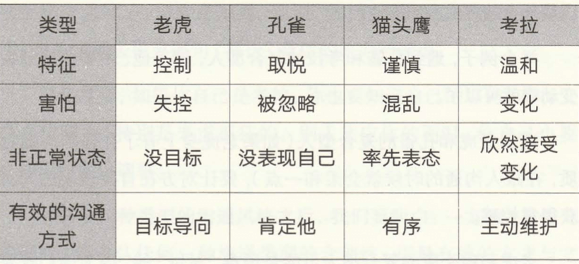

# 01 先听再说：画好三个框，沟通不用慌

- 你在倾听别人说话时，怎么抓住信息重点的
- 你能分清对方传达的情绪、事实和期待么
- 会议一下，领导给你安排任务，你们怎么对话的

结构化倾听: 沟通对象的情绪、事实和期待。

- 情绪。情绪路标词：总是、老是、每次、经常、永远等。对方是在宣泄情绪，比如 “你怎么总是忘记我们的纪念日?"。这时候应该安抚对方情绪。
- 事实。不受主观判断影响的内容。要素：人物、时间、地点、事实
- 期待。对方内心真正想要的东西。

举个例子：

- 事实: 对方收到一件破损商品
- 情绪: 他很生气，也很着急
- 期待: 赶紧换货，最好还能补偿他的损失

反向叙述: 按照自己理解的逻辑，重新叙述一遍前面结构化倾听获得的信息，请对方做个确认。三步骤：

- 响应情绪(优先处理)。点破和接纳对方情绪。对对方情绪正面回应
- 确认事实。您刚才说的这几点，我的理解是。。。，不知道我的理解对么？
- 明确行动。根据前面信息，把对方的期待翻译成接下来可实施的行动，让对方感受到你确实听懂了他的意思并且规划出行动

倾听工具：

- 笔记本。左边记录事实，右边记录情绪、感受等
- 录音。

# 02 听话听音：你能听懂别人没说出来的意思么

- 你觉得自己平时沟通中， 最大的优点和劣势是什么？
- 你的沟通风格像是哪种动物？
- 你最重要的沟通对象，特点是怎样的

人的沟通模式 4 种类型：控制型(老虎)、表现型(孔雀)、谨慎型(猫头鹰)、温和型(考拉)。复合型
(PDP职业性格测试)

- 老虎：强势、有力量，掌控欲强
- 孔雀：努力开展，展现自己，高度在意感受。自来熟
- 猫头鹰：处事周全、讲求事实依据，聊天兴趣不高的感觉
- 考拉：温和友好，不争不抢

- 和老虎型沟通：直切主题；给对方足够掌控感；如果对方假客气，就马上让他提意见，请求他说出目标
- 和孔雀型沟通：多夸奖赞美；探寻、回应对方感受
- 和猫头鹰型沟通：主动为对方提供信息
- 和考拉型沟通：好好先生，探寻背后的压力和顾虑

# 03 积极回应: 你能让不友好的人好好说话吗

- 如果对方问了一个你不会的问题，你是怎么回应的
- 如果对方提出了一个你不想答应的需求，你会如何答复呢
- 领导像你提出质疑时，你要怎样答应呢

直言有讳：有话要直说，方式要恰当

- 换口径：偷换概念。A:您可真是个大忙人 B：我就佩服您这样的业务大拿，什么事情到您手上都能很快解决
- 换时间。化被动为主动。带着想好的目标、条件、要求和领导沟通
- 换场合。"小事，不耽误大家，会后我跟您说"
- 换角色。反问。 领导：你觉得这个季度的指标制定合理么？扔回去：特别想和您请教，您看这个指标怎么制定才更合理、符合公司大局呢？

真话不全说，假话绝不说。

肯定反射：自己在开口之前，把第一句话定位为，给对方一个肯定。

# 04 开放性：学会说“我们”，你就能团结任何人

- 怎么区分“真开放性” 和“假开放性”
- 一段沟通中，你会怎么开启对方的开放性
- 上一次重要沟通，能重新设计一个结尾么

有没有从沟通对象那里拿到新的信息，能不能因此输出一个更好的结果。

开放性= 扩大共识 + 消除盲区。

### 建立共同体：少说"你"，多说“我们”。

- 您能不能跟我说说，为什么孩子成绩下降这么多？
- 最近孩子成绩下降，请问我们家长可以从哪些方面来帮助孩子提高成绩呢？

### 开启对方的开放性：每说一段，都问问对方意见
策略性点名，或者“露个破绽”， 抛出一个具体的问题，帮助对方打开开放性

### 上个台阶：万能接话

- "是个思路"， 意味着我没有关闭谈话，也没评价你说的对不对。
- "有启发"

# 05 目标感：你更有目标感，你就掌握主动权

- 和对方目标不一致，怎样达成共识
- 有没有遇到过目标在沟通过程中被带偏的问题？原因是什么
- 多重目标如何判断优先级

### 目标感=方案力
把"我的目标"转化为“我们的方案”。“我们有一个目标要达成，对此我有一个方案”

### 怎么找到真正的目标
我马上要做的事，和我最终要做的事，是同一件事么？

# 06 建设性：从“我要”到“我来”是你的一次质变

- 一场沟通中，什么样的表现被称为有建设性
- 开放性、目标感和建设性有什么关系
- 你有没有自己的口头禅，如果没有问问周边朋友。你希望身边朋友听到这些话么

### 把沟通导向行动

建设性 = 可执行的最小化行动 + 可持续的行动阶梯 + 每个节点的及时反馈

- 开会。“来，你们说，我在白板上记录”

技巧：

- “来，我们抓抓落实”
- “请您再给我提点需求”

应对不合理需求：把看似不合理的需求拆解成一级级可以持续行动的阶梯

### 不要使用负面词汇

尤其不要下意识使用负面词汇（烦死了、没意思、讨厌）。录音，如果你发现自己经常使用负面词汇，一定要有意识把这个习惯戒掉。

# 07 破冰：怎样让人对你印象深刻
- 和陌生人破冰，你一般怎么介绍自己
- 研讨会你又会怎么介绍自己
- 自我介绍后，你会如何挖掘双方感兴趣的话题

破冰 = 双线卡位 + 展现关切+ 营造掌控

### 双线卡位
同校、同乡、同好、同伴。

经线简洁、清晰交代“你是谁”，纬线把你嵌入对方的关系网络。在对方人际关系网络卡住一个位置

### 展现关切
营造掌控感。最轻的一种方式，把联系方式给对方。发微信“今天交流非常有收获。这是我的电话XXX，有事您随时联系”

多人破冰：先“摁”住第一个人。跟第一个人破冰以后，就能用话题“卷入”下一个人。

### 上个台阶：破冰第二天
破冰第二天再和对方有进行一次轻量级互动。(朋友圈评论)

# 08 赞美：怎样提升你的人际友好度
- 你会从哪些方向赞美一个人
- 你有哪些赞美小妙招
- 别人夸奖你时，你怎么回应

### 用行动表达赞美
身体语言。做笔记、少看手机、点头。

### 让对方被看见
赞美 = 打追光 + 轻轻地 + 深深地 + 常常地

- 打追光：”赞美的光束“打在人身上。技巧：发现差异；照亮行为而不是禀赋
- 轻轻地：赞美的表达一定要简介，不给人负担
- 深深地：表达对方对我们影响之深
- 常常地：经常表达赞美

### 上个台阶：如何回应赞美

大大方方接受，表达自己要进一步努力的态度，同事保留开放性结尾。

- 领导：材料处理得不错
- 谢谢领导，我还有很多做的不到位的地方，您要是有时间，再给我指导指导

# 09 激励：怎样成为鼓舞人心的高手
- 如果你想激励一个员工继续努力工作，会怎么跟他说
- 你觉得赞美和激励的区别是什么
- 你印象最深的一次激励是怎样发生的

激励= 及时赞美(你做得真好) + 行为建模(请问你是怎么做到的) + 反馈闭环(你总结得真好,我跟你说说对我的启发)

### 保持行为建模的习惯
一个人从他每天偶发的、零散的行为中找出最值得保持的部分，用简单的逻辑整理一下，把这些行为变成一些方法论，让这些值得保持的
行为能够不断被复制，被优化。这就是行为建模。

- 对下级：你的速度特别快，一定有自己的方法。我很好奇，你能总结一下，展开讲讲呢?
- 对平级：你今天真好看，特别符合公司形象要求。下周能让你担任讲师讲一下形象管理么，我陪你一起备课
- 对上级：领导，我挺好奇的，您平时这么忙，为什么还能了解这么多一线工作的细节呢？有什么特别的工作方式么

# 10 说服：怎样让别人愿意支持你

- 如果你要说服对方，你会从哪几个方面找方案
- 你印象中最成功的一次说服，怎样的场景中发生的
- 你有一个方案，但是对方心理有成见，你会怎么说服他

说服是让对方觉得我们俩是一伙的，我的目标就是他的目标。

说服 = 说话有分量 + 凿穿心理防线

### 说话有分量

强准备。用足够充分的准备所带来的心理优势和信息优势去碾压对方。

### 凿穿心理防线
吹风和慢熬。

吹风就是在正式说服之前，通过各种非正式的方式向对方发射信号。
慢熬：挖掘，不给他回避的机会，立即请教：这个方案我应该怎么改善？

### 新方案代替旧方案

对方抵触你的观点。一个抵抗的情绪背后都有尚未满足的需要。

# 11 辅导：怎样教会别人更好地做事
- 假如你是领导，属下已经操作过两三次依然犯错，你会怎么跟他说
- 新人任务快到时间了才完成过半，你会怎么做
- 加入让你重新辅导这位下属，打算怎么讲

### 准则：教行动方法，不教价值观

辅导= 植入目标+ 发现盲区 + 实战演习

- 植入目标：”你可以更好，我来教你“
- 发现盲区：具体哪里不行。 口诀：你做我看，我做你看
- 实战演习：观念懂了和真正上手两码事。 AAR（after action review): 行动后回顾

# 12 安慰：怎样得体地表达你的善意
- 当别人失意，怎么样沟通能起到安慰效果
- 安慰的雷区
- 假如你被过度安慰，你会如何回应

安慰的前提是能感受他人之感受(同情心不等于同理心)。 安慰 = 轻度介入 + 提供支持

- 轻度介入。节制并且温和地传递力量。只要对方没有表露出他的需求，就不要主动提供安慰。 ”领导，您看需要我做什么，您随时安排“
- 提供支持。"刚听说你遇到这个情况，我也不知道帮你做点什么。我有这样的便利，只要你需求，随时找我，别跟我客气，我随时都在"

### 怎么接收别人的安慰

1. 自己能抗住的，自己抗住
2. 对别人的安慰表示感谢。
3. 对于不得体的安慰，赶紧用一个封闭式的句式。”谢谢关心“”

# 13 批评：怎样让你的难听话也能得到正反馈
- 批评和责备的区别
- 批评的注意事项
- 你被批评了，你会怎么回应

批评不是要让对方认识到错误，而是要让他做出正确的行为。

批评 = 控制环境 + 定义问题 + 刷新动作 + 设定反馈点 + 完成重启

- 控制环境。控制场合和时间。不要当他人面，能小范围就不要大范围；时间上不要翻旧账，最好是对方做错后第一时间
- 定义问题。一定要调查事实经过

  1. 今天把你叫过来有件事情想和你沟通，我对某个行为不满意，想和你谈谈
  2. 发生了什么
  3. 你怎么看待这件事
  4. 发生这件事的过程中，你都试了哪些办法
  5. 还有么(开放式)

- 刷新动作: 把批评转译为一个具体行动，告诉对方怎样才能做对
- 设定反馈点：“刚才梳理的动作，可能需要两周时间落实。两周后咱们再碰一下，看看具体实施中你还可能存在哪些困难”
- 完成重启: 批评的最后一句话一定要让对方说。 “这是现在的情况，你说说你的想法吧。”

### 上个台阶：如何接受批评

1. 不要在公开场合暴露自己的情绪。这会让领导觉得你不抗事，情绪不稳定，以后不敢对你委以重任
2. 不要在批评中急于解释。让对方说个痛快，不要显得你不接受批评 （做笔记，哪怕假装）
3. 千万不要想怎么安抚领导的情绪，想如何解决这个问题。“我明白了，我有这么几个方法来补救，您看行不行”？转移到具体问题上
4. 别等领导给你设定反馈点，主动和他约定反馈点。“我明白了立即整改。给我一周时间再跟您汇报一下我的心得，您再指导我一下”

# 14 提意见：怎样改变自己说了不算的事
- 提意见之前，一般会做哪些工作
- 思考一下，该提的和不该提的意见
- 一个好意见的标准有哪些

### 先发展关系，再解决问题

用“提建议“ 代替 “提意见”。

提意见 = 事前征求同意 + 定义双方关系 + 提供具体建议

- 事前征求同意: 1. 你要熟悉沟通中的事实、情绪和目标，把“草稿”先打好。 2."我对这件事有个建议，你想听一下么"
- 定义双方关系
- 提供具体建议：
- 提意见如何常态化：(团队里定期组织活动)

  - 你希望我开始做什么事
  - 你希望我不要再做什么事
  - 你建议我在什么地方、哪些事情上投入更多

### 如何接收意见
表现出对对方情绪的接纳，理解和感谢他。一定要给对方反馈。用“肯定反射“指出自己准备做哪部分。

# 15 绩效面谈：怎样事半功倍地发挥你的领导力
- 你认为绩效面谈最重要的目标是什么
- 发起时注意哪些细节
- 要和下属就上一个阶段的业绩表现达成共识吗

绩效面谈=  营造正式感+ 换框架

### 营造正式感
1. 时间上的正式感。提前预约，亲自预约。让下属提前准备几个问题
2. 空间意义上的正式感。独立不受干扰的封闭空间
3. 话语意义上的正式感。要准确，不能模棱两可

### 换框架
给员工看看大局。战略目标，定位等，让下属从日常的琐碎事务里跳出来，在更大框架下看待自己的工作。

很多员工离职，因为没体验到意义感。(知道为什么而战的士兵是不可战胜的)

- 你知道明年公司最重要的目标是什么吗？可能有新岗位、新项目，新的机会
- 你知道公司的目标对咱们部门意味着什么吗？ 公司对你的能力有新的要求
- 你知道这对你意味着什么吗？ 你必须做出取舍

### 最后的结尾，留给对方说
让对方说说自己的想法和计划。

### 如何接受绩效面谈
1. 你发现你的领导不认真，走过场。对方不是一个值得追随的领导，有机会正确转岗
2. 你发现对方绩效面谈水平不高。发起一个主动的探索，比如请他给你打分。
3. 你发现领导以非常规范的格式跟你作绩效面谈。谁的准备度高，谁有话语权

# 16 主持会议： 怎样降低你的存在感，提高你的控场力
- 如果会议上大家经常跑题怎么办
- 没人愿意发言怎么办
- 会议上讨论的共识，怎么保证落地

### 会议支持人 = 牧羊人

主持会议= 行为设计 + 全程控场

### 行为设计

- 设计场地
- 设计时间
- 设计环境
- 设计规则
  - 手机和电子设备的规则设计。为了管理参会人的注意力
  - 发言时间的规则设计。为了防止跑题和超时
  - 会议材料管理的规则设计

### 全程控场

1. 会前积极跑动。提前和与会者沟通
2. 开场自我赋能。会议时间、节奏、讨论范畴
3. 会中敢于干预。防止冷场和跑题
4. 结束出口成章。下一步行动：每一项行动是什么、负责人、开始和截止时间，记录下来形成纪要

### 上个台阶：会前如何寒暄
最简单的方式是发起一个请教，参会者最近在做的事情、发生的事。

# 17 道歉：怎样把你的错误变成促进关系的机会
- 我们为什么经常不愿意道歉
- 越道歉对方越生气
- 道歉的关键点

道歉 = 关闭过去 + 承诺未来

### 关闭过去

1. 道歉越早，代价越小
2. 道歉和弥补损失分开
3. 诚恳的态度比做任何事情都重要。最好当面或者打电话
4. 接纳对方情绪，引导对方释放情绪

### 承诺未来

1. 带着方案来。接下来我准备怎么办，我的新方案是什么。
  - 案例：丈夫忘记结婚纪念日。❌ 你怎么才能不生气？   ✅ 带着一个新方案，我们一起去一个你想去的海岛玩
2. 上个请教。你实在不知道怎么办，用请教的方式
3. 上个小礼物。茶、书、电影或者演出门票

### 不原谅怎么办
1. 小事打个时间隔断。时间拉开点，再做一次沟通。一周为宜
2. 大事第一时间请求支援

### 如何接收道歉

1. 坦然接受对方道歉
2. 阻止对方把问题升级
3. 如果涉及到外部关系，该秉公处理就秉公处理

# 18 调解：怎样持续优化你的社会网络
- 那些矛盾应该调解
- 怎样让对方从情绪中恢复出来
- 矛盾双方让我们评理，该怎么办

### 不是解扣，而是补网

比如婆媳矛盾，“补网”的思路不是冲上去两边劝和，而是分别加固你和妻子、你与母亲的关系。

调节矛盾= 处理情绪 + 重建目标 + 最小改善

### 处理情绪
首先引导对方尽可能倾诉，让对方说痛快了，甚至说累了，这是沟通的起点。
接纳对方情绪，获取对方新人，让他觉得你是站在他的立场考虑问题。
最后制造认知失调，把对方情绪彻底掀翻在地，告诉她这个情绪没有价值。

### 重建目标

假设对方已经给你道歉过了，你想要什么

### 最小改善
让对方回归正常的生活、工作状态。 正好我手头有一个项目，你要不要帮我处理一下

### 如何预先避免矛盾
规则前置。 “有问题当下、当面跟当事人提，不允许第三方传话，传话会被公开问询”。

# 19 求助：怎样用示弱增强你的关系网
- 求助前的准备
- 怎样表达可以增大别人答应我们的概率
- 还是被拒绝了，接下去怎么办？

一个愿意求助的人，目标感肯定大过自尊心，而且人际友好度会比较高，也会具有调动和整合资源的能力。

求助 = 别人帮得了 + 自己值得帮

### 别人帮得了
1. 时间和精力上可以启动。尽可能减轻对方的负担。让对方感觉是轻量级的，可以轻松启动的
2. 在职责边界内可以启动
3. 在关系程度内可以启动

### 自己值得帮

1. 先干为敬。自己已经在这件事上付出极大努力。
  - 说明你的目标
  - 展现已经做出的努力
  - 提出你真实的诉求
2. 真诚领情。

### 被拒绝了怎么办
求助之前就想好，被拒绝了如何回应。 不要反过来讽刺别人，不要给对方负反馈。

### 为自己配备“救生员”

1. 你和对方的工作、生活有一定交集
2. 双方没有直接的利害关系

# 20 拒绝：怎样让你在说“不”时依然受欢迎
- 为什么拒绝会不好意思
- 拒绝有哪些注意事项
- 如果你拒绝的理由被对方解决了，你又会如何回应

讨好型人格。拒绝对方的方案而不是否定对方这个人。

拒绝 = 开门见山 + 移花接木。 开门见山就是直接表明立场，移花接木是重新发牌，剔除替代方案。

### 开门见山

第一时间和第一人称(不要撒谎+最好只用一个理由解释)。 附上相应的理由。

- 借钱。 不好意思，我老家正在装修，我手里没有现金
- 亲戚给你推销保险。

### 移花接木
难以拒绝的人，给出替代方案。

- Yes,if 如果能...的话，我可以同意
- 交换条件。
  - 如果您跟我们持续合作两年，我觉这个条件，我就可以跟公司申请下来。
  - 领导让你接一个不是很愿意的项目。“行，但是我一个人忙不过来，能不能给我加个人？”

### 提前设定规则，解决系统性问题

反复遇到同一种情况需要拒绝，你的系统有问题。 提前设定好规则，集中消灭。

### 如何对待被拒绝
不要死缠烂打。拿出次优方案

# 21 即兴发言：怎样让你彻底告别张口结舌
- 如果要当众做一次发言，你会怎么准备自我介绍
- 你再参加一个活动时，突然被要求发表感想，会从那几个方面准备
- 如何克服紧张情绪

即兴发言 = 万能开头 + 谈感受/谈行动

### 准备一个万能开头

个人介绍，姓名身份。

- 不要贴负面标签。“我姓周，周而复始的周”
- 不增加冗余信息

### 谈感受/谈行动
多赞美别人

# 22 闲谈：怎样让谁都觉得和你聊得来
- 电梯里碰到领导，你会怎么闲聊呢
- 同事在饭桌上聊起你不熟悉的话题，怎么回应
- 飞机上遇到点头之交的客户，你怎么和他闲聊呢

### 涟漪式沟通
闲谈的最高任务只有一个：优化双方关系。

闲谈 = 传递尊重+ 传递价值

### 传递尊重
1. 上个请教。对方擅长，请教一个特定的、明确的，有场景性的问题
2. 多给一点。开放式而不是封闭式问题。“王老师我想请客户去全聚德好么“？ 比如”您看我去哪家餐厅合适“？
3. 深度破冰
4. 管理人设。避免聊到彼此的三观问题，发展关系才是目标。因为三观不合吵架实在不值得

### 传递价值
让对方觉得我们说的对他有用。

# 23 汇报：怎样才能让你的方案被人重视

### 不是请示，而是演习
提案 = 融目标 + 抢进度 + 提诉求

1. 融目标。自己和客户目标融合在一起。
2. 抢进度。对方远远跑在我们之前的行动力
  - 把会影响实质性成果的工作往前做
  - 把能展现自己决心的工作往前做
3. 提诉求。尽量低成本，对方可以马上落实

### 如何征求反馈意见

主动邀请对方参与到你的陈述之中。让对方可以发表反馈意见

# 24 竞聘：怎样才能让你在竞争中笑到最后

### 竞聘 = 请战

竞聘更看重未来。

1. 一定要肯定现状，肯定领导或者前任同事的既有部署。
2. 需要详述接下来要做的具体事项

竞聘 = 肯定现有战场 + 我的独特打法 + 我的充分准备

### 竞聘 5 大注意事项

1. 不要说前任的坏处，要肯定现有战场
2. 不要摆过去的功劳，要讲未来的打算
3. 不要讲对未来的畅想，要说对未来的抓手
4. 不要光讲准备，要突出个人特质(证明自己和岗位最匹配)
5. 不要因为落选闹情绪，要备好败选方案

### 如何对待下属竞聘
三杯酒。

对竞聘成功的人: 1.表示祝贺 2.表示认可，说说下属优点、亮点。3.提要求，说期待

对竞聘没成的人：1. 依然表示祝贺（消除不安全感） 2.重建信心 3.提期待(再接再厉)
