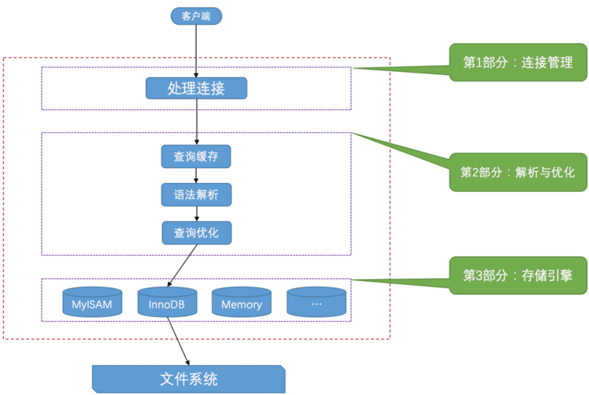

# 1 第1章 装作自己是个小白-重新认识MySQL

## 1.6 服务器处理客户端请求



### 1.6.1 连接管理
每当有一个客户端进程连接到服务器进程时，服务器进程都会创建一个线程来专门处理与这个 客户端的交互，
当该客户端退出时会与服务器断开连接，服务器并不会立即把与该客户端交互的线程销毁掉，而 是把它缓存起来，
在另一个新的客户端再进行连接时，把这个缓存的线程分配给该新客户端。

### 1.6.2 解析与优化

- 查询缓存。如果两个请求任何字符不同都不会命中。mysql 监测到表被修改，那使用该表的所有高速缓存查询都将变为无效并从高速缓存中删除
  - 从MySQL 5.7.20 开始，不推荐使用查询缓存，并在MySQL 8.0中删除。
- 语法解析。
- 查询优化。 MySQL 的优化程序会对我们的语句做一些优化，如外连接转换为内连接、表达式简化、子查询转为连接等，生成执行计划

### 1.6.3 存储引擎
为了管理方便，人们把连接管理 、 查询缓存 、 语法解析 、 查询优化 这些并不涉及真实数据存储的功能划分 为 MySQL server 的功能，
把真实存取数据的功能划分为存储引擎功能。

## 1.7 常用存储引擎

- InnoDB: 具备外键支持功能的事务存储引擎
- MEMORY: 置于内存的表
- MyISAM: 主要的非事务处理存储引擎


# 2 第2章 MySQL的调控按钮-启动选项和系统变量


# 3 第3章 乱码的前世今生-字符集和比较规则
(看书的时候把书中的 mysql 命令找一个测试的 mysql 自己尝试一下)

- utf8mb3 :阉割过的 utf8 字符集，只使用1~3个字节表示字符。 (mysql中 utf8 就是 utf8mb3 的别名)
- utf8mb4 :正宗的 utf8 字符集，使用1~4个字节表示字符。 (如果有 emoji 要用utf8mb4)

字符集(CHARSET)与比较规则(COLLATION)：

- 只修改字符集，则比较规则将变为修改后的字符集默认的比较规则。
- 只修改比较规则，则字符集将变为修改后的比较规则对应的字符集。(比如要修改大小写排序敏感等)

我们通常都把 character_set_client 、character_set_connection、 character_set_results 这三个系统变量设置成和客户端使用的字符集一致的情况，
这样减少了很多无谓的字符 集转换。为了方便我们设置， MySQL 提供了一条非常简便的语句: `SET NAMES 字符集名`;

这一条语句产生的效果和我们执行这3条的效果是一样的:
```
SET character_set_client = 字符集名;
SET character_set_connection = 字符集名;
SET character_set_results = 字符集名;
```

# 4 第4章 从一条记录说起-InnoDB记录结构

页: InnoDB将数据划分为若干个页，以页作为磁盘和内存之间交互的基本单位，InnoDB中页的大小 一般为 16 KB。
也就是在一般情况下，一次最少从磁盘中读取16KB的内容到内存中，一次最少把内存中的16KB 内容刷新到磁盘中。

行格式： Compact 、 Redundant 、Dynamic 和 Compressed 行格式

### 4.3.2 Compact 行格式：

`|变长字段长度列表|NULL值列表|记录头信息|列1的值|列2的值|...|列n的值|`

 MySQL 会为每个记录默认的添加一些列(也称为 隐藏列 ), DB_ROW_ID(没有定义主键和unique键会添加), DB_TRX_ID(事务ID), DB_ROLL_PTR(回滚指针)

对于 CHAR(M) 类型的列来说，当列采用的是定长字符集时，该列占用的字节数不会被加到变长字 段长度列表，而如果采用变长字符集时，该列占用的字节数也会被加到变长字段长度列表。

### 4.3.3 Redundant 行格式

`|字段长度偏移列表|记录头信息|列1的值|列2的值|...|列n的值|`

### 4.3.4 行溢出数据

MySQL 是以 页 为基本单位来管理存储空间的，我们 的记录都会被分配到某个 页 中存储。而一个页的大小一般是 16KB ，
也就是 16384 字节，而一个 VARCHAR(M) 类 型的列就最多可以存储 65532 个字节，这样就可能造成一个页存放不了一条记录的尴尬情况。

4.3.5 Dynamic和Compressed行格式
Dynamic 和 Compressed 行格式 MySQL 版本是 5.7 ，它的默认行格 式就是 Dynamic ，这俩行格式和 Compact 行格式挺像，
只不过在处理 行溢出 数据时有点儿分歧，它们不会在记录的真实数据处存储字段真实数据的前 768 个字节，而是把所有的字节都存储到其他页面中，
只在记录的真实数 据处存储其他页面的地址。

Compressed 行格式和 Dynamic 不同的一点是， Compressed 行格式会采用压缩算法对页面进行压缩，以节省空 间。

# 5 第5章 盛放记录的大盒子-InnoDB数据页结构

## 5.2 数据页结构的快速浏览

数据页代表的这块 16KB 大小的存储空间可以被划分为多个部分，不同部分有不同的功能，InnoB数据页结构示意图：

`|File Header(38字节)|Page Header(56字节)|Infimum + supremum(26字节)|User Records(大小不定)|Free Space(大小不定)|Page Directory(大小不定)|File Tailer(8字节)|`

## 5.3 记录在页中的存储

在一开 始生成页的时候，其实并没有 User Records 这个部分，每当我们插入一条记录，都会从 Free Space 部分，
也就是尚未使用的存储空间中申请一个记录大小的空间划分到 User Records 部分，当 Free Space 部分的空间全部 被 User Records 部分替代掉之后，也就意味着这个页使用完了，如果还有新的记录插入的话，就需要去申请新 的页了

不论我们怎么对页中的记录做增删改操作，InnoDB始终会维护一条记录的单链表，链表中的各个 节点是按照主键值由小到大的顺序连接起来的

## 5.4 Page Directory (页目录)

所以在一个数据页中查找指定主键值的记录的过程分为两步:
1. 通过二分法确定该记录所在的槽，并找到该槽中主键值最小的那条记录。
2. 通过记录的 next_record 属性遍历该槽所在的组中的各个记录。


## 5.5 Page Header (页面头部)

为了能得到一个数据页中存储的记录的状态信息，比如本页中已经存储了多少条记录，第 一条记录的地址是什么，
页目录中存储了多少个槽等等，特意在页中定义了一个叫 Page Header 的部分，它是页结构的第二部分，
这个部分占用固定的 56 个字节，专门存储各种状态信息

## 5.6 File Header(文件头部)

File Header 针对各种类型的页都通用，也就是说不同类型的页都会以 File Header 作 为第一个组成部分，
它描述了一些针对各种页都通用的一些信息，比方说这个页的编号是多少，它的上一个页、 下一个页是谁, 这个部分占用固定的 38 个字节

## 5.7 File Trailer

InnoDB 存储引擎会把数据存储到磁盘上，但是磁盘速度太慢，需要以 页 为单位把数据加载到内存中处理，
如果该页中的数据在内存中被修改了，那么在修改后的某个时间需要把数据同步到磁盘中。但是在同步了一半的时候中断电了咋办，
为了检测一个页是否完整(也就是在同步的时候有没有发生只同步 一半的尴尬情况)，InnoDB 每个页的尾部都加了一个 File Trailer 部分，
这个部分由 8 个字 节组成，可以分成2个小部分: 前4个字节代表页的校验和, 后4个字节代表页面被最后修改时对应的日志序列位置(LSN)。


# 6 第6章 快速查询的秘籍-B+树索引

## 6.2 索引

页分裂：下一个数据页中用户记录的主键值必须大于上一个页中用户记录的主键值。如果不满足就需要先移动再插入，
这个过程我们也可以称为 页分裂 。

目录项记录和普通用户记录的区别：(一个存储 主键和页号，一个存用户插入数据)

- 目录项记录 的 record_type 值是1，而普通用户记录的 record_type 值是0。
- 目录项记录 只有主键值和页的编号两个列，而普通的用户记录的列是用户自己定义的，可能包含很多列， 另外还有 InnoDB 自己添加的隐藏列。
- 只有在存储 目录项记录 的页 中的主键值最小的 目录项记录 的 min_rec_mask 值为 1 ，其他别的记录的 min_rec_mask 值都是 0 。

不论是存放用户记录的数据页，还是存放目录项记录的数据页，我们都把它们存放到 B+ 树这个数据结构中了， 所以我们也称这些数据页为 节点 。
从图中可以看出来，我们的实际用户记录其实都存放在B+树的最底层的节点 上，这些节点也被称为 叶子节点 或 叶节点 ，
其余用来存放 目录项 的节点称为 非叶子节点 或者 内节点 ，其 中 B+ 树最上边的那个节点也称为 根节点 。

#### 6.2.2.1 聚簇索引

上边介绍的 B+ 树本身就是一个目录，或者说本身就是一个索引。它有两个特点:

1. 使用记录主键值的大小进行记录和页的排序，这包括三个方面的含义:
  - 页内的记录是按照主键的大小顺序排成一个单向链表。
  - 各个存放用户记录的页也是根据页中用户记录的主键大小顺序排成一个双向链表。
  - 存放目录项记录的页分为不同的层次，在同一层次中的页也是根据页中目录项记录的主键大小顺序排成一个双向链表。
2. B+ 树的叶子节点存储的是完整的用户记录。 所谓完整的用户记录，就是指这个记录中存储了所有列的值(包括隐藏列)。

具有这两种特性的 B+ 树称为 聚簇索引 ，所有完整的用户记录都存放在这个 聚簇索引 的叶子节点处
InnoDB 存储引擎会自动的为我们创建聚簇索引。另外有趣的一点是，在 InnoDB 存储引擎中， 聚簇索引 就是数 据的存储方式(所有的用户记录都存储在了 叶子节点 )，
也就是所谓的索引即数据，数据即索引。

#### 6.2.2.2 二级索引

非聚簇索引(二级索引or辅助索引)：B+ 数叶子节点只存储了当前列和主键(索引列和主键)，还需要再去聚簇索引中再查找一遍完整的用户记录。(这个过程也叫做**回表**)

联合索引：以多个列的大小为排序规则建立的B+树称为联合索引，本质上也是一个二级索引 (一个B+树)

### 6.2.3 InnoDB的B+树索引的注意事项

- 根节点不动

一个B+树索引的根节点自诞生之日起，便不会再移动。这样只要我们对某个表 建立一个索引，那么它的 根节点 的页号便会被记录到某个地方，
然后凡是 InnoDB 存储引擎需要用到这个索引的 时候，都会从那个固定的地方取出 根节点 的页号，从而来访问这个索引。

- 内节点中目录项记录的唯一性
- 一个页面最少存储2条记录

### 6.2.4 MyISAM中的索引方案简单介绍

- MyISAM 的索引方案虽然也使用树形 结构，但是却将索引和数据分开存储:
将表中的记录按照记录的插入顺序单独存储在一个文件中，称之为 数据文件 。这个文件并不划分为若干个 数据页，有多少记录就往这个文件中塞多少记录就成了。我们可以通过行号而快速访问到一条记录
- 使用 MyISAM 存储引擎的表会把索引信息另外存储到一个称为 索引文件 的另一个文件中。
MyISAM 会单独为 表的主键创建一个索引，只不过在索引的叶子节点中存储的不是完整的用户记录，而是 主键值 + 行号 的组 合。也就是先通过索引找到对应的行号，再通过行号去找对应的记录!(全部是二级索引)
- 如果有需要的话，我们也可以对其它的列分别建立索引或者建立联合索引，原理和 InnoDB 中的索引差不多，不过在叶子节点处存储的是相应的列 + 行号 。这些索引也全部都是二级索引

### 6.2.5 MySQL中创建和删除索引的语句

InnoDB 和 MyISAM 会自动为主键或者声明为 UNIQUE 的列去自动建立 B+ 树索引，但是如果我们想为其他的列建立索引就需要我们显式的去指明。


# 7 第7章 好东西也得先学会怎么用-B+树索引的使用

## 7.1 索引的代价

- 空间。每建立一个索引都要为它建立一棵 B+ 树，每一棵 B+ 树的每一个节点都是一个数据页， 一个页默认会占用 16KB 的存储空间，一棵很大的 B+ 树由许多数据页组成
- 时间。每次对表中的数据进行增、删、改操作时，都需要去修改各个 B+ 树索引

## 7.2 B+树索引适用的条件

```
-- 以下使用这个表作为示例
CREATE TABLE person_info(
        id INT NOT NULL auto_increment,
        name VARCHAR(100) NOT NULL,
        birthday DATE NOT NULL,
        phone_number CHAR(11) NOT NULL,
        country varchar(100) NOT NULL,
        PRIMARY KEY (id),
        KEY idx_name_birthday_phone_number (name, birthday, phone_number)
);
```

- 全值匹配：搜索条件中的列和索引列一致的话，这种情况就称为全值匹配。
` SELECT * FROM person_info WHERE name = 'Ashburn' AND birthday = '1990-09-27' AND phone_number = '15123983239';`
这几个条件的书写顺序无影响，查询优化器会根据索引顺序决定先使用那个搜索条件。

- 匹配左边的列(最左前缀)。如果我们想使用联合索引中尽可能多的列，搜索条件中的各个列必须是联合索引中 从最左边连续的列
因为 B+ 树的数据页和记录先是按照 name 列的值排序的，在 name 列的值相同的情况下才使 用 birthday 列进行排序(上述 sql 例子)。

- 匹配列前缀。 `SELECT * FROM person_info WHERE name LIKE 'As%';` 可以使用索引，而 `LIKE %As%` 会全表扫描

- 匹配值范围。B+树所有记录都是按照索引列的值从小到大的顺序排好序的。
  - `SELECT * FROM person_info WHERE name > 'Asa' AND name < 'Barlow'`; 可以使用索引，因为排好序了找到首位记录，
  中间链表连起来的都可以取出来，之后找到记录的主键回表查找完整记录。
  - 如果对多个列同时进行范围查找的话，只有对索引最左边的那个 列进行范围查找的时候才能用到 B+ 树索引。
  `SELECT * FROM person_info WHERE name > 'Asa' AND name < 'Barlow' AND birthday > '1980-01-01'` 只能用到 name 索引

- 精确匹配某一列并范围匹配另外一列。对于同一个联合索引来说，虽然对多个列都进行范围查找时只能用到最左边那个索引列，但是如果左边的列是精确查找，
  则右边的列可以进行范围查找
  - ` SELECT * FROM person_info WHERE name = 'Ashburn' AND birthday > '1980-01-01' AND birthday < '2000-12-31' AND phone_number > '15100000000';`
  - 上面 sql name 和 birthday 可以用到索引，但是 phone_number 条件不行

- 用于排序。
  - ORDER BY 子句里使用到了我们的 索引列，就有可能省去在内存或文件中排序的步骤。`SELECT * FROM person_info ORDER BY name, birthday, phone_number LIMIT 10;`
  - 使用联合索引排序注意：ORDER BY 的子句后边的列的顺序也必须按照索引列的顺序给出
  - 不可以使用索引排序的几种情况：
    - ASC, DESC 混用
    - WHERE 子句中出现非排序使用到的索引列
    - 排序列包含非同一个索引的列。`SELECT * FROM person_info ORDER BY name, country LIMIT 10;` country 不在索引列
    - 排序列使用了复杂表达式

- 用户分组。`SELECT name, birthday, phone_number, COUNT(*) FROM person_info GROUP BY name, birthday, phone_number`

## 7.3 回表的代价

`SELECT * FROM person_info WHERE name > 'Asa' AND name < 'Barlow';` 这个语句两个特点：

- 会使用到两个 B+ 树索引，一个二级索引，一个聚簇索引。
- 访问二级索引使用 顺序I/O ，访问聚簇索引使用 随机I/O 。

覆盖索引：为了彻底告别 回表 操作带来的性能损耗，我们建议:最好在查询列表里只包含索引列，比如这样:
`SELECT name, birthday, phone_number FROM person_info WHERE name > 'Asa' AND name < 'Barlow'`

## 7.4 如何挑选索引

- 只为用于搜索、排序或分组的列创建索引。只为出现在 WHERE 子句中的列、连接子句中的连接列，或者出现在 ORDER BY 或 GROUP BY 子句中的列创建索引。
- 考虑列的基数(值越分散)。 最好为那些列的基数大的列建立索引，为基数太小列的建立索引效果可能不好。
- 索引列的类型尽量小 。比较更快，占用更小
- 索引字符串值的前缀。只对字符串的前几个字符进行索引
- 让索引列在比较表达式中单独出现。索引列不要加上函数或者表达式，否则索引用不到
- 主键插入顺序。最好让主键具 有 AUTO_INCREMENT ，让存储引擎自己为表生成主键，而不是我们手动插入。
- 冗余和重复索引。比如定义了联合索引，又单独定义了一个列索引。


# 第8章 数据的家-MySQL的数据目录

## 8.2 MySQL数据目录

`SHOW VARIABLES LIKE 'datadir';`

## 8.3 数据目录的结构

每个数据库都对应数据目录下的一个子目录，或者说对应一个文件夹，我们每当我们新建一个数据库时，MySQL 会帮我们做这两件事儿:

1. 在 数据目录 下创建一个和数据库名同名的子目录(或者说是文件夹)。
2. 在该与数据库名同名的子目录下创建一个名为 db.opt 的文件，这个文件中包含了该数据库的各种属性，比方说该数据库的字符集和比较规则是个啥。

表结构信息：InnoDB 和MyISAM 这两种存储引擎都在 数据目录 下对应的数据库子目录下创建了一个专门用于描述表结构的文件。表名.frm

#### 8.3.2.1 InnoDB是如何存储表数据的

- 系统表空间(system tablespace):可以对应文件系统上一个或多个实际的文件，默认情况下， InnoDB 会在 数据目录下创建一个名为
ibdata1 (在你的数据目录下找找看有木有)、大小为 12M 的文件，这个文件就是对应的 系统表空 间 在文件系统上的表示

- 独立表空间(file-per-table tablespace): mysql5.5.6以后每一个表建立一个独立表空间。 test.ibd(自扩展)，存储 test 表的数据和索引

#### 8.3.2.2 MyISAM是如何存储表数据的

MyISAM 全部是二级索引，数据和引擎分开。表数据都存放到对应的数据库子目录下。test.frm, test.MYD(数据文件), test.MYI(索引文件)

### 8.3.3 视图在文件系统中的表示

存储 视图 的时候是不 需要存储真实的数据的，只需要把它的结构存储起来就行了。和 表 一样，
描述视图结构的文件也会被存储到所属数据库对应的子目录下边，只会存储一个 视图名.frm 的文件

## 8.5 MySQL系统数据库简介

- mysql: 存储了MySQL的用户账户和权限信息，一些存储过程、事件的定义信息，一些运行过 程中产生的日志信息，一些帮助信息以及时区信息等
- information_schema: MySQL服务器维护的所有其他数据库的信息，比如有哪些表、哪些视图、哪些触发器、哪些列、哪些索引
- performance_schema: 这个数据库里主要保存MySQL服务器运行过程中的一些状态信息，算是对MySQL服务器的一个性能监控
- sys: 这个数据库主要是通过视图的形式把 information_schema 和 performance_schema 结合起来，让程序员可以更方便的了解MySQL服务器的一些性能信息。


# 9 第9章 存放页面的大池子-InnoDB的表空间

## 9.2 独立表空间结构

### 9.2.1 区(extent)的概念

对于16KB的页来说，**连续**的64个页就是一个 区 ，也就是说一个区默认占用1MB空间大小。不论是系统 表空间还是独立表空间，
都可以看成是由若干个区组成的，每256个区被划分成一组。每个组的最开始的几个页面类型是固定的。

### 9.2.2 段(segment)的概念

InnoDB 对B+ 树的叶子节点和非叶子节点进行了区别对待，也就是说叶子节点有自己 独有的 区 ，
非叶子节点也有自己独有的 区 。存放叶子节点的区的集合就算是一个 段 ( segment )，存放非叶 子节点的区的集合也算是一个 段 。
也就是说一个索引会生成2个段，一个叶子节点段，一个非叶子节点段。

是碎片区中的页 可以用于不同的目的，比如有些页用于段A，有些页用于段B，有些页甚至哪个段都不属于。碎片区直属于表空 间，
并不属于任何一个段。所以此后为某个段分配存储空间的策略是这样的:

- 在刚开始向表中插入数据的时候，段是从某个碎片区以单个页面为单位来分配存储空间的。
- 当某个段已经占用了32个碎片区页面之后，就会以完整的区为单位来分配存储空间。

### 9.2.3 区的分类

表空间的是由若干个区组成的，这些区大体上可以分为4种类型:

- 空闲的区:现在还没有用到这个区中的任何页面。
- 有剩余空间的碎片区:表示碎片区中还有可用的页面。
- 没有剩余空间的碎片区:表示碎片区中的所有页面都被使用，没有空闲页面。
- 附属于某个段的区。每一个索引都可以分为叶子节点段和非叶子节点段，除此之外InnoDB还会另外定义一些 特殊作用的段，在这些段中的数据量很大时将使用区来作为基本的分配单位。


综上所述，表空间是由若干个区组成的，每个区都对应一个 XDES Entry 的结构，直属于表空间的区对应的 XDES Entry 结构可以分成
FREE 、 FREE_FRAG 和 FULL_FRAG 这3个链表;每个段可以附属若干个区，每个段中的区对 应的 XDES Entry 结构可以分成
FREE 、 NOT_FULL 和 FULL 这3个链表。每个链表都对应一个 List Base Node 的 结构，这个结构里记录了链表的头、尾节点的位置以及该链表中包含的节点数。
正是因为这些链表的存在，管理 这些区才变成了一件so easy的事情。

### 9.2.4 段的结构

每个 段都定义了一个 INODE Entry 结构来记录一下段中的属性

### 9.2.5 各类型页面详细情况

### 9.2.6 Segment Header 结构的运用

## 9.3 系统表空间

系统表空间的结构和独立表空间基本类似,只不过整个MySQL进程只有一个系统表空间，在系统表空间中会额外记录一些有关整个系统信息的页面，
所以会比独立表空间多出一些记录这些信息的页面


# 10 第10章 条条大路通罗马-单表访问方法

## 10.1 访问方法(access method)的概念

- 全表扫描
- 使用索引

```sql
 CREATE TABLE single_table (
        id INT NOT NULL AUTO_INCREMENT,
        key1 VARCHAR(100),
        key2 INT,
        key3 VARCHAR(100),
        key_part1 VARCHAR(100),
        key_part2 VARCHAR(100),
        key_part3 VARCHAR(100),
        common_field VARCHAR(100),
        PRIMARY KEY (id),
        KEY idx_key1 (key1),
        UNIQUE KEY idx_key2 (key2),
        KEY idx_key3 (key3),
        KEY idx_key_part(key_part1, key_part2, key_part3)
) Engine=InnoDB CHARSET=utf8;
```

## 10.2 const

把这种通过主键或者**唯一**二级索引列来定位一条记录的访问方法定义为: const (常数级别的，代价忽略不计)

## 10.3 ref

这种搜索条件为二级索引列与常数等值比较，采用二级索引来执行查询的访 问方法称为: ref。 （可能匹配多条记录）

## 10.4 ref_or_null

`SELECT * FROM single_demo WHERE key1 = 'abc' OR key1 IS NULL;`

## 10.5 range

把那种索引列等值匹配的情况称之为 单点区间 ，上边所说的 范围1 和 范围2 都可以被称为单点区间， 像 范围3 这种的我们可以称为连续范围区间。
`SELECT * FROM single_table WHERE key2 IN (1438, 6328) OR (key2 >= 38 AND key2 <= 79);`

## 10.6 index

采用遍历二级索引记录的执行方式称之为: index 。

SELECT key_part1, key_part2, key_part3 FROM single_table WHERE key_part2 = 'abc';

- 查询的三个列都在索引 idx_key_part 中
- 搜索条件中只有 key_part2，不满足最左前缀(无法用ref或者 range)，但是可以直接遍历二级索引。这种方式称之为 index

## 10.7 all

全表扫描, 对于 InnoDB 表来说也就是直接扫描聚簇索引。

## 10.8

- **一般**情况下只能利用单个二级索引执行查询（如果有多个优化器会找扫描行数少的，回表结果再过滤,因为二级索引只包含索引列和主键）
  - `SELECT * FROM single_table WHERE key1 = 'abc' AND key2 > 1000;`
- 明确range访问方法使用的范围区间
  - 所有搜索条件都可以使用某个索引的情况: ` SELECT * FROM single_table WHERE key2 > 100 AND key2 > 200;`
  - 有的搜索条件无法使用索引的情况。也就是说一个使用到索引的搜索条件和没 有使用该索引的搜索条件使用 OR 连接起来后是无法使用该索引的。
  - 复杂搜索条件下找出范围匹配的区间。（使用 AND OR 条件简化）

### 10.8.3 索引合并

特殊情况下也可能在一个查询中使用到多个二级索引，这种使用到多个索引来完成一次查询 的执行方法称之为: index merge.
合并主键之后再回表。

#### 10.8.3.1 Intersection合并

(回表是随机IO，读取二级索引是顺序IO)。这种方式场景下会先去合并索引得到的主键 id，之后再回表。有两种情况：

- 二级索引列是等值匹配的情况，对于联合索引来说，在联合索引中的每个列都必须等值匹配，不能出现只出现匹配部分列的情况。
- 主键列可以是范围匹配。只有在这种情况下根据二级索引查询出的结果集是按照主键值排序的

#### 10.8.3.2 Union合并

- 情况一:二级索引列是等值匹配的情况，对于联合索引来说，在联合索引中的每个列都必须等值匹配，不能出现只出现匹配部分列的情况。
- 情况二:主键列可以是范围匹配
- 情况三:使用 Intersection 索引合并的搜索条件

#### 10.8.3.3 Sort-Union合并

上述这种先按照二级索引记录的主键值进行排序，之后按照 Union 索引合并方式执行的方式称之为 Sort- Union 索引合并，
这种 Sort-Union 索引合并比单纯的 Union 索引合并多了一步对二级索引记录的主键 值排序的过程。


# 11 第11章 两个表的亲密接触-连接的原理

## 11.1 连接简介

连接 的本质就是把各个连接表中的记录都取出来依次匹配的组合加入结果集并返回给用户。（笛卡尔积）

## 11.2 连接过程

- 1. 首先确定第一个需要查询的表，这个表称之为 驱动表
- 2. 针对上一步骤中从驱动表产生的结果集中的每一条记录，分别需要到 t2 表中查找匹配的记录，所谓 匹配的记录 ，指的是符合过滤条件的记录。

## 11.1.3 内连接和外连接

驱动表中的记录即使在被驱动表中没有匹配的记 录，也仍然需要加入到结果集。为了解决这个问题，就有了 内连接 和 外连接 的概念

- 对于 内连接 的两个表，驱动表中的记录在被驱动表中找不到匹配的记录，该记录不会加入到最后的结果 集，我们上边提到的连接都是所谓的 内连接 。
- 对于 外连接 的两个表，驱动表中的记录即使在被驱动表中没有匹配的记录，也仍然需要加入到结果集。又分为左外连接、右外连接

过滤条件也分为两种：

- WHERE 子句中的过滤条件: 不论是内连接还是外连接，凡是不符合 WHERE 子句中的过 滤条件的记录都不会被加入最后的结果集。
- ON 子句中的过滤条件:
- 对于外连接的驱动表的记录来说，如果无法在被驱动表中找到匹配 ON 子句中的过滤条件的记录，那么该记录仍然会被加入到结果集中，对应的被驱动表记录的各个字段使用 NULL 值填充。
- 内连接中的WHERE子句和ON子句是等价的

一般情况下，我们都把只涉及单表的过滤条件放到 WHERE 子句中，把涉及两表的过滤条件都放到 ON 子句中，我 们也一般把放到 ON 子句中的过滤条件也称之为 连接条件

#### 11.1.3.1 左(外)连接的语法

`SELECT * FROM t1 LEFT [OUTER] JOIN t2 ON 连接条件 [WHERE 普通过滤条件];`
对于 LEFT JOIN 类型的连接来说，我们把放在左边的表称之为外表或 者驱动表，右边的表称之为内表或者被驱动表

#### 11.1.3.2 右(外)连接的语法

右(外)连接和左(外)连接的原理是一样一样的，语法也只是把 LEFT 换成 RIGHT 而已: `SELECT * FROM t1 RIGHT [OUTER] JOIN t2 ON 连接条件 [WHERE 普通过滤条件];`
只不过驱动表是右边的表，被驱动表是左边的表。

#### 11.1.3.3 内连接的语法

内连接和外连接的根本区别就是在驱动表中的记录不符合 ON 子句中的连接条件时不会把该记录加入到最后的结 果集，
`SELECT * FROM t1 [INNER | CROSS] JOIN t2 [ON 连接条件] [WHERE 普通过滤条件];`
由于在内连接中ON子句和WHERE子句是等价的，所以内连接中不要求强制写明ON子句

## 11.2 连接的原理

### 11.2.1 嵌套循环连接(Nested-Loop Join)

这种驱动表只访问一次，但被驱动表却可能被多次访问，访问次数取决于 对驱动表执行单表查询后的结果集中的记录条数的连接执行方式称之为 嵌套循环连接 ( Nested-Loop Join )

### 11.2.2 使用索引加快连接速度

利用索引加快 被驱动表的查询速度

### 11.2.3 基于块的嵌套循环连接(Block Nested-Loop Join)

join buffer 的概念， join buffer 就是执行连接查询前申请的一块固定大小的内存，
先把若干条驱动表结果集 中的记录装在这个 join buffer 中，然后开始扫描被驱动表，
每一条被驱动表的记录一次性和 join buffer 中的 多条驱动表记录做匹配，因为匹配的过程都是在内存中完成的，所以这样可以显著减少被驱动表的 I/O 代价


# 12 第12章 谁最便宜就选谁-MySQL基于成本的优化

## 12.1 什么成本

- IO 成本。先把数据或者索引加载到内存中然后再操作。这个从磁盘到内存这个加载的过程损耗的时间称 之为 I/O 成本。
- CPU 成本。读取以及检测记录是否满足对应的搜索条件、对结果集进行排序等这些操作损耗的时间称之为 CPU 成本。

规定读取一个页面花费的 成本默认是 1.0 ，读取以及检测一条记录是否符合搜索条件的成本默认是 0.2 。 1.0 、 0.2 这些数字称之为成本常数

## 12.2 单表查询的成本

### 12.2.2 基于成本的优化步骤

在一条单表查询语句真正执行之前， MySQL 的查询优化器会找出执行该语句所有可能使用的方案，对比之后找出 成本最低的方案，这个成本最低的方案就是所谓的 执行计划 ，之后才会调用存储引擎提供的接口真正的执行查询

1. 根据搜索条件，找出所有可能使用的索引。 possible keys
2. 计算全表扫描的代价。聚簇索引占用的页面数(data_length/16/1024); 该表中的记录数
3. 计算使用不同索引执行查询的代价
4. 对比各种执行方案的代价，找出成本最低的那一个 (根据成本常数计算并且选取最小的代价方式)

### 12.2.3 基于索引统计数据的成本计算

`SHOW VARIABLES LIKE '%dive%';` (假设返回200)
说如果我们的 IN 语句中的参数个数小于200个的话，将使用 index dive 的方式计算各个单点区间对应的 记录条数，如果大于或等于200个的话，可就不能使用 index dive 了，要使用所谓的索引统计数据来进行估算

## 12.3 连接查询的成本

### 12.3.2 Condition filtering介绍

- 单次查询驱动表的成本
- 多次查询被驱动表的成本(具体查询多少次取决于对驱动表查询的结果集中有多少条记录)

我们把对驱动表进行查询后得到的记录条数称之为驱动表的 扇出 (英文名: fanout )。很显然驱动表的扇出值 越小，
对被驱动表的查询次数也就越少，连接查询的总成本也就越低。当查询优化器想计算整个连接查询所使用 的成本时，就需要计算出驱动表的扇出值

### 12.3.3 两表连接的成本分析

连接查询总成本 = 单次访问驱动表的成本 + 驱动表扇出数 x 单次访问被驱动表的成本

- 尽量减少驱动表的扇出
- 对被驱动表的访问成本尽量低(尽量在被驱动表的连接列上建立索引，这样就 可以使用 ref 访问方法来降低访问被驱动表的成本)

### 12.3.4 多表连接的成本分析

n 个表连接是 n! 种顺序，mysql 会减少计算成本：

- 提前结束某种顺序的成本评估
- 系统变量 optimizer_search_depth
- 根据某些规则压根儿就不考虑某些连接顺序

## 12.4 调节成本常数

我们前边之介绍了两个 成本常数, `SHOW TABLES FROM mysql LIKE '%cost%'` (server层和存储引擎层)

- 读取一个页面花费的成本默认是 1.0
- 检测一条记录是否符合搜索条件的成本默认是 0.2


# 13 第13章 兵马未动，粮草先行-InnoDB统计数据是如何收集的

## 13.1 两种不同的统计数据存储方式

- 永久性的统计数据。这种统计数据存储在磁盘上，也就是服务器重启之后这些统计数据还在。
- 非永久性的统计数据这种统计数据存储在内存中，当服务器关闭时这些这些统计数据就都被清除掉了，等到服务器重启之后，在
  某些适当的场景下才会重新收集这些统计数据。

## 13.2 基于磁盘的永久性统计数据

`SHOW TABLES FROM mysql LIKE 'innodb%';`


# 13.2.3 定期更新统计数据 (以表为单位)

innodb_table_stats 和 innodb_index_stats 表里的统计数据是不是也应该跟着变一变了?当然要变了, 提供了如下两种更新统计数据的方式:

- 开启 innodb_stats_auto_recalc。每个表都维护了一个变量，该变量记录着对该表进行增删改的记录条数，如果发生变动的记录数量超过了表大小的 10% ，
  并且自动重新计算统计数据的功能是打开的，那么服务器会重新进行一 次统计数据的计算，并且更新 innodb_table_stats 和 innodb_index_stats 表
- 手动调用 ANALYZE TABLE 语句来更新统计信息(同步的)

## 13.3 基于内存的非永久性统计数据


# 14 第14章 不好看就要多整容-MySQL基于规则的优化(内 含关于子查询优化二三事儿)

## 14.1 条件化简

- 移除不必要的括号
- 常量传递(constant_propagation): `a=5 and b>a` -> `a=5 and b>5`
- 等值传递(equality_propagation)
- 移除没用的条件(trivial_condition_removal)。永远True 或者 False 的表达式
- 表达式计算
- HAVING子句和WHERE子句的合并
- 常量表检测

## 14.2 外连接消除

外连接查询中，指定的 WHERE 子句中包含被驱动表中的列不为 NULL 值的条件称之为 空值拒绝 (英文名: reject-NULL )。
在被驱动表的WHERE子句符合空值拒绝的条件后，外连接和内连接可以相互转 换。这种转换带来的好处就是查询优化器可以通过评估表的不同连接顺序的成本，选出成本最低的那种连接顺序 来执行查询。

## 14.3 子查询优化

### 14.3.2 子查询在MySQL中是怎么执行的(MySQL 5.7)

对于包含不相关的标量子查询或者行子查询的查询语句来说，MySQL会分别独立的执行外层查询和子查询，就当作两个单表查询就好了

将子查询结果集中的记录保存到临时表的过程称之为 物化 (英文名: Materialize )。

半连接 (英文名: semi-join )。将 s1 表和 s2 表进行半连接的意思就是:对于 s1 表的某 条记录来说，我们只关心在 s2 表中是否存在与之匹配的记录是否存在，而不关心具体有多少条记录与之匹配， 最终的结果集中只保留 s1 表的记录


# 15 第15章 查询优化的百科全书-Explain详解(上)

MySQL 查询优化器的各种基于成本和规则的优化会后生成一个所谓的 执行计划 ，这个执行 计划展示了接下来具体执行查询的方式，
比如多表连接的顺序是什么，对于每个表采用什么访问方法来具体执行查询等等。 EXPLAIN 语句来帮助我们查看某个查询语句的具体执行计划

```sql
MySQL [(none)]> explain select 1;
+----+-------------+-------+------------+------+---------------+------+---------+------+------+----------+----------------+
| id | select_type | table | partitions | type | possible_keys | key  | key_len | ref  | rows | filtered | Extra          |
+----+-------------+-------+------------+------+---------------+------+---------+------+------+----------+----------------+
|  1 | SIMPLE      | NULL  | NULL       | NULL | NULL          | NULL | NULL    | NULL | NULL |     NULL | No tables used |
+----+-------------+-------+------------+------+---------------+------+---------+------+------+----------+----------------+
```

## 15.1 执行计划输出中各列详解

- table: 表名。EXPLAIN语句输出的每条记录都对应着某个单表的访问方法，该条记录的table列代表着该表的表名
- id: 查询语句中每出现一个 SELECT 关键字， MySQL 就会为它分配一个唯一的 id 值
- select_type: SIMPLE, PRIMARY, UNION, UNION RESULT, DEPENDENT SUBQUERY, DEPENDENT UNION, DERIVED, MATERIALIZED
- type: (一般按照以下顺序性能依次变差)
  - system: 当表中只有一条记录并且该表使用的存储引擎的统计数据是精确的，比如MyISAM、Memory，那么对该表的 访问方法就是 system
  - const: 根据主键或者唯一二级索引列与常数进行等值匹配时，对单表的访问方法 就是 const
  - eq_ref: 在连接查询时，如果被驱动表是通过主键或者唯一二级索引列等值匹配的方式进行访问的(如果该主键或者唯一二级索引是联合索引的话，所有的索引列都必须进行等值比较)，则对该被驱动表的访问方法就是eq_ref
  - ref: 当通过普通的二级索引列与常量进行等值匹配时来查询某个表，那么对该表的访问方法就可能是 ref
  - fulltext
  - ref_or_null: 对普通二级索引进行等值匹配查询，该索引列的值也可以是 NULL 值时，那么对该表的访问方法就可能是 ref_or_null
  - index_merge: Intersection 、 Union 、 Sort-Union 这三种索引合并的方式来执行查询
  - unique_subquery: 子查询可以使用到主键进行等值匹配的 话，那么该子查询执行计划的 type 列的值就是 unique_subquery
  - index_subquery: index_subquery 与 unique_subquery 类似，只不过访问子查询中的表时使用的是普通的索引
  - range: 使用索引获取某些 范围区间 的记录，那么就可能使用到 range 访问方法
  - index: 当我们可以使用索引覆盖，但需要扫描全部的索引记录时，该表的访问方法就是 index
  - ALL: 全表扫描 (除了ALL其他都可以利用索引，除了index_merge 其余最多只能利用一个索引)
- possible_keys: 可能用到的索引(并非越多越好，删除无用索引)
- keys: 实际用到的索引(查询优化器计算后的选择)
- key_len: 当优化器决定使用某个索引执行查询时，该索引记录的最大长度
- ref: 当使用索引列等值匹配的条件去执行查询时，也就是在访问方法是 const 、 eq_ref 、 ref 、 ref_or_null 、 unique_subquery 、 index_subquery 其中之一时， ref 列展示的就是与索引列作等值匹配的对象
- rows: 优化器决定使用全表扫描的方式对某个表执行查询时，rows 列就代表预计需要扫描的行数，如果使用索引来执行查询时，执行计划的 rows 列就代表预计扫描的索引记录行数
- filtered: 连接查询中用来计算扇出值
- Extra:额外信息。 No tables used; Impossible WHERE; No matching min/max row; Using index; Using index condition
  - Using index condition(**索引下推** Index Condition Pushdown):  `SELECT * FROM s1 WHERE key1 > 'z' AND key1 LIKE '%a';`
    - 先根据 `key1>z`定位到二级索引记录，然后先不着急回表而是检测记录是否满足 `key1 like '%a'`，不满足都没必要回表(随机IO)
  - Using where: 当我们使用全表扫描来执行对某个表的查询，并且该语句的 WHERE 子句中有针对该表的搜索条件时
  - Using join buffer (Block Nested Loop)
  - Not exists
  - Using intersect(...) 、 Using union(...) 和 Using sort_union(...)
  - Zero limit: limit 参数 0
  - Using filesort: 在内存中或者磁盘上进行排序的方式统称为文件排序( 大量文件排序很消耗性能 )
  - Using temporary: 使用了临时内部表
  - Start temporary, End temporary
  - LooseScan
  - FirstMatch

# 16 第16章 查询优化的百科全书-Explain详解(下)

## 16.2 Json格式的执行计划

```
mysql> EXPLAIN FORMAT=JSON SELECT * FROM s1 INNER JOIN s2 ON s1.key1 = s2.key2 WHERE s1.common_field = 'a'\G
```

## 16.3 Extented EXPLAIN

使用 EXPLAIN 语句查看了某个查询的执行计划后，紧接着 还可以使用 SHOW WARNINGS 语句查看与这个查询的执行计划有关的一些扩展信息


# 17 第17章 神兵利器-optimizer trace表的神器功效 标签: MySQL 是怎样运行的

mysq5.6 之后有一个 optimizer trace 的功能，这个功能可以让我们方便的查看优化器生成执行计划的整个过程:

```
SET optimizer_trace="enabled=on"
SHOW VARIABLES LIKE 'optimizer_trace';
```

优化过程大致分为了三个阶段:

- prepare 阶段
- optimize 阶段。主要关注 optimize 阶段的"rows_estimation"这个过程
- execute 阶段


# 18 第18章 调节磁盘和CPU的矛盾-InnoDB的Buffer Pool

## 18.1 缓存的重要性

即使我们 只需要访问一个页的一条记录，那也需要先把整个页的数据加载到内存中。将整个页加载到内存中后就可以进行 读写访问了，
在进行完读写访问之后并不着急把该页对应的内存空间释放掉，而是将其 缓存 起来，这样将来有 请求再次访问该页面时，就可以省去磁盘 IO 的开销了。

## 18.2 InnoDB的Buffer Pool

### 18.2.1 啥是个Buffer Pool
为了缓存磁盘中的页，在 MySQL 服务器启动的时候就向操作系统申请了一片连续的内存，他 们给这片内存起了个名，叫做 Buffer Pool (中文名是 缓冲池 ),
默认 128M。可以通过配置 innodb_buffer_pool_size 修改(>=5M)。

### 18.2.2 Buffer Pool内部组成

控制块和缓存页是一一对应的，它们都被存放到 Buffer Pool 中，其中控制块被存放到 Buffer Pool
的前边，缓存页被存放到 Buffer Pool 后边，

### 18.2.3 free链表的管理
把所有空闲的缓存页对应的控制块作为一个节 点放到一个链表中，这个链表也可以被称作 free链表 (或者说空闲链表)

每当需要从磁盘中加载一个页到 Buffer Pool 中时，就从 free链表 中 取一个空闲的缓存页，
并且把该缓存页对应的 控制块 的信息填上(就是该页所在的表空间、页号之类的信 息)，然后把该缓存页对应的 free链表 节点从链表中移除，
表示该缓存页已经被使用了


### 18.2.4 缓存页面的哈希处理

可以用 表空间号 + 页号 作为 key ， 缓存页 作为 value 创建一个哈希表，在需要访问某个页的数据 时，
先从哈希表中根据 表空间号 + 页号 看看有没有对应的缓存页，如果有，直接使用该缓存页就好，如果没 有，
那就从 free链表 中选一个空闲的缓存页，然后把磁盘中对应的页加载到该缓存页的位置。

### 18.2.5 flush链表的管理

如果我们修改了 Buffer Pool 中某个缓存页的数据，那它就和磁盘上的页不一致了，这样的缓存页也被称为 脏页 (英文名: dirty page )

再创建一个存储脏页的链表，凡是修改过的缓存页对 应的控制块都会作为一个节点加入到一个链表中，
因为这个链表节点对应的缓存页都是需要被刷新到磁盘上的， 所以也叫 flush链表

### 18.2.6 LRU链表的管理

划分区域的 LRU 链表：

InnoDB 提供了一个看起来比较贴心的服务—— 预读 (英文名: read ahead )。所谓 预读 ，就 是 InnoDB 认为执行当前的请求可能之后会读取某些页面，
就预先把它们加载到 Buffer Pool 中。细分为：线性预读； 随机预读。但是预读可能降低缓存命中：

- 加载到 Buffer Pool 中的页不一定被用到。
- 如果非常多的使用频率偏低的页被同时加载到 Buffer Pool 时，可能会把那些使用频率非常高的页从Buffer Pool 中淘汰掉。

因为有这两种情况的存在，InnoDB 把这个 LRU链表 按照一定比例分成两截，分别是:

- 一部分存储使用频率非常高的缓存页，所以这一部分链表也叫做 热数据 ，或者称 young区域
- 另一部分存储使用频率不是很高的缓存页，所以这一部分链表也叫做 冷数据 ，或者称 old区域。

innodb_old_blocks_pct 控制 old 在 LRU链表占比。
innodb_old_blocks_time 如果第一次和最后一次访问该页面的时间间隔小于 1s (很明显在一次全表扫描的过程中，多次访问一个页面中的时间不会超过 1s )，
那么该页是不会被加入到 young 区域的

### 18.2.8 刷新脏页到磁盘

后台有专门的线程每隔一段时间负责把脏页刷新到磁盘，这样可以不影响用户线程处理正常的请求。主要有两种刷新路径:

- 从 LRU链表 的冷数据中刷新一部分页面到磁盘。后台线程会定时从 LRU链表 尾部开始扫描一些页面，扫描的页面数量可以通过系统变量
  `innodb_lru_scan_depth` 来指定，如果从里边儿发现脏页，会把它们刷新到磁盘。这种刷新页面的方式被称之为 BUF_FLUSH_LRU 。
- 从 flush链表 中刷新一部分页面到磁盘。

### 18.2.9 多个Buffer Pool实例

为了减少并发访问的锁开销，在 Buffer Pool 特别大的时候，我们可以把它们拆分成若干个小的 Buffer Pool ，
每个 Buffer Pool 都称为一个 实例 ，它们都是独立的，独立的去申请内存空间，独立的管理各种链表。

### 18.2.13 查看Buffer Pool的状态信息

`SHOW ENGINE INNODB STATUS\G`


# 19 第19章 从猫爷被杀说起-事务简介

## 19.1 事务的起源

- 原子性(Atomicity): 要么全做，要么全部做
- 一致性(Consistency): 最后的结果符合所有现实世界中的约束，那么就是符合 一致性 的
- 隔离性(Isolation): 其它的状态转换不会影响到本次状态转换，这个规则被称之为 隔离性
- 持久性(Durability): 一个状态转换完成后，这个转换的结果将永久的保留(存入磁盘)

## 19.2 事务的概念

事务(transaction): 把需要保证原子性 、隔离性 、一致性 和 持久性的一个或多个数据库操作称之为一个事务。
根据执行阶段事务划分以下状态：

- 活动的(active): 事务对应的数据库操作正在执行过程中时，我们就说该事务处在 活动的 状态。
- 部分提交(partially committed): 事务中的最后一个操作执行完成，但由于操作都在内存中执行，所造成的影响并没有刷新到磁盘时。
- 失败的(failed): 当事务处在 活动的 或者 部分提交的 状态时，可能遇到了某些错误(数据库自身的错误、操作系统错误或者 直接断电等)而无法继续执行，
  或者人为的停止当前事务的执行，我们就说该事务处在 失败的 状态。
- 中止的(aborted): 撤销失败事务对当前数据库造成的影响，撤销的过程也称之为回滚。当 回滚 操作执行完毕时，
  也就是数据库恢复到了执行事 务之前的状态，我们就说该事务处在了 中止的 状态。
- 提交的(committed): 当一个处在 部分提交的 状态的事务将修改过的数据都同步到磁盘上之后，我们就可以说该事务处在了 提交 的 状态。

只有当事务处于提交的(修改永久生效)或者中止的状态时(回滚)，一个事务的生命周期才算是结束了。

## 19.3 MySQL中事务的语法

### 19.3.1 开启事务
我们可以使用下边两种语句之一来开启一个事务:

- `BEGIN [work]`
- `START TRANSACTION`: 可以加上修饰符
  - READ ONLY: 只读事务。`START TRANSACTION READ ONLY;`
  - READ WRITE: 读写事务 (默认)
  - WITH CONSISTENT SNAPSHOT 启动一致性读

### 19.3.2 提交事务:

`COMMIT [WORK]`

```
mysql> BEGIN;
Query OK, 0 rows affected (0.00 sec)
mysql> UPDATE account SET balance = balance - 10 WHERE id = 1;
Query OK, 1 row affected (0.02 sec)
Rows matched: 1  Changed: 1  Warnings: 0
mysql> UPDATE account SET balance = balance + 10 WHERE id = 2;
Query OK, 1 row affected (0.00 sec)
Rows matched: 1  Changed: 1  Warnings: 0
mysql> COMMIT;
Query OK, 0 rows affected (0.00 sec)
```

### 19.3.3 手动中止事务

如果写了几条语句后发现某条语句写错了，可以手动使用rollback来将数据库恢复到事务执行之前的样子:`ROLLBACK [WORK]`。
ROLLBACK 语句是我们程序员手动的去回滚事务时才去使用的，如果事务在执行过程中遇到 了某些错误而无法继续执行的话，
事务自身会自动的回滚。

### 19.3.4 支持事务的存储引擎

目前只有 InnoDB 和 NDB 存储引擎支持。不支持事务的引擎修改后将无法回滚。

### 19.3.5 自动提交

`SHOW VARIABLES LIKE 'autocommit';` 默认值 on。，也就是说默认情况下，如果我们不显式的使用 START TRANSACTION 或者
BEGIN 语句 开启一个事务，**那么每一条语句都算是一个独立的事务**，这种特性称之为事务的 自动提交。
如果我们想关闭这种 自动提交 的功能，可以使用下边两种方法之一:

- 显式使用 START TRANSACTION 或者 BEGIN 语句开启一个事务。 这样在本次事务提交或者回滚前会**暂时关闭**掉自动提交的功能。
- 把系统变量 autocommit 的值设置为 OFF。这样的话，我们写入的多条语句就算是属于同一个事务了，直到我们显式的写出 COMMIT 语句来把这个事务
  提交掉，或者显式的写出 ROLLBACK 语句来把这个事务回滚掉。

### 19.3.6 隐式提交

某些特殊的语句而导致事务提交的情况称为 隐式提交 ，这些会导致事务隐式提交 的语句包括:

- 定义或修改数据库对象(数据库,表视图,存储过程等)的数据定义语言(Data definition language，缩写为: DDL )。
- 隐式使用或修改 mysql 数据库中的表
- 事务控制或关于锁定的语句。在一个事务还没提交或者回滚时就又使用 START TRANSACTION 或者 BEGIN 语句开启了另一个事务时，
  会隐式的提交上一个事务，
- 加载数据的语句
- 关于 MySQL 复制的一些语句
- 其它的一些语句

### 19.3.7 保存点

 保存点 (英文: savepoint )的概念，就是在事务对应的数据库语句中打几个点，我们 在调用 ROLLBACK 语句时可以指定会滚到哪个点，
 而不是回到最初的原点。

 ```
 SAVEPOINT 保存点名称;
 ROLLBACK [WORK] TO [SAVEPOINT] 保存点名称;
 RELEASE SAVEPOINT 保存点名称;
 ```


# 20 第20章 说过的话就一定要办到-redo日志(上)

## 20.2 redo日志是个啥

让已经提交了的事务对数据库中数据所做的修改永久生效，即使后来 系统崩溃，在重启后也能把这种修改恢复出来。
所以我们其实没有必要在每次事务提交时就把该事务在内存中修 改过的全部页面刷新到磁盘，只需要把修改了哪些东西记录一下就好。
比如 ： 将第0号表空间的100号页面的偏移量为1000处的值更新为 2 。
这样我们在事务提交时，把上述内容刷新到磁盘中，即使之后系统崩溃了，重启之后只要按照上述内容所记录的 步骤重新更新一下数据页，
那么该事务对数据库中所做的修改又可以被恢复出来，也就意味着满足 持久性 的要求。因为在系统奔溃重启时需要按照上述内容所记录的步骤重新更新数据页，
所以上述内容也被称之为重做日志 ，英文名为 redo log。只将该事务执行过程中产生的 redo 日志刷新到磁盘的好处如下:

- redo 日志占用的空间非常小
- redo 日志是顺序写入磁盘的

## 20.3 redo日志格式

redo 日志本质上只是记录了一下事务对数据库做了哪些修改。
redo log 日志通用结构：`|type|space ID|page number|data|`

- type: redo 日志类型
- space ID: 表空间ID
- page number: 页号
- data: redo 日志具体内容

### 20.3.1 简单的redo日志类型

Max Row ID 属性占用的存储空间是8个字节，当某个事务向某个包含 row_id 隐藏列的表插入一条记录，并 且为该记录分配的 row_id 值为256的倍数时，
就会向系统表空间页号为7的页面的相应偏移量处写入8个字节的值。
记录一下在某个页面的某个偏移量处修改了几个字节的值，具体被修改的内容是啥 就好了，InnoDB 把这种极其简单的 redo 日志称之为 物理日志。

### 20.3.2 复杂一些的redo日志类型

紧凑和原始的格式。
这些类型的 redo 日志既包含 物理 层面的意思，也包含 逻辑 层面的意思，具体指:

- 物理层面看，这些日志都指明了对哪个表空间的哪个页进行了修改。
- 逻辑层面看，在系统奔溃重启时，并不能直接根据这些日志里的记载，将页面内的某个偏移量处恢复成某个数据，而是需要调用一些事先准备好的函数，
  执行完这些函数后才可以将页面恢复成系统奔溃前的样子。

### 20.3.3 redo日志格式小结

redo日志会把事务在执行过程 中对数据库所做的所有修改都记录下来，在之后系统奔溃重启后可以把事务所做的任何修改都恢复出来。

## 20.4 Mini-Transaction

### 20.4.1 以组的形式写入redo日志

- 乐观插入：空间够，直接插入无页分裂
- 悲观插入：有页分裂

这些需要保证原子性的操作时必须以 组 的形式来记录的 redo 日志，在进行系统奔 溃重启恢复时，针对某个组中的 redo 日志，
要么把全部的日志都恢复掉，要么一条也不恢复。
需要保证原子性的操作产生的一系列 redo 日志必须要以一个类型为 MLOG_MULTI_REC_END 结尾。

### 20.4.2 Mini-Transaction的概念

把对底层页面中的一次原子访问的过程称之为一个 Mini-Transaction ，简称 mtr ，比如上边 所说的修改一次 Max Row ID 的值算是一个 Mini-Transaction ，
向某个索引对应的 B+ 树中插入一条记录的过程 也算是一个 Mini-Transaction 。
一个事务可以包含若干条语句，每一条语句其实是由若干个 mtr 组成，每一个 mtr 又可以包含若干条 redo 日志。

## 20.5 redo日志的写入过程

### 20.5.1 redo log block

为了更好的进行系统奔溃恢复，通过 mtr 生成的 redo 日志都放在了大小为 512字节 的 页 中。
为了和我们前边提到的表空间中的页做区别，我们这里把用来存储 redo 日志的页称为 block。

### 20.5.2 redo日志缓冲区

同理，写入 redo 日 志时也不能直接直接写到磁盘上，实际上在服务器启动时就向操作系统申请了一大片称之为 redo log buffer 的 连续内存空间，
翻译成中文就是 redo日志缓冲区 ，我们也可以简称为 log buffer 。这片内存空间被划分成若干 个连续的 redo log block
可以通过启动参数 innodb_log_buffer_size 来指定 log buffer 的大小，在 MySQL 5.7.21 这个版本中，该启动参数的默认值为 16MB。

### 20.5.3 redo日志写入log buffer

顺序写，通过 全局变量 buf_free 指明后续写入的 redo 日志应该写入到 log buffer 中哪个位置。
每个 mtr 运行过程中产生的日志先暂时存到 一个地方，当该 mtr 结束的时候，将过程中产生的一组 redo 日志再全部复制到 log buffer 中。


## 21 第21章 说过的话就一定要办到-redo日志(下)

## 21.1 redo日志文件

### 21.1.1 redo日志刷盘时机

mtr 运行过程中产生的一组 redo 日志在 mtr 结束时会被复制到 log buffer 中，可是这些日志总在 内存里呆着也不是个办法，在一些情况下它们会被刷新到磁盘里，比如:

- log buffer 空间不足时
- log buffer 的大小是有限的(通过系统变量 innodb_log_buffer_size 指定)，如果不停的往这个有限大小 的 log buffer 里塞入日志，很快它就会被填满。
  如果当前写入 log buffer 的redo 日志量已经占满了 log buffer 总容量的大约一半左右，就需要把这些日志刷新到磁盘上。
- 事务提交时
- 后台线程不停的刷，大约每秒都会刷新一次 log buffer 中的 redo 日志到磁盘。
- 正常关闭服务器时
- 做所谓的 checkpoint 时
- 其他的一些情况...

### 21.1.2 redo日志文件组

MySQL 的数据目录(使用 SHOW VARIABLES LIKE 'datadir' 查看)下默认有两个名为 ib_logfile0 和 ib_logfile1 的文件，
log buffer 中的日志默认情况下就是刷新到这两个磁盘文件中(最大100个文件)。可以通过启动参数调节：

- innodb_log_group_home_dir 该参数指定了 redo 日志文件所在的目录，默认值就是当前的数据目录。
- innodb_log_file_size该参数指定了每个 redo 日志文件的大小，在 MySQL 5.7.21 这个版本中的默认值为 48MB
- innodb_log_files_in_group 该参数指定 redo 日志文件的个数，默认值为2，最大值为100。写完之后循环从第一个文件开始写(可能追尾！)

### 21.1.3 redo日志文件格式

将log buffer中的redo日志刷新到磁盘的本质就是把block的镜像写入日志文件中，所以 redo 日志文件其实也是由若干 个 512 字节大小的block组成。

### 21.2 Log Sequeue Number

InnoDB 为记录已经写入的 redo 日志量，设计了一个称之为 Log Sequeue Number 的全局变量，翻译过来就是: 日志序列号 ，简称 lsn 。
规定初始的 lsn 值为 8704。
每一组由mtr生成的redo日志都有一个唯一的LSN值与其对应，LSN值越小，说明 redo日志产生的越早。

### 21.2.1 flushed_to_disk_lsn

innodb有一个表示刷新到磁盘中的 redo 日志量的全局变量，称之为flushed_to_disk_lsn 。系统第一次启动时，该变量的值和初始的 lsn 值是相同的，
都是 8704 。随着系统的运 行，redo 日志被不断写入 log buffer ，但是并不会立即刷新到磁盘， lsn 的值就和 flushed_to_disk_lsn 的 值拉开了差距

当有新的 redo 日志写入到 log buffer 时，首先 lsn 的值会增长，但 flushed_to_disk_lsn 不变， 随后随着不断有 log buffer 中的日志被刷新到磁盘上，
flushed_to_disk_lsn 的值也跟着增长。如果两者的值 相同时，说明log buffer中的所有redo日志都已经刷新到磁盘中了(调用操作系统fsync后)

### 21.2.2 lsn值和redo日志文件偏移量的对应关系
初始时的 LSN 值是 8704 ，对应文件偏移量 2048 ，之后每个 mtr 向磁盘中写入多少字节日志， lsn 的值就增长 多少。

### 21.2.3 flush链表中的LSN
在 mtr 结束时还有一件非常重要的事情要做，就是把在mtr执行过程中可能修改过的页面加入到Buffer Pool的flush链表。
flush链表中的脏页按照修改发生的时间顺序进行排序，也就是按照 oldest_modification代表的LSN值进行排序，
被多次更新的页面不会重复插入到flush链表中，但是会更新 newest_modification属性的值。

## 21.3 checkpoint

判断某些redo日志占用的磁盘空间是否可以覆盖的依据就是它对应的脏页是否已经 刷新到磁盘里。

InnoDB 提出了 一个全局变量 checkpoint_lsn 来代表当前系统中可以被覆盖的 redo 日志总量是多少，这个变量初始值也是8704 。

- 步骤一:计算一下当前系统中可以被覆盖的 redo 日志对应的 lsn 值最大是多少。
- 步骤二:将 checkpoint_lsn 和对应的 redo 日志文件组偏移量以及此次 checkpint 的编号写到日志文件的 管理信息(就是 checkpoint1 或者 checkpoint2 )中。

### 21.3.1 批量从flush链表中刷出脏页

一般情况下都是后台的线程在对 LRU链表 和 flush链表 进行刷脏操作， 这主要因为刷脏操作比较慢，不想影响用户线程处理请求。
但是如果当前系统修改页面的操作十分频繁，这样就 导致写日志操作十分频繁，系统 lsn 值增长过快。如果后台的刷脏操作不能将脏页刷出，那么系统无法及时做
checkpoint ，可能就需要用户线程同步的从 flush链表 中把那些最早修改的脏页( oldest_modification 最小 的脏页)刷新到磁盘，这样这些脏页对应的 redo 日志就没用了，
然后就可以去做 checkpoint 了。

### 21.3.2 查看系统中的各种LSN值
可以使用 `SHOW ENGINE INNODB STATUS\G` 查看 LSN 的值：
```sql
mysql> SHOW ENGINE INNODB STATUS\G
(...省略前边的许多状态)
LOG
---
Log sequence number 124476971
Log flushed up to 124099769
Pages flushed up to 124052503
Last checkpoint at 124052494
0 pending log flushes, 0 pending chkp writes 24 log i/o's done, 2.00 log i/o's/second ---------------------- (...省略后边的许多状态)
```

- Log sequence number :代表系统中的 lsn 值，也就是当前系统已经写入的 redo 日志量，包括写入 log buffer 中的日志。
- Log flushed up to :代表 flushed_to_disk_lsn 的值，也就是当前系统已经写入磁盘的 redo 日志量。
- Pages flushed up to :代表 flush链表 中被最早修改的那个页面对应的 oldest_modification 属性值。
- Last checkpoint at :当前系统的 checkpoint_lsn 值。

## 21.4 innodb_flush_log_at_trx_commit的用法

为了保证事务的 持久性 ，用户线程在事务提交时需要将该事务执行过程中产生的所有 redo 日志都刷 新到磁盘上。这一条要求太狠了，
会很明显的降低数据库性能。如果有的同学对事务的 持久性 要求不是那么强 烈的话，可以选择修改一个称为 innodb_flush_log_at_trx_commit 的系统变量的值，
该变量有3个可选的值:

- 0 :当该系统变量值为0时，表示在事务提交时不立即向磁盘中同步 redo 日志，这个任务是交给后台线程 做的。
  这样很明显会加快请求处理速度，但是如果事务提交后服务器挂了，后台线程没有及时将 redo 日志刷新到 磁盘，那么该事务对页面的修改会丢失。
- 1 :当该系统变量值为1时，表示在事务提交时需要将 redo 日志同步到磁盘，可以保证事务的 持久性 。 1 也是 innodb_flush_log_at_trx_commit 的默认值。
- 2 :当该系统变量值为2时，表示在事务提交时需要将 redo 日志写到操作系统的缓冲区中，但并不需要保 证将日志真正的刷新到磁盘。
  这种情况下如果数据库挂了，操作系统没挂的话，事务的 持久性 还是可以保证的，但是操作系统也挂了的 话，那就不能保证 持久性 了。

## 21.5 崩溃恢复

### 21.5.1 确定恢复的起点
对于checkpoint_lsn之前的日志都可以被覆盖(redo日志对应的脏页都刷到磁盘中了)，对于 checkpoint_lsn 之后的 redo 日志，
它们对应的脏页可能没被刷盘，也可能被刷盘了，我们不能确定，所以需要从 checkpoint_lsn 开始读取 redo 日志来恢复页面。
redo 日志文件组的第一个文件的管理信息中有两个block都存储了 checkpoint_lsn 的信息，我们当然是 要选取最近发生的那次checkpoint的信息。

### 21.5.2 确定恢复的终点

block的 log block header 部分有一个称之为 LOG_BLOCK_HDR_DATA_LEN 的属性，该属性值记录了当前block 里使用了多少字节的空间。
对于被填满的block来说，该值永远为 512 。如果该属性的值不为 512 ，那么就是它了，它就是此次奔溃恢复中需要扫描的最后一个block。

### 21.5.3 怎么恢复

- 使用哈希表。根据 redo 日志的 space ID 和 page number 属性计算出散列值，把 space ID 和 page number 相同的 redo 日志放到哈希表的同一个槽里，
  如果有多个 space ID 和 page number 都相同的 redo 日志，那么它们之间 使用链表连接起来(按照生成先后顺序连接起来)
- 跳过已经刷新到磁盘的页面。File Header 里的 FIL_PAGE_LSN 的值大于 checkpoint_lsn 可以跳过

## 21.6 遗漏的问题:LOG_BLOCK_HDR_NO是如何计算的

`((lsn / 512) & 0x3FFFFFFFUL) + 1`
规定 redo 日志文件组中包含的所有文件大小总和不得超过512GB，一个block大小是512字节，也就是说redo日志文件组中包含的block块最多为1GB个，
所以有1GB个不重复的编号值也就够用了。


# 22 第22章 后悔了怎么办-undo日志(上)

## 22.1 事务回滚的需求

每当我们要对一条记录做改动时(这里的改动可以指INSERT 、DELETE 、UPDATE)，都需要留一手，把回滚时所需的东西都给记下来。
把这些为了回滚而记录的这些东东称之为撤销日志(undo log)。 (select 语句不会修改所以不需要记录undo log)

## 22.2 事务id

如果某个事务执行过程中对某个表执行了增、删、改操作，那么 InnoDB 存储引擎就会给它分配一个独一无二的事务id:

- 对于只读事务来说，只有在它第一次对某个用户创建的临时表执行增、删、改操作时才会为这个事务分配一个事务id ，否则的话是不分配事务id 的。
- 对于读写事务来说，只有在它第一次对某个表(包括用户创建的临时表)执行增、删、改操作时才会为这个 事务分配一个 事务id ，否则的话也是不分配 事务id 的。
  如果开启了读写事务但是全是查询语句也不会分配事务 id。

### 22.2.2 事务id是怎么生成的

- 服务器会在内存中维护一个全局变量，每当需要为某个事务分配一个 事务id 时，就会把该变量的值当作 事 务id 分配给该事务，并且把该变量自增1。
- 每当这个变量的值为 256 的倍数时，就会将该变量的值刷新到系统表空间的页号为 5 的页面中一个称之为Max Trx ID 的属性处，这个属性占用 8 个字节的存储空间。
- 当系统下一次重新启动时，会将上边提到的 Max Trx ID 属性加载到内存中，将该值加上256之后赋值给我们 前边提到的全局变量(因为在上次关机时该全局变量的值可能大于 Max Trx ID 属性值)。

保证是一个全局自增的数字。

### 22.2.3 trx_id隐藏列
聚簇索引的记录除了会保存完整的用户数据以外，而且还会自动添加名为trx_id、roll_pointer的隐藏列，如果用户没有在表中定义主键以及UNIQUE键，
还会自动添加一个 名为row_id的隐藏列。trx_id 列其实还蛮好理解的，就是某个对这个聚簇索引记录做改动的语句所在的事务对应的事务id而已。

## 22.3 undo日志的格式

### 22.3.1 INSERT操作对应的undo日志

无论是乐观还是悲观插入，删除这个记录就好了，记录这个记录的主键信息。InnoDB 设计了一个类型为TRX_UNDO_INSERT_REC 的 undo日志
(我们在回滚插入操作时，只需要知道这条记录的主键信息，然后根据主键信息做 对应的删除操作，做删除操作时就会顺带着把所有二级索引中相应的记录也删除掉)

#### 22.3.1.1 roll pointer隐藏列的含义

roll_pointer 本质就是一个指针，指向记录对应的undo日志。(7个字节)

### 22.3.2 DELETE操作对应的undo日志

- delete mark阶段: 仅仅将记录的 delete_mask 标识位设置为 1 ，其他的不做修改(其实会修改记录的 trx_id 、 roll_pointer 这些隐藏列的值)。
- purge阶段:当该删除语句所在的事务提交之后，会有专门的线程后来真正的把记录删除掉。(从正常链表移除，加入到垃圾链表)

在删除语句所在的事务提交之前，只会经历 阶段一 ，也就是 delete mark 阶段(提交之后我们就不用回滚了，所以只需考虑对删除操作的 阶段一 做的影响进行回滚)。
InnoDB 设计了一种称之为 TRX_UNDO_DEL_MARK_REC 类型的 undo日志:

- 记录了 old trx_id 和 old roll_pointer 实现 版本链
- 类型为 TRX_UNDO_DEL_MARK_REC 的 undo 日志还多了一 个 索引列各列信息 的内容。索引列各列信息 存储的内容实质上就是 `<pos, len, value>` 的一个列表。
  这部分信息主要是用在事务提交后，对该 中间状态记录 做真正删除的阶段二，也就是 purge 阶段中使用的

### 22.3.3 UPDATE操作对应的undo日志

#### 22.3.3.1 不更新主键的情况

在不更新主键的情况下，又可以细分为被更新的列占用的存储空间不发生变化和发生变化的情况。

- 就地更新(in-place update): 更新前后存储空间一样大(每列的记录一样大)，就可以就地更新
- 先删除掉旧记录，再插入新记录

InnoDB 设计了一种类型为 TRX_UNDO_UPD_EXIST_REC 的 undo日志

- n_updated 属性表示本条 UPDATE 语句执行后将有几个列被更新，后边跟着的`<pos, old_len, old_value>`分别表示被更新列在记录中的位置、
  更新前该列占用的存储空间大小、更新前该列的真实值。
- 如果在 UPDATE 语句中更新的列包含索引列，那么也会添加 索引列各列信息 这个部分，否则的话是不会添加 这个部分的。

#### 22.3.3.2 更新主键的情况

- 将旧记录进行 delete mark 操作(不能真的放到垃圾链表，否则别的事务访问不到了)
- 根据更新后各列的值创建一条新记录，并将其插入到聚簇索引中(需重新定位插入的位置)

针对 UPDATE 语句更新记录主键值的这种情况，在对该记录进行 delete mark 操作前，会记录一条类型为 TRX_UNDO_DEL_MARK_REC 的 undo日志;
之后插入新记录时，会记录一条类型为 TRX_UNDO_INSERT_REC 的 undo日志 ，也就是说每对一条记录的主键值做改动时，会记录2条undo日志。


# 23 第23章 后悔了怎么办-undo日志(下)

## 23.1 通用链表结构

链表节点和基节点。

## 23.2  FIL_PAGE_UNDO_LOG页面

表空间的页面有很多类型，FIL_PAGE_UNDO_LOG 类型的页面是专门用来存储 undo日志的。

- TRX_UNDO_PAGE_TYPE : 存储什么种类的 undo日志。分成插入和更新两个大类
- TRX_UNDO_PAGE_START :表示在当前页面中是从什么位置开始存储 undo日志 的，或者说表示第一条 undo日 志 在本页面中的起始偏移量。
- TRX_UNDO_PAGE_FREE :与上边的 TRX_UNDO_PAGE_START 对应，表示当前页面中存储的最后一条 undo 日志 结束时的偏移量，或者说从这个位置开始，可以继续写入新的 undo日志 。
- TRX_UNDO_PAGE_NODE :代表一个 List Node 结构(链表的普通节点，我们上边刚说的)。

## 23.3 Undo页面链表

### 23.3.1 单个事务中的Undo页面链表

同一个 Undo页面 要么只存储 TRX_UNDO_INSERT 大类的 undo日志 ，要么只存储TRX_UNDO_UPDATE 大类的 undo日志。
所以在一个事务执行过程中就可能需要2个 Undo页面 的 链表，一个称之为 insert undo链表 ，另一个称之为 update undo链表。
如果有临时表也对应2个链表，所以一个事务最多 4 个以 undo 页面为节点组成的链表。

### 23.3.2 多个事务中的Undo页面链表

为了尽可能提高 undo日志 的写入效率，不同事务执行过程中产生的undo日志需要被写入到不同的Undo页面链表中。

## 23.4 undo日志具体写入过程

### 23.4.1 段(Segment)的概念
段 是一个逻辑上的概念，本质上是由若干个零散页面和若干个完整的区组成的。比如一个 B+ 树索引被划分成两个段，一个叶子节点段，
一个非叶子节点段，这样叶子节点就可以被尽可能的存到一起，非叶子节点被尽可能的存到一起。

### 23.4.2 Undo Log Segment Header

每一个 Undo页面 链表都对应着一个 段 ，称之为 Undo Log Segment 。也就是说链表 中的页面都是从这个段里边申请的

### 23.4.3 Undo Log Header

一个事务在向 Undo页面 中写入 undo日志 时的方式是十分简单暴力的，就是直接往里怼，写完一条紧接着写另一 条，各条 undo日志 之间是亲密无间的。
写完一个 Undo页面 后，再从段里申请一个新页面，然后把这个页面插入 到 Undo页面 链表中，继续往这个新申请的页面中写

#### 23.5 重用Undo页面

一个 Undo页面 链表是否可以被重用的条件很简单：

- 该链表中只包含一个 Undo页面 。
- 该 Undo页面 已经使用的空间小于整个页面空间的3/4。

两种链表重用策略不同：

- insert undo链表 中只存储类型为 TRX_UNDO_INSERT_REC 的 undo日志 ，这种类型的 undo日志 在事务提交 之后就没用了，就可以被清除掉
- 在一个事务提交后，它的 update undo链表 中的 undo日志 也不能立即删除掉(这些日志用于MVCC，我们 后边会说的)。
  所以如果之后的事务想重用 update undo链表 时，就不能覆盖之前事务写入的 undo日志 。 这样就相当于在同一个 Undo页面 中写入了多组的 undo日志

## 23.6 回滚段

InnodDB 设计了一个称之为 Rollback Segment Header 的页面，在这个页面中存放了各个 Undo页 面 链表的 frist undo page 的 页号 ，
把这些 页号 称之为 undo slot。 这个 Rollback Segment 里其实只有一个页面

### 23.6.2 从回滚段中申请Undo页面链表

- 如果是 `FIL_NULL` ，那么在表空间中新创建一个段
- 如果不是 `FIL_NULL` ，说明该 undo slot 已经指向了一个 undo链表 ，也就是说这个 undo slot 已经被别的 事务占用了，
  那就跳到下一个 undo slot ，判断该 undo slot 的值是不是 `FIL_NULL` ，重复上边的步骤

### 23.6.3 多个回滚段

系统表空间的第 5 号页面中存储了128个 Rollback Segment Header 页面地址，每个 Rollback Segment Header 就相当于一个回滚段。
在 Rollback Segment Header 页面中，又包 含 1024 个 undo slot ，每个 undo slot 都对应一个 Undo页面 链表

### 23.6.4 回滚段的分类

在修改针对普通表的回滚段中的Undo页面时，需要记录对应的redo日志，而修改针 对临时表的回滚段中的Undo页面时，不需要记录对应的redo日志。

### 23.6.5 为事务分配Undo页面链表详细过程

### 23.7 回滚段相关配置

### 23.7.1 配置回滚段数量
- innodb_rollback_segments: 默认 128

### 23.7.2 配置undo表空间

- innodb_undo_directory undo 表空间目录
- innodb_undo_tablespaces undo表空间数量


# 24 第24章 一条记录的多幅面孔-事务的隔离级别与 MVCC

## 24.1 事前准备

```
CREATE TABLE hero (
    number INT,
    name VARCHAR(100),
    country varchar(100),
    PRIMARY KEY (number)
) Engine=InnoDB CHARSET=utf8;
```

## 24.2 事务隔离级别

同一个服务器来说，可以有若干个客户端与之连接， 每个客户端与服务器连接上之后，就可以称之为一个会话( Session )

### 24.2.1 事务并发执行遇到的问题

- 脏写(Dirty Write): 一个事务修改了另一个未提交事务修改过的数据(事务A写，B 也写之后回滚导致 A 的修改不生效)
- 脏读(Dirty Read): 一个事务读到了另一个未提交事务修改过的数据，那就意味着发生了 脏读(A读，B 写但是 B 回滚，A 读到了不存在的数据)
- 不可重复读(Non-Repeatable Read): 如果一个事务只能读到另一个已经提交的事务修改过的数据，并且其他事务每对该数据进行一次修改并*提交后*，
  该事务都能查询得到最新值，那就意味着发生了 不可重复读
- 幻读(Phantom): 如果一个事务先根据某些条件查询出一些记录，之后另一个事务又向表中插入了符合这些条件的记录，
  原先的事务再次按照该条件查询时，能把另一个事务插入的记录也读出来，那就意味着发生了幻读
  (幻读 强调的是一个事务按照某个相同条件多次读取记录时，后读取时读到了之前没有读到的记录)


### 24.2.2 SQL标准中的四种隔离级别

按照严重性排个序：脏写 > 脏读 > 不可重复读 > 幻读。设立一些隔离级别，隔离级别越低，越严 重的问题就越可能发生。

- READ UNCOMMITTED :未提交读。
- READ COMMITTED :已提交读。
- REPEATABLE READ :可重复读。
- SERIALIZABLE :可串行化。


- READ UNCOMMITTED 隔离级别下，可能发生 脏读 、 不可重复读 和 幻读 问题。
- READ COMMITTED 隔离级别下，可能发生 不可重复读 和 幻读 问题，但是不可以发生 脏读 问题。
- REPEATABLE READ 隔离级别下，可能发生 幻读 问题，但是不可以发生 脏读 和 不可重复读 的问题。
- SERIALIZABLE 隔离级别下，各种问题都不可以发生。

这是因为脏写这个问题太严重了，不论是哪种隔离级别，都不允许脏写的情况发生。

### 24.2.3 MySQL中支持的四种隔离级别

MySQL 虽然支持4种隔离级别，但与 SQL标准 中所规定的各级隔离级 别允许发生的问题却有些出入，MySQL在REPEATABLE READ隔离级别下，
是可以禁止幻读问题的发生的。**MySQL 的默认隔离级别为 REPEATABLE READ**，我们可以手动修改一下事务的隔离级别。

### 24.2.3.1 如何设置事务的隔离级别

```
SET [GLOBAL|SESSION] TRANSACTION ISOLATION LEVEL level;
SHOW VARIABLES LIKE 'transaction_isolation';
```

## 24.3 MVCC原理(多版本并发控制)

### 24.3.1 版本链

聚簇索引隐藏列：

- trx_id :每次一个事务对某条聚簇索引记录进行改动时，都会把该事务的 事务id 赋值给 trx_id 隐藏列。
- roll_pointer :每次对某条聚簇索引记录进行改动时，都会把旧的版本写入到 undo日志 中，然后这个隐藏 列就相当于一个指针，可以通过它来找到该记录修改前的信息。

每次对记录进行改动，都会记录一条 undo日志 ，每条 undo日志 也都有一个 roll_pointer 属性( INSERT 操作 对应的 undo日志 没有该属性，因为该记录并没有更早的版本)，
可以将这些 undo日志 都连起来，串成一个链表。(见书中图示)

对该记录每次更新后，都会将旧值放到一条 undo日志 中，就算是该记录的一个旧版本，随着更新次数的增多，
所有的版本都会被 roll_pointer 属性连接成一个链表，我们把这个链表称之为**版本链**，版本链的头节点就是当 前记录最新的值。另外，
每个版本中还包含生成该版本时对应的 事务id。

### 24.3.2 ReadView
对于使用 READ UNCOMMITTED 隔离级别的事务来说，由于可以读到未提交事务修改过的记录，所以直接读取记录 的最新版本就好了;
对于使用 SERIALIZABLE 隔离级别的事务来说，InnoDB 使用加锁的方式来访 问记录;
对于使用 READ COMMITTED 和 REPEATABLE READ 隔离级别的事务来说，都必须保证读到已经提交了的事务修改过的记录，
也就是说假如另一个事务已经修改了记录但是尚未提交，是不能直接读取最新版本的记录的，核心问题就是:需要判断一下版本链中的哪个版本是当前事务可见的。
InnoDB 提出了ReadView 的概念，包含4 个比较重要内容：

- m_ids :表示在生成 ReadView 时当前系统中活跃的读写事务的 事务id 列表。
- min_trx_id :表示在生成 ReadView 时当前系统中活跃的读写事务中最小的 事务id ，也就是 m_ids 中的最小值。
- max_trx_id :表示生成 ReadView 时系统中应该分配给下一个事务的 id 值。
- creator_trx_id :表示生成该 ReadView 的事务的 事务id 。(读事务是 0,只有改动才会分配事务 id)

有了这个 ReadView ，这样在访问某条记录时，只需要按照下边的步骤判断记录的某个版本是否可见:

- 如果被访问版本的 trx_id 属性值与 ReadView 中的 creator_trx_id 值相同，意味着当前事务在访问它自己 修改过的记录，所以该版本可以被当前事务访问。
- 如果被访问版本的 trx_id 属性值小于 ReadView 中的 min_trx_id 值，表明生成该版本的事务在当前事务生 成 ReadView 前已经提交，所以该版本可以被当前事务访问。
- 如果被访问版本的 trx_id 属性值大于 ReadView 中的 max_trx_id 值，表明生成该版本的事务在当前事务生 成 ReadView 后才开启，所以该版本不可以被当前事务访问。
- 如果被访问版本的 trx_id 属性值在 ReadView 的 min_trx_id 和 max_trx_id 之间，那就需要判断一下 trx_id 属性值是不是在 m_ids 列表中，如果在，
  说明创建 ReadView 时生成该版本的事务还是活跃的，该版本不可以被访问;如果不在，说明创建 ReadView 时生成该版本的事务已经被提交，该版本可以被访问。

在 MySQL 中， READ COMMITTED 和 REPEATABLE READ 隔离级别的的一个非常大的区别就是它们生成ReadView的 时机不同

#### 24.3.2.1 READ COMMITTED —— 每次读取数据前都生成一个ReadView

使用READ COMMITTED隔离级别的事务在每次查询开始时都会生成一个独立的ReadView。(具体看书中的图示和解释)

#### 24.3.2.2 REPEATABLE READ —— 在第一次读取数据时生成一个ReadView

对于使用 REPEATABLE READ 隔离级别的事务来说，只会在第一次执行查询语句时生成一个 ReadView ，之后的查 询就不会重复生成了。

### 24.3.3 MVCC小结

MVCC (Multi-Version Concurrency Control ，多版本并发控制)指的就 是在使用 READ COMMITTD 、 REPEATABLE READ
这两种隔离级别的事务在执行普通的 SEELCT 操作时访问记录的版本链的过程，这样子可以使不同事务的 读-写 、 写-读 操作并发执行，
从而提升系统性能。 READ COMMITTD 、REPEATABLE READ 这两个隔离级别的一个很大不同就是:生成ReadView的时机不同，
READ COMMITTD在每一 次进行普通SELECT操作前都会生成一个ReadView，而REPEATABLE READ只在第一次进行普通SELECT操作 前生成一个ReadView，
之后的查询操作都重复使用这个ReadView就好了。

## 24.4 关于purge

- insert undo 在事务提交之后就可以被释放掉了，而 update undo 由于还需要支持 MVCC ，不能立即 删除掉。
- 为了支持 MVCC ，对于 delete mark 操作来说，仅仅是在记录上打一个删除标记，并没有真正将它删除掉。

随着系统的运行，在确定系统中包含最早产生的那个 ReadView 的事务不会再访问某些 update undo日志 以及被打了删除标记的记录后，
有一个后台运行的purge线程会把它们真正的删除掉。


# 第25章 工作面试老大难-锁

## 25.1 解决并发事务带来问题的两种基本方式

并发事务访问相同记录的情况大致可以划分为3种:

- 读-读 情况:即并发事务相继读取相同的记录。读取操作本身不会对记录有影响，并不会引起什么问题，所以允许这种情况的发生。
- 写-写 情况:即并发事务相继对相同的记录做出改动。加锁来实现
- 读-写 或 写-读 情况:也就是一个事务进行读取操作，另一个进行改动操作。这种情况下可能发生 脏读 、 不可重复读 、 幻读 的问题。

怎么解决 脏读 、 不可重复读 、 幻读 这些问题呢?其实有两种可选的解决方案:

- 方案一：读操作利用多版本并发控制(MVCC)，写操作进行加锁 。
- 方案二：读、写操作都采用加锁的方式。

### 25.1.1 一致性读(Consistent Reads)

事务利用 MVCC 进行的读取操作称之为 一致性读 ，或者 一致性无锁读 ，有的地方也称之为 快照读 。
所有普通 的 SELECT 语句( plain SELECT )在 READ COMMITTED 、 REPEATABLE READ 隔离级别下都算是 一致性读 ，比方 说:
一致性读 并不会对表中的任何记录做 加锁 操作，其他事务可以自由的对表中的记录做改动。

### 25.1.2 锁定读(Locking Reads)

#### 25.1.2.1 共享锁和独占锁

在使用 加锁 的方式解决问题时，由于既要允 许 读-读 情况不受影响，又要使 写-写 、 读-写 或 写-读 情况中的操作相互阻塞，
MySQL 锁分了个类:

- 共享锁 ，英文名: Shared Locks ，简称 S锁 。在事务要**读取**一条记录时，需要先获取该记录的 S锁 。
- 独占锁 ，也常称 排他锁 ，英文名: Exclusive Locks ，简称 X锁 。在事务要**改动**一条记录时，需要先获取该记录的X锁 。

假如事务 T1 首先获取了一条记录的 S锁 之后，事务 T2 接着也要访问这条记录:

- 如果事务 T2 想要再获取一个记录的 S锁 ，那么事务 T2 也会获得该锁，也就意味着事务 T1 和 T2 在该记录 上同时持有 S锁 。
- 如果事务 T2 想要再获取一个记录的 X锁 ，那么此操作会被阻塞，直到事务 T1 提交之后将 S锁 释放掉。

如果事务 T1 首先获取了一条记录的 X锁 之后，那么不管事务 T2 接着想获取该记录的 S锁 还是 X锁 都会被阻 塞，直到事务 T1 提交。
所以我们说 S锁 和 S锁 是兼容的， S锁 和 X锁 是不兼容的， X锁 和 X锁 也是不兼容的。（只有S-S 兼容)

#### 25.1.2.2 锁定读的语句

- 对读取的记录加 S锁 : `SELECT ... LOCK IN SHARE MODE;`
- 对读取的记录加 X锁 : `SELECT ... FOR UPDATE;`  select 加排他锁

### 25.1.3 写操作

- DELETE:先在 B+ 树中定位到这条记录的位置，然后获取一下这条记录的 X 锁 ，然后再执行 delete mark 操作。
  我们也可以把这个定位待删除记录在 B+ 树中位置的过程看成是一个获 取 X锁 的 锁定读

- UPDATE:
  - 如果未修改该记录的键值并且被更新的列占用的存储空间在修改前后未发生变化，则先在 B+ 树中定位 到这条记录的位置，
    然后再获取一下记录的 X锁 ，最后在原记录的位置进行修改操作。其实我们也可以 把这个定位待修改记录在 B+ 树中位置的过程看成是一个获取 X锁 的锁定读 。
  - 如果未修改该记录的键值并且至少有一个被更新的列占用的存储空间在修改前后发生变化，则先在B+ 树中定位到这条记录的位置，
    然后获取一下记录的 X锁 ，将该记录彻底删除掉(就是把记录彻底移 入垃圾链表)，最后再插入一条新记录。
    这个定位待修改记录在 B+ 树中位置的过程看成是一个获取 X 锁 的 锁定读 ，新插入的记录由 INSERT 操作提供的 隐式锁 进行保护。
  - 如果修改了该记录的键值，则相当于在原记录上做 DELETE 操作之后再来一次 INSERT 操作，加锁操作就 需要按照 DELETE 和 INSERT 的规则进行了。

- INSERT:一般情况下，新插入一条记录的操作并不加锁，InnoDB 用称之为 隐式锁 保护这条新插入的记录在本事务提交前不被别的事务访问

## 25.2 多粒度锁

在上表锁时，怎么知道有没有已经被上了行锁呢？依次检查不太现实
意向锁 (英文名: Intention Locks):

- 意向共享锁，英文名: Intention Shared Lock ，简称 IS锁 。当事务准备在某条记录上加 S锁 时，需要先在表级别加一个 IS锁 。
- 意向独占锁，英文名: Intention Exclusive Lock ，简称 IX锁 。当事务准备在某条记录上加 X锁 时，需要先在表级别加一个 IX锁 。

IS、IX锁是**表级锁**，它们的提出仅仅为了在之后加表级别的S锁和X锁时可以快速判断表中的记录是否被上锁，
以避免用遍历的方式来查看表中有没有上锁的记录，也就是说其实IS锁和IX锁是兼容的，IX锁和IX锁是兼容的。

## 25.3 MySQL中的行锁和表锁

### 25.3.1 其他存储引擎中的锁

对于 MyISAM 、 MEMORY 、 MERGE 这些存储引擎来说，它们只支持表级锁，而且这些引擎并不支持事务，所以使用这些存储引擎的锁一般都是针对当前会话来说的

### 25.3.2 InnoDB存储引擎中的锁

#### 25.3.2.1 InnoDB中的表级锁

- 表级别的S锁、X 锁(因为有更细粒度的行锁，表锁不常用，会降低并发性能)
  - 手动获取 InnoDB 存储引擎提供的表t的 S锁 或者 X锁 可以这么写:(比较鸡肋，降低并发性能，少用)
    - LOCK TABLES t READ : InnoDB 存储引擎会对表 t 加表级别的 S锁 。
    - LOCK TABLES t WRITE : InnoDB 存储引擎会对表 t 加表级别的 X锁 。
- 表级别的 IS锁 、 IX锁。IS锁 和 IX锁 的使命只是为了后续在加表级别的 S锁 和 X锁时判断表中是否有已经被加锁的记录，以避免用遍历的方式来查看表中有没有上锁的记录。
- 表级别的 AUTO-INC锁。主键赋值用， 由 innodb_autoinc_lock_mode 控制

#### 25.3.2.2 InnoDB中的行级锁

行锁 ，也称为 记录锁 ，顾名思义就是在记录上加的锁，有多个类型。

- Record Locks: 前边提到的记录锁就是这种类型，仅仅把一条记录锁上。官方的类型名称为: LOCK_REC_NOT_GAP
- Gap Locks(间隙锁):仅仅是为了防止插入幻影记录而提出的。插入锁的记录前边间隙不允许插入数据，一直等到拥有 gap 锁的事务提交。
  而且如果你对一条记录加了 gap锁 (不论是 共享gap锁 还是 独占gap锁 )，并不会限制其他事务对这条记录加 正经记录锁 或者继续加 gap锁 ，
  再强调一遍， gap锁 的作用仅仅是为了防止插入幻影记录而已。
- Next-Key Locks : 既想锁住某条记录，又想阻止其他事务在该记录前边的 间隙 插入新记录，Next-Key Locks 锁，官方的类型名称为: LOCK_ORDINARY
  本质就是一个 非间隙锁间隙锁的合体
- Insert Intention Locks(插入意向锁): 规定事务在等待的时候也需要在内存中生成一个 锁结构 ，表明有事务想在某 个 间隙 中插入新记录，但是现在在等待。
  这种类型锁命名为 Insert Intention Locks ，官方的类型名称为: LOCK_INSERT_INTENTION ，我们也可以称为 插入意向锁。插入意向锁并不会阻止别的事务继 续获取该记录上任何类型的锁
- 隐式锁: 一个事务对新插入的记录可以不显式的加锁(生成一个锁结构)，但是由于 事务id 的存在，相当于加了一个 隐式锁

### 25.3.3 InnoDB锁的内存结构

`|锁所在的事务信息|索引信息|表锁/行锁信息|type_mode|其他信息|一堆比特位`
