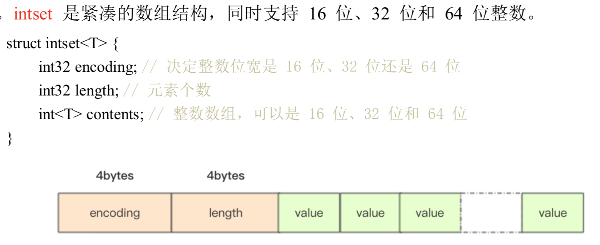
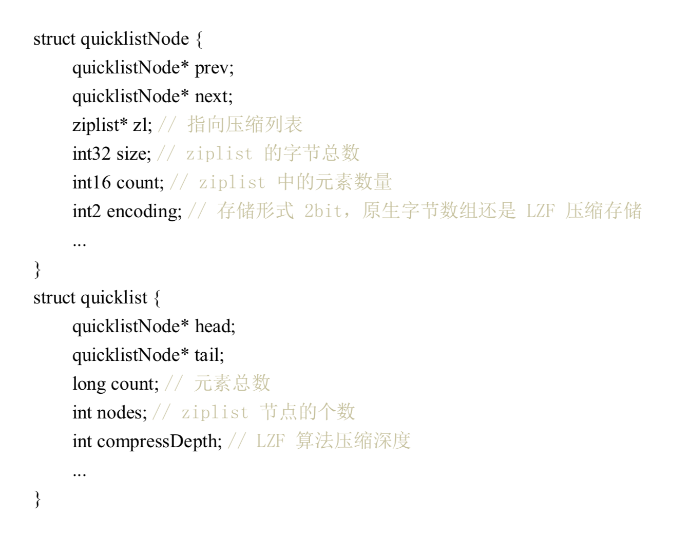
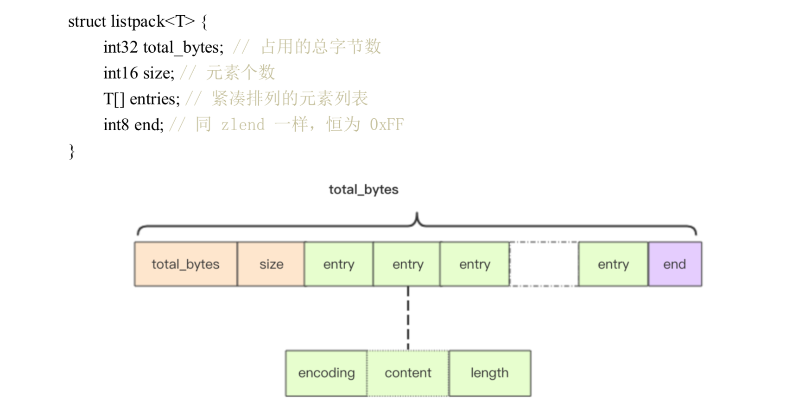

# 应用1：分布式锁


redis2.8 之后加入了set 指令的扩展参数， 使得 setnx 和 expire 可以一起执行（保证原子性）

可重入性：指的是线程持有锁的情况下再次请求加锁，如果一个锁 支持同一个线程的多次加锁，就是可重入的。


# 应用2：缓兵之计-延时队列

使用 list 作为异步消息队列（你对可靠性没有极致追求）
blpop,brpop 阻塞操作，如果list 没有数据就会进入休眠。这里需要注意长时间连接断开，需要处理超时异常并重试。


# 应用3：节衣缩食：位图

bit 数组，bytes 数组，使用 get/set/getbit/setbit/bitcount/bitops 操作

redis 位图自动扩展，如果某个偏移位置超出了现有的内容范围，自动将位图数组进行零扩充。

比如可以用来计算用户的签到时间，非常节省内存。


# 应用4: 四两拨千斤：HyperLogLog

解决统计问题的，比如统计UV(unique visit)，pv 好统计，直接可以用hash(key,val) 计数。

提供不精确的去重计数方案，标准误差 0.81%.

pfadd,pfcount 类似 sadd,scard。 (pf 是其HyperLogLog 发明人首字母缩写)

HyperLogLog  占据 12k 存储空间


# 应用5：布隆过滤器

比如用户推荐系统的去重复。布隆过滤器说某个值存在，这个值可能不存在，但是若确定不存在，则肯定不存在。

redis4.0 提供了插件功能之后才有布隆过滤器功能。

bf.add, bf.exists

bloom filter calculator

# 应用6：断尾求生-简单限流

思想是使用 zset 记录用户在一个时间窗口之内的操作数量。
这种方式适合小规模的限流，比如用户发帖等。


```py
# coding:utf8
import time
import redis

client = redis.StrictRedis()


def is_action_allowed(user_id, action_key, period, max_count):
    """
    # 指定用户 user_id 的某个行为 action_key 在特定的时间内 period 只允许发生一定的次数

    :param user_id:
    :param action_key: 行为字符串
    :param period:
    :param max_count:
    """
    key = "hist:%s:%s" % (user_id, action_key)
    now_ts = int(time.time() * 1000)  # 毫秒时间戳
    with client.pipeline() as pipe:
        # 记录行为，这里第一个 now_ts 没啥意义，用 uuid 之类的也可以。，每一个行为都会作为 zset 中的一个 key 保存下来。同一个用户同一种行为用一个 zset 记录
        pipe.zadd(key, now_ts, now_ts)  # redis> ZADD myzset 1 "one"
        # 移除时间窗口之前的行为记录，剩下的都是时间窗口之内的
        pipe.zremrangebyscore(key, 0, now_ts - period * 1000)
        # 获取时间窗口内的行为数量
        pipe.zcard(key)
        # 设置 zset 过期时间，主要是为了处理冷用户持续占用内存
        # 过期时间应该等于时间窗口长度，多宽限1s
        pipe.expire(key, period + 1)

        _, _, current_count, _ = pipe.execute()
    return current_count <= max_count


for i in range(20):
    time.sleep(0.1)
    print(
        is_action_allowed('laowang', 'reply', 60, 5)
    )
```

# 应用7：一毛不拔-漏斗限流


```py
# coding:utf8
# 单机漏斗算法
import time
# 漏斗的剩余空间代表当前行为可以持续进行的数量
# 漏斗的流水速度代表系统允许该行为的最大频率
class Funnel:
    """
    漏斗的剩余空间就代表着当前行为可以持续进行的数量，漏嘴的流水速率代表着
    系统允许该行为的最大频率
    """
    def __init__(self, capacity, leaking_rate):
        self.capacity = capacity  # 漏斗容量
        self.leaking_rate = leaking_rate  # 流水速率
        self.left_quota = capacity
        self.leaking_ts = time.time()  # 上一次漏水时间

    def make_space(self):
        now_ts = time.time()
        delta_ts = now_ts - self.leaking_ts  # 距离上一次漏水过了多久
        delta_quota = delta_ts * self.leaking_rate  # 又可以腾出来的空间
        if delta_quota < 1:  # 腾出来的空间太少，等下一次
            return
        self.left_quota += delta_quota
        self.leaking_ts = now_ts  # 更新漏水时间
        if self.left_quota > self.capacity:
            self.left_quota = self.capacity  # 不能多余容量

    def watering(self, quota):
        self.make_space()
        if self.left_quota >= quota:  # 判断剩余空间是否足够
            self.left_quota -= quota
            return True
        return False


funnels = {}  # 所有漏斗


# capacity 漏斗容量
# leaking_rate 漏嘴流水速率 quota/s
def is_action_allowed(user_id, action_key, capacity, leaking_rate):
    key = '%s:%s' % (user_id, action_key)
    funnel = funnels.get(key)
    if not funnel:
        funnel = Funnel(capacity, leaking_rate)
        funnels[key] = funnel
    return funnel.watering(1)


for i in range(20):
    print(is_action_allowed("laoqian", "reply", 15, 0.5))
```

如何实现分布式限流呢？这里其实可以把 dict 替换成hash，但是要保证从 hash 取值/内存计算/取出字段的原子性。
Redis4.0 提供了一个限流 redis 模块，redis-cell，提供了漏斗算法和原子限流指令。

```
# 表示user_id的回复行为频率每60秒最多30次。
cl.throttle user_id:reply 15 30 60 1

15 capacity 漏斗容量
30 operations/60seconds 漏水速率
1 是可选quota, 默认值1
```

# 应用8：近水楼台-GeHash

redis3.2 以后增加了地理位置 GEO，可以实现附近的餐馆这种功能。

地图元素的位置数据使用二维经纬度表示，经度范围(-180, 180]，纬度范围（-90，90]

比如指定一个半径r，使用 sql 可以圈出来。如果用户不满意，可以扩大半径继续筛选。

```
select id from positions where x0-r <x< x0+r and y0-r<y<y0+r
```
一般为了性能加上双向符合索引 (x,y)。但是在高并发场景不是好的选择。


### GEOHash 算法，地理位置距离排序

原理：把地球看成二维平面，划分成一系列的正方形方格（类似棋盘）。
所有地图元素坐标都放置在唯一的方格中，方格越小越精确。
然后对这些方格整数编码，越是靠近方格的编码越是接近。比如两刀切蛋糕，可以用 00,01,10,11四个二进制数字
表示。继续切下去正方形会越来越小，二进制正数也会越来越长，精度更高。
编码之后每个地图元素的坐标都是一个整数，通过整数可以快速还原出坐标。

redis 使用52位的整数进行编码，放到 zset 里边，value 是元素 key，score 是 GeoHash 的52位整数值。

- 增加：geoadd company 116.48015 39.996794 juejin
- 计算距离：geodist company juejin ireader km
- 获取元素位置(轻微误差，不影响附近的人功能)：geopos company juejin ireader
- 获取元素 hash(geohash 52位编码)：geohash company ireader   # http://gohash.org/XXXX 可以获取位置
- 附近的公司: georadiusbymember copany ireader 20 km count 3 asc
  - 范围20公里以内最多的3个元素按照距离正序排序，不会排除自身
- 根据坐标查询：georadius company 116.514202 39.905409 20 km withdist count 3 asc

集群环境中单个 zset key 数据量不宜超过 1M，否则迁移集群出现卡顿。
可以根据国家，省份，市区等进行拆分，显著降低 zset 集合大小


# 应用9：大海捞针-Scan

从海量 key 找出特定前缀的key列表。
redis keys 简单粗暴列出所有 满足特定正则的key.  `keys codehole*`
缺点：
- 没有 limit， offet，刷屏
- O(n)，千万级别以上的 key导致 redis 卡顿

redis2.8 加入了 scan 用来大海捞针

- 复杂度虽然也是O(n)，但是通过游标分布进行，不会阻塞线程
- limit 参数，limit 返回的只是 hint，结果可大可小
- 同 keys 有模式匹配
- 返回结构可能重复，需要客户端去重
- 如果遍历过程期间有修改，改动后的数据能否遍历到不确定
- 通过返回的游标是否为0决定是否遍历结束，而不是返回的个数

避免大 key 产生。如果你观察 redis 内存大起大落，很有可能是大 key 导致的。
定位到 key 然后改进业务代码。

redis提供了大 key 扫描功能。

- redis-cli -h 127.0.0.1 -p 7001 --bigkeys -i 0.1
- 0.1 表示每隔100条scan 休眠 0.1 ，防止 ops 剧烈抬升，扫描时间会变久


# 原理1：线程 IO 模型

redis是单线程程序，一定要小心使用O(n)的指令，防止 redis 卡顿

```
read_events, write_events = select(read_fds, write_fds, timeout)
for event in read_events:
    handle_read(event.fd)
for event in write_events:
    handle_write(enent.fd)
handle_others() # 处理其他任务，比如定时任务
```
###  指令队列
redis 为每个客户端维护了一个指令队列，先来先服务

### 响应队列
redis 同样也为每个客户端套接字关联一个响应队列，redis服务器通过响应队列来讲指令的结果返回给客户端。
如果队列为空，意味着连接暂时空闲，不需要获取写17:26:02，可以把当前客户端 socket 从write_fds移出来。
等到队列有数据了再放进去，避免select系统调用立即返回写事件，结果发现没什么数据可写，线程飙高 cpu。

### 定时任务
redis定时任务记录在一个最小堆。快要执行的任务放在堆顶，每个循环周期，redis 都会把最小堆里已经到点的任务
立即进行处理。处理完毕后，把最快要执行的任务还需要的时间记录下来，这个时间就是 select 的 timeout 参数。
redis 知道未来 timeout 时间段内，没有其他定时任务需要处理，可以安心睡眠 timeout 的时间。


# 原理2：交头接耳- 通信协议

RESP(Redis Serialization Protocol): redis序列化协议

resp 把传输的数据结构分成5种最小单元类型，单元结束后统一加上回车换行符 \r\n

- 单行字符串以+开头
  - +hello\r\n
- 多行字符串以$开头，后缀字符串长度
  - $11\r\nhello world\r\n
- 整数值以: 开头，跟上字符串形式
  - :1024\r\n
- 错误消息，以-开头
  - WRONGTYPE Operation against a key holding the wrong kind of value
- 数组，以 * 开头，后跟数组的长度
  - *3\r\n:1\r\n:2\r\n:3\r\n

特殊：

- NULL 用多行字符串，长度-1
  - $-1\r\n
- 空串，用多行字符串表示，长度0。注意这里的俩\r\n 中间隔的是空串
  - $0\r\n\r\n

### 客户端->服务器

只有一种格式，多行字符串数组

### 服务器->客户端

也是5种基本类型组合

- 单行字符串响应
- 错误响应
- 整数响应
- 多行字符串响应
- 数组响应
- 嵌套


# 原理3：未雨绸缪-持久化

### 快照，一次全量备份，内存数据的二进制序列化格式
- redis使用操作系统的多进程 COW(copy on write) 机制来实现快照持久化
- glibc fork产生一个子进程，快照持久化完全交给子进程处理。
- cow 机制进行数据段页面的分离，数据段由很多操作系统的页面组合而成。
  当父进程对其中一个页面的数据修改时，会将被共享的页面复制一份出来，然后对这个复制的页面修改。
  子进程还是 fork 瞬间的数据。

```
pid = os.fork()
if pid > 0:
    handle_client_requests() #父进程继续处理 client 请求
if pid == 0:
    handle_snapshot_write() # 子进程快照写磁盘
if pid < 0:
    # fork error
```

### AOF日志，连续的增量备份，记录内存数据修改的指令记录版本。

只记录对内存进行修改的指令记录。通过『重放』恢复 Redis 当前实例的内存数据结构状态。

AOF 重写：gbrewriteaof 指令用于对 AOF 日志瘦身。开辟一个子进程对内存遍历转换成一系列 Redis 操作指令，
序列化到一个新的 AOF 日志文件中。序列化完毕后再把操作期间发生的增量 AOF 日志追到薪的 AOF 日志文件中，
追加完毕立即替换旧的 AOF 文件。瘦身完成。

linux glibc提供了 fsync(int fd) 函数可以将指定文件内容强制从内核缓存刷到磁盘。
只要 redis 进程实时调用 fsync 可以保证 aof日志不丢失。


运维：通常不在 master 持久化，而是从节点进行。做好主从监控。


### 混合持久化
Redis4.0 增加了混合持久化。rdb文件内容和增量的 AOF 日志文件存到一起，AOF 不再是全量的的日志，
而是自持久化开始 到 持久化结束 这段时间的增量 AOF 日志，通常会比较小。

Redis重启，先加载 rdb 内容，然后重放增量 AOF 日志就可以完全替代之前的 AOF 全量文件重放，大幅提升重启效率。


# 原理4：雷厉风行-管道
管道本质是 client 提供的，不是 redis server.

# 原理5：同舟共济-事务

redis 事务模型不严格。
传统事务又 begin,commit,rollback，redis 是 multi,exec,discard，分别是事务开始，执行和丢弃。
所有指令在 exec 之前不执行，而是缓存在服务器的一个事务队列中，服务器一旦收到 exec，
开始执行整个事务队列，并且期间不会被其他指令打扰。
如果遇到一个失败了，后续指令还是会继续执行，不能算是原子性，仅仅是满足了事务的隔离性。

discard 用于丢弃事务缓冲队列种的所有指令，在 exec 执行之前。
通常结合 pipeline 使用减少网络IO。

```
pipe = redis.pipeline(transaction=True)
pipe.multi()
pipe.incr('a')
pipe.incr('a')
values = pipe.execute()
```

### redis Watch

乐观锁，解决并发修改。

```
while True:
    do_watch()
    commands()
    multi()
    send_commands()
    try:
        exec()
        break
    except WatchError:
        continue
```

watch 监控的变量如果事务执行的时候发现被修改了（包括当前客户端），
exec 指令返回 null 告诉 client 执行失败，一般由 client 重试。
```
# 使用 redis-py 实现余额加倍

import redis


def key_for(user_id):
    return 'account_{}'.format(user_id)


def double_account(client, user_id):
    key = key_for(user_id)
    while True:
        client.watch(key)
        value = int(client.get(key))
        value *= 2
        pipe = client.pipeline(transaction=True)
        pipe.multi()
        pipe.set(key, value)
        try:
            pipeline.execute()
            break  # 成功，退出
        except redis.WatchError:
            continue  # 重试
    return int(client.get(key))  # 重新获余额


client = client.StrictRedis()
user_id = 1
client.setnx(ke_for(user_id), 5)  # 初始化
print(double_account(client, user_id))
```

#  原理6：Pubsub

发布订阅，不过无法持久化消息队列，一般没啥用。

redis5.0 加入了 stream 数据结构，给redis 带来了持久化消息队列。
从此 pubsub 可以消失了。


# 原理7：开源节流-小对象压缩

32 vs 64 bit: 如果使用不超过4g，可以考虑32bit编译，内部所有数据结构所使用的指针空间占用少一半。

小对象压缩存储 : ziplist, intset


内存回收机制：redis 并不总是可以将空闲内存立即归还给操作系统。原因os 回收内存以page 为单位，
如果这个页上只要有一个 key 还在使用，那么它就不能被回收。但是 Redis 会对这些内存重用。


内存分配算法：redis 将内存分配细节丢给了第三方，目前可以用 jemalloc(facebook)库来管理内存，
或者切换到tcmalloc(google)，默认 redis 使用了性能更好的 jemalloc。

info memory 命令查看redis 内存信息。


# 原理8：有备无患-主从同步

增量同步：同步指令流，主节点会把那些对自己的状态产生修改性影响的指令记录在本地内存 buffer，
然后异步将 buffer 中的指令同步到从节点。使用的 buffer 是环形 buffer，存在覆盖丢失数据危险


快照同步：非常耗费资源的操作，首先在主库上进行一次bgsave将当前内存的数据全部快照到磁盘文件中，
然后再将快照文件的内容全部传送到从节点。从节点将快照文件接收完毕后， 立即清空数据然后全量加载。
加载完毕后同事主节点继续增量同步（之所以需要继续增量是同步期间还有新的执行指令需要同步到从节点）
(快照同步可能遇到死循环，配置一个合适的 buffer 大小)

增加从节点：从节点刚刚加入到集群先要进行一次快照同步，同步完成后再继续进行增量同步。

Wait指令：redis 复制是异步进行的，wait 可以让异步复制变身同步复制，确保强一致性（不严格）

小结：如果只用来做缓存可以不用复制功能，否则就要保证主从复制。


# 集群1：Sentinel

 Redis Sentinel 集群看成是一个 ZooKeeper 集群，它是集群高可用的心脏， 它一般是由 3~5 个节点组成，这样挂了个别节点集群还可以正常运转。
 它负责持续监控主从节点的健康，当主节点挂掉时，自动选择一个最优的从节点切换为 主节点。客户端来连接集群时，会首先连接 sentinel，通过 sentinel 来查询主节点的地址，
 然后再去连接主节点进行数据交互。当主节点发生故障时，客户端会重新向 sentinel 要地 址，sentinel 会将最新的主节点地址告诉客户端。如此应用程序将无需重启即可自动完成节 点切换。

# 集群2：分而治之：Codis

Codis  使用 go 开发，是一个代理中间件，同样使用 redis 协议对外提供服务，codis 负责将指令
转发到后边的 redis 实例来执行，并将结果返回客户端。客户端可以使用和 redis 一样的客户端。

codis 将所有key 默认划分为1024个槽(slot),首次对客户端传过来的 key 进行 crc32计算哈希值，再将
hash 之后的整数值对1024取模得到一个余数，就是对应 key 的槽位。

```
hash = crc32(command.key)
slot_index = hash % 1024
redis = slots[slot_index].redis
redis.do(command)
```

codis 使用 ZooKeeper或者etcd 来持久化槽位关系。codis 增加了 SLOTSSCAN 执行来遍历下slot 下所有槽位。
官方建议单个集合结构的总字节容量不要超过1M，如果是粉丝列表这种业务，可能要考虑分桶存储，业务上折中。

对于像是 mget 这种命令，codis 是将 key 按照所分配的示例打散分组，然后依次对每个实例调用 mget，
最后汇总结果为一个返回给客户端。

Codis 总是比官方慢半拍，但是提供了更多的 dashboard 工具来竞争。


# 集群3：众志成城-Cluster

Redis Cluster 把所有数据划分为 16384 的slot，每个节点负责其中一部分槽位。槽位信息存储在每个节点中，
不像 codis 需要额外的分布式存储来存储节点槽位信息。当 redis cluster 客户端来连接集群时，它也会得到
一份集群的槽位配置信息。

#### 槽位定位
Cluster 默认对 key 使用 crc32 算法计算 hash 得到一个整数值，然后用这个整数对16384取模得到具体槽位。
Cluster 还允许用户通过 key 里嵌入 tag 标记，强制 key 所挂在的槽位等于 tag 所在槽位。

#### 跳转
当客户端向一个错误的节点发出了指令，该节点会发现key 并不归自己管理，这时它会向客户端发送一个特殊
跳转指令携带目标操作的节点地址，告诉客户端去连这个节点去获取数据。

```
GET x
-MOVED 3999 127.0.0.1:6381
```
### 迁移
redis cluster 提供了 redis-trib 可以让运维人员手动调整槽位分布。以 slot 为单位进行迁移。
应该尽量避免大 key 的产生。

### 容错
redis clsuter 可以为每个主节点设置若干从节点，单主节点故障时，集群会自动将其中某个节点提升为主节点。

### 可能下线(PFail-possibly Fail)与确定下线(Fail)

集群通过协商来确定是否需要主从切换， redis 集群节点使用 Gossip 协议广播自己的状态以及自己对整个集群认知的改变。
如果一个节点收到了某节点失联的数量(PFail count) 达到了集群大多数，就可以标记该节点为确定下线状态(Fail),
然后向整个集群广播，强迫其他节点也接收该节点已经下线的事实，并立即对该失联节点进行主从切换。

pip install redis-py-cluster


# 扩展1：Stream

Redis 5.0 Stream: 一个新的强大的支持多播的可持久化的消息队列，借鉴了 kafka 设计。

stream 有一个消费链表，将所有加入的消息都串起来，每个消息都有唯一 ID 和对应的内容。
每个 stream 都可以挂多个消费組，每个消费组会有个游标 last_deliverd_id 在 Stream 数组之上向前移动，
表示当前消费组消费到哪条消息了。同一份 Stream 内部的消息会被每个消费组都消费到。

同一个消费组(consumer group)可以挂接多个消费者(consumer)，这些消费者是竞争关系，任意一个
消费者读取了消息都会使游标 last_deliverd_id 往前移动。

Stream 借鉴了 kafka 的消费分组概念，弥补了 Pub/Sub 不能持久化消息的缺陷。
但是又不像 kafka，消息可以分 partition。如果非要 partion，要再客户端做，提供不同的 Stream 名称，
对消息进行 hash 取模选择放入哪一个 Stream。

# 扩展2：无所不知 - Info 指令

```
# 查看每秒操作数
redis-cli info stats  | grep ops

# 查看连接多少客户端, connected_clients，如果rejected_connections很大，需要调整macxclients.
redis-cli info clients

# 查看占用内存，如果单个 redis 内存占用过大，并且在业务上没有大多压缩空间，可以考虑集群化了
redis-cli info memory | grep used | grep human

# 复制积压缓冲区多大，严重影响主从复制效率。积压缓冲区是环形的
# 如果从库断开时间太长，或者缓冲区设置太小，从库无法快速恢复中断的主从同步过程，
# 因为中间的指令被覆盖了。这个时候从库会进行全量同步模式，非常消耗 cpu 和网络资源
redis-cli info replication | grep backlog
redis-cli info stats | grep sync # 通过sync_partial_err(主从半同步复制失败的次数) 次数决定是否需要扩大积压缓冲区
```

# 扩展3：再谈分布式锁

集群环境下，当主从发生 failover 时候，分布式锁是不安全的。
同一把锁可能会被两个客户端持有。比如一个客户端在主节点持有一把锁，还没同步到从节点，主节点挂掉了。
一个从节点变成主节点， 然后另一个客户端也去申请锁，这个时候直接就会允许加锁，结果一把锁被两个客户端同时持有。

### Redlock 算法
redis 作者发明了 redlock 算法解决这个问题。 redlock-py


# 扩展4：过期策略

### 过期的 key 集合

redis 会将每个设置了过期时间的 key 放到一个单独的字典中，以后会定时遍历这个字典来删除过期 key。
出了定时遍历，还会使用惰性删除策略来删除过期 key，即访问 key 才对 key 过期时间进行检查，
如果过期了就立刻删除。

注意：开发人员要注意避免有大量 key 同时过期，最好设置一个随机范围。否则可能会有卡顿报警现象。

### 从库过期策略

从库不会进行过期扫描，从库对过期处理是被动的。主库在 key 过期时，会在 AOF 文件增加一条 del 指令，
同步到所有的从库，从库通过执行 del 来删除过期 key。


# 扩展5：LRU
当 redis 内存超过物理限制，内存数据会开始和磁盘产生频繁交换（swap），性能急剧下降，基本不可用。
一般不允许 redis 出现交换。redis提供了配置参数 maxmemory 来限制内存超出期望大小。

- noeviction。默认淘汰策略。禁止写请求，会导致线上业务不能进行
- volatile-lru。尝试淘汰设置了过期时间的key，最少使用的 key 优先被淘汰
- volatile-ttl: key的剩余寿命ttl越小，越先被淘汰
- volatile-random
- allkeys-lru : 没有设置过期时间的 key 也会被淘汰
- allkeys-random

volatile-xxx 只会淘汰带过期时间的key。如果只拿 redis 做缓存，应该用 allkeys-xxx，客户端写缓存不用带上过期时间。
如果同时用 redis 持久化，那就用 volatile-xxx.

### 近似 LRU
redis 使用的一种近似 LRU，之所以不用 lru，是因为消耗大量额外内存。
近似 lru 使用随机采样来淘汰元素，能达到和 lru 近似效果。lru 只有惰性处理。


# 扩展6：懒惰删除

如果删除一个 key 是一个大对象，比如一个包含了千万元素的 hash，删除会导致线程卡顿。
redis4.0 引入了 unlink，能对删除进行惰性处理，丢给后台线程来异步回收内存。

redis 同样提供了 flushdb async  和 flushall async 来让后台线程处理。

# 扩展7：优雅使用 Jedis

Java redis client。每次从 JedisPool 获取一个 Jedis 对象独占，使用完归还。


# 扩展8：居安思危-保护 redis

### 指令安全

- keys 导致 redis 卡顿
- flushdb/flushall 数据清空

可以通过 rename-command 指令把一些危险的指令修改成特殊名称

### 端口安全

运维人员务必在 Redis 配置文件中指定监听的 IP 地址。指定密码

### Lua 脚本安全

开发者必须禁止 Lua 脚本由用户输入的内容(UGC)生成，可能被黑客利用植入恶意代码得到 redis 主机权限。

同时应该让 redis 以普通用户身份启动，即使存在恶意代码黑客也无法获取 root 权限。

### SSL 代理

如果是公网上，可以考虑 ssl 代理。redis 官方推荐 spiped 工具


# 扩展9：redis 安全通信

spied 是一款 ssl 代理


# 源码1：字符串内部结构

redis 字符串 sds (Simple Dynamic String)，带有长度信息的字节数组。
redis 字符串在长度特别短时，使用 emb 形式存储(embeded)，长度超过44使用 raw 存储。
字符串小于 1M 之前，扩容采用加倍策略，长度超过 1M 之后，每次扩容只增加 1M。

```c
struct SDS<T> {
	T capacity; //1byte
	T len; //1byte
	byte flags;//特殊标识位, 1byte
	byte[] content; 
}
struct RedisObject {
	int4 type; //4bits
	int4 encoding; // 4bits
	int24 lru; //24bits
	int32 refcount; // 4bytes
	void *ptr; // 8bytes, 64-bit system
} robj; // 一个RedisObject 对象头占用16 byte
```

# 源码2：探索字典内部

字典使用两个 hashtable，通常只有一个有值，但是当 dict 扩容缩容时，需要分配薪的 hashtable，然后渐进式搬迁，
这时两个 hashtable 分别存储旧的和新的 hashtable。搬迁结束后，旧的 hashtable 被删除，新的 hashtable 取而代之。

hashtable 和 java HashMap 类似，通过分桶的方式解决冲突，第一维是数组，第二维是链表。
数组中存储的是第二维链表的第一个元素的指针。

```c
struct dictEntry {
	void *key;
	void *val;
	dictEntry *next; // 链接下一个 entry
}

struct dictht {
	dictEntry** table;
	long size; // 第一维数组长度
	long used; // hash 表中元素个数
}
```

### 渐进式 rehash

redis 使用渐进式rehash （直接 rehash 操作O(n)无法接受)，搬迁操作埋伏在当前字典的后续指令中（来自客户端的hset/hdel等),
但是有可能客户端闲下来了，所以 redis 还会在定时任务中队字典进行主动搬迁。

### 查找过程

通过 hash 函数找到槽，如果对应的槽没有元素，就遍历它的链表继续找。

### hash 函数

最好是 hash 比较均匀，redis 字典默认是 hash 函数是 siphash。
siphash在输入 key 很小的情况下，也能产生随机性很好的输出。

### hash 攻击

恶意构造是的 hash 很多元素到个别链表中，查找效率极速下降。

### 扩容

正常情况下当 hash 表中的元素个数等于第一维数组长度就会扩容到原来的两倍。
不过 redis 做 bgsave时，为了减少内存页过多分离(Copy On Write)，redis 尽量不去扩容(dict_can_resize)，
但是如果 hash 表元素个数已经达到了第一纬数组5倍(dict_force_resize_ratio)，会强制扩容。

### 缩容

元素个数低于数组长度的 10%，缩容不会考虑 redis 是否在做 bgsave.

### set 结构
也是字典，只不过所有的 value 值时NULL，其他特性和字典一样。


# 探索『压缩列表』内部

redis 为了节约空间，zset 和 hash 容器对象在元素较少的时候，使用 压缩列表ziplist 存储。


ziplist紧凑存储，没有冗余空间，插入一个新的元素需要调用 realloc 扩展内存。
如果 ziplist 占据内存太大，重新分配内存和拷贝内存就会有很大消耗。所以 ziplist 不适合大型字符串，元素也不宜过多。

插入操作造成级联更新（修改prevlen字段）

#### IntSet

当 set 集合容纳的元素都是整数并且元素个数较小时，Redis 会使用 intset 来存储。

intset 是紧凑数组




# 探索『快速列表』内部

redis 早期存储 list 使用 ziplist 和 linkedlist，元素少时用 ziplist，元素多了用 linkedlist。
考虑链表的附加空间太高， prev,next 占用空间，另外每个节点内存单独分配，加重碎片化，影响内存管理效率。




每个 ziplist 默认 8k 字节，超过了这个字节数，会新起一个 ziplist。ziplist 长度由 list-max-ziplist-size 决定

默认 压缩深度0也就是不压缩，由 list-compress-depth 确定。
为了支持快速 push/pop，quicklist 首尾两个 ziplist 不压缩，此时深度就是1。
如果深度为2，就表示 quicklist 的首尾第一个 ziplist 和收尾第 2 个都不压缩。


# 探索跳跃列表内部

zset 是一个复合结构，需要一个 hash 来存储 value 和 score 的对应关系。
score 排序和根据指定的 score 范围获取 value 列表的功能，需要另一个结构 siplist.


```
struct zslnode {
	string value;
	double score; zslnode*[] forwards; zslnode* backward;
}
struct zsl {
	zslnode* header;
	int maxLevel;
	map<string, zslnode*> ht; // hash 结构的所有键值对
}
```

### 随机层数

对于每一个新插入的节点，都需要调用一个随机算法给它分配一个合理的层数。直观上
期望的目标是 50% 的 Level1，25% 的 Level2，12.5% 的 Level3，一直到最顶层 2^-63，
因为这里每一层的晋升概率是 50%。


# 探索紧凑列表内部

redis5.0 引入新的结构 listpack，对 ziplist 的改进。



### 级联更新
listpack 的设计彻底消灭了 ziplist 存在的级联更新行为，元素与元素之间完全独立，不 会因为一个元素的长度变长就导致后续的元素内容会受到影响。

### 取代 ziplist
listpack 的设计的目的是用来取代 ziplist，不过当下还没有做好替换 ziplist 的准备，因 为有很多兼容性的问题需要考虑，ziplist 在 Redis 数据结构中使用太广泛了，替换起来复杂 度会非常之高。它目前只使用在了新增加的 Stream 数据结构中。


# 探索 基数树 内部

Rax (Radix Tree) 有序字典树，按照 key 的字典序排列，支持快速定位、插入和删除操作。


golang HttpRouter 就是使用的 radix-tree.

Rax 被用在 Redis Stream 结构里面用于存储消息队列，在 Stream 里面消息 ID 的前缀 是时间戳 + 序号，这样的消息可以理解为时间序列消息。使用 Rax 结构进行存储就可以快 速地根据消息 ID 定位到具体的消息，然后继续遍历指定消息之后的所有消息。


# 参考：

- https://redis.io/
- http://antirez.com/latest/0
- https://redis.io/modules
- https://pauladamsmith.com/articles/redis-under-the-hood.html
