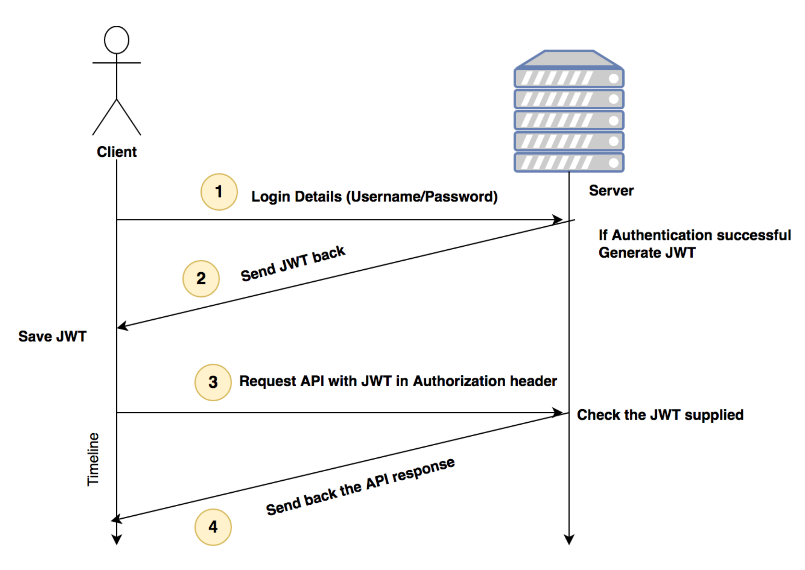

《Building RESTful Web services with GO》 涉及面比较广，但是讲得太浅


# 1. Getting started with REST API Development

Live reloading the application with supervisord and gulp

# 2. Handling Routing for Rest Srevices

### ServeMux a basic router in Go

`go get github.com/julienschmidt/httprouter`


```
// execService.go

// Package main  provides ...
package main

import (
	"bytes"
	"fmt"
	"log"
	"net/http"
	"os/exec"

	"github.com/julienschmidt/httprouter"
)

func getCommandOutput(command string, arguments ...string) string {
	cmd := exec.Command(command, arguments...) //unpack
	var out bytes.Buffer
	var stderr bytes.Buffer
	cmd.Stdout = &out
	cmd.Stderr = &stderr
	err := cmd.Start()
	if err != nil {
		log.Fatal(fmt.Sprint(err) + ": " + stderr.String())
	}
	err = cmd.Wait()
	if err != nil {
		log.Fatal(fmt.Sprint(err) + ": " + stderr.String())
	}
	return out.String()
}

func goVersion(w http.ResponseWriter, r *http.Request, params httprouter.Params) {
	fmt.Fprintf(w, getCommandOutput("/usr/local/bin/go", "version"))
}

func getFileContent(w http.ResponseWriter, r *http.Request, params httprouter.Params) {
	fmt.Fprintf(w, getCommandOutput("/bin/cat", params.ByName("name")))
}

func main() {
	router := httprouter.New()
	router.GET("/api/v1/go-version", goVersion)
	router.GET("/api/v1/show-file/:name", getFileContent)
	log.Fatal(http.ListenAndServe(":8000", router))
}
```

### Building the simple static file server

```
package main

import (
	"log"
	"net/http"

	"github.com/julienschmidt/httprouter"
)

func main() {
	router := httprouter.New()
	router.ServeFiles("/static/*filepath", http.Dir("/users/naren/static"))
	log.Fatal(http.ListenAndServe(":8000", router))
}
```

### Gorilla Mux, a powerful HTTP router

- Path-based matching
- Query-based matching
- Domain-based matching
- Sub-domain based matching
- Reverse URL generation


# 3. Working with Middleware and RPC


### What is middleware?

When a piece of code needs to be executed for every request or subset of HTTP requests.

### Creating a basic middleware

```
// custommiddleware.go
package main

func middleware(handler http.handler) http.handler {
	return http.handlerfunc(func(w http.responsewriter, r *http.request) {
		fmt.println("executing middleware before request phase!")
		//pass control back to handler
		handler.servehttp(w, r)
		fmt.println("executing middleware after response phase!")
	})
}

func mainlogic(w http.responsewriter, r *http.request) {
	// business logic here
	fmt.println("executing mainhandler")
	w.write([]byte("ok"))
}

func main() {
	manlogichandler := http.handlerfunc(mainlogic)
	http.handler("/", middleware(manlogichandler))
	http.listenandserve(":8000", nil)
}
```

### Multiple middleware and chaining


```
// cityAPI.go
package main

import (
	"encoding/json"
	"fmt"
	"net/http"
)

type city struct {
	Name string
	Area uint64
}

func mainLogic(w http.ResponseWriter, r *http.Request) {
	if r.Method == "POST" {
		var tempCity city
		decoder := json.NewDecoder(r.Body)
		err := decoder.Decode(&tempCity)
		if err != nil {
			panic(err)
		}
		defer r.Body.Close()
		// creat logic
		fmt.Printf("%s %d", tempCity.Name, tempCity.Area)
		// tell everything is fine
		w.WriteHeader(http.StatusOK)
		w.Write([]byte("201 - Created"))
	} else {
		w.WriteHeader(http.StatusMethodNotAllowed)
		w.Write([]byte("405 - Method Not Allowed"))
	}
}

func main() {
	http.HandleFunc("/city", mainLogic)
	http.ListenAndServe(":8000", nil)
}
```

抽象出来俩middleware:

```
package main

import (
	"encoding/json"
	"fmt"
	"log"
	"net/http"
	"strconv"
	"time"
)

type city struct {
	name string
	area uint64
}

// middleware to check content type as json
func filtercontenttype(handler http.handler) http.handler {
	return http.handlerfunc(func(w http.responsewriter, r *http.request) {
		log.println("currently in the check content type middleware")
		// filtering request by mime type
		if r.header.get("content-type") != "application/json" {
			w.writeheader(http.statusunsupportedmediatype)
			w.write([]byte("415 - unsupported media type. please send json"))
			return
		}
		handler.servehttp(w, r)
	})
}

// middle to add server timestamp for response cookie
func setservertimecookie(handler http.handler) http.handler {
	return http.handlerfunc(func(w http.responsewriter, r *http.request) {
		handler.servehttp(w, r)
		cookie := http.cookie{name: "server-time(utc)", value: strconv.formatint(time.now().unix(), 10)}
		http.setcookie(w, &cookie)
		log.println("currently in the set server time middleware")
	})
}

func mainlogic(w http.responsewriter, r *http.request) {
	if r.method == "post" {
		var tempcity city
		decoder := json.newdecoder(r.body)
		err := decoder.decode(&tempcity)
		if err != nil {
			panic(err)
		}
		defer r.body.close()
		// creat logic
		fmt.printf("%s %d", tempcity.name, tempcity.area)
		// tell everything is fine
		w.writeheader(http.statusok)
		w.write([]byte("201 - created"))
	} else {
		w.writeheader(http.statusmethodnotallowed)
		w.write([]byte("405 - method not allowed"))
	}
}

func main() {
	mainlogichnadler := http.handlerfunc(mainlogic)
	http.handler("/city", filtercontenttype(setservertimecookie(mainlogichnadler)))
	http.listenandserve(":8000", nil)
}
```

### Paniless middleware chaining with Alice

```
//go get github.com/justinas/alice

func main() {
    mainLogicHandler := http.HandlerFunc(mainLogic)
    chain := alice.New(filterContentType, setServerTimeCookie).Then(mainLogicHandler)
    http.Handle("/city", chain)
    http.ListenAndServe(":8000", nil)
}
```

### Using Gorilla's Handlers middleware for Logging

- LoggingHandler
- CompressingHandler: for zipping the responses
- RecoveryHandler: for recovering from unexpected panics

### What is RPC?

"net/rpc"

### JSON RPC using Gorilla RPC


# 4. Simplifying RESTful Services with Popular Go Frameworks

### go-restful, a framework for REST API creation


```
package main

import (
	"fmt"
	"io"
	"net/http"
	"time"

	"github.com/emicklei/go-restful"
)

// brew install sqlite3
// go get github.com/emicklei/go-restful
// a simple ping server echoes the server time back to the client
func main() {
	webservice := new(restful.WebService)
	webservice.Route(webservice.GET("/ping").To(pingTime))
	restful.Add(webservice)
	http.ListenAndServe(":8000", nil)
}

func pingTime(req *restful.Request, resp *restful.Response) {
	io.WriteString(resp, fmt.Sprintf("%s", time.Now()))
}

// curl -X GET "http://localhost:8000/ping"
```

### CRUD and SQLite3 basics

```
// sqliteFundamentals.go
package main

import (
	"database/sql"
	"log"

	_ "github.com/mattn/go-sqlite3"
)

// go get github.com/mattn/go-sqlite3

type Book struct {
	id     int
	name   string
	author string
}

func main() {
	db, err := sql.Open("sqlite3", "./books.db")
	log.Println(db)
	if err != nil {
		log.Println(err)
	}
	//create table
	statement, err := db.Prepare("create table if not exists books(id integer primary key, isbn integer, author(varchar(64), name varchar(64) NULL)")
	if err != nil {
		log.Println("Error in creating table")
	} else {
		log.Println("success created table books")
	}
	statement.Exec()
	// Create
	statement, _ = db.Prepare("INSERT INTO books (name, author, isbn) VALUES (?, ?, ?)")
	statement.Exec("A Tale of Two Cities", "Charles Dickens", 140430547)
	log.Println("Inserted the book into database!")
	// Read
	rows, _ := db.Query("SELECT id, name, author FROM books")
	var tempBook Book
	for rows.Next() {
		rows.Scan(&tempBook.id, &tempBook.name, &tempBook.author)
		log.Printf("ID:%d, Book:%s, Author:%s\n", tempBook.id,
			tempBook.name, tempBook.author)
	}
	// Update
	statement, _ = db.Prepare("update books set name=? where id=?")
	statement.Exec("The Tale of Two Cities", 1)
	log.Println("Successfully updated the book in database!")
	//Delete
	statement, _ = db.Prepare("delete from books where id=?")
	statement.Exec(1)
	log.Println("Successfully deleted the book in database!")
}

// 略坑啊：
// This program runs on Windows and Linux without any problem. In Go versions less than 1.8.1, you may see problems on macOS X such as Signal Killed. This is because of the Xcode version; please keep this in mind.
```


### Building a Metro Rail APi with go-restful

// go get github.com/emicklei/go-restful


### Building RESTful APIs with the Gin framework

```
// go get github.com/gin-gonic/gin
// ginBasic.go
package main

import (
	"time"

	"github.com/gin-gonic/gin"
)

func main() {
	r := gin.Default()
	r.GET("/pingTime", func(c *gin.Context) {
		c.JSON(200, gin.H{"serverTime": time.Now().UTC()})
	})
	r.Run(":8000")
}
```

### Building a RESTful API with Revel.go

Like Python's Django.

go get github.com/revel/revel


# 5. Working with MongoDB and Go to Create REST APIs

### Introducig mgo, a MongoDB deiver for Go

get get gopkg.in/mgo.v2


# 6. Wokring with Protocol Bufffers and GRPC

### Protocol buffer language

- Scalar values, Enumerations, Defalut values, Nested values, Unknown types

```
syntax 'proto3';

message NetworkInterface {
  int index=1;
  int mtu=2;
  string name=3;
  string hardwareaddr=4;
}
```

the protocol buffer message will be converted to a Go struct and fiels are filled with empty defaut values.

### Compiling a protocol buffer with protoc

install protobuf compiler on your meachine.  brew install protobuf

### GRPC

go get google.golang.org/grpc

go get -u github.com/golang/protobuf/protoc-gen-go

Grpc has the following benefits over HTTP/REST/JSON architecture:

- GPRC use http/2, which is a binary protocol
- Header compression is possible in http2
- we can multiplex many requests on one connection
- Usage of protobufs for strict typing of data
- streaming of requests or responses is possible instead of request/response transactions

### Bidirectional streaming with GRPC


# 7. Working with PostgreSQL, JSON, and Go

### install PostgreSQL

brew install postgresql && brew services start postgresql // port 5432
// use psql shell create new use and database and

### pq, a pure PostgreSQL database driver for Go

go get github.com/lib/pq

### Exploring thj JSON store in PostgreSQL

PostgreSQL > 9.2 has a feature called the JSON store.

### GORM, a powerful ORM for GO

go get -u github.com/jinzhu/gorm


# 8. Building a REST API Client in Go and Unit Testing

### Basics for writing a command-line tool in Go


```
// flagExample.go
package main

import (
	"flag"
	"log"
)

var name = flag.String("name", "stranger", "you wonderfule name")

func main() {
	flag.Parse()
	log.Printf("Hello %s", *name)
}
// ./flagExample -name laowang or ./flagExample -name=laowang
```

### CLI - a library for building beautiful clients

go get github.com/urfave/cli

```
// cliBasci.go
package main

import (
	"log"
	"os"

	"github.com/urfave/cli"
)

func main() {
	app := cli.NewApp()
	app.Flags = []cli.Flag{
		cli.StringFlag{
			Name:  "name",
			Value: "stranger",
			Usage: "you wonderful name",
		},
		cli.IntFlag{
			Name:  "age",
			Value: 0,
			Usage: "your graceful age",
		},
	}
	app.Action = func(c *cli.Context) error {
		log.Printf("Hello %s (%d years), Welcome to the command line world", c.String("name"), c.Int("age"))
		return nil
	}
	app.Run(os.Args)
}
```

### Collecting command-line arguments in CLI


```
// storeMarks.go
package main

import (
	"log"
	"os"

	"github.com/urfave/cli"
)

func main() {
	app := cli.NewApp()
	// define flags
	app.Flags = []cli.Flag{
		cli.StringFlag{
			Name:  "save",
			Value: "no",
			Usage: "Should save to database (yes/no)",
		},
	}

	app.Version = "1.0"
	// define action
	app.Action = func(c *cli.Context) error {
		var args []string
		if c.NArg() > 0 {
			// Fetch arguments in a array
			args = c.Args()
			personName := args[0]
			marks := args[1:len(args)]
			log.Println("Person: ", personName)
			log.Println("marks", marks)
		}
		// check the flag value
		if c.String("save") == "no" {
			log.Println("Skipping saving to the database")
		} else {
			// Add database logic here
			log.Println("Saving to the database", args)
		}
		return nil
	}

	app.Run(os.Args)
}

// ./storeMarks --save=yes Albert 89 85 97
```

### grequests - a REST API package for GO


go get -u github.com/levigross/grequests

```
package main

import (
	"log"

	"github.com/levigross/grequests"
)

func main() {
	resp, err := grequests.GET("http://httpbin.org/get", nil)
	if err != nil {
		log.Fatalln("Unabled to make requests: ", err)
	}
	log.Println(resp.String())
}
package main

import (
	"log"

	"github.com/levigross/grequests"
)

func main() {
	resp, err := grequests.GET("http://httpbin.org/get", nil)
	if err != nil {
		log.Fatalln("Unabled to make requests: ", err)
	}
	log.Println(resp.String())
}
/*
type Response struct {
    Ok bool
    Error error
    RawResponse *http.Response
    StatusCode int
    Header http.Header
}
*/
```

### Getting comfortable with the GitHub REST API


```
// https://developer.github.com/v3/

// export GITHUB_TOKEN=YOUR_GITHUB_ACCESS_TOKEN
// getRepos.go
package main

import (
  "github.com/levigross/grequests"
  "log"
  "os"
)

var GITHUB_TOKEN = os.Getenv("GITHUB_TOKEN")
var requestOptions = &grequests.RequestOptions{Auth: []string{GITHUB_TOKEN, "x-oauth-basic"}}

type Repo struct {
  ID int `json:"id"`
  Name string `json:"name"`
  FullName string  `json:"full_name"`
  Forks int `json:"forks"`
  Private bool `json:"private"`
}

func getStats(url string) *grequests.Response{
  resp, err := grequests.Get(url, requestOptions)
  // You can modify the request by passing an optional RequestOptions struct
  if err != nil {
    log.Fatalln("Unable to make request: ", err)
  }
  return resp
}

func main() {
  var repos []Repo
  var repoUrl = "https://api.github.com/users/torvalds/repos"
  resp := getStats(repoUrl)
  resp.JSON(&repos)
  log.Println(repos)
}
```

### Using Redis for caching the API data


go get github.com/go-redis/redis

### Creating a unit testing tool for our URL shortening service

```
package main_test

import (
	"net/http"
	"testing"
)

func TestGetoOriginalURL(t *testing.T) {
	response, err := http.Get("http://localhost:8000/v1/short/1")
	if http.StatusOK != response.StatusCode {
		t.Errorf("Expected response code %d. Got %d\n", http.StatusOK)
	}
	if err != nil {
		t.Errorf("encoutered an error:", err)
	}
}
```


# 9. Scaling Our REST API Using Microservices

The disadvantage list of a monolithic application could be:

- Tightly coupled architecture
- Single point of failure
- Velocity of adding new features and components
- Fragmentation of work is limited to teams
- Continuous deployment is very tough because an entire application needs to be pushed

Microservices bring the following benefits to the plate:

- If the team is big, people can work on chunks of applications
- Adaptability is easy for the new developers
- Adopting best practices, such as Continuous Integration (CI) and Continuous Delivery (CD)
- Easily replaceable software with loosely coupled architecture


### Go Kit, a package for building microservices

go get github.com/go-kit/kit


# 10. Deplying Our REST srevices

### proxy server

The benefits of having a proxy server (Nginx):

- It can act as a load balancer
- It can sit in front of cluster of applications and redirect HTTP requests
- It can serve a filesystem with a good performance
- It streams media very well

### Load balancing with Nginx

- Round Robin
- Least Coonection: send to the server that is currently serving the least number of clients
- IP HASH
- Least Time: send to the machine with the lowest average latency time

### Rate limiting our REST API

limit_conn_zone


# 11. Using an API Gateway to Monitor and Metricize REST API

They are authentication, logging, rate limiting, and so on. The best way to add those features is to use an API gateway.

### Why is an API gateway required?

An api gateway is a fine piece of middleware does these things:

- Loggig
- Security
- Traffic control
- Transformations

### Kong, an open-source API gateway
Kong is a cloud-native, fast, scalable, and distributed Microservice Abstraction Layer (also known as an API Gateway, API Middleware or in some cases Service Mesh). Made available as an open-source project in 2015, its core values are high performance and extensibility.
Combination of OpenResty and Nginx.


# 12 Handling Authentication for Our REST Services

- session-based authentication
- JSON Web Tokens (JWT)
- Authentication2(OAuth2)

```
//go get github.com/gorilla/sessions
var store = sessions.NewCookieStore([]byte("secret_key"))
```

### session-based authentication

```
package main

import (
	"log"
	"net/http"
	"os"
	"time"

	"github.com/gorilla/mux"
	"github.com/gorilla/sessions"
)

// os.Getenv return empty string "" if not exists key
var store = sessions.NewCookieStore([]byte(os.Getenv("SESSION_SECRET")))

var users = map[string]string{"naren": "passme", "admin": "password"}

func HealthcheckHandler(w http.ResponseWriter, r *http.Request) {
	session, _ := store.Get(r, "session.id")
	if (session.Values["authenticated"] != nil) && session.Values["authenticated"] != false {
		w.Write([]byte(time.Now().String()))
	} else {
		http.Error(w, "Forbidden", http.StatusForbidden)
	}
}

func LoginHandler(w http.ResponseWriter, r *http.Request) {
	session, _ := store.Get(r, "session.id")
	err := r.ParseForm()
	if err != nil {
		http.Error(w, "pass the data as URL form encoded", http.StatusBadRequest)
		return
	}
	username := r.PostForm.Get("username")
	password := r.PostForm.Get("password")

	if originalPassword, ok := users[username]; ok {
		if password == originalPassword {
			session.Values["authenticated"] = true
			session.Save(r, w) // save to response
		} else {
			http.Error(w, "Invalid credentials", http.StatusUnauthorized)
			return
		}
	} else {
		http.Error(w, "user is not found", http.StatusNotFound)
		return
	}
	w.Write([]byte("Logged In success"))
}

func LogoutHandler(w http.ResponseWriter, r *http.Request) {
	session, _ := store.Get(r, "session.id")
	session.Values["authenticated"] = false
	session.Save(r, w)
	w.Write([]byte(""))
}

func main() {
	r := mux.NewRouter()
	r.HandleFunc("/login", LogoutHandler)
	r.HandleFunc("/health", HealthcheckHandler)
	r.HandleFunc("/logout", LogoutHandler)
	http.Handle("/", r)
	srv := &http.Server{
		Handler:      r,
		Addr:         "127.0.0.1:8000",
		WriteTimeout: 15 * time.Second,
		ReadTimeout:  15 * time.Second,
	}
	log.Fatal(srv.ListenAndServe())

}
```

```py
# test py code
import requests

resp = requests.post("http://localhost:8000/login", data={"username": "admin", "password": "password"})
print(resp.text)
assert resp.status_code == 200

cookies = resp.cookies
resp = requests.get("http://localhost:8000/health", cookies=cookies)
print(resp.text)
assert resp.status_code == 200
```

### JWT



### Json web token format

- Create a JWT header by doing Base64Url encoding on the header JSON.
- Create a JWT payload by doing Base64Url encoding on the payload JSON.
- Create a signature by encrypting the appended header and payload using a secret key.
- JWT string can be obtained by appending the header, payload, and signature.

signature = HMACSHA256( base64UrlEncode(header) + "." + base64UrlEncode(payload), secret)
tokenString = base64UrlEncode(header) + "." + base64UrlEncode(payload) + "." + signature

go get github.com/dgrijalva/jwt-go

### Auth2

Authentication is the process of identifying whether a client is genuine or not. When a server authenticates a client, it checks the username/password pair and creates session cookie/JWT.

Authorization is the process of differentiating one client from another after a successful authentication. In cloud services, the resources requested by a client need to be served by checking that the resources belong to that client but not the other client. The permissions and access to resources vary for different clients. For example, the admin has the highest privileges of resources. A normal user's access is limited.

OAuth2 is a protocol for authenticating multiple clients to a service, whereas the JWT is a token format. We need to encode/decode JWT tokens to implement the second stage (dashed lines in the following screenshot) of OAuth 2.


```
package main

import (
	"encoding/json"
	"fmt"
	"log"
	"net/http"
	"os"
	"time"

	jwt "github.com/dgrijalva/jwt-go"
	"github.com/dgrijalva/jwt-go/request"
	"github.com/gorilla/mux"
)

var secretKey = []byte(os.Getenv("SESSION_SECRET"))

// var secretKey = []byte("test")

var users = map[string]string{"naren": "passme", "admin": "password"}

// json response for jwt
type Response struct {
	Token  string `json:"token"`
	Status string `json:"status"`
}

func HealthcheckHandler(w http.ResponseWriter, r *http.Request) {
	tokenString, err := request.HeaderExtractor{"access_token"}.ExtractToken(r)
	token, err := jwt.Parse(tokenString, func(token *jwt.Token) (interface{}, error) {
		// Don't forget to validate the alg is what you expect:
		if _, ok := token.Method.(*jwt.SigningMethodHMAC); !ok {
			return nil, fmt.Errorf("Unexpected signing method: %v", token.Header["alg"])
		}
		// hmacSampleSecret is a
		return secretKey, nil
	})
	if err != nil {
		w.WriteHeader(http.StatusForbidden)
		w.Write([]byte("Access Denied; Please check access token"))
		return
	}

	if claims, ok := token.Claims.(jwt.MapClaims); ok && token.Valid {
		// If token is valid
		response := make(map[string]string)
		// response["user"] = claims["username"]
		response["time"] = time.Now().String()
		response["user"] = claims["username"].(string) // claims value is interface, convert to string
		responseJSON, _ := json.Marshal(response)
		w.Write(responseJSON)
	} else {
		w.WriteHeader(http.StatusForbidden)
		w.Write([]byte(err.Error()))
	}
}

// LoginHandler validates the user credentials
func getTokenHandler(w http.ResponseWriter, r *http.Request) {
	err := r.ParseForm()
	if err != nil {
		http.Error(w, "Please pass the data as URL form encoded", http.StatusBadRequest)
		return
	}
	username := r.PostForm.Get("username")
	password := r.PostForm.Get("password")
	if originalPassword, ok := users[username]; ok {
		if password == originalPassword {
			// Create a claims map
			claims := jwt.MapClaims{
				"username":  username,
				"ExpiresAt": 15000,
				"IssuedAt":  time.Now().Unix(),
			}
			token := jwt.NewWithClaims(jwt.SigningMethodHS256, claims)
			tokenString, err := token.SignedString(secretKey)
			if err != nil {
				w.WriteHeader(http.StatusBadGateway)
				w.Write([]byte(err.Error()))
			}
			response := Response{Token: tokenString, Status: "success"}
			responseJSON, _ := json.Marshal(response)
			w.WriteHeader(http.StatusOK)
			w.Header().Set("Content-Type", "application/json")
			w.Write(responseJSON)
		} else {
			http.Error(w, "Invalid Credentials", http.StatusUnauthorized)
			return
		}
	} else {
		http.Error(w, "User is not found", http.StatusNotFound)
		return

	}
}
func main() {
	r := mux.NewRouter()
	r.HandleFunc("/getToken", getTokenHandler)
	r.HandleFunc("/healthcheck", HealthcheckHandler)
	http.Handle("/", r)
	srv := &http.Server{
		Handler: r,
		Addr:    "127.0.0.1:8000",
		// Good practice: enforce timeouts for servers you create!
		WriteTimeout: 15 * time.Second,
		ReadTimeout:  15 * time.Second,
	}
	log.Fatal(srv.ListenAndServe())
}
```
