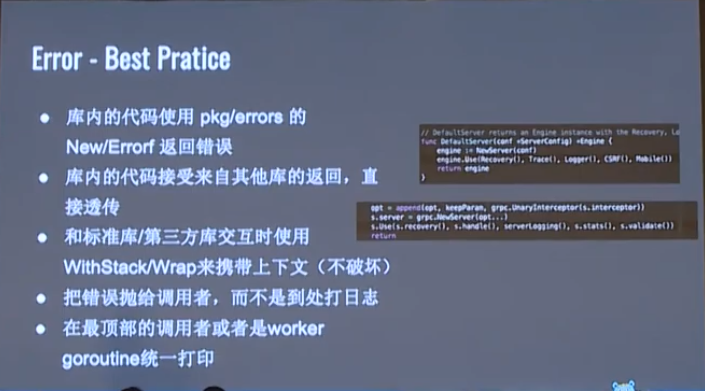

https://www.youtube.com/watch?v=N_00d3qUfQY

go业务基础库之Error&Context


# Error-Background

- 错误检查和打印
  - 分层开发导致处处打印
  - 难以获取堆栈关联
  - 根因丢失

- 业务错误处理
  - API 中逻辑标识处理
  - API 中错误消息展示
  - API 中业务的 Hint 数据


# Error-Handle Error

- 追加上下文
  - WithStack/Warp 来保存堆栈
  - WithMessage 来定义消息

```go
// github.com/pkg/errors
_, err := ioutil.ReadAll(r)
if err != nil {
  return errors.Wrap(err, "read failed")
}
```

- 根因追踪
  - Cause 获取根因，用于 Sentinel errors 逻辑处理


# Error-Best practice




- 集中处理错误，errorgroup
  - 容易用错返回的context
  - 扇出没有控制
  - 业务代码容易 panic

# Error-Handle Error


# Context-Background

- 超时 & 取消
  - 业务库从无到有
  - 可用性：超时
  - 可用性：取消

- 元数据传递
  - 同进程：同步生命周期传递
  - 同进程：异步生命周期传递
  - 跨进程：网络传递

# Context-Context With API


