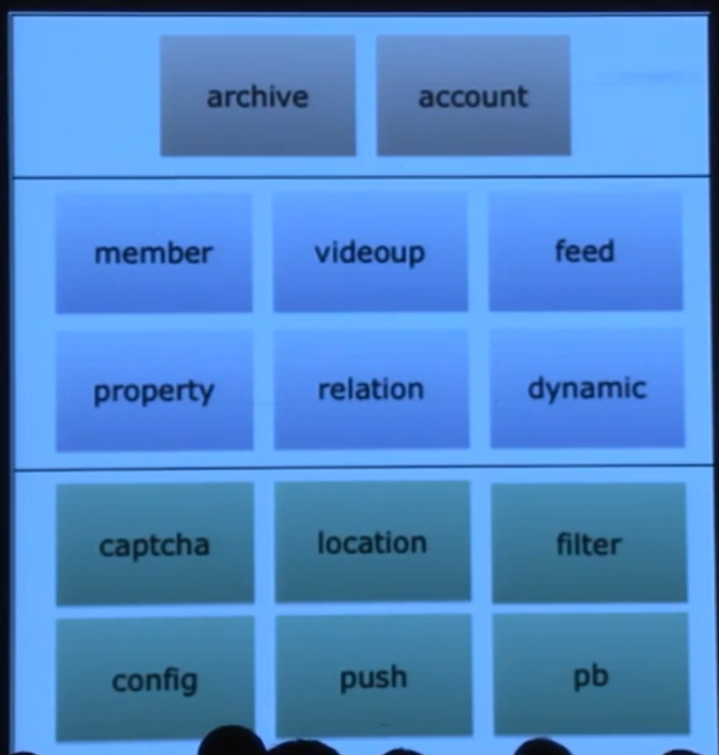
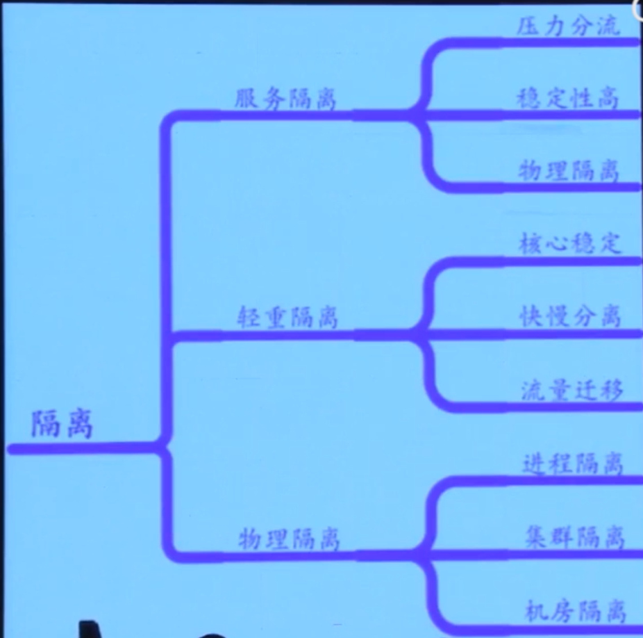
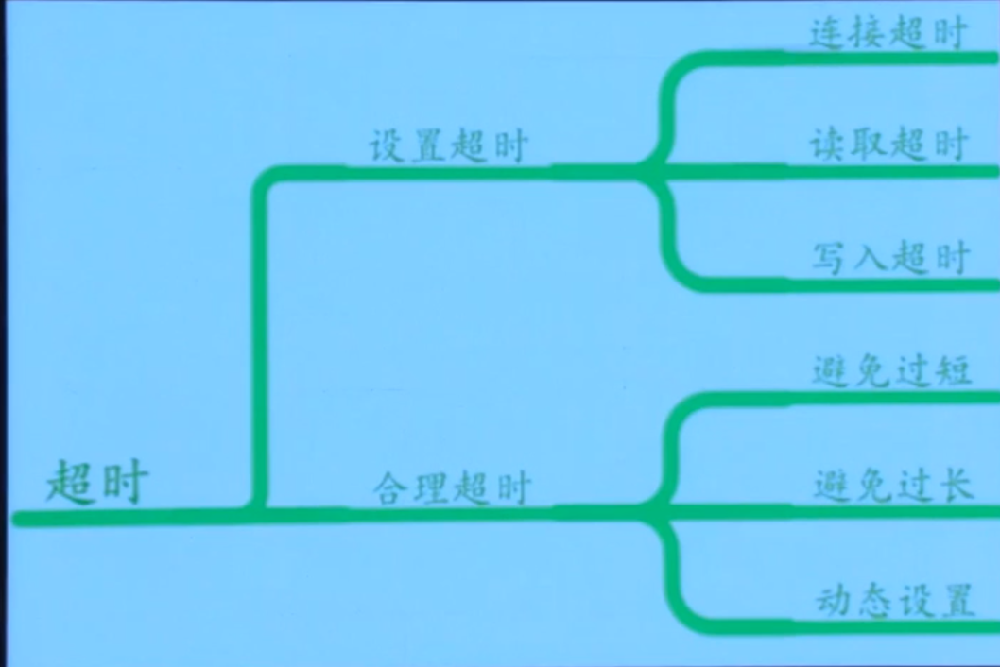
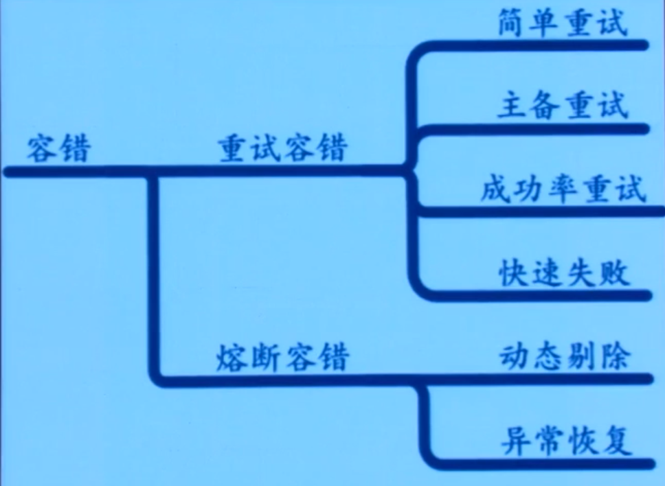

# 微服务演进

巨石架构：部署难；升级痛苦

步骤：

- 梳理业务边界。
  - 拆分服务，周边业务（观看历史，收藏）。
  - 保持 API 兼容
  - 让相关方迁移，请人家吃烧烤

- 资源隔离部署
  - 不要和老代码一同部署

- 内外网服务隔离

- RPC框架(基于netrpc改造，加上context/超时)
  - 序列化(GOB)。语言统一
  - 上下文管理（超时控制）。一堵就挂掉
  - 拦截器（鉴权，统计，限流）
  - 服务注册（zookeeper）
  - 负载均衡（客户端）

- API Gateway
  - 统一&聚合协议
  - errgroup 并行调用
  - 业务隔离
  - 熔断，降级，限流等高可用

# 高可用

- 隔离

- 超时

- 限流

- 降级

- 容错(netflix java 代码改写)

# 中间件

- databus (基于kafka)
- canal (mysql replication)
- bilitw (基于 twemproxy)
- bfs (facebook haystack, opencv)
- config-service
- dapper (google dapper)

# 持续集成和交付

- 语义化版本控制
- 微服务

# 运维体系

# 内容：

- https://www.youtube.com/watch?v=wC-EIYJw4nk
