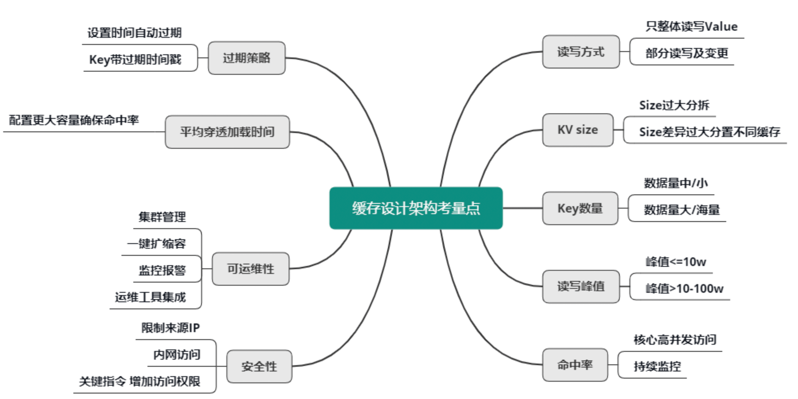

# 01 业务数据访问性能太低怎么办？

缓存的基本思想、优点和代价

- 思想：
  - 时间局限性，被获取过一次的数据在未来被多次引用
  - 空间换时间来达到加速目的
  - 性能成本 tradeoff

- 优点：
  - 提升访问性能
  - 降低网络堵塞
  - 减轻服务负载
  - 增强可扩展性

- 代价：
  - 复杂度
  - 运维成本，费用
  - 一致性问题、可用性和分区问题

# 02 如何根据业务来选择缓存模式和组件？

业务系统读写缓存的三种模式：

- Cache Aside（旁路缓存）
  - Write: 更新db，删除cache, db驱动cache更新
  - Read: miss 后读db+回写
  - 特点：lazy 计算，以 db 为准
  - 适合场景：更强一致性或者Cache数据构建复杂的业务

- Read/Write Through（读写穿透）
  - Write: cache不存在更新db；cache 存在更新cache+db
  - Read: miss后由缓存服务加载并写 cache
  - 特点：存储服务负责数据读写，隔离型更佳，热数据友好
  - 适合场景：数据有冷热区分 (微博 feed 的用户最新微博列表)

- Write Behind Caching（异步缓存写入）
  - Write: 只更新缓存，缓存服务异步更新db
  - Read: miss后由缓存服务加载 + 写 cache
  - 特点：写性能最高，定期异步刷新，存在丢失概率
  - 适合场景：写频率超高(一致性要求不高)，需要合并

# 03 设计缓存架构时需要考量哪些因素？

组件选择：首先要选定缓存组件，比如要用 Local-Cache，还是 Redis、Memcached、Pika 等开源缓存组件，如果业务缓存需求比较特殊，你还要考虑是直接定制开发一个新的缓存组件，还是对开源缓存进行二次开发，来满足业务需要。

数据结构设计：序列化协议；数据结构hash/set/list/geo等

分布设计：
- 分布式算法，取模还是一致性哈希
- client 还是 proxy 实现
- 水平迁移

运维策略：
- 核心、非核心数据分离不影响
- 分层访问，分摊访问量
- 多 IDC 部署，同步数据
- 多种组件组合，缓存异构

# 04 缓存失效、穿透和雪崩问题怎么处理？

缓存设计 7 大经典问题：(失效、穿透、雪崩、不一致、并发竞争、热 key、大 key)

- 缓存失效: 设置 base时间 + 随机时间，防止同时大量失效

- 缓存穿透
  - 1. 没查到的 key 依然放到缓存，设置一个特殊值缓存较短时间
  - 2. 构建一个 BloomFilter 缓存过滤器判断 key 是否存在并定期清零。(BloomFilter还可以做用户已读内容过滤)

- 缓存雪崩 (区分是否 rehash)
  - 1. 对业务 DB 的访问增加读写开关，当发现 DB 请求变慢、阻塞，慢请求超过阀值时，就会关闭读开关，部分或所有读 DB 的请求进行 failfast 立即返回，待 DB 恢复后再打开读开关
  - 2. 缓存多副本并且尽量在不同机架
  - 3. 缓存体系监控，请求慢速比超过阈值时，及时报警，通过机器替换、停止非核心功能，保证核心功能运行

# 05 缓存数据不一致和并发竞争怎么处理？

- 数据不一致
  - 1. cache 更新失败后，可以进行重试，如果重试失败，则将失败的 key 写入队列机服务，待缓存访问恢复后，将这些 key 从缓存删除。这些 key 在再次被查询时，重新从 DB 加载，从而保证数据的一致性。
  - 2. 缓存时间适当调短，让缓存数据及早过期后，然后从 DB 重新加载，确保数据的最终一致性。
  - 3. 不采用 rehash 漂移策略，而采用缓存分层策略，尽量避免脏数据产生。

- 数据并发竞争: 数据并发竞争，是指在高并发访问场景，一旦缓存访问没有找到数据，大量请求就会并发查询 DB，导致 DB 压力大增的现象。
  - 1. 全局锁。如下图所示，即当缓存请求 miss 后，先尝试加全局锁，只有加全局锁成功的线程，才可以到 DB 去加载数据。
    其他进程/线程在读取缓存数据 miss 时，如果发现这个 key 有全局锁，就进行等待，待之前的线程将数据从 DB 回种到缓存后，再从缓存获取。
  - 2. 对缓存数据保持多个备份，即便其中一个备份中的数据过期或被剔除了，还可以访问其他备份，从而减少数据并发竞争的情况，如下图。

# 06 Hot Key和Big Key引发的问题怎么应对？

对于重要节假日、线上促销活动、集中推送这些提前已知的事情，可以提前评估出可能的热 key 来。
而对于突发事件，无法提前评估，可以通过 Spark，对应流任务进行实时分析，及时发现新发布的热点 key。
而对于之前已发出的事情，逐步发酵成为热 key 的，则可以通过 Hadoop 对批处理任务离线计算，找出最近历史数据中的高频热 key。

- 热 key(hot key)
  - 1. key打散。比如 key_1, key_2 等，然后每次随机请求一个 key
  - 2. 多副本+多级结合的缓存架构设计
  - 3. 本地缓存

- 大 key(big key)
  - 1. 如果数据存在 Mc 中，可以设计一个缓存阀值，当 value 的长度超过阀值，则对内容启用压缩，让 KV 尽量保持小的 size，其次评估大 key 所占的比例，在 Mc 启动之初，就立即预写足够数据的大 key，让 Mc 预先分配足够多的 trunk size 较大的 slab。
  - 2. 比如redis set, 扩展新的数据结构，同时让 client 在这些大 key 写缓存之前，进行序列化构建，然后通过 restore 一次性写入
  - 3. 将大 key 分拆为多个 key，尽量减少大 key 的存在。同时由于大 key 一旦穿透到 DB，加载耗时很大，所以可以对这些大 key 进行特殊照顾，比如设置较长的过期时间，比如缓存内部在淘汰 key 时，同等条件下，尽量不淘汰这些大 key。
