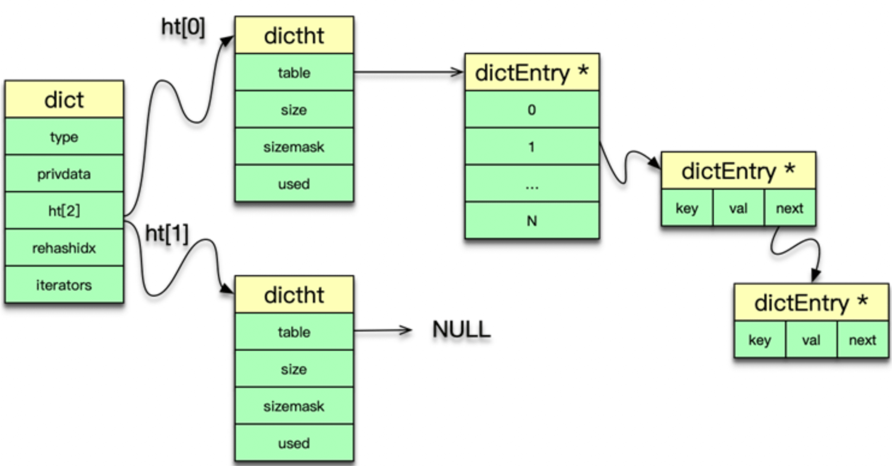
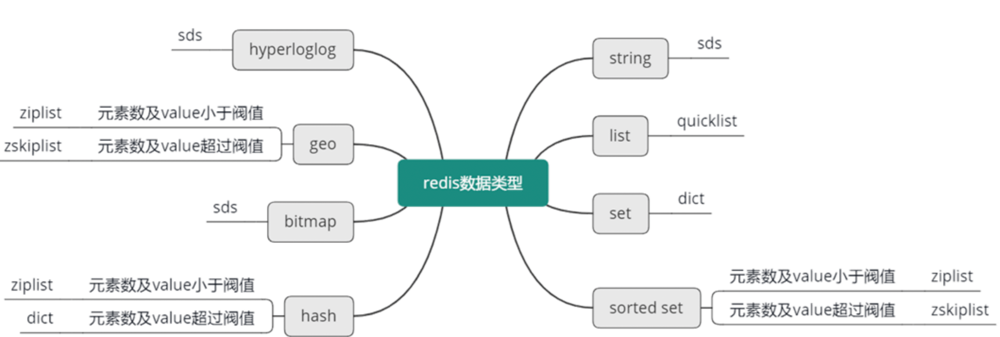
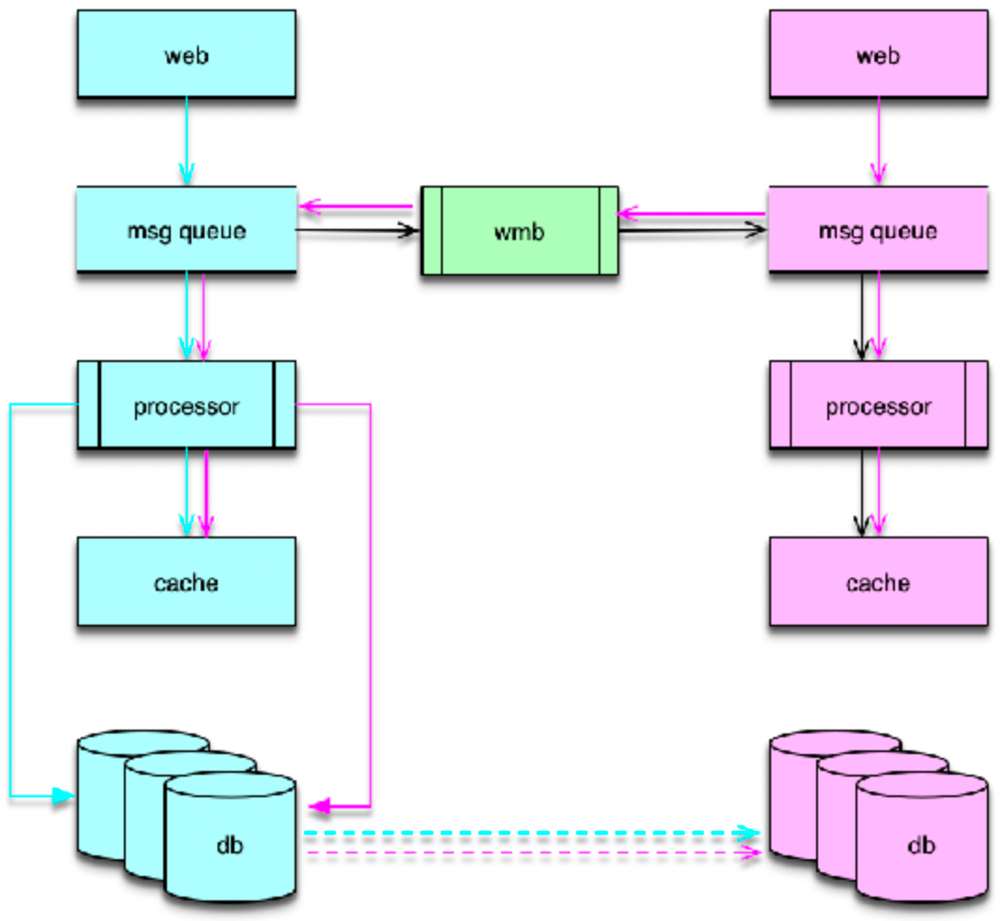
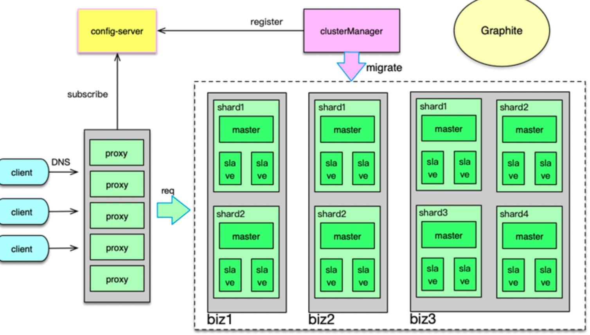
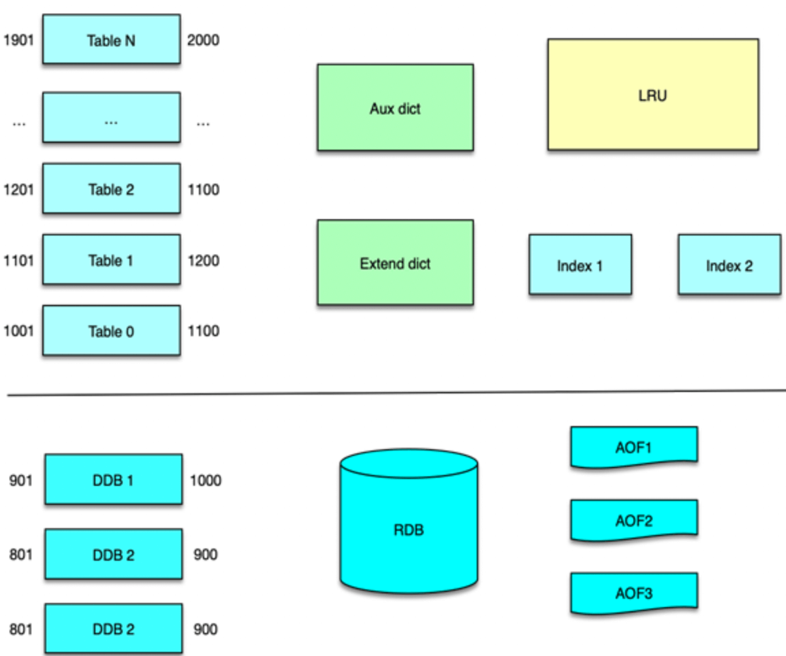
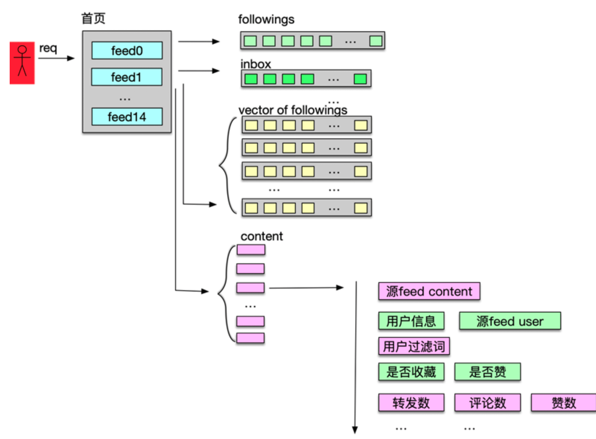

# 01 业务数据访问性能太低怎么办？

缓存的基本思想、优点和代价

- 思想：
  - 时间局限性，被获取过一次的数据在未来被多次引用
  - 空间换时间来达到加速目的
  - 性能成本 tradeoff

- 优点：
  - 提升访问性能
  - 降低网络堵塞
  - 减轻服务负载
  - 增强可扩展性

- 代价：
  - 复杂度
  - 运维成本，费用
  - 一致性问题、可用性和分区问题


# 02 如何根据业务来选择缓存模式和组件？

业务系统读写缓存的三种模式：

- Cache Aside（旁路缓存）
  - Write: 更新db，删除cache, db驱动cache更新
  - Read: miss 后读db+回写
  - 特点：lazy 计算，以 db 为准
  - 适合场景：更强一致性或者Cache数据构建复杂的业务

- Read/Write Through（读写穿透）
  - Write: cache不存在更新db；cache 存在更新cache+db
  - Read: miss后由缓存服务加载并写 cache
  - 特点：存储服务负责数据读写，隔离型更佳，热数据友好
  - 适合场景：数据有冷热区分 (微博 feed 的用户最新微博列表)

- Write Behind Caching（异步缓存写入）
  - Write: 只更新缓存，缓存服务异步更新db
  - Read: miss后由缓存服务加载 + 写 cache
  - 特点：写性能最高，定期异步刷新，存在丢失概率
  - 适合场景：写频率超高(一致性要求不高)，需要合并


# 03 设计缓存架构时需要考量哪些因素？

组件选择：首先要选定缓存组件，比如要用 Local-Cache，还是 Redis、Memcached、Pika 等开源缓存组件，如果业务缓存需求比较特殊，你还要考虑是直接定制开发一个新的缓存组件，还是对开源缓存进行二次开发，来满足业务需要。

数据结构设计：序列化协议；数据结构hash/set/list/geo等

分布设计：

- 分布式算法，取模还是一致性哈希
- client 还是 proxy 实现
- 水平迁移

运维策略：

- 核心、非核心数据分离不影响
- 分层访问，分摊访问量
- 多 IDC 部署，同步数据
- 多种组件组合，缓存异构


# 04 缓存失效、穿透和雪崩问题怎么处理？

缓存设计 7 大经典问题：(失效、穿透、雪崩、不一致、并发竞争、热 key、大 key)

- 缓存失效: 设置 base时间 + 随机时间，防止同时大量失效

- 缓存穿透
  - 1.没查到的 key 依然放到缓存，设置一个特殊值缓存较短时间
  - 2.构建一个 BloomFilter 缓存过滤器判断 key 是否存在并定期清零。(BloomFilter还可以做用户已读内容过滤)

- 缓存雪崩 (区分是否 rehash)
  - 1.对业务 DB 的访问增加读写开关，当发现 DB 请求变慢、阻塞，慢请求超过阀值时，就会关闭读开关，部分或所有读 DB 的请求进行 failfast 立即返回，待 DB 恢复后再打开读开关
  - 2.缓存多副本并且尽量在不同机架
  - 3.缓存体系监控，请求慢速比超过阈值时，及时报警，通过机器替换、停止非核心功能，保证核心功能运行


# 05 缓存数据不一致和并发竞争怎么处理？

- 数据不一致
  - 1.cache 更新失败后，可以进行重试，如果重试失败，则将失败的 key 写入队列机服务，待缓存访问恢复后，将这些 key 从缓存删除。这些 key 在再次被查询时，重新从 DB 加载，从而保证数据的一致性。
  - 2.缓存时间适当调短，让缓存数据及早过期后，然后从 DB 重新加载，确保数据的最终一致性。
  - 3.不采用 rehash 漂移策略，而采用缓存分层策略，尽量避免脏数据产生。

- 数据并发竞争: 数据并发竞争，是指在高并发访问场景，一旦缓存访问没有找到数据，大量请求就会并发查询 DB，导致 DB 压力大增的现象。
  - 1.全局锁。如下图所示，即当缓存请求 miss 后，先尝试加全局锁，只有加全局锁成功的线程，才可以到 DB 去加载数据。
    其他进程/线程在读取缓存数据 miss 时，如果发现这个 key 有全局锁，就进行等待，待之前的线程将数据从 DB 回种到缓存后，再从缓存获取。
  - 2.对缓存数据保持多个备份，即便其中一个备份中的数据过期或被剔除了，还可以访问其他备份，从而减少数据并发竞争的情况，如下图。


# 06 Hot Key和Big Key引发的问题怎么应对？

对于重要节假日、线上促销活动、集中推送这些提前已知的事情，可以提前评估出可能的热 key 来。
而对于突发事件，无法提前评估，可以通过 Spark，对应流任务进行实时分析，及时发现新发布的热点 key。
而对于之前已发出的事情，逐步发酵成为热 key 的，则可以通过 Hadoop 对批处理任务离线计算，找出最近历史数据中的高频热 key。

- 热 key(hot key)
  - 1.key打散。比如 key_1, key_2 等，然后每次随机请求一个 key
  - 2.多副本+多级结合的缓存架构设计
  - 3.本地缓存

- 大 key(big key)
  - 1.如果数据存在 Mc 中，可以设计一个缓存阀值，当 value 的长度超过阀值，则对内容启用压缩，让 KV 尽量保持小的 size，其次评估大 key 所占的比例，在 Mc 启动之初，就立即预写足够数据的大 key，让 Mc 预先分配足够多的 trunk size 较大的 slab。
  - 2.比如redis set, 扩展新的数据结构，同时让 client 在这些大 key 写缓存之前，进行序列化构建，然后通过 restore 一次性写入
  - 3.将大 key 分拆为多个 key，尽量减少大 key 的存在。同时由于大 key 一旦穿透到 DB，加载耗时很大，所以可以对这些大 key 进行特殊照顾，比如设置较长的过期时间，比如缓存内部在淘汰 key 时，同等条件下，尽量不淘汰这些大 key。

# 07 MC为何是应用最广泛的缓存组件？ (Memcached)
Mc 并不是将所有数据放在一起来进行管理的，而是将内存划分为一系列相同大小的 slab 空间后，每个 slab 只管理一定范围内的数据存储。
也就是说 Mc 内部采用 slab 机制来管理内存分配。Mc 内的内存分配以 slab 为单位，默认情况下一个 slab 是 1MB，可以通过 -I 参数在启动时指定其他数值。


# 08 MC系统架构是如何布局的？
Mc 的系统架构主要包括网络处理模块、多线程处理模块、哈希表、LRU、slab 内存分配模块 5 部分。Mc 基于 Libevent 实现了网络处理模块，
通过多线程并发处理用户请求；基于哈希表对 key 进行快速定位，基于 LRU 来管理冷数据的剔除淘汰，基于 slab 机制进行快速的内存分配及存储。


# 09 MC是如何使用多线程和状态机来处理请求命令的？
Mc 基于 Libevent 实现多线程网络 IO 模型。Mc 的 IO 处理线程分主线程和工作线程，每个线程各有一个 event_base，来监听网络事件。
主线程负责监听及建立连接。工作线程负责对建立的连接进行网络 IO 读取、命令解析、处理及响应。


# 10 MC是怎么定位key的
个 LRU 管理。这些 LRU 都是通过双向链表实现数据记录的。双向链表在进行增加、删除、修改位置时都非常高效，但其获取定位 key 的性能非常低下，
只能通过链表遍历来实现。因此，Mc 还通过 Hashtable，也就是哈希表，来记录管理这些 Item，通过对 key 进行哈希计算，从而快速定位和读取这些 key/value 所在的 Item。


# 11 MC如何淘汰冷key和失效key
Mc 对 key/value 的删除回收，则有 3 种方式。

- 第一种是获取时的惰性删除，即 key 在失效后，不立即删除淘汰，而在获取时，检测 key 的状态，如果失效，才进行真正的删除并回收存储空间。
- 第二种方式是在需要对 Item 进行内存分配申请时，如果内存已全部用完，且该 Item 对应的slabclass 没有空闲的 chunk 可用，申请失败，则会对 LRU 队尾进行同步扫描，回收过期失效的 key，如果没有失效的 key，则会强制删除一个 key。
- 第三种方式是 LRU 维护线程，不定期扫描 4 个 LRU 队列，对过期 key/value 进行异步淘汰。

# 12 为何MC能长期维持高性能读写？
Mc 内存分配采用 slab 机制，slab 机制可以规避内存碎片，是 Mc 能持续高性能进行数据读写的关键。

# 13 如何完整学习MC协议及优化client访问？
在使用 Mc client 时，有一些通用性的调优及改进方案。比如，如果读写的 key/value 较大，需要设置更大的缓冲 buf，以提高性能。
在一些业务场景中，需要启用 TCP_NODELAY，避免 40ms 的延迟问题。同时，如果存取的 key/value size 较大，可以设置一个压缩阀值，超过阀值，就对value 进行压缩算法，减少读写及存储的空间。

# 14 大数据时代，MC如何应对新的常见问题？
- 容量问题。mc 一般设为物理内存 80%
- 性能问题。超过 10-20w qps单机扛不住
- 链接瓶颈。线上 Mc 的连接数控制在 10w以下。单个实例的最小、最大连接数一般设置为 5-60 个之间
- 硬件资源故障。使用 4 年之后硬件故障率陡增
- 流量洪峰下快速扩展

解决方案：

- Memcached 分拆缓存池，每个缓存池 4-8 个节点，使用一致性哈希或者取模分布
- master-slave 两级架构
- L1 热数据缓存池


# 15 如何深入理解、应用及扩展 Twemproxy？
Twemproxy 是基于 epoll 事件驱动模型开发的，架构如下图所示。它是一个单进程、单线程组件。核心进程处理所有的事件，
包括网络 IO，协议解析，消息路由等。Twemproxy 可以监听多个端口，每个端口接受并处理一个业务的缓存请求。Twemproxy 支持 Redis、Memcached 协议，支持一致性 hash 分布、取模分布、随机分布三种分布方案。Twemproxy 通过 YAML 文件进行配置，简单清晰，且便于人肉读写。

# 16 常用的缓存组件Redis是如何运行的？
Redis 提供了 2 种持久化方式。

- 快照方式，将某时刻所有数据都写入硬盘的 RDB 文件；
- 追加文件方式，即将所有写命令都以追加的方式写入硬盘的 AOF 文件中。

线上 Redis 一般会同时使用两种方式，通过开启 appendonly 及关联配置项，将写命令及时追加到 AOF 文件，同时在每日流量低峰时，通过 bgsave 保存当时所有内存数据快照。

redis 支持 8 种核心数据类型：string,list,set,zset,hash,bitmap,geo,hyperloglog

Redis fork 子进程主要有 3 种场景:

- 收到 bgrewriteaof 命令时，Redis 调用 fork，构建一个子进程，子进程往临时 AOF文件中，写入重建数据库状态的所有命令，当写入完毕，子进程则通知父进程，父进程把新增的写操作也追加到临时 AOF 文件，然后将临时文件替换老的 AOF 文件，并重命名。
- 收到 bgsave 命令时，Redis 构建子进程，子进程将内存中的所有数据通过快照做一次持久化落地，写入到 RDB 中。
- 当需要进行全量复制时，master 也会启动一个子进程，子进程将数据库快照保存到 RDB 文件，在写完 RDB 快照文件后，master 就会把 RDB 发给 slave，同时将后续新的写指令都同步给 slave。

Redis 的集群管理有 3 种方式。

- client 分片访问，client 对 key 做 hash，然后按取模或一致性 hash，把 key 的读写分散到不同的 Redis 实例上。
- 在 Redis 前加一个 proxy，把路由策略、后端 Redis 状态维护的工作都放到 proxy 中进行，client 直接访问 proxy，后端 Redis 变更，只需修改 proxy 配置即可。
- 直接使用 Redis cluster。Redis 创建之初，使用方直接给 Redis 的节点分配 slot，后续访问时，对 key 做 hash 找到对应的 slot，然后访问 slot 所在的 Redis 实例。在需要扩容缩容时，可以在线通过 cluster setslot 指令，以及migrate 指令，将 slot 下所有 key 迁移到目标节点，即可实现扩缩容的目的


# 17 如何理解、选择并使用Redis的核心数据类型？
- string: 二进制安全，可以包含任何数据
- list: 双向链表。消息队列、热门 feed、timeline 等场景
- set: 无序集合。可以求交集、并集、差集。可以用来存储关注列表，判断是否关注
- sorted set: 有序集合。排行榜、统计增加权重值
- hash: 哈希表
- bitmap: 位图。存储成本低，位操作。场景：用户登录天数；标签对应 bit设置为 1
- geo: 底层是 zset。附近的位置；查询位置；位置距离等
- hyperloglog: 基数统计。海量数据统计元素估算数量。比如统计每日、每月的 UV；用户搜索的独立词条数目


# 18 Redis协议的请求和响应有哪些“套路”可循？
Redis Serialization Protocol(redis序列化协议，RESP)。

设计原则：简答、快速解析、便于阅读

请求模型：

- ping/pong 一问一答
- pipeline 模式，即 client 一次连续发送多个请求，然后等待 server 响应，server 处理完请求后，把响应返回给 client。
- pub/sub 模式。即发布订阅模式，client 通过 subscribe 订阅一个 channel，然后 client 进入订阅状态，静静等待。当有消息产生时，server 会持续自动推送消息给 client，不需要 client 的额外请求。而且客户端在进入订阅状态后，只可接受订阅相关的命令如 SUBSCRIBE、PSUBSCRIBE、UNSUBSCRIBE 和 PUNSUBSCRIBE，除了这些命令，其他命令一律失效。

对于请求指令，格式有 2 种类型。

- 当你没有 redis-client，但希望可以用通用工具 telnet，直接与 Redis 交互时，Redis 协议虽然简单易于阅读，但在交互式会话中使用，并不容易拼写，此时可以用第一种格式，即 inline cmd 内联命令格式。使用 inline cmd 内联格式，只需要用空格分隔请求指令及参数，简单快速，一个简单的例子如 mget key1 key2\r\n。
- 第二种格式是 Array 数组格式类型。请求指令用的数组类型，与 Redis 响应的数组类型相同，后面在介绍响应格式类型时会详细介绍。

Redis 协议的响应格式有 5 种，分别是：

```
- simple strings 简单字符串类型，以 + 开头，后面跟字符串，以 CRLF（即 \r\n）结尾。这种类型不是二进制安全类型，字符串中不能包含 \r 或者 \n。比如许多响应回复以 OK 作为操作成功的标志，协议内容就是 +OK\r\n 。
- Redis 协议将错误作为一种专门的类型，格式同简单字符串类型，唯一不同的是以 -（减号）开头。Redis 内部实现对 Redis 协议做了进一步规范，减号后面一般先跟 ERR 或者 WRONGTYPE，然后再跟其他简单字符串，最后以 CRLF（回车换行）结束。这里给了两个示例，client 在解析响应时，一旦发现 - 开头，就知道收到 Error 响应。
- Integer 整数类型。整数类型以 ：开头，后面跟字符串表示的数字，最后以回车换行结尾。Redis 中许多命令都返回整数，但整数的含义要由具体命令来确定。比如，对于 incr 指令，：后的整数表示变更后的数值；对于 llen 表示 list 列表的长度，对于 exists 指令，1 表示 key 存在，0 表示 key 不存在。这里给个例子，：后面跟了个 1000，然后回车换行结束。
- bulk strings 字符串块类型。字符串块分头部和真正字符串内容两部分。字符串块类型的头部， 为 $ 开头，随后跟真正字符串内容的字节长度，然后以 CRLF 结尾。字符串块的头部之后，跟随真正的字符串内容，最后以 CRLF 结束字符串块。字符串块用于表示二进制安全的字符串，最大长度可以支持 512MB。一个常规的例子，“$6\r\nfoobar\r\n”，对于空字串，可以表示为 “$0\r\n\r\n”，NULL字串： “$-1\r\n”。
- Arrays 数组类型，如果一个命令需要返回多条数据就需要用数组格式类型，另外，前面提到 client 的请求命令也是主要采用这种格式。
```

Redis 协议主要分为 16 种，其中 8 种协议对应前面我们讲到的 8 种数据类型，你选择了使用什么数据类型，就使用对应的响应操作指令即可。剩下 8 种协议如下所示。

- pub-sub 发布订阅协议，client 可以订阅 channel，持续等待 server 推送消息。
- 事务协议，事务协议可以用 multi 和 exec 封装一些列指令，来一次性执行。
- 脚本协议，关键指令是 eval、evalsha 和 script等。
- 连接协议，主要包括权限控制，切换 DB，关闭连接等。
- 复制协议，包括 slaveof、role、psync 等。
- 配置协议，config set/get 等，可以在线修改/获取配置。
- 调试统计协议，如 slowlog，monitor，info 等。
- 其他内部命令，如 migrate，dump，restore 等。

# 19 Redis系统架构中各个处理模块是干什么的？

### 事件处理机制
Redis 组件的系统架构如图所示，主要包括事件处理、数据存储及管理、用于系统扩展的主从复制/集群管理，以及为插件化功能扩展的 Module System 模块。

Redis 中的事件处理模块，采用的是作者自己开发的 ae 事件驱动模型，可以进行高效的网络 IO 读写、命令执行，以及时间事件处理。

其中，网络 IO 读写处理采用的是 IO 多路复用技术，通过对 evport、epoll、kqueue、select 等进行封装，同时监听多个 socket，并根据 socket 目前执行的任务，来为 socket 关联不同的事件处理器。

当监听端口对应的 socket 收到连接请求后，就会创建一个 client 结构，通过 client 结构来对连接状态进行管理。在请求进入时，将请求命令读取缓冲并进行解析，并存入到 client 的参数列表。

然后根据请求命令找到 对应的redisCommand ，最后根据命令协议，对请求参数进一步的解析、校验并执行。Redis 中时间事件比较简单，目前主要是执行 serverCron，来做一些统计更新、过期 key 清理、AOF 及 RDB 持久化等辅助操作。

### 数据管理
Redis 的内存数据都存在 redisDB 中。Redis 支持多 DB，每个 DB 都对应一个 redisDB 结构。Redis 的 8 种数据类型，每种数据类型都采用一种或多种内部数据结构进行存储。同时这些内部数据结构及数据相关的辅助信息，都以 kye/value 的格式存在 redisDB 中的各个 dict 字典中。

数据在写入 redisDB 后，这些执行的写指令还会及时追加到 AOF 中，追加的方式是先实时写入AOF 缓冲，然后按策略刷缓冲数据到文件。由于 AOF 记录每个写操作，所以一个 key 的大量中间状态也会呈现在 AOF 中，导致 AOF 冗余信息过多，因此 Redis 还设计了一个 RDB 快照操作，可以通过定期将内存里所有的数据快照落地到 RDB 文件，来以最简洁的方式记录 Redis 的所有内存数据。

Redis 进行数据读写的核心处理线程是单线程模型，为了保持整个系统的高性能，必须避免任何kennel 导致阻塞的操作。为此，Redis 增加了 BIO 线程，来处理容易导致阻塞的文件 close、fsync 等操作，确保系统处理的性能和稳定性。

### 功能扩展
Redis 在 4.0 版本之后引入了 Module System 模块，可以方便使用者，在不修改核心功能的同时，进行插件化功能开发。使用者可以将新的 feature 封装成动态链接库，Redis 可以在启动时加载，也可以在运行过程中随时按需加载和启用。

在扩展模块中，开发者可以通过 RedisModule_init 初始化新模块，用 RedisModule_CreateCommand 扩展各种新模块指令，以可插拔的方式为 Redis 引入新的数据结构和访问命令。

### 系统扩展
虽然业界大多采用在 client 和 proxy 端分区，但 Redis 自己也早早推出了 cluster 功能，并不断进行优化。Redis cluster 预先设定了 16384 个 slot 槽，
在 Redis 集群启动时，通过手动或自动将这些 slot 分配到不同服务节点上。在进行 key 读写定位时，首先对 key 做 hash，并将 hash 值对 16383 ，
做按位与运算，确认 slot，然后确认服务节点，最后再对 对应的 Redis 节点，进行常规读写。如果 client 发送到错误的 Redis 分片，Redis 会发送重定向回复。如果业务数据大量增加，Redis 集群可以通过数据迁移，来进行在线扩容。


# 20 Redis如何处理文件事件和时间事件？

### 事件驱动模型
Redis 的事件驱动模型机制封装在 aeEventLoop 等相关的结构体中，网络连接、命令读取执行回复，数据的持久化、淘汰回收 key 等，几乎所有的核心操作都通过 ae 事件模型进行处理。

Redis 的事件驱动模型处理 2 类事件：

- 文件事件，如连接建立、接受请求命令、发送响应等；
- 时间事件，如 Redis 中定期要执行的统计、key 淘汰、缓冲数据写出、rehash等。

Redis 的文件事件采用典型的 Reactor 模式进行处理。Redis 文件事件处理机制分为 4 部分：

- 连接 socket
- IO 多路复用程序
- 文件事件分派器
- 事件处理器

### IO 多路复用
Redis 封装了 4 种多路复用程序，每种封装实现都提供了相同的 API 实现。编译时，会按照性能和系统平台，选择最佳的 IO 多路复用函数作为底层实现，
选择顺序是，首先尝试选择 Solaries 中的 evport，如果没有，就尝试选择 Linux 中的 epoll，否则就选择大多 UNIX 系统都支持的 kqueue，这 3 个多路复用函数都直接使用系统内核内部的结构，可以服务数十万的文件描述符。

### 文件事件收集及派发器
aeProcessEvents 在获取到触发的事件后，会根据事件类型，将文件事件 dispatch 派发给对应事件处理函数。如果同一个 socket，同时有读事件和写事件，Redis 派发器会首先派发处理读事件，然后再派发处理写事件。

### 文件事件处理函数分类

- initServer acceptTcpHandler
- readQueryFromClient 请求处理函数
- 命令回复处理器 sendReplyToClient

Redis 中的时间事件是指需要在特定时间执行的事件。多个 Redis 中的时间事件构成 aeEventLoop 中的一个链表，供 Redis 在 ae 事件循环中轮询执行。

Redis 当前的主要时间事件处理函数有 2 个：

- serverCron
- moduleTimerHandler

Redis 中的时间事件分为 2 类：

- 单次时间，即执行完毕后，该时间事件就结束了。
- 周期性事件，在事件执行完毕后，会继续设置下一次执行的事件，从而在时间到达后继续执行，并不断重复。

时间事件主要有 5 个属性组成。

- 事件 ID：Redis 为时间事件创建全局唯一 ID，该 ID 按从小到大的顺序进行递增。
- 执行时间 when_sec 和 when_ms：精确到毫秒，记录该事件的到达可执行时间。
- 时间事件处理器 timeProc：在时间事件到达时，Redis 会调用相应的 timeProc 处理事件。
- 关联数据 clientData：在调用 timeProc 时，需要使用该关联数据作为参数。
- 链表指针 prev 和 next：它用来将时间事件维护为双向链表，便于插入及查找所要执行的时间事件。

时间事件的处理是在事件循环中的 aeProcessEvents 中进行。执行过程是：

- 首先遍历所有的时间事件。
- 比较事件的时间和当前时间，找出可执行的时间事件。
- 然后执行时间事件的 timeProc 函数。
- 执行完毕后，对于周期性时间，设置时间新的执行时间；对于单次性时间，设置事件的 ID为 -1，后续在事件循环中，下一次执行 aeProcessEvents 的时候从链表中删除。


# 21 Redis读取请求数据后，如何进行协议解析和处理
### 协议解析
请求命令进入，触发 IO 读事件后。client 会从连接文件描述符读取请求，并存入 client 的 query buffer 中。client 的读缓冲默认是 16KB，读取命令时，如果发现请求超过 1GB，则直接报异常，关闭连接。
client 读取完请求命令后，则根据 query buff 进行协议解析。协议解析时，首先查看协议的首字符。如果是 `*`，则解析为字符块数组类型，即 MULTIBULK。否则请求解析为 INLINE 类型。
INLINE 类型是以 CRLF 结尾的单行字符串，协议命令及参数以空格分隔。解析过程参考之前课程里分析的对应协议格式。协议解析完毕后，将请求参数个数存入 client 的 argc 中，将请求的具体参数存入 client 的 argv 中。

### 协议执行
对于非 quit 指令，以 client 中 argv[0] 作为命令，从 server 中的命令表中找到对应的 redisCommand。如果没有找到 redisCommand，
则返回未知 cmd 异常。如果找到 cmd，则开始执行 redisCommand 中的 proc 函数，进行具体命令的执行。在命令执行完毕后，将响应写入 client 的写缓冲。并按配置和部署，将写指令分发给 aof 和 slaves。同时更新相关的统计数值。


# 22 怎么认识和应用Redis内部数据结构？

### redisDb
Redis 中所有数据都保存在 DB 中，一个 Redis 默认最多支持 16 个 DB。Redis 中的每个 DB 都对应一个 redisDb 结构，即每个 Redis 实例，
默认有 16 个 redisDb。用户访问时，默认使用的是 0 号 DB，可以通过 `select $dbID` 在不同 DB 之间切换。

redisDb 主要包括 2 个核心 dict 字典、3 个非核心 dict 字典、dbID 和其他辅助属性。2 个核心 dict 包括一个 dict 主字典和一个 expires 过期字典。
主 dict 字典用来存储当前 DB 中的所有数据，它将 key 和各种数据类型的 value 关联起来，该 dict 也称 key space。过期字典用来存储过期时间 key，存的是 key 与过期时间的映射。日常的数据存储和访问基本都会访问到 redisDb 中的这两个 dict。

3 个非核心 dict 包括一个字段名叫 blocking_keys 的阻塞 dict，一个字段名叫 ready_keys 的解除阻塞 dict，还有一个是字段名叫 watched_keys 的 watch 监控 dict。

### redisObject

字段：type, encoding, lru, refcount, ptr

### dict



### sds(简单动态字符串)

字段：len, alloc, flags, buf。 sds同时也是 hyperloglog, bitmap 内部结构

### ziplist
为了节约内存，并减少内存碎片，Redis 设计了 ziplist 压缩列表内部数据结构。压缩列表是一块连续的内存空间，可以连续存储多个元素，没有冗余空间，是一种连续内存数据块组成的顺序型内存结构。
ziplist 的结构如图所示，主要包括 5 个部分。

- zlbytes 是压缩列表所占用的总内存字节数。
- Zltail 尾节点到起始位置的字节数。
- Zllen 总共包含的节点/内存块数。
- Entry 是 ziplist 保存的各个数据节点，这些数据点长度随意。
- Zlend 是一个魔数 255，用来标记压缩列表的结束。

由于 ziplist 是连续紧凑存储，没有冗余空间，所以插入新的元素需要 realloc 扩展内存，所以如果 ziplist 占用空间太大，realloc 重新分配内存和拷贝的开销就会很大，所以 ziplist 不适合存储过多元素，也不适合存储过大的字符串。

### quicklist
Redis 在 3.2 版本之后引入 quicklist，用以替换 linkedlist。因为 linkedlist 每个节点有前后指针，要占用 16 字节，而且每个节点独立分配内存，很容易加剧内存的碎片化。而 ziplist 由于紧凑型存储，增加元素需要 realloc，删除元素需要内存拷贝，天然不适合元素太多、value 太大的存储。

而 quicklist 快速列表应运而生，它是一个基于 ziplist 的双向链表。将数据分段存储到 ziplist，然后将这些 ziplist 用双向指针连接。快速列表的结构如图所示。

- head、tail 是两个指向第一个和最后一个 ziplist 节点的指针。
- count 是 quicklist 中所有的元素个数。
- len 是 ziplist 节点的个数。
- compress 是 LZF 算法的压缩深度。

快速列表从头尾读写数据很快，时间复杂度为 O(1)。也支持从中间任意位置插入或读写元素，但速度较慢，时间复杂度为 O(n)。快速列表当前主要作为 list 列表的内部数据结构。

### zskiplist
跳跃表 zskiplist 是一种有序数据结构，它通过在每个节点维持多个指向其他节点的指针，从而可以加速访问。跳跃表支持平均 O(logN) 和最差 O(n) 复杂度的节点查找。在大部分场景，跳跃表的效率和平衡树接近，但跳跃表的实现比平衡树要简单，所以不少程序都用跳跃表来替换平衡树。




# 23 Redis是如何淘汰key的？

### 淘汰原理
Redis 会在 2 种场景下对 key 进行淘汰:

- 1. 定期执行 serverCron 时，检查淘汰 key
- 2. 在执行命令时，检查淘汰 key

### 淘汰方式

Redis 中 key 的淘汰方式有两种，分别是同步删除淘汰和异步删除淘汰。在 serverCron 定期清理过期 key 时，如果设置了延迟过期配置 lazyfree-lazy-expire，
会检查 key 对应的 value 是否为多元素的复合类型，即是否是 list 列表、set 集合、zset 有序集合和 hash 中的一种，并且 value 的元素数大于 64，
则在将 key 从 DB 中 expire dict 过期字典和主 dict 中删除后，value 存放到 BIO 任务队列，由 BIO 延迟删除线程异步回收；否则，直接从 DB 的 expire dict 和主 dict 中删除，并回收 key、value 所占用的空间。
在执行命令时，如果设置了 lazyfree-lazy-eviction，在淘汰 key 时，也采用前面类似的检测方法，对于元素数大于 64 的 4 种复合类型，使用 BIO 线程异步删除，否则采用同步直接删除。

Redis 提供了 8 种淘汰策略对 key 进行管理，而且还引入基于样本的 eviction pool，来提升剔除的准确性，确保 在保持最大性能 的前提下，剔除最不活跃的 key

1. noeviction: 默认策略不淘汰，返回错误。数据量不大的场景，当成存储使用
2. volatile-lru: 它对带过期时间的 key 采用最近最少访问算法来淘汰。有过期时间且冷热区分
3. volatile-lfu，它对带过期时间的 key 采用最近最不经常使用的算法来淘汰。适合大多数带过期时间且有冷热分区场景
4. volatile-ttl，它是对带过期时间的 key 中选择最早要过期的 key 进行淘汰。带过期时间且有冷热分区
5. volatile-random，它是对带过期时间的 key 中随机选择 key 进行淘汰。有过期时间且没有明显热点
6. allkey-lru，它是对所有 key，而非仅仅带过期时间的 key，采用最近最久没有使用的算法来淘汰。对所有 key 淘汰且有冷热分区
7. allkeys-lfu，它也是针对所有 key 采用最近最不经常使用的算法来淘汰。所有 key 且有冷热分区，且越热的访问越高
8. allkeys-random，它是针对所有 key 进行随机算法进行淘汰。没有明显热点的场景


# 24 Redis崩溃后，如何进行数据恢复的？
Redis 持久化是一个将内存数据转储到磁盘的过程。Redis 目前支持 RDB、AOF，以及混合存储三种模式。

### RDB
Redis 的 RDB 持久化是以快照的方式将内存数据存储到磁盘。在需要进行 RDB 持久化时，Redis 会将内存中的所有数据以二进制的格式落地，
每条数据存储的内容包括过期时间、数据类型、key，以及 value。当 Redis 重启时，如果 appendonly 关闭，则会读取 RDB 持久化生成的二进制文件进行数据恢复。

触发构建 RDB 的场景主要有以下四种。

- 第一种场景是通过 save 或 bgsave 命令进行主动 RDB 快照构建。它是由调用方调用 save 或 bgsave 指令进行触发的。
- 第二种场景是利用配置 save m n 来进行自动快照生成。它是指在 m 秒中，如果插入或变更 n 个 key，则自动触发 bgsave。这个配置可以设置多个配置行，以便组合使用。
  由于峰值期间，Redis 的压力大，变更的 key 也比较多，如果再进行构建 RDB 的操作，会进一步增加机器负担，对调用方请求会有一定的影响，所以线上使用时需要谨慎。
- 第三种场景是主从复制，如果从库需要进行全量复制，此时主库也会进行 bgsave 生成一个 RDB 快照。
- 第四种场景是在运维执行 flushall 清空所有数据，或执行 shutdown 关闭服务时，也会触发 Redis 自动构建 RDB 快照。

线上 Redis 快照备份，一般会选择凌晨低峰时段，通过 bgsave 主动触发进行备份。

RDB 快照文件主要由 3 部分组成:

- 第一部分是 RDB 头部，主要包括 RDB 的版本，以及 Redis 版本、创建日期、占用内存等辅助信息。
- 第二部分是各个 RedisDB 的数据。存储每个 RedisDB 时，会首先记录当前 RedisDB 的DBID，然后记录主 dict 和 expire dict 的记录数量，最后再轮询存储每条数据记录。存储数据记录时，如果数据有过期时间，首先记录过期时间。如果 Redis 的 maxmemory_policy 过期策略采用 LRU 或者 LFU，还会将 key 对应的 LRU、LFU 值进行落地，最后记录数据的类型、key，以及 value。
- 第三部部分是 RDB 的尾部。RDB 尾部，首先存储Redis 中的 Lua 脚本等辅助信息。然后存储 EOF 标记，即值为 255 的字符。最后存 RDB 的 cksum。

## AOF
Redis 的 AOF 持久化是以命令追加的方式进行数据落地的。通过打开 appendonly 配置，Redis 将每一个写指令追加到磁盘 AOF 文件，从而及时记录内存数据的最新状态。
这样即便 Redis 被 crash 或异常关闭后，再次启动，也可以通过加载 AOF，来恢复最新的全量数据，基本不会丢失数据。

AOF 文件中存储的协议是写指令的 multibulk 格式，这是 Redis 的标准协议格式，所以不同的 Redis 版本均可解析并处理，兼容性很好。

但是，由于 Redis 会记录所有写指令操作到 AOF，大量的中间状态数据，甚至被删除的过期数据，都会存在 AOF 中，冗余度很大，而且每条指令还需通过加载和执行来进行数据恢复，耗时会比较大。

AOF 数据的落地流程如下。Redis 在处理完写指令后，首先将写指令写入 AOF 缓冲，然后通过 server_cron 定期将 AOF 缓冲写入文件缓冲。
最后按照配置策略进行 fsync，将文件缓冲的数据真正同步写入磁盘。

Redis 通过 appendfsync 来设置三种不同的同步文件缓冲策略。

- no，即 Redis 不主动使用 fsync 进行文件数据同步落地，而是由操作系统的 write 函数去确认同步时间，在 Linux 系统中大概每 30 秒会进行一次同步，如果 Redis 发生 crash，就会造成大量的数据丢失。
- always，即每次将 AOF 缓冲写入文件，都会调用 fsync 强制将内核数据写入文件，安全性最高，但性能上会比较低效，而且由于频繁的 IO 读写，磁盘的寿命会大大降低。
- everysec。即每秒通过 BIO 线程进行一次 fsync。这种策略在安全性、性能，以及磁盘寿命之间做较好的权衡，可以较好的满足线上业务需要。

随着时间的推移，AOF 持续记录所有的写指令，AOF 会越来越大，而且会充斥大量的中间数据、过期数据，为了减少无效数据，提升恢复时间，可以定期对 AOF 进行 rewrite 操作。

AOF 的 rewrite 操作可以通过运维执行 bgrewiretaof 命令来进行，也可以通过配置重写策略进行，由 Redis 自动触发进行。当对 AOF 进行 rewrite 时，首先会 fork 一个子进程。子进程轮询所有 RedisDB 快照，将所有内存数据转为 cmd，并写入临时文件。在子进程 rewriteaof 时，主进程可以继续执行用户请求，执行完毕后将写指令写入旧的 AOF 文件和 rewrite 缓冲。子进程将 RedisDB 中数据落地完毕后，通知主进程。主进程从而将 AOF rewite 缓冲数据写入 AOF 临时文件，然后用新的 AOF 文件替换旧的 AOF 文件，最后通过 BIO 线程异步关闭旧的 AOF 文件。至此，AOF 的 rewrite 过程就全部完成了。

AOF 持久化的优势是可以记录全部的最新内存数据，最多也就是 1-2 秒的数据丢失。同时 AOF 通过 Redis 协议来追加记录数据，兼容性高，而且可以持续轻量级的保存最新数据。最后因为是直接通过 Redis 协议存储，可读性也比较好。

AOF 持久化的不足是随着时间的增加，冗余数据增多，文件会持续变大，而且数据恢复需要读取所有命令并执行，恢复速度相对较慢。

### 混合持久化
redis 4.0以后引入混合持久化, 5.0 之后默认开启。混合模式一体化使用 RDB 和 AOF，综合 RDB 和 AOF 的好处。即可包含全量数据，加载速度也比较快。
可以使用 aof-use-rdb-preamble 配置来明确打开混合持久化模式。

混合持久化也是通过 bgrewriteaof 来实现的。当启用混合存储后，进行 bgrewriteaof 时，主进程首先依然是 fork 一个子进程，
子进程首先将内存数据以 RDB 的二进制格式写入 AOF 临时文件中。然后，再将落地期间缓冲的新增写指令，以命令的方式追加到临时文件。
然后再通知主进程落地完毕。主进程将临时文件修改为 AOF 文件，并关闭旧的 AOF 文件。这样主体数据以 RDB 格式存储，新增指令以命令方式追加的混合存储方式进行持久化。
后续执行的任务，以正常的命令方式追加到新的 AOF 文件即可。

混合持久化综合了 RDB 和 AOF 的优缺点，优势是包含全量数据，加载速度快。不足是头部的 RDB 格式兼容性和可读性较差。


# 25 Redis是如何处理容易超时的系统调用的？

### BIO 线程简介
Redis 引入了 BIO 后台线程，专门处理那些慢任务，从而保证和提升主线程的处理能力。Redis 的 BIO 线程采用生产者-消费者模型。
主线程是生产者，生产各种慢任务，然后存放到任务队列中。

### BIO 处理任务
Redis 启动时，会创建三个任务队列，并对应构建 3 个 BIO 线程，三个 BIO 线程与 3 个任务队列之间一一对应。BIO 线程分别处理如下 3 种任务。

- close 关闭文件任务。rewriteaof 完成后，主线程需要关闭旧的 AOF 文件，就向 close 队列插入一个旧 AOF 文件的关闭任务。由 close 线程来处理。
- fysnc 任务。Redis 将 AOF 数据缓冲写入文件内核缓冲后，需要定期将系统内核缓冲数据写入磁盘，此时可以向 fsync 队列写入一个同步文件缓冲的任务，由 fsync 线程来处理。
- lazyfree 任务。Redis 在需要淘汰元素数大于 64 的聚合类数据类型时，如列表、集合、哈希等，就往延迟清理队列中写入待回收的对象，由 lazyfree 线程后续进行异步回收。

### BIO 处理流程
当主线程有慢任务需要异步处理时。就会向对应的任务队列提交任务。提交任务时，首先申请内存空间，构建 BIO 任务。然后对队列锁进行加锁，
在队列尾部追加新的 BIO 任务，最后尝试唤醒正在等待任务的 BIO 线程。

BIO 线程启动时或持续处理完所有任务，发现任务队列为空后，就会阻塞，并等待新任务的到来。当主线程有新任务后，主线程会提交任务，
并唤醒 BIO 线程。BIO 线程随后开始轮询获取新任务，并进行处理。当处理完所有 BIO 任务后，则再次进入阻塞，等待下一轮唤醒。


# 26 如何大幅成倍提升Redis处理性能？

### 主线程
Redis 慢的主要原因是单进程单线程模型。

### IO 线程
Redis (6.0之后)的多线程模型，分为主线程和 IO 线程。

因为处理命令请求的几个耗时点，分别是请求读取、协议解析、协议执行，以及响应回复等。所以 Redis 引入 IO 多线程，
并发地进行请求命令的读取、解析，以及响应的回复。而其他的所有任务，如事件触发、命令执行、IO 任务分发，以及其他各种核心操作，仍然在主线程中进行，也就说这些任务仍然由单线程处理。这样可以在最大程度不改变原处理流程的情况下，引入多线程。

### 命令处理流程

当请求命令进入时，在主线程触发读事件，主线程此时并不进行网络 IO 的读取，而将该连接所在的 client 加入待读取队列中。
Redis 的 Ae 事件模型在循环中，发现待读取队列不为空，则将所有待读取请求的 client 依次分派给 IO 线程，并自旋检查等待，等待 IO 线程读取所有的网络数据。
所谓自旋检查等待，也就是指主线程持续死循环，并在循环中检查 IO 线程是否读完，不做其他任何任务。只有发现 IO 线程读完所有网络数据，才停止循环，继续后续的任务处理。

一般可以配置多个 IO 线程（4-8 个），性能提升一倍以上。

### 多线程方案优劣

首先所有命令的执行仍然在主线程中进行，存在性能瓶颈。然后所有的事件触发也是在主线程中进行，也依然无法有效使用多核心。
而且，IO 读写为批处理读写，即所有 IO 线程先一起读完所有请求，待主线程解析处理完毕后，所有 IO 线程再一起回复所有响应，不同请求需要相互等待，效率不高。
最后在 IO 批处理读写时，主线程自旋检测等待，效率更是低下，即便任务很少，也很容易把 CPU 打满。


# 27 Redis是如何进行主从复制的？

### redis复制原理
通过数据复制，Redis 的一个 master 可以挂载多个 slave，而 slave 下还可以挂载多个 slave，形成多层嵌套结构。所有写操作都在 master 实例中进行，
master 执行完毕后，将写指令分发给挂在自己下面的 slave 节点。

master 在分发写请求时，同时会将写指令复制一份存入复制积压缓冲，这样当 slave 短时间断开重连时，只要 slave 的复制位置点仍然在复制积压缓冲，
则可以从之前的复制位置点之后继续进行复制，提升复制效率。

在 Redis 2.8 之前，Redis 基本只支持全量复制。在 slave 与 master 断开连接，或 slave 重启后，都需要进行全量复制。在 2.8 版本之后，
Redis 引入 psync，增加了一个复制积压缓冲，在将写指令同步给 slave 时，会同时在复制积压缓冲中也写一份。在 slave 短时断开重连后，
上报master runid 及复制偏移量。如果 runid 与 master 一致，且偏移量仍然在 master 的复制缓冲积压中，则 master 进行增量同步。

### redis 复制分析

在设置 master、slave 时，首先通过配置或者命令 slaveof no one 将节点设置为主库。然后其他各个从库节点，通过 slaveof $master_ip $master_port，
将其他从库挂在到 master 上。同样方法，还可以将 slave 节点挂载到已有的 slave 节点上。在准备开始数据复制时，slave 首先会主动与 master 创建连接，并上报信息。


# 28 如何构建一个高性能、易扩展的Redis集群？

### client 端分区
client决定数据存储到哪个 rediw 分片。通过取模哈希、一致性哈希和区间分布哈希。可以通过 DNS 方式来管理集群的主从。
Client 端分区方案的优点在于分区逻辑简单，配置简单，Client 节点之间和 Redis 节点之间均无需协调，灵活性强。而且 Client 直接访问对应 Redis 节点，没有额外环节，性能高效。但该方案扩展不便。在 Redis 端，只能成倍扩展，或者预先分配足够多的分片。在 Client 端，每次分片后，业务端需要修改分发逻辑，并进行重启。

### Proxy 端分区
Proxy 端分区方案是指 Client 发送请求给 Proxy 请求代理组件，Proxy 解析 Client 请求，并将请求分发到正确的 Redis 节点，然后等待 Redis 响应，
最后再将结果返回给 Client 端。

常见的是 Twemproxy的简单分区方案 和 Codis的可平滑数据迁移的分区方案。

Proxy 端分区方案的优势，是 Client 访问逻辑和 Redis 分布逻辑解耦，业务访问便捷简单。在资源发生变更或扩缩容时，只用修改数量有限的 Proxy 即可，数量庞大的业务 Client 端不用做调整。
但 Proxy 端分区的方案，访问时请求需要经过 Proxy 中转，访问多跳了一级，性能会存在损耗，一般损耗会达到 5~15% 左右。另外多了一个代理层，整个系统架构也会更复杂。

### Redis Cluster 分区
Redis 社区版在 3.0 后开始引入 Cluster 策略，一般称之为 Redis-Cluster 方案。Redis-Cluster 按 slot 进行数据的读写和管理，
一个 Redis-Cluster 集群包含 16384 个 slot。每个 Redis 分片负责其中一部分 slot。在集群启动时，按需将所有 slot 分配到不同节点，
在集群系统运行后，按 slot 分配策略，将 key 进行 hash 计算，并路由到对应节点 访问。

Redis Cluster 是一个去中心化架构，每个节点记录全部 slot 的拓扑分布。这样 Client 如果把 key 分发给了错误的 Redis 节点，
Redis 会检查请求 key 所属的 slot，如果发现 key 属于其他节点的 slot，会通知 Client 重定向到正确的 Redis 节点访问。

Redis Cluster 下的不同 Redis 分片节点通过 gossip 协议进行互联，使用 gossip 的优势在于，该方案无中心控制节点，这样，更新不会受到中心节点的影响，可以通过通知任意一个节点来进行管理通知。
不足就是元数据的更新会有延时，集群操作会在一定的时延后才会通知到所有Redis。

key 的访问需要 smart client 配合。Client 首先发送请求给 Redis 节点，Redis 在接受并解析命令后，会对 key 进行 hash 计算以确定 slot 槽位。
计算公式是对 key 做 crc16 哈希，然后对 16383 进行按位与操作。如果 Redis 发现 key 对应的 slot 在本地，则直接执行后返回结果

如果 Redis 发现 key 对应的 slot 不在本地，会返回 moved 异常响应，并附带 key 的 slot，以及该 slot 对应的正确 Redis 节点的 host 和 port。
Client 根据响应解析出正确的节点 IP 和端口，然后把请求重定向到正确的 Redis，即可完成请求。为了加速访问，Client 需要缓存 slot 与 Redis 节点的对应关系，
这样可以直接访问正确的节点，以加速访问性能。

Redis 社区官方在源代码中也提供了 redis-trib.rb，作为 Redis Cluster 的管理工具。该工具用 Ruby 开发，所以在使用前，需要安装相关的依赖环境。
redis-trib 工具通过封装前面所述的 Redis 指令，从而支持创建集群、检查集群、添加删除节点、在线迁移 slot 等各种功能。

Redis 节点要存储 slot 和 key 的映射关系，需要额外占用较多内存，特别是对 value size 比较小、而key相对较大的业务，影响更是明显。
key 迁移过程是阻塞模式，迁移大 value 会导致服务卡顿。而且，迁移过程，先获取 key，再迁移，效率低。最后，Cluster 模式下，
集群复制的 slave 只能挂载到 master，不支持 slave 嵌套，会导致 master 的压力过大，无法支持那些，需要特别多 slave、读 TPS 特别大的业务场景。


# 29 从容应对亿级QPS访问，Redis还缺少什么？

### 功能扩展
重启可能非常耗时，热升级方案。热升级方案如下，首先构建一个 Redis 壳程序，将 redisServer 的所有属性（包括redisDb、client等）保存为全局变量。
然后将 Redis 的处理逻辑代码全部封装到动态连接库 so 文件中。Redis 第一次启动，从磁盘加载恢复数据，在后续升级时，通过指令，
壳程序重新加载 Redis 新的 so 文件，即可完成功能升级，毫秒级完成 Redis 的版本升级。而且整个过程中，所有 Client 连接仍然保留，在升级成功后，原有 Client 可以继续进行读写操作，整个过程对业务完全透明。

扩展数据结构：微博使用 longset 存储关注关系。
longset 中的 long 数组，采用 double-hash 进行寻址，即对每个 long 值采用 2 个哈希函数计算，然后按 (h1 + n*h2)% 数组长度 的方式，
确定 long 值的位置。n 从 0 开始计算，如果出现哈希冲突，即计算的哈希位置，已经有其他元素，则 n 加 1，继续向前推进计算，最大计算次数是数组的长度。

### 完全增量复制
在完全增量方案中，aof 文件不再只有一个，而是按后缀 id 进行递增，如 aof.00001、aof.00002，当 aof 文件超过阀值，则创建下一个 id 加 1 的文件，从而滚动存储最新的写指令。

### 集群管理

我们也基于 Redis 构建了集群存储体系。首先将 Redis 的集群功能剥离到独立系统，Redis 只关注存储，不再维护 slot 等相关的信息。通过新构建的 clusterManager 组件，负责 slot 维护，数据迁移，服务状态管理。
业务资源的部署、Proxy 的访问，都通过配置中心进行获取及协调。clusterManager 向配置中心注册业务资源部署，并持续探测服务状态，根据服务状态进行故障转移，切主、上下线 slave 等。proxy 和 smart client 从配置中心获取配置信息，并持续订阅服务状态的变化。


# 30 面对海量数据，为什么无法设计出完美的分布式缓存体系？

### CAP 

CAP 定理，简单的说就是分布式系统不可能同时满足 Consistency 一致性、Availability 可用性、Partition Tolerance 分区容错性三个要素。

- Consistency: all nodes see the same data at the same time
- Availability: reads and writes always succeed
- Partition Tolerance: The system continues to operate despite arbitrary message loss or failure of part of the system

- CA: 只支持一致性和可用性。不允许网络异常。但是分布式系统网络异常无法避免，只能退回到单机系统
- CP: 放弃可用性换取一致性。支付交易领域
- AP: 放弃一致性。最终一致性（BASE）


# 31 如何设计足够可靠的分布式缓存体系，以满足大中型移动互联网系统的需要？

### 传统 CAP 的突破

探测感知 -> 分区下的处理策略 -> 补偿修复

- 探测感知: 主动探测，状态上报，特殊事件/事件预警、历史数据预测
- 分区下的处理策略: 内存缓冲、队列服务保存数据后继续服务，敏感功能停服
- 补偿修复: 恢复后如何同步和修复数据

### BASE 理论

- Baseically Available 基本可用。系统出现故障，允许损失部分可用性，保证核心服务
- Soft state 软状态。允许存在中间状态
- Eventual consistency 最终一致性。系统恢复后最终达到一致状态

BASE 理论是面向大中型分布式系统提出的，它更适合当前的大中型互联网分布式系统。

- 首先用户体验第一，系统设计时要优先考虑可用性。
- 其次，在故障发生时，可以牺牲部分功能的可用性，牺牲数据的强一致性，来保持系统核心功能的可用性。
- 最后，在系统故障恢复后，通过各种策略，确保系统最终再次达到一致。

### 一致性问题和应对

- 分布式事务: 分布式事务在各节点均能正常执行事务内一系列操作才会提交，否则就进行回滚，可以保持系统内数据的强一致
  - 2pc 两阶段提交: 协调者、参与者, 请求阶段和提交阶段
  - 3pc 三阶段提交: 三阶段提交与两阶段提交类似，只是在协调者、参与者都引入了超时机制，而且把两阶段提交中的第一阶段分拆成了 2 步，即先询问再锁资源。
  - Paxos
  - Zab
  - Raft

- 主从复制: mysql 等 db 中广泛使用
- 消息总线分发，来更新缓存和存储体系

### 分布式系统多区数据一致性案例



# 32 一个典型的分布式缓存系统是什么样的？

### 分布式 redis 服务



微博的 Redis 服务内部也称为 RedisService。RedisService 的整体架构如图所示。主要分为Proxy、存储、集群管理、配置中心、Graphite，5 个部分。

- RedisService 中的 Proxy 是无状态多租户模型，每个 Proxy 下可以挂载不同的业务存储，通过端口进行业务区分。
- 存储基于 Redis 开发，但在集群数据存储时，只保留了基本的存储功能，支持定制的迁移功能，但存储内部无状态，不存储 key-slot 映射关系。
- 配置中心用于记录及分发各种元数据，如存储 Proxy 的 IP、端口、配置等，在发生变化时，订阅者可以及时感知。
- Graphite 系统用于记录并展现系统、业务，组件以及实例等的状态数据。
- ClusterManager 用于日常运维管理，业务 SLA 监控，报警等。同时 ClusterManager 会整合 Proxy、Redis 后端存储以及配置中心，对业务数据进行集群管理

根据业务特点，wredis 被分为缓存和存储类型。对于 Redis 缓存主要通过消息总线进行驱动更新，而对于 Redis 存储则采用主从复制更新。
更新方式不同，主要是因为 Redis 作为缓存类型的业务数据，在不同区或者不同 IDC 的热点数据不同，如果采用主从复制，部署从库的 IDC，
会出现热数据无法进入缓存，同时冷数据无法淘汰的问题，因为从库的淘汰也要依赖主库进行。而对于 Redis 作存储的业务场景，
由于缓存存放全量数据，直接采用主从复制进行数据一致性保障，这样最便捷。


# 33 如何为秒杀系统设计缓存体系？

### 描述系统分析

业务特点：

- 业务简单，事先定义好的，商品有明确的类型和数量，卖完为止
- 定时上架
- 购买数远大于商品数，快速抢购一空
- 短时间超高并发

技术挑战：

- 冲击量大
- 请求远多于售卖量，提前规划好处理策略
- 存储资源需要良好设计
- 超大负荷，避免过载宕机
- 反作弊

### 秒杀系统设计
2 个原则： 尽量请求拦截在上游充分利用缓存; 利用缓存提升性能和可用性

- 静态文件 cdn 存储
- 按钮置灰等，防止重复点击
- 负载均衡发到不同的服务器，识别用户行为限流
- 权限校验


# 34 如何为海量计数场景设计缓存体系？

### 常规方案
在 Redis 问世并越来越成熟后，很多互联网系统会直接把计数全部存储在 Redis 中。通过 hash 分拆的方式，可以大幅提升计数服务在 Redis 集群的写性能，
通过主从复制，在 master 后挂载多个从库，利用读写分离，可以大幅提升计数服务在 Redis 集群的读性能。
而且 Redis 有持久化机制，不会丢数据，在很多大中型互联网场景，这都是一个比较适合的计数服务方案。

在互联网移动社交领域，由于用户基数巨大，每日发表大量状态数据，且相互之间有大量的交互动作，从而产生了海量计数和超高并发访问，
如果直接用 Redis 进行存储，会带来巨大的成本和性能问题。

### 海量计数场景


为了解决海量计数的存储及访问的问题，微博基于 Redis 定制开发了计数服务系统，该计数服务兼容 Redis 协议，将所有数据分别存储在内存和磁盘 2 个区域。首先，内存会预分配 N 块大小相同的 Table 空间，线上一般每个 Table 占用 1G 字节，最大分配 10 个左右的 Table 空间。首先使用 Table0，当存储填充率超过阀值，就使用 Table1，依次类推。每个 Table 中，key 是微博 id，value 是自定义的多个计数。

微博的 id 按时间递增，因此每个内存 Table 只用存储一定范围内的 id 即可。内存 Table 预先按设置分配为相同 size 大小的 key-value 槽空间。每插入一个新 key，就占用一个槽空间，当槽位填充率超过阀值，就滚动使用下一个 Table，当所有预分配的 Table 使用完毕，还可以根据配置，继续从内存分配更多新的 Table 空间。当内存占用达到阀值，就会把内存中 id 范围最小的 Table 落盘到 SSD 磁盘。落盘的 Table 文件称为 DDB。每个内存 Table 对应落盘为 1 个 DDB 文件。

计数服务会将落盘 DDB 文件的索引记录在内存，这样当查询需要从内存穿透到磁盘时，可以直接定位到磁盘文件，加快查询速度。


# 35 如何为社交 feed 场景设计缓存体系

### Feed 流场景分析

获取 Feed 流操作是一个重操作，后端数据处理存在 100 ~ 1000 倍以上的读放大。也就是说，前端用户发出一个接口请求，服务后端需要请求数百甚至数千条数据，然后进行组装处理并返回响应。因此，为了提升处理性能、快速响应用户，微博 Feed 平台重度依赖缓存，几乎所有的数据都从缓存获取。如用户的关注关系从 Redis 缓存中获取，用户发出的 Feed 或收到特殊 Feed 从 Memcached 中获取，用户及 Feed 的各种计数从计数服务中获取。



### Feed 流流程分析

- 首先，根据用户信息，获取用户的关注关系，一般会得到 300~2000 个关注用户的 UID。
- 然后，再获取用户自己的 Feed inbox 收件箱。收件箱主要存放其他用户发表的供部分特定用户可见的微博 ID 列表。
- 接下来，再获取所有关注列表用户的微博 ID 列表，即关注者发表的所有用户或者大部分用户可见的 Feed ID 列表。这些 Feed ID 列表都以 vector 数组的形式存储在缓存。由于一般用户的关注数会达到数百甚至数千，因此这一步需要获取数百或数千个 Feed vector。
- 然后，Feed 系统将 inbox 和关注用户的所有 Feed vector 进行合并，并排序、分页，即得到目标 Feed 的 ID 列表。
- 接下来，再根据 Feed ID 列表获取对应的 Feed 内容，如微博的文字、视频、发表时间、源微博 ID 等。
- 然后，再进一步获取所有微博的发表者 user 详细信息、源微博内容等信息，并进行内容组装。
- 之后，如果用户设置的过滤词，还要将这些 Feed 进行过滤筛选，剔除用户不感兴趣的 Feed。
- 接下来，再获取用户对这些 Feed 的收藏、赞等状态，并设置到对应微博中。
- 最后，获取这些 Feed 的转发数、评论数、赞数等，并进行计数组装。至此，Feed 流获取处理完毕，Feed 列表以 JSON 形式返回给前端，用户刷新微博首页成功完成。

### Feed 流缓存架构

Feed 流处理中，缓存核心业务数据主要分为 6 大类。

- 第一类是用户的 inbox 收件箱，在用户发表仅供少量用户可见的 Feed 时，为了提升访问效率，这些 Feed ID 并不会进入公共可见的 outbox 发件箱，而会直接推送到目标客户的收件箱。
- 第二类是用户的 outbox 发件箱。用户发表的普通微博都进入 outbox，这些微博几乎所有人都可见，由粉丝在刷新 Feed 列表首页时，系统直接拉取组装。
- 第三类是 Social Graph 即用户的关注关系，如各种关注列表、粉丝列表。
- 第四类是 Feed Content 即 Feed 的内容，包括 Feed 的文字、视频、发表时间、源微博 ID 等。
- 第五类是 Existence 存在性判断缓存，用来判断用户是否阅读了某条 Feed，是否赞了某条 Feed 等。对于存在性判断，微博是采用自研的 phantom 系统，通过 bloomfilter 算法进行存储的。
- 第六类是 Counter 计数服务，用来存储诸如关注数、粉丝数，Feed 的转发、评论、赞、阅读等各种计数。

对于 Feed 的 inbox 收件箱、outbox 发件箱，Feed 系统通过 Memcached 进行缓存，以 feed id的一维数组格式进行存储。
对于关注列表，Feed 系统采用 Redis 进行缓存，存储格式为 longset。longset 在之前的课时介绍过，是微博扩展的一种数据结构，它是一个采用 double-hash 寻址的一维数组。
当缓存 miss 后，业务 client 可以从 DB 加载，并直接构建 longset 的二进制格式数据作为 value写入Redis，Redis 收到后直接 restore 到内存，而不用逐条加入。
这样，即便用户有成千上万个关注，也不会引发阻塞。

Feed content 即 Feed 内容，采用 Memcached 存储。由于 Feed 内容有众多的属性，且时常需要根据业务需要进行扩展，Feed 系统采用 Google 的 protocol bufers 的格式进行存放。
protocol buffers 序列化后的所生成的二进制消息非常紧凑，二进制存储空间比 XML 小 3~10 倍，而序列化及反序列化的性能却高 10 倍以上，而且扩展及变更字段也很方便。微博的 Feed content 最初采用 XML 和 JSON 存储，在 2011 年之后逐渐全部改为 protocol buffers 存储。

对于存在性判断，微博 Feed 系统采用自研的 phantom 进行存储。数据存储采用 bloom filter 存储结构。

对于计数服务，微博就是用前面讲到的 CounterService。CounterService 采用 schema 策略，支持一个 key 对应多个计数，只用 5~10% 的空间，却提升 3~5 倍的读取性能。
