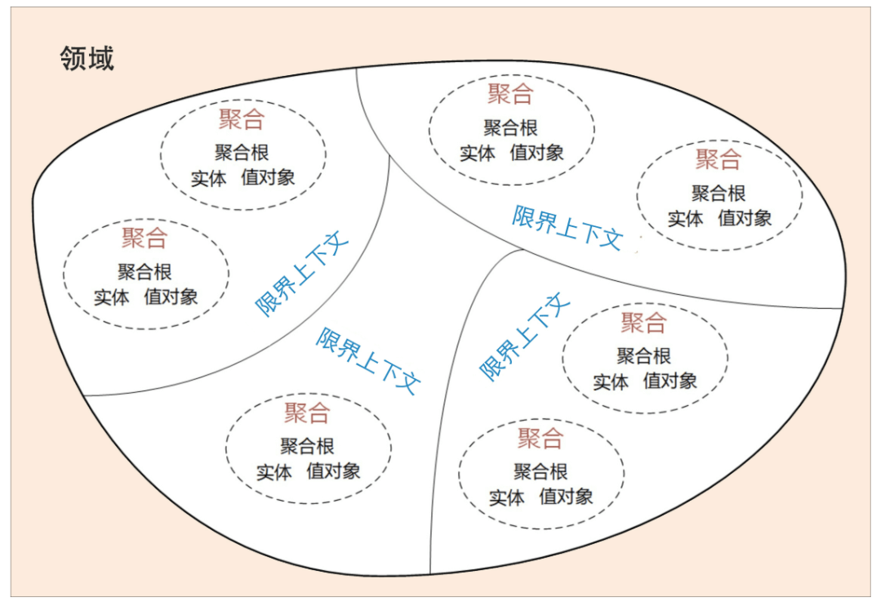
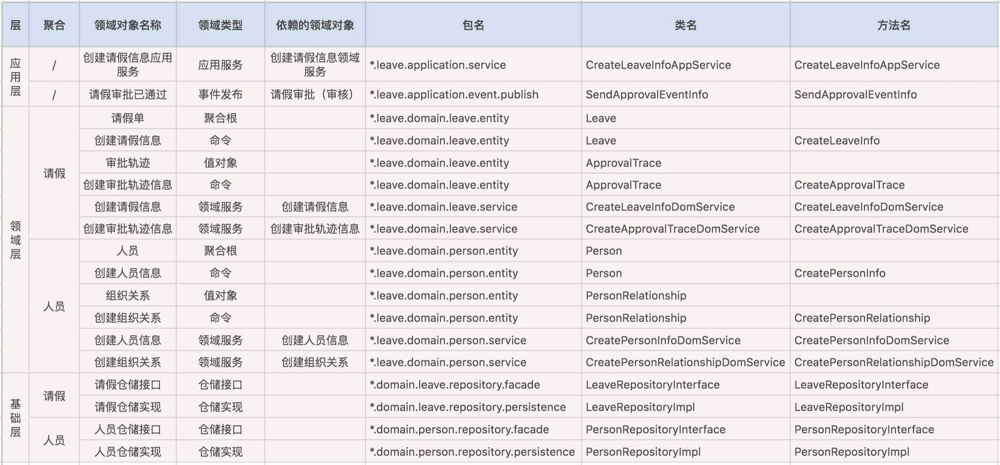
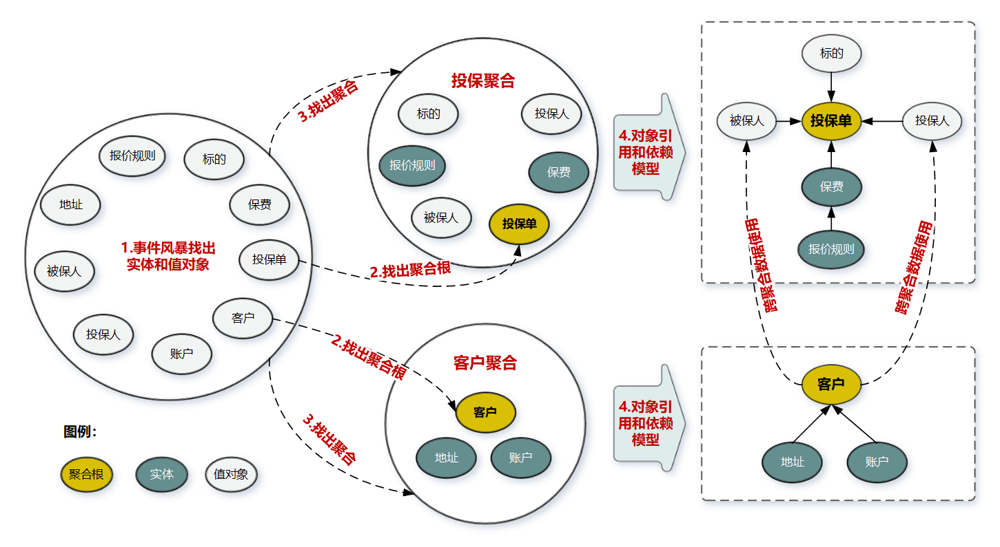
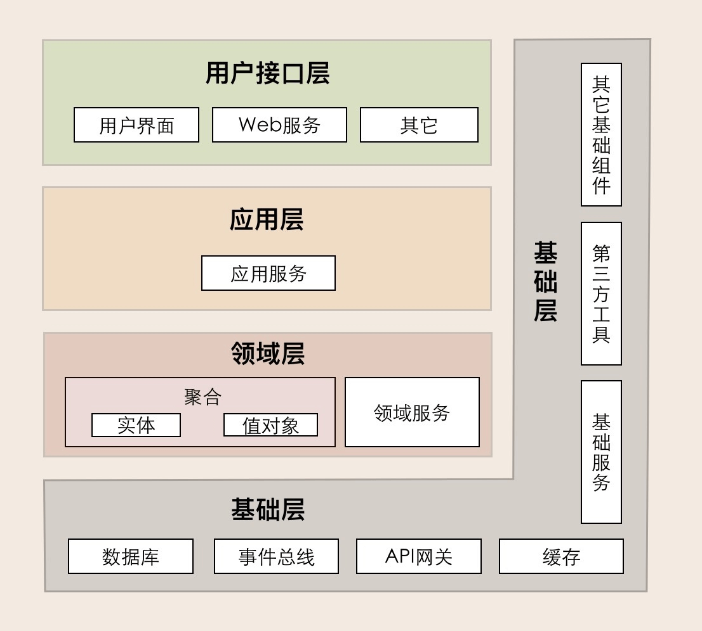
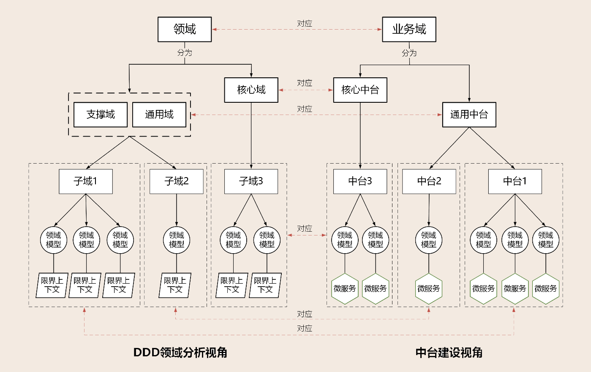

# 01 领域驱动设计：微服务为什么要选择DDD



我们可以用三步来划定领域模型和微服务的边界。

- 第一步：在事件风暴中梳理业务过程中的用户操作、事件以及外部依赖关系等，根据这些要素梳理出领域实体等领域对象。
- 第二步：根据领域实体之间的业务关联性，将业务紧密相关的实体进行组合形成聚合，同时确定聚合中的聚合根、值对象和实体。在这个图里，聚合之间的边界是第一层边界，它们在同一个微服务实例中运行，这个边界是逻辑边界，所以用虚线表示。
- 第三步：根据业务及语义边界等因素，将一个或者多个聚合划定在一个限界上下文内，形成领域模型。在这个图里，限界上下文之间的边界是第二层边界，这一层边界可能就是未来微服务的边界，不同限界上下文内的领域逻辑被隔离在不同的微服务实例中运行，物理上相互隔离，所以是物理边界，边界之间用实线来表示。


# 02 领域、子域、核心域、通用域和支撑域：傻傻分不清？

决定产品和公司核心竞争力的子域是核心域，它是业务成功的主要因素和公司的核心竞争力。没有太多个性化的诉求，同时被多个子域使用的通用功能子域是通用域。
还有一种功能子域是必需的，但既不包含决定产品和公司核心竞争力的功能，也不包含通用功能的子域，它就是支撑域。


# 03 限界上下文：定义领域边界的利器

## 通用语言
通用语言定义上下文含义，限界上下文则定义领域边界，以确保每个上下文含义在它特定的边界内有唯一的含义，领域模型则存在于这个
边界之内。

能简单、清晰、准确描述业务含义和规则的语言就是通用语言。包含术语和用例场景，能直接反映在代码中。

1. 在事件风暴的过程中，领域专家会和设计、开发人员一起建立领域模型，在领域建模的过程中会形成通用的业务术语和用户故事。事件风暴也是一个项目团队统一语言的过程。 
2. 通过用户故事分析会形成一个个的领域对象，这些领域对象对应领域模型的业务对象，每一个业务对象和领域对象都有通用的名词术语，并且一一映射。 
3. 微服务代码模型来源于领域模型，每个代码模型的代码对象跟领域对象一一对应

从事件风暴建立通用语言到领域对象设计和代码落地的完整过程:

1.事件风暴 -> 2.领域故事分析 -> 3. 提取领域对象 -> 4. 领域对象与代码模型映射 -> 5.代码落地



## 限界上下文

限界就是领域的边界，上下文是语义环境。
我认为限界上下文的定义就是：用来封装通用语言和领域对象，提供上下文环境，保证在领域之内的一些术语、业务相关对象等（通用语言）有一个确切的含义，没有二义性。这个边界定义了模型的适用范围，使团队所有成员能够明确地知道什么应该在模型中实现，什么不应该在模型中实现。


# 04 实体和值对象：从领域模型的基础单元看系统设计

## 实体

在 DDD 中有这样一类对象，它们拥有唯一标识符，且标识符在历经各种状态变更后仍能保持一致。对这些对象而言，重要的不是其属性，
而是其延续性和标识，对象的延续性和标识会跨越甚至超出软件的生命周期。

- 实体的业务形态：在事件风暴中，我们可以根据命令、操作或者事件，找出产生这些行为的业务实体对象，进而按照一定的业务规则将依存度高和业务关联紧密的多个实体对象和值对象进行聚类，形成聚合。
- 实体的代码形态：表现形式是实体类，这个类包含了实体的属性和方法，通过这些方法实现实体自身的业务逻辑
- 实体的运行形态：实体以 DO（领域对象）的形式存在，每个实体对象都有唯一的 ID。(比如商品)
- 实体的数据库形态：一个实体可能对应 0 个、1 个或者多个数据库持久化对象。大多情况下是一对一，也可能没有持久化对象

## 值对象

通过对象属性值来识别的对象，它将多个相关属性组合为一个概念整体。在 DDD 中用来描述领域的特定方面，并且是一个没有标识符的对象，叫作值对象。

简单来说，值对象本质上就是一个集。那这个集合里面有什么呢？若干个用于描述目的、具有整体概念和不可修改的属性。那这个集合存在的意义又是什么？在领域建模的过程中，值对象可以保证属性归类的清晰和概念的完整性，避免属性零碎。


- 值对象的业务形态：值对象只是若干个属性的集合，只有数据初始化操作和有限的不涉及修改数据的行为，基本不包含业务逻辑。
- 值对象的代码形态：没有 id 的 class 类
- 值对象的运行形态：属性嵌入的方式和序列化大对象的方式(比如json)。
- 值对象的数据库形态：在数据建模时，我们可以将值对象嵌入实体，减少实体表的数量，简化数据库设计。


# 05 聚合和聚合根：怎样设计聚合？

## 聚合

领域模型内的实体和值对象就好比个体，而能让实体和值对象协同工作的组织就是聚合，它用来确保这些领域对象在实现共同的业务逻辑时，能保证数据的一致性。
可以这么理解，聚合就是由业务和逻辑紧密关联的实体和值对象组合而成的，聚合是数据修改和持久化的基本单元，每一个聚合对应一个仓储，实现数据的持久化。

## 聚合根

聚合根的主要目的是为了避免由于复杂数据模型缺少统一的业务规则控制，而导致聚合、实体之间数据不一致性的问题。

聚合根是实体，有实体的特点，具有全局唯一标识，有独立的生命周期。一个聚合只有一个聚合根，聚合根在聚合内对实体和值对象采用直接对象引用的方式进行组织和协调，聚合根与聚合根之间通过 ID 关联的方式实现聚合之间的协同。

## 怎样设计聚合



1. 采用事件风暴，根据业务行为，梳理出在投保过程中发生这些行为的所有的实体和值对象，比如投保单、标的、客户、被保人等等。
2. 从众多实体中选出适合作为对象管理者的根实体，也就是聚合根。判断一个实体是否是聚合根，你可以结合以下场景分析：是否有独立的生命周期？是否有全局唯一 ID？是否可以创建或修改其它对象？是否有专门的模块来管这个实体。图中的聚合根分别是投保单和客户实体。
3. 根据业务单一职责和高内聚原则，找出与聚合根关联的所有紧密依赖的实体和值对象。构建出 1 个包含聚合根（唯一）、多个实体和值对象的对象集合，这个集合就是聚合。
4. 在聚合内根据聚合根、实体和值对象的依赖关系，画出对象的引用和依赖模型。这里我需要说明一下：投保人和被保人的数据，是通过关联客户 ID 从客户聚合中获取的，在投保聚合里它们是投保单的值对象，这些值对象的数据是客户的冗余数据，即使未来客户聚合的数据发生了变更，也不会影响投保单的值对象数据。从图中我们还可以看出实体之间的引用关系，比如在投保聚合里投保单聚合根引用了报价单实体，报价单实体则引用了报价规则子实体。
5. 多个聚合根据业务语义和上下文一起划分到同一个限界上下文内。


# 06 领域事件：解耦微服务的关键

## 领域事件

除了命令和操作等业务行为以外，还有一种非常重要的事件，这种事件发生后通常会导致进一步的业务操作，在 DDD 中这种事件被称为领域事件。

举例来说的话，领域事件可以是业务流程的一个步骤，比如投保业务缴费完成后，触发投保单转保单的动作；也可能是定时批处理过程中发生的事件，
比如批处理生成季缴保费通知单，触发发送缴费邮件通知操作；或者一个事件发生后触发的后续动作，比如密码连续输错三次，触发锁定账户的动作。

### 微服务内的领域事件：
当领域事件发生在微服务内的聚合之间，领域事件发生后完成事件实体构建和事件数据持久化，发布方聚合将事件发布到事件总线，订阅方接收事件数据完成后续业务操作。
(不一定要引入消息队列)

### 微服务之间的领域事件：

跨微服务的领域事件会在不同的限界上下文或领域模型之间实现业务协作，其主要目的是实现微服务解耦，减轻微服务之间实时服务访问的压力。
跨微服务的事件机制要总体考虑事件构建、发布和订阅、事件数据持久化、消息中间件，甚至事件数据持久化时还可能需要考虑引入分布式事务机制等。

### 领域事件总体架构

1. 事件构架和发布。基类 DomainEvent(id, timestamp, source, data)
2. 事件数据持久化(数据对账或者审计)
3. 事件总线(EventBus)
4. 消息中间件(Kafka)
5. 事件接收和处理


# 07 DDD分层架构：有效降低层与层之间的依赖


1. 用户接口层。负责向用户展示信息和解释用户指令
2. 应用层。应用层是很薄的一层，理论上不应该有业务规则或逻辑，主要面向用例和流程相关的操作。但应用层又位于领域层之上，
因为领域层包含多个聚合，所以它可以协调多个聚合的服务和领域对象完成服务编排和组合，协作完成业务操作。
3. 领域层。领域层的作用是实现企业核心业务逻辑，通过各种校验手段保证业务的正确性。领域层主要体现领域模型的业务能力，它用来表达业务概念、业务状态和业务规则。
4. 基础层。基础层是贯穿所有层的，它的作用就是为其它各层提供通用的技术和基础服务，包括第三方工具、驱动、消息中间件、网关、文件、缓存以及数据库等。比较常见的功能还是提供数据库持久化。
基础层包含基础服务，它采用依赖倒置设计，封装基础资源服务，实现应用层、领域层与基础层的解耦，降低外部资源变化对应用的影响。

原则：每一层智只能与位于其下方的层发生耦合。


# 08 微服务架构模型：几种常见模型的对比和分析

## 整洁架构
## 六边形架构(端口适配器架构)

中台和微服务设计：

1. 中台建设需要聚焦领域模型
2. 微服务要有合理的架构分层


# 09 中台：数字转型后到底应该共享什么？

阿里自己人对中台的定义：“中台是一个基础的理念和架构，我们要把所有的基础服务用中台的思路建设，进行联通，共同支持上端的业务。
业务中台更多的是支持在线业务，数据中台提供了基础数据处理能力和很多的数据产品给所有业务方去用。


# 10 DDD、中台和微服务：它们是如何协作的？



中台如何建模：

1. 按照业务流程（通常适用于核心域）或者功能属性、集合（通常适用于通用域或支撑域），将业务域细分为多个中台，再根据功能属性或重要性归类到核心中台或通用中台。核心中台设计时要考虑核心竞争力，通用中台要站在企业高度考虑共享和复用能力。
2. 选取中台，根据用例、业务场景或用户旅程完成事件风暴，找出实体、聚合和限界上下文。依次进行领域分解，建立领域模型。
3. 以主领域模型为基础，扫描其它中台领域模型，检查并确定是否存在重复或者需要重组的领域对象、功能，提炼并重构主领域模型，完成最终的领域模型设计
4. 选择其它主领域模型重复第三步，直到所有主领域模型完成比对和重构
5. 基于领域模型完成微服务设计，完成系统落地


# 11 DDD实践：如何用DDD重构中台业务模型？

如何构架中台业务模型？

1. 自顶向下的策略

第一种策略是自顶向下。这种策略是先做顶层设计，从最高领域逐级分解为中台，分别建立领域模型，根据业务属性分为通用中台或核心中台。
领域建模过程主要基于业务现状，暂时不考虑系统现状。自顶向下的策略适用于全新的应用系统建设，或旧系统推倒重建的情况。

2. 自底向上的策略

第二种策略是自底向上。这种策略是基于业务和系统现状完成领域建模。首先分别完成系统所在业务域的领域建模；然后对齐业务域，
找出具有同类或相似业务功能的领域模型，对比分析领域模型的差异，重组领域对象，重构领域模型。这个过程会沉淀公共和复用的业务能力，会将分散的业务模型整合。自底向上策略适用于遗留系统业务模型的演进式重构。

总结成一句话就是：“分域建模型，找准基准域，划定上下文，聚合重归类。”


# 12 领域建模：如何用事件风暴构建领域模型？
如何用事件风暴构建领域模型？
领域建模的过程主要包括产品愿景、业务场景分析、领域建模和微服务拆分与设计这几个重要阶段。下面我以用户中台为例，介绍一下如何用事件风暴构建领域模型。

1. 产品愿景
2. 业务场景分析
3. 领域建模
4. 微服务拆分与设计


# 13 代码模型（上）：如何使用DDD设计微服务代码模型？

- 用户接口层：面向前端提供服务适配，面向资源层提供资源适配。这一层聚集了接口适配相关的功能。
- 应用层职责：实现服务组合和编排，适应业务流程快速变化的需求。这一层聚集了应用服务和事件相关的功能。
- 领域层：实现领域的核心业务逻辑。这一层聚集了领域模型的聚合、聚合根、实体、值对象、领域服务和事件等领域对象，以及它们组合所形成的业务能力。
- 基础层：贯穿所有层，为各层提供基础资源服务。这一层聚集了各种底层资源相关的服务和能力。

```
- interfaces 用户接口层: 存放用户接口层与前端交互、展现数据相关的代码。前端应用通过这一层的接口，向应用服务获取展现所需的数据。
  - assembler 实现 DTO 与领域对象之间的相互转换和数据交换
  - dto 数据传输的载体，内部不存在任何业务逻辑，我们可以通过 DTO 把内部的领域对象与外界隔离。
  - facade 提供较粗粒度的调用接口，将用户请求委派给一个或多个应用服务进行处理

- application 应用层: 应用层服务组合和编排相关的代码。应用服务向下基于微服务内的领域服务或外部微服务的应用服务完成服务的编排和组合，向上为用户接口层提供各种应用数据展现支持服务。
  - event: 事件
    - publish: 事件发布
    - subscribe: 事件订阅
  - service 应用服务：应用服务。应用服务会对多个领域服务或外部应用服务进行封装、编排和组合，对外提供粗粒度的服务。

- domain 领域层: 存放领域层核心业务逻辑相关的代码。领域层可以包含多个聚合代码包，它们共同实现领域模型的核心业务逻辑。聚合以及聚合内的实体、方法、领域服务和事件等代码会放在这一层目录里。
  - aggregate00 在聚合内定义聚合根、实体和值对象以及领域服务之间的关系和边界。聚合内实现高内聚的业务逻辑，它的代码可以独立拆分为微服务。
    - entity: 存放聚合根、实体、值对象以及工厂模式（Factory）相关代码。实体类采用充血模型，同一实体相关的业务逻辑都在实体类代码中实现。跨实体的业务逻辑代码在领域服务中实现
    - event: 存放事件实体以及与事件活动相关的业务逻辑代码
    - service: 存放领域服务代码。一个领域服务是多个实体组合出来的一段业务逻辑
    - repository: 存放所在聚合的查询或持久化领域对象的代码，通常包括仓储接口和仓储实现方法。为了方便聚合的拆分和组合，我们设定了一个原则：一个聚合对应一个仓储。

  - aggregate01

- infrastructure 基础层: 通用技术能力、三方软件包、数据库服务、配置和基础资源服务的代码都会放在这一层目录里。
  - config: 配置相关代码
  - util
    - api
    - driver
    - eventbus
    - mq
```


# 14 代码模型（下）：如何保证领域模型与代码模型的一致性？
领域对象是怎么得来的？

1. 设计实体
2. 找出聚合根
3. 设计值对象
4. 设计领域事件
5. 设计领域服务
6. 设计仓储

服务的封装和调用主要有以下几种方式

1. 实体方法的封装
2. 领域服务的组合和封装
3. 应用服务的组合和编排


# 15 边界：微服务的各种边界在架构演进中的作用？
