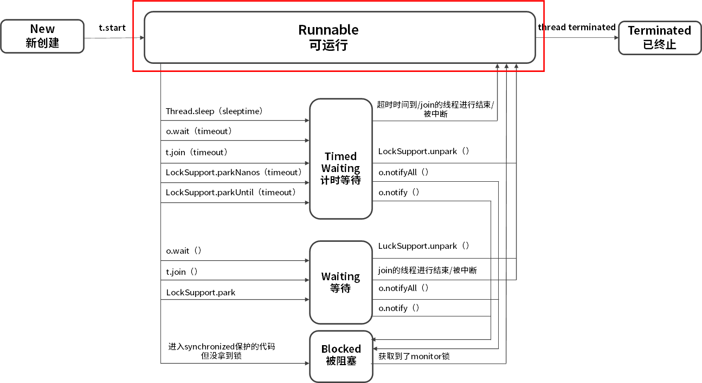
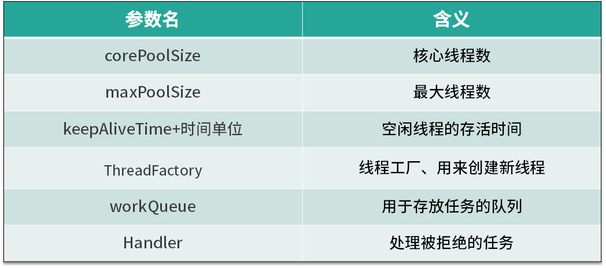

# 01 为何说只有 1 种实现线程的方法？

本质上就一种，构造一个 Thread 类

```java
//  继承 Thread 类
public class ExtendsThread extends Thread {
    @Override
    public void run() {
        System.out.println('用Thread类实现线程');
    }
}

//实现 Runnable 接口 (推荐)
public class RunnableThread implements Runnable {
    @Override
    public void run() {
        System.out.println('用实现Runnable接口实现线程');
    }
}
```

# 02 如何正确停止线程？为什么 volatile 标记位的停止方法是错误的？

对于 Java 而言，最正确的停止线程的方式是使用 interrupt。但 interrupt 仅仅起到通知被停止线程的作用。而对于被停止的线程而言，
它拥有完全的自主权，它既可以选择立即停止，也可以选择一段时间后停止，也可以选择压根不停止(防止未处理完出现数据完整性问题，让线程有时间首尾)。

如何用 interrupt 停止线程

```java
while (!Thread.currentThread().isInterrupted() && more work to do) {
    do more work
}
```

为什么 volatile 可能不生效？

生产者在执行 storage.put(num) 时发生阻塞，在它被叫醒之前是没有办法进入下一次循环判断 canceled 的值的，
所以在这种情况下用 volatile 是没有办法让生产者停下来的，相反如果用 interrupt 语句来中断，即使生产者处于阻塞状态，仍然能够感受到中断信号，并做响应处理。


# 03 线程是如何在 6 种状态之间转换的？

在 Java 中线程的生命周期中一共有 6 种状态。

- New（新创建）
- Runnable（可运行）
- Blocked（被阻塞）
- Waiting（等待）
- Timed Waiting（计时等待）
- Terminated（被终止）




# 04 waitnotifynotifyAll 方法的使用注意事项？

1.为什么 wait 方法必须在 synchronized 保护的同步代码中使用？

正是因为 wait 方法所在的 take 方法没有被 synchronized 保护，所以它的 while 判断和 wait 方法无法构成原子操作，那么此时整个程序就很容易出错。

2.为什么 wait/notify/notifyAll 被定义在 Object 类中，而 sleep 定义在 Thread 类中？

- 因为 Java 中每个对象都有一把称之为 monitor 监视器的锁，由于每个对象都可以上锁，这就要求在对象头中有一个用来保存锁信息的位置。这个锁是对象级别的，而非线程级别的，wait/notify/notifyAll 也都是锁级别的操作，它们的锁属于对象，所以把它们定义在 Object 类中是最合适，因为 Object 类是所有对象的父类。
- 因为如果把 wait/notify/notifyAll 方法定义在 Thread 类中，会带来很大的局限性，比如一个线程可能持有多把锁，以便实现相互配合的复杂逻辑，假设此时 wait 方法定义在 Thread 类中，如何实现让一个线程持有多把锁呢？又如何明确线程等待的是哪把锁呢？既然我们是让当前线程去等待某个对象的锁，自然应该通过操作对象来实现，而不是操作线程。

3.wait/notify 和 sleep 方法的异同？

- 它们都可以让线程阻塞。
- 它们都可以响应 interrupt 中断：在等待的过程中如果收到中断信号，都可以进行响应，并抛出 InterruptedException 异常。

但是它们也有很多的不同点：

- wait 方法必须在 synchronized 保护的代码中使用，而 sleep 方法并没有这个要求。
- 在同步代码中执行 sleep 方法时，并不会释放 monitor 锁，但执行 wait 方法时会主动释放 monitor 锁。
- sleep 方法中会要求必须定义一个时间，时间到期后会主动恢复，而对于没有参数的 wait 方法而言，意味着永久等待，直到被中断或被唤醒才能恢复，它并不会主动恢复。
- wait/notify 是 Object 类的方法，而 sleep 是 Thread 类的方法。


# 05 有哪几种实现生产者消费者模式的方法？

```java
public static void main(String[] args) {
	BlockingQueue<Object> queue = new ArrayBlockingQueue<>(10);

	Runnable producer = () -> {
		while (true) {
			queue.put(new Object());
		}

	};

	new Thread(producer).start();
	new Thread(producer).start();

	Runnable consumer = () -> {
		while (true) {
			queue.take();
		}
	};

	new Thread(consumer).start();
	new Thread(consumer).start();
}
```


# 06 一共有哪 3 类线程安全问题？

《Java Concurrency In Practice》的作者 Brian Goetz 对线程安全是这样理解的，当多个线程访问一个对象时，
如果不用考虑这些线程在运行时环境下的调度和交替执行问题，也不需要进行额外的同步，而调用这个对象的行为都可以获得正确的结果，那这个对象便是线程安全的。

实际开发中经常会遇到线程不安全的情况，那么一共有哪 3 种典型的线程安全问题呢？

1.运行结果错误；

比如多个线程同时对一个变量自增，结果不是期望值。

2.发布和初始化导致线程安全问题；

比如构造函数开了线程初始化。因为 students 这个成员变量是在构造函数中新建的线程中进行的初始化和赋值操作，而线程的启动需要一定的时间，
但是我们的 main 函数并没有进行等待就直接获取数据，导致 getStudents 获取的结果为 null，这就是在错误的时间或地点发布或初始化造成的线程安全问题。

3.活跃性问题。

第三种线程安全问题统称为活跃性问题，最典型的有三种，分别为死锁、活锁和饥饿。

- 死锁是指两个线程之间相互等待对方资源，但同时又互不相让，都想自己先执行
- 活锁与死锁非常相似，也是程序一直等不到结果，但对比于死锁，活锁是活的，什么意思呢？因为正在运行的线程并没有阻塞，它始终在运行中，却一直得不到结果。
- 饥饿是指线程需要某些资源时始终得不到，尤其是CPU 资源，就会导致线程一直不能运行而产生的问题


# 07 哪些场景需要额外注意线程安全问题？

1. 访问共享变量或资源
2. 依赖时序的操作。比如“检查与执行”并不是原子操作
3. 不同数据之间存在绑定关系。比如 ip 和端口操作，需要保证原子性
4. 对方没声明自己是线程安全的。比如 ArrayList


# 08 为什么多线程会带来性能问题？

- 调度开销。上下文切换；缓存失效
- 协作开销。为了保证线程安全，就有可能禁止编译器和 CPU 对其进行重排序等优化，也可能出于同步的目的，反复把线程工作内存的数据 flush 到主存中，
  然后再从主内存 refresh 到其他线程的工作内存中


# 09 使用线程池比手动创建线程好在哪里？

如果每个任务都创建一个线程会带来哪些问题：

1. 反复创建线程系统开销比较大，每个线程创建和销毁都需要时间，如果任务比较简单，那么就有可能导致创建和销毁线程消耗的资源比线程执行任务本身消耗的资源还要大。
2. 过多的线程会占用过多的内存等资源，还会带来过多的上下文切换，同时还会导致系统不稳定。

使用线程池比手动创建线程主要有三点好处。

1. 线程池可以解决线程生命周期的系统开销问题，同时还可以加快响应速度。因为线程池中的线程是可以复用的，我们只用少量的线程去执行大量的任务，这就大大减小了线程生命周期的开销。而且线程通常不是等接到任务后再临时创建，而是已经创建好时刻准备执行任务，这样就消除了线程创建所带来的延迟，提升了响应速度，增强了用户体验。
2. 线程池可以统筹内存和 CPU 的使用，避免资源使用不当。线程池会根据配置和任务数量灵活地控制线程数量，不够的时候就创建，太多的时候就回收，避免线程过多导致内存溢出，或线程太少导致 CPU 资源浪费，达到了一个完美的平衡。
3. 线程池可以统一管理资源。比如线程池可以统一管理任务队列和线程，可以统一开始或结束任务，比单个线程逐一处理任务要更方便、更易于管理，同时也有利于数据统计，比如我们可以很方便地统计出已经执行过的任务的数量。


# 10 线程池的各个参数的含义？



# 11 线程池有哪 4 种拒绝策略？

拒绝策略

- 第一种拒绝策略是 AbortPolicy，这种拒绝策略在拒绝任务时，会直接抛出一个类型为 RejectedExecutionException 的 RuntimeException，让你感知到任务被拒绝了，于是你便可以根据业务逻辑选择重试或者放弃提交等策略。
- 第二种拒绝策略是 DiscardPolicy，这种拒绝策略正如它的名字所描述的一样，当新任务被提交后直接被丢弃掉，也不会给你任何的通知，相对而言存在一定的风险，因为我们提交的时候根本不知道这个任务会被丢弃，可能造成数据丢失。
- 第三种拒绝策略是 DiscardOldestPolicy，如果线程池没被关闭且没有能力执行，则会丢弃任务队列中的头结点，通常是存活时间最长的任务，这种策略与第二种不同之处在于它丢弃的不是最新提交的，而是队列中存活时间最长的，这样就可以腾出空间给新提交的任务，但同理它也存在一定的数据丢失风险。
- 第四种拒绝策略是 CallerRunsPolicy，相对而言它就比较完善了，当有新任务提交后，如果线程池没被关闭且没有能力执行，则把这个任务交于提交任务的线程执行，也就是谁提交任务，谁就负责执行任务。这样做主要有两点好处。
  - 第一点新提交的任务不会被丢弃，这样也就不会造成业务损失。
  - 第二点好处是，由于谁提交任务谁就要负责执行任务，这样提交任务的线程就得负责执行任务，而执行任务又是比较耗时的，在这段期间，提交任务的线程被占用，也就不会再提交新的任务，减缓了任务提交的速度，相当于是一个负反馈。在此期间，线程池中的线程也可以充分利用这段时间来执行掉一部分任务，腾出一定的空间，相当于是给了线程池一定的缓冲期。


# 12 有哪 6 种常见的线程池？什么是 Java8 的 ForkJoinPool？

- FixedThreadPool: 它的核心线程数和最大线程数是一样的，所以可以把它看作是固定线程数的线程池
- CachedThreadPool: 可以称作可缓存线程池，它的特点在于线程数是几乎可以无限增加的（实际最大可以达到 Integer.MAX_VALUE)
- ScheduledThreadPool: 支持定时或周期性执行任务
- SingleThreadExecutor: 它会使用唯一的线程去执行任务，原理和 FixedThreadPool 是一样的，只不过这里线程只有一个，如果线程在执行任务的过程中发生异常，线程池也会重新创建一个线程来执行后续的任务。适合用于所有任务都需要按被提交的顺序依次执行的场景，
- SingleThreadScheduledExecutor: 它只是将 ScheduledThreadPool 的核心线程数设置为了 1。
- ForkJoinPool: 适合分裂和汇总任务；每个线程都有自己独立的任务队列。适合递归场景，树遍历、最优路径搜索等


# 13 线程池常用的阻塞队列有哪些？

线程池的内部结构主要由四部分组成，如图所示。

- 第一部分是线程池管理器，它主要负责管理线程池的创建、销毁、添加任务等管理操作，它是整个线程池的管家。
- 第二部分是工作线程，也就是图中的线程 t0~t9，这些线程勤勤恳恳地从任务队列中获取任务并执行。
- 第三部分是任务队列，作为一种缓冲机制，线程池会把当下没有处理的任务放入任务队列中，由于多线程同时从任务队列中获取任务是并发场景，此时就需要任务队列满足线程安全的要求，所以线程池中任务队列采用 BlockingQueue 来保障线程安全。
- 第四部分是任务，任务要求实现统一的接口，以便工作线程可以处理和执行。


# 14 为什么不应该自动创建线程池？

这几种自动创建的线程池都存在风险，相比较而言，我们自己手动创建会更好，因为我们可以更加明确线程池的运行规则，不仅可以选择适合自己的线程数量，更可以在必要的时候拒绝新任务的提交，避免资源耗尽的风险。


# 15 合适的线程数量是多少？CPU 核心数和线程数的关系？

CPU 密集型任务:

首先，我们来看 CPU 密集型任务，比如加密、解密、压缩、计算等一系列需要大量耗费 CPU 资源的任务。对于这样的任务最佳的线程数为 CPU 核心数的 1~2 倍


耗时 IO 型任务:

比如数据库、文件的读写，网络通信等任务，这种任务的特点是并不会特别消耗 CPU 资源，但是 IO 操作很耗时，总体会占用比较多的时间

《Java并发编程实战》的作者 Brain Goetz 推荐的计算方法：线程数 = CPU 核心数 *（1+平均等待时间/平均工作时间）

综上所述我们就可以得出一个结论：

- 线程的平均工作时间所占比例越高，就需要越少的线程；
- 线程的平均等待时间所占比例越高，就需要越多的线程；
- 针对不同的程序，进行对应的实际测试就可以得到最合适的选择。


# 16 如何根据实际需要，定制自己的线程池？

核心线程数、阻塞队列、线程工厂、拒绝策略


# 17 如何正确关闭线程池？shutdown 和 shutdownNow 的区别？

通常我们可以用 shutdown() 方法来关闭，这样可以让已提交的任务都执行完毕，但是如果情况紧急，那我们就可以用 shutdownNow 方法来加快线程池“终结”的速度。


# 18 线程池实现“线程复用”的原理？

实现线程复用的逻辑主要在一个不停循环的 while 循环体中。

1. 通过取 Worker 的 firstTask 或者通过 getTask 方法从 workQueue 中获取待执行的任务。
2. 直接调用 task 的 run 方法来执行具体的任务（而不是新建线程）。

通过取 Worker 的 firstTask 或者 getTask方法从 workQueue 中取出了新任务，并直接调用 Runnable 的 run 方法来执行任务，也就是如之前所说的，
每个线程都始终在一个大循环中，反复获取任务，然后执行任务，从而实现了线程的复用。


# 19 你知道哪几种锁？分别有什么特点？

根据分类标准我们把锁分为以下 7 大类别，分别是：

- 偏向锁/轻量级锁/重量级锁；
  - 这三种锁特指 synchronized 锁的状态，通过在对象头中的 mark word 来表明锁的状态。
  - 锁升级的路径：无锁→偏向锁→轻量级锁→重量级锁。
  - 偏向锁性能最好，可以避免执行 CAS 操作。而轻量级锁利用自旋和 CAS 避免了重量级锁带来的线程阻塞和唤醒，性能中等。重量级锁则会把获取不到锁的线程阻塞，性能最差。
- 可重入锁/非可重入锁； 可重入锁指的是线程当前已经持有这把锁了，能在不释放这把锁的情况下，再次获取这把锁。
- 共享锁/独占锁； 共享锁指的是我们同一把锁可以被多个线程同时获得，而独占锁指的就是，这把锁只能同时被一个线程获得(读写锁)
- 公平锁/非公平锁；公平锁的公平的含义在于如果线程现在拿不到这把锁，那么线程就都会进入等待，开始排队，在等待队列里等待时间长的线程会优先拿到这把锁
- 悲观锁/乐观锁；悲观锁的概念是在获取资源之前，必须先拿到锁，以便达到“独占”的状态，
- 自旋锁/非自旋锁； 自旋锁的理念是如果线程现在拿不到锁，并不直接陷入阻塞或者释放 CPU 资源，而是开始利用循环，不停地尝试
  获取锁，这个循环过程被形象地比喻为“自旋”。非自旋锁的理念就是没有自旋的过程，如果拿不到锁就直接放弃，或者进行其他的处理逻辑，例如去排队、陷入阻塞等。
- 可中断锁/不可中断锁。不可中断：一旦线程申请了锁，就没有回头路了，只能等到拿到锁以后才能进行其他的逻辑处理


# 20 悲观锁和乐观锁的本质是什么？

悲观锁: synchronized 关键字和 Lock 相关类

悲观锁比较悲观，它认为如果不锁住这个资源，别的线程就会来争抢，就会造成数据结果错误，所以悲观锁为了确保结果的正确性，会在每次获取并修改数据时，都把数据锁住，让其他线程无法访问该数据，这样就可以确保数据内容万无一失。

乐观锁(一般 CAS 实现, AtomicInteger):

乐观锁比较乐观，认为自己在操作资源的时候不会有其他线程来干扰，所以并不会锁住被操作对象，不会不让别的线程来接触它，同时，为了确保数据正确性，在更新之前，会去对比在我修改数据期间，数据有没有被其他线程修改过：如果没被修改过，就说明真的只有我自己在操作，那我就可以正常的修改数据；如果发现数据和我一开始拿到的不一样了，说明其他线程在这段时间内修改过数据，那说明我迟了一步，所以我会放弃这次修改，并选择报错、重试等策略。

两种锁各自的使用场景:

- 悲观锁适合用于并发写入多、临界区代码复杂、竞争激烈等场景，这种场景下悲观锁可以避免大量的无用的反复尝试等消耗。
- 乐观锁适用于大部分是读取，少部分是修改的场景，也适合虽然读写都很多，但是并发并不激烈的场景。在这些场景下，乐观锁不加锁的特点能让性能大幅提高。


# 21 如何看到 synchronized 背后的“monitor 锁”？

最简单的同步方式就是利用 synchronized 关键字来修饰代码块或者修饰一个方法，那么这部分被保护的代码，在同一时刻就最多只有一个线程可以运行，
而 synchronized 的背后正是利用 monitor 锁实现的。

本课时我们讲解了获取和释放 monitor 的时机，以及被 synchronized 修饰的等价代码，然后我们还利用 javac 和 javap 命令查看了 synchronized 代码块以及 synchronized 方法所对应的的反汇编指令，其中同步代码块是利用 monitorenter 和 monitorexit 指令实现的，而同步方法则是利用 flags 实现的。


# 22 synchronized 和 Lock 孰优孰劣，如何选择？

相同点：

- synchronized 和 Lock 都是用来保护资源线程安全的。
- synchronized 和 ReentrantLock 都拥有可重入的特点。

不同点：

- synchronized 关键字可以加在方法上，不需要指定锁对象（此时的锁对象为 this），也可以新建一个同步代码块并且自定义 monitor 锁对象；而 Lock 接口必须显示用 Lock 锁对象开始加锁 lock() 和解锁 unlock()，并且一般会在 finally 块中确保用 unlock() 来解锁，以防发生死锁。
- synchronized 锁只能同时被一个线程拥有，但是 Lock 锁没有这个限制
- 原理区别 synchronized 是内置锁，由 JVM 实现获取锁和释放锁的原理，还分为偏向锁、轻量级锁、重量级锁。ReentrantLock 内部AQS 实现

如何选择：

- 如果能不用最好既不使用 Lock 也不使用 synchronized。因为在许多情况下你可以使用 java.util.concurrent 包中的机制，它会为你
  处理所有的加锁和解锁操作，也就是推荐优先使用工具类来加解锁。
- 如果 synchronized 关键字适合你的程序， 那么请尽量使用它，这样可以减少编写代码的数量，减少出错的概率。因为一旦忘记在 finally 里 unlock，代码可能会出很大的问题，而使用 synchronized 更安全。
- 如果特别需要 Lock 的特殊功能，比如尝试获取锁、可中断、超时功能等，才使用 Lock。


# 23 Lock 有哪几个常用方法？分别有什么用？

- lock() 是最基础的获取锁的方法。在线程获取锁时如果锁已被其他线程获取，则进行等待，是最初级的获取锁的方法。
- tryLock() 用来尝试获取锁，如果当前锁没有被其他线程占用，则获取成功，返回 true，否则返回 false，代表获取锁失败(可以避免死锁)
- tryLock(long time, TimeUnit unit)，这个方法和 tryLock() 很类似，区别在于 tryLock(long time, TimeUnit unit) 方法会有一个超时时间，在拿不到锁时会等待一定的时间，如果在时间期限结束后，还获取不到锁，就会返回 false；如果一开始就获取锁或者等待期间内获取到锁，则返回 true。
- lockInterruptibly() 除非当前线程在获取锁期间被中断，否则便会一直尝试获取直到获取到为止。
- unlock() : 对于 ReentrantLock 而言，执行 unlock() 的时候，内部会把锁的“被持有计数器”减 1，直到减到 0 就代表当前这把锁已经完全释放


# 24 讲一讲公平锁和非公平锁，为什么要“非公平”？

公平锁指的是按照线程请求的顺序，来分配锁；而非公平锁指的是不完全按照请求的顺序，在一定情况下，可以允许插队

`new ReentrantLock(false) 参数设置公平/非公平锁， 参数 fair为 true 表示公平锁`

- 公平锁：
  - 优势：每个线程等待一段时间之后总有执行的机会
  - 劣势：更慢，吞吐更小

- 非公平锁
  - 优势：更快，吞吐量更大
  - 劣势：可能产生线程饥饿

公平锁与非公平锁的 lock() 方法唯一的区别就在于公平锁在获取锁时多了一个限制条件：hasQueuedPredecessors() 为 false，
这个方法就是判断在等待队列中是否已经有线程在排队了。这也就是公平锁和非公平锁的核心区别，如果是公平锁，那么一旦已经有线程在排队了，当前线程就不再尝试获取锁；对于非公平锁而言，无论是否已经有线程在排队，都会尝试获取一下锁，获取不到的话，再去排队。

tryLock 可以插队，本身实现就是非公平的。


# 25 读写锁 ReadWriteLock 获取锁有哪些规则？

ReadWriteLock (适合读多写少场景)我们在使用读写锁时遵守下面的获取规则：

- 如果有一个线程已经占用了读锁，则此时其他线程如果要申请读锁，可以申请成功。
- 如果有一个线程已经占用了读锁，则此时其他线程如果要申请写锁，则申请写锁的线程会一直等待释放读锁，因为读写不能同时操作。
- 如果有一个线程已经占用了写锁，则此时其他线程如果申请写锁或者读锁，都必须等待之前的线程释放写锁，同样也因为读写不能同时，并且两个线程不应该同时写。

所以我们用一句话总结：要么是一个或多个线程同时有读锁，要么是一个线程有写锁，但是两者不会同时出现。
也可以总结为：读读共享、其他都互斥（写写互斥、读写互斥、写读互斥）。


# 26 读锁应该插队吗？什么是读写锁的升降级？

即便是非公平锁，只要等待队列的头结点是尝试获取写锁的线程，那么读锁依然是不能插队的，目的是避免“饥饿”。

比如如果一直有线程要获取读锁，就会导致写锁饥饿得不到执行。

对于 ReentrantReadWriteLock 而言。

- 插队策略: 
  - 公平策略下，只要队列里有线程已经在排队，就不允许插队。
  - 非公平策略下：
    - 如果允许读锁插队，那么由于读锁可以同时被多个线程持有，所以可能造成源源不断的后面的线程一直插队成功，导致读锁一直不能完全释放，从而导致写锁一直等待，为了防止“饥饿”，在等待队列的头结点是尝试获取写锁的线程的时候，不允许许读锁插队。
    - 写锁可以随时插队，因为写锁并不容易插队成功，写锁只有在当前没有任何其他线程持有读锁和写锁的时候，才能插队成功，同时写锁一旦插队失败就会进入等待队列，所以很难造成“饥饿”的情况，允许写锁插队是为了提高效率。

- 升降级策略：只能从写锁降级为读锁，不能从读锁升级为写锁。


# 27 什么是自旋锁？自旋的好处和后果是什么呢？

首先，我们了解什么叫自旋？“自旋”可以理解为“自我旋转”，这里的“旋转”指“循环”，比如 while 循环或者 for 循环。“自旋”就是自己在这里不停地循环，直到目标达成。
而不像普通的锁那样，如果获取不到锁就进入阻塞。

自旋锁，它并不会放弃 CPU 时间片，而是通过自旋等待锁的释放，也就是说，它会不停地再次地尝试获取锁(do while)，如果失败就再次尝试，直到成功为止。

java.util.concurrent 里面的原子类基本都是自旋锁的实现。

- 优点：用一句话总结自旋锁的好处，那就是自旋锁用循环去不停地尝试获取锁，让线程始终处于 Runnable 状态，节省了线程状态切换带来的开销。
- 缺点：它最大的缺点就在于虽然避免了线程切换的开销，但是它在避免线程切换开销的同时也带来了新的开销，因为它需要不停得去尝试获取锁。如果这把锁一直不能被释放，那么这种尝试只是无用的尝试，会白白浪费处理器资源。
  也就是说，虽然一开始自旋锁的开销低于线程切换，但是随着时间的增加，这种开销也是水涨船高，后期甚至会超过线程切换的开销，得不偿失。
- 适用场景: 自旋锁适用于并发度不是特别高的场景，以及临界区比较短小的情况，这样我们可以利用避免线程切换来提高效率。


# 28 JVM 对锁进行了哪些优化？

- 自适应的自旋锁
- 锁消除。栈上数据只有本线程可以访问，本来就是线程安全的
- 锁粗化。合并 synchronized 块(仅适合非循环场景)
- 偏向锁/轻量级锁/重量级锁


# 29 HashMap 为什么是线程不安全的？

- put 操作有 modCount++ 非原子操作
- 扩容期间取出来的值不准确
- 同事 put 碰撞导致数据丢失
- 可见性问题无法保证。一个线程操作这个容器时，其他线程能感知到本次操作
- 死循环造成 cpu 100%

推荐用 ConcurrenthashMap


# 30 ConcurrentHashMap 在 Java7 和 8 有何不同？
图中的节点有三种类型。

- 第一种是最简单的，空着的位置代表当前还没有元素来填充。
- 第二种就是和 HashMap 非常类似的拉链法结构，在每一个槽中会首先填入第一个节点，但是后续如果计算出相同的 Hash 值，就用链表的形式往后进行延伸。
- 第三种结构就是红黑树结构，这是 Java 7 的 ConcurrentHashMap 中所没有的结构，在此之前我们可能也很少接触这样的数据结构。

Java 7 采用 Segment(16个) 分段锁来实现，而 Java 8 中的 ConcurrentHashMap 使用数组 + 链表 + 红黑树，在这一点上它们的差别非常大。


# 31 为什么 Map 桶中超过 8 个才转为红黑树？

当链表长度大于或等于阈值（默认为 8）的时候，如果同时还满足容量大于或等于 MIN_TREEIFY_CAPACITY（默认为 64）的要求，就会把链表转换为红黑树。
同样，后续如果由于删除或者其他原因调整了大小，当红黑树的节点小于或等于 6 个以后，又会恢复为链表形态。


# 32 同样是线程安全，ConcurrentHashMap 和 Hashtable 的区别

- 实现方式：Hashtable 通过 synchronized。ConcurrentHashMap 是利用了 CAS + synchronized + Node 节点的方式，这和 Hashtable 的完全利用 synchronized 的方式有很大的不同。
- 性能：ConcurrentHashMap 并发性能高
- 修改：Hashtable 不允许迭代器期间修改内容，抛异常。 ConcurrentHashMap不会


# 33 CopyOnWriteArrayList 有什么特点？

- 读写规则：可以写入的时候同时读取
- 缺点：写操作的时候复制占用双倍内存，消耗 cpu 资源。修改时候对其他线程不可见


# 34 什么是阻塞队列？

`public interface BlockingQueue<E> extends Queue<E>{...}`

BlockingQueue 线程安全的。

- take方法。获取并且移除队头元素，如果无数据，则阻塞，一直到队列有数据，有数据后会立即结束阻塞并获取数据
- put。如果队列满了会阻塞直到有空闲


# 35 阻塞队列包含哪些常用的方法？add、offer、put 等方法的区别？

这三组方法由于功能很类似，所以比较容易混淆。它们的区别仅在于特殊情况：当队列满了无法添加元素，或者是队列空了无法移除元素时，不同组的方法对于这种特殊情况会有不同的处理方式：

- 抛出异常：add、remove、element
- 返回结果但不抛出异常：offer、poll、peek
- 阻塞：put、take


# 36 有哪几种常见的阻塞队列？

- ArrayBlockingQueue: 有界队列
- LinkedBlockingQueue: 内部链表实现（无界队列，Integer.MAX_VALUE)
- SynchronousQueue: 容量为 0.因为 SynchronousQueue 不需要去持有元素，它所做的就是直接传递（direct handoff）。由于每当需要传递的时候，SynchronousQueue 会把元素直接从生产者传给消费者，在此期间并不需要做存储，所以如果运用得当，它的效率是很高的。
- PriorityBlockingQueue: 通过实现 compareTo() 定义优先级
- DealyQueue: 延时功能


# 37 阻塞和非阻塞队列的并发安全原理是什么

ArrayBlockingQueue 实现并发同步的原理就是利用 ReentrantLock 和它的两个 Condition，读操作和写操作都需要先获取到 ReentrantLock 独占锁才能进行下一步操作。
进行读操作时如果队列为空，线程就会进入到读线程专属的 notEmpty 的 Condition 的队列中去排队，等待写线程写入新的元素；
同理，如果队列已满，这个时候写操作的线程会进入到写线程专属的 notFull 队列中去排队，等待读线程将队列元素移除并腾出空间。

非阻塞队列 ConcurrentLinkedQueue。顾名思义，ConcurrentLinkedQueue 是使用链表作为其数据结构的。
可以看出，非阻塞队列 ConcurrentLinkedQueue 使用 CAS 非阻塞算法 + 不停重试，来实现线程安全，适合用在不需要阻塞功能，且并发不是特别剧烈的场景。


# 38 如何选择适合自己的阻塞队列？

- FixedThreadPool（SingleThreadExecutor 同理）选取的是 LinkedBlockingQueue(链表长度默认可以无限延长)
- CachedThreadPool 选取的是 SynchronousQueue (直接把任务提交给线程)
- ScheduledThreadPool（SingleThreadScheduledExecutor同理）选取的是延迟队列

选取维度：

- 功能：是否排序、延迟执行等
- 容量 
- 能否扩容
- 内存结构（数组还是链表）
- 性能


# 39 原子类是如何利用 CAS 保证线程安全的？

原子性意味着“一组操作要么全都操作成功，要么全都失败，不能只操作成功其中的一部分”。而 java.util.concurrent.atomic 下的类，就是具有原子性的类，
可以原子性地执行添加、递增、递减等操作。

不过原子类相比于锁，有一定的优势：

- 粒度更细：原子变量可以把竞争范围缩小到变量级别，通常情况下，锁的粒度都要大于原子变量的粒度。
- 效率更高：除了高度竞争的情况之外，使用原子类的效率通常会比使用同步互斥锁的效率更高，因为原子类底层利用了 CAS 操作，不会阻塞线程。

包含 6 类:

- Atomic 基本类型原子类: 分别是 AtomicInteger、AtomicLong 和 AtomicBoolean。
- Array 数组类型原子类
- Atomic Reference 引用类型原子类 （让一个对象保持原子性）
- Atomic FieldUpdater 原子更新器
- Adder 加法器

Unsafe 其实是 CAS 的核心类。由于 Java 无法直接访问底层操作系统，而是需要通过 native 方法来实现。不过尽管如此，JVM 还是留了一个后门，
在 JDK 中有一个 Unsafe 类，它提供了硬件级别的原子操作，我们可以利用它直接操作内存数据。

Unsafe 的 getAndAddInt 方法是通过循环 + CAS 的方式来实现的，在此过程中，它会通过 compareAndSwapInt 方法来尝试更新 value 的值，如果更新失败就重新获取，然后再次尝试更新，直到更新成功。


# 40 AtomicInteger 在高并发下性能不好，如何解决？为什么？

在低竞争的情况下，AtomicLong 和 LongAdder 这两个类具有相似的特征，吞吐量也是相似的，因为竞争不高。但是在竞争激烈的情况下，LongAdder 的预期吞吐量要高得多，
经过试验，LongAdder 的吞吐量大约是 AtomicLong 的十倍，不过凡事总要付出代价，LongAdder 在保证高效的同时，也需要消耗更多的空间。


# 41 原子类和 volatile 有什么异同？

在变量的前面加上 volatile 关键字修饰，只要我们加上这个关键字，那么每一次变量被修改的时候，其他线程对此都可见，
这样一旦线程 1 改变了这个值，那么线程 2 就可以立刻看到，因此就可以退出 while 循环了。


volatile 和原子类的使用场景是不一样的，如果我们有一个可见性问题，那么可以使用 volatile 关键字，但如果我们的问题是一个组合操作，需要用同步来解决原子性问题的话，那么可以使用原子变量，而不能使用 volatile 关键字。


# 42 AtomicInteger 和 synchronized 的异同点？

- 原理不同。 synchronized 内后是 monitor锁。 原子类是 CAS操作
- 使用范围不同。原子类比较局限
- 粒度：原子变量粒度小
- 性能区别。synchronized 是一种悲观锁， 原子类是乐观锁。在竞争非常激烈的情况下，推荐使用 synchronized；而在竞争不激烈的情况下，使用原子类会得到更好的效果。


# 43 Java 8 中 Adder 和 Accumulator 有什么区别？

接下来我们说一下 LongAccumulator 的适用场景。

- 第一点需要满足的条件，就是需要大量的计算，并且当需要并行计算的时候，我们可以考虑使用 LongAccumulator。
- 第二点需要满足的要求，就是计算的执行顺序并不关键，执行先后不影响结果（比如加法乘法满足交换律）


# 44 ThreadLocal 适合用在哪些实际生产的场景中？

在通常的业务开发中，ThreadLocal 有两种典型的使用场景。

- 场景1，ThreadLocal 用作保存每个线程独享的对象，为每个线程都创建一个副本，这样每个线程都可以修改自己所拥有的副本, 而不会影响其他线程的副本，确保了线程安全。
- 场景2，ThreadLocal 用作每个线程内需要独立保存信息，以便供其他方法更方便地获取该信息的场景。每个线程获取到的信息可能都是不一样的，前面执行的方法保存了信息后，后续方法可以通过 ThreadLocal 直接获取到，避免了传参，类似于全局变量的概念。
