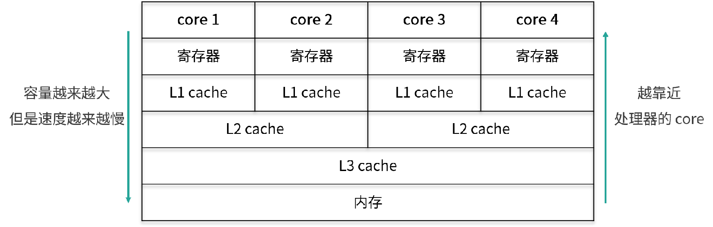
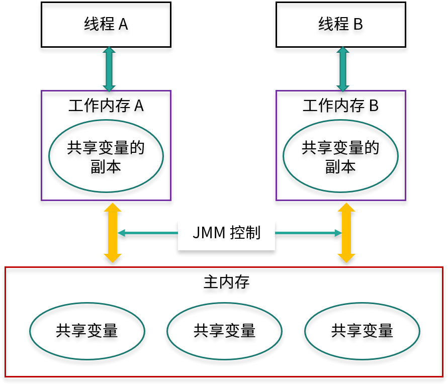

# 01 为何说只有 1 种实现线程的方法？

本质上就一种，构造一个 Thread 类

```java
//  继承 Thread 类
public class ExtendsThread extends Thread {
    @Override
    public void run() {
        System.out.println('用Thread类实现线程');
    }
}

//实现 Runnable 接口 (推荐)
public class RunnableThread implements Runnable {
    @Override
    public void run() {
        System.out.println('用实现Runnable接口实现线程');
    }
}
```

# 02 如何正确停止线程？为什么 volatile 标记位的停止方法是错误的？

对于 Java 而言，最正确的停止线程的方式是使用 interrupt。但 interrupt 仅仅起到通知被停止线程的作用。而对于被停止的线程而言，
它拥有完全的自主权，它既可以选择立即停止，也可以选择一段时间后停止，也可以选择压根不停止(防止未处理完出现数据完整性问题，让线程有时间首尾)。

如何用 interrupt 停止线程

```java
while (!Thread.currentThread().isInterrupted() && more work to do) {
    do more work
}
```

为什么 volatile 可能不生效？

生产者在执行 storage.put(num) 时发生阻塞，在它被叫醒之前是没有办法进入下一次循环判断 canceled 的值的，
所以在这种情况下用 volatile 是没有办法让生产者停下来的，相反如果用 interrupt 语句来中断，即使生产者处于阻塞状态，仍然能够感受到中断信号，并做响应处理。


# 03 线程是如何在 6 种状态之间转换的？

在 Java 中线程的生命周期中一共有 6 种状态。

- New（新创建）
- Runnable（可运行）
- Blocked（被阻塞）
- Waiting（等待）
- Timed Waiting（计时等待）
- Terminated（被终止）


# 04 waitnotifynotifyAll 方法的使用注意事项？

1.为什么 wait 方法必须在 synchronized 保护的同步代码中使用？

正是因为 wait 方法所在的 take 方法没有被 synchronized 保护，所以它的 while 判断和 wait 方法无法构成原子操作，那么此时整个程序就很容易出错。

2.为什么 wait/notify/notifyAll 被定义在 Object 类中，而 sleep 定义在 Thread 类中？

- 因为 Java 中每个对象都有一把称之为 monitor 监视器的锁，由于每个对象都可以上锁，这就要求在对象头中有一个用来保存锁信息的位置。这个锁是对象级别的，而非线程级别的，wait/notify/notifyAll 也都是锁级别的操作，它们的锁属于对象，所以把它们定义在 Object 类中是最合适，因为 Object 类是所有对象的父类。
- 因为如果把 wait/notify/notifyAll 方法定义在 Thread 类中，会带来很大的局限性，比如一个线程可能持有多把锁，以便实现相互配合的复杂逻辑，假设此时 wait 方法定义在 Thread 类中，如何实现让一个线程持有多把锁呢？又如何明确线程等待的是哪把锁呢？既然我们是让当前线程去等待某个对象的锁，自然应该通过操作对象来实现，而不是操作线程。

3.wait/notify 和 sleep 方法的异同？

- 它们都可以让线程阻塞。
- 它们都可以响应 interrupt 中断：在等待的过程中如果收到中断信号，都可以进行响应，并抛出 InterruptedException 异常。

但是它们也有很多的不同点：

- wait 方法必须在 synchronized 保护的代码中使用，而 sleep 方法并没有这个要求。
- 在同步代码中执行 sleep 方法时，并不会释放 monitor 锁，但执行 wait 方法时会主动释放 monitor 锁。
- sleep 方法中会要求必须定义一个时间，时间到期后会主动恢复，而对于没有参数的 wait 方法而言，意味着永久等待，直到被中断或被唤醒才能恢复，它并不会主动恢复。
- wait/notify 是 Object 类的方法，而 sleep 是 Thread 类的方法。


# 05 有哪几种实现生产者消费者模式的方法？

```java
public static void main(String[] args) {
	BlockingQueue<Object> queue = new ArrayBlockingQueue<>(10);

	Runnable producer = () -> {
		while (true) {
			queue.put(new Object());
		}

	};

	new Thread(producer).start();
	new Thread(producer).start();

	Runnable consumer = () -> {
		while (true) {
			queue.take();
		}
	};

	new Thread(consumer).start();
	new Thread(consumer).start();
}
```


# 06 一共有哪 3 类线程安全问题？

《Java Concurrency In Practice》的作者 Brian Goetz 对线程安全是这样理解的，当多个线程访问一个对象时，
如果不用考虑这些线程在运行时环境下的调度和交替执行问题，也不需要进行额外的同步，而调用这个对象的行为都可以获得正确的结果，那这个对象便是线程安全的。

实际开发中经常会遇到线程不安全的情况，那么一共有哪 3 种典型的线程安全问题呢？

1.运行结果错误；

比如多个线程同时对一个变量自增，结果不是期望值。

2.发布和初始化导致线程安全问题；

比如构造函数开了线程初始化。因为 students 这个成员变量是在构造函数中新建的线程中进行的初始化和赋值操作，而线程的启动需要一定的时间，
但是我们的 main 函数并没有进行等待就直接获取数据，导致 getStudents 获取的结果为 null，这就是在错误的时间或地点发布或初始化造成的线程安全问题。

3.活跃性问题。

第三种线程安全问题统称为活跃性问题，最典型的有三种，分别为死锁、活锁和饥饿。

- 死锁是指两个线程之间相互等待对方资源，但同时又互不相让，都想自己先执行
- 活锁与死锁非常相似，也是程序一直等不到结果，但对比于死锁，活锁是活的，什么意思呢？因为正在运行的线程并没有阻塞，它始终在运行中，却一直得不到结果。
- 饥饿是指线程需要某些资源时始终得不到，尤其是CPU 资源，就会导致线程一直不能运行而产生的问题


# 07 哪些场景需要额外注意线程安全问题？

1. 访问共享变量或资源
2. 依赖时序的操作。比如“检查与执行”并不是原子操作
3. 不同数据之间存在绑定关系。比如 ip 和端口操作，需要保证原子性
4. 对方没声明自己是线程安全的。比如 ArrayList


# 08 为什么多线程会带来性能问题？

- 调度开销。上下文切换；缓存失效
- 协作开销。为了保证线程安全，就有可能禁止编译器和 CPU 对其进行重排序等优化，也可能出于同步的目的，反复把线程工作内存的数据 flush 到主存中，
  然后再从主内存 refresh 到其他线程的工作内存中


# 09 使用线程池比手动创建线程好在哪里？

如果每个任务都创建一个线程会带来哪些问题：

1. 反复创建线程系统开销比较大，每个线程创建和销毁都需要时间，如果任务比较简单，那么就有可能导致创建和销毁线程消耗的资源比线程执行任务本身消耗的资源还要大。
2. 过多的线程会占用过多的内存等资源，还会带来过多的上下文切换，同时还会导致系统不稳定。

使用线程池比手动创建线程主要有三点好处。

1. 线程池可以解决线程生命周期的系统开销问题，同时还可以加快响应速度。因为线程池中的线程是可以复用的，我们只用少量的线程去执行大量的任务，这就大大减小了线程生命周期的开销。而且线程通常不是等接到任务后再临时创建，而是已经创建好时刻准备执行任务，这样就消除了线程创建所带来的延迟，提升了响应速度，增强了用户体验。
2. 线程池可以统筹内存和 CPU 的使用，避免资源使用不当。线程池会根据配置和任务数量灵活地控制线程数量，不够的时候就创建，太多的时候就回收，避免线程过多导致内存溢出，或线程太少导致 CPU 资源浪费，达到了一个完美的平衡。
3. 线程池可以统一管理资源。比如线程池可以统一管理任务队列和线程，可以统一开始或结束任务，比单个线程逐一处理任务要更方便、更易于管理，同时也有利于数据统计，比如我们可以很方便地统计出已经执行过的任务的数量。


# 10 线程池的各个参数的含义？


# 11 线程池有哪 4 种拒绝策略？

拒绝策略

- 第一种拒绝策略是 AbortPolicy，这种拒绝策略在拒绝任务时，会直接抛出一个类型为 RejectedExecutionException 的 RuntimeException，让你感知到任务被拒绝了，于是你便可以根据业务逻辑选择重试或者放弃提交等策略。
- 第二种拒绝策略是 DiscardPolicy，这种拒绝策略正如它的名字所描述的一样，当新任务被提交后直接被丢弃掉，也不会给你任何的通知，相对而言存在一定的风险，因为我们提交的时候根本不知道这个任务会被丢弃，可能造成数据丢失。
- 第三种拒绝策略是 DiscardOldestPolicy，如果线程池没被关闭且没有能力执行，则会丢弃任务队列中的头结点，通常是存活时间最长的任务，这种策略与第二种不同之处在于它丢弃的不是最新提交的，而是队列中存活时间最长的，这样就可以腾出空间给新提交的任务，但同理它也存在一定的数据丢失风险。
- 第四种拒绝策略是 CallerRunsPolicy，相对而言它就比较完善了，当有新任务提交后，如果线程池没被关闭且没有能力执行，则把这个任务交于提交任务的线程执行，也就是谁提交任务，谁就负责执行任务。这样做主要有两点好处。
  - 第一点新提交的任务不会被丢弃，这样也就不会造成业务损失。
  - 第二点好处是，由于谁提交任务谁就要负责执行任务，这样提交任务的线程就得负责执行任务，而执行任务又是比较耗时的，在这段期间，提交任务的线程被占用，也就不会再提交新的任务，减缓了任务提交的速度，相当于是一个负反馈。在此期间，线程池中的线程也可以充分利用这段时间来执行掉一部分任务，腾出一定的空间，相当于是给了线程池一定的缓冲期。


# 12 有哪 6 种常见的线程池？什么是 Java8 的 ForkJoinPool？

- FixedThreadPool: 它的核心线程数和最大线程数是一样的，所以可以把它看作是固定线程数的线程池
- CachedThreadPool: 可以称作可缓存线程池，它的特点在于线程数是几乎可以无限增加的（实际最大可以达到 Integer.MAX_VALUE)
- ScheduledThreadPool: 支持定时或周期性执行任务
- SingleThreadExecutor: 它会使用唯一的线程去执行任务，原理和 FixedThreadPool 是一样的，只不过这里线程只有一个，如果线程在执行任务的过程中发生异常，线程池也会重新创建一个线程来执行后续的任务。适合用于所有任务都需要按被提交的顺序依次执行的场景，
- SingleThreadScheduledExecutor: 它只是将 ScheduledThreadPool 的核心线程数设置为了 1。
- ForkJoinPool: 适合分裂和汇总任务；每个线程都有自己独立的任务队列。适合递归场景，树遍历、最优路径搜索等


# 13 线程池常用的阻塞队列有哪些？

线程池的内部结构主要由四部分组成，如图所示。

- 第一部分是线程池管理器，它主要负责管理线程池的创建、销毁、添加任务等管理操作，它是整个线程池的管家。
- 第二部分是工作线程，也就是图中的线程 t0~t9，这些线程勤勤恳恳地从任务队列中获取任务并执行。
- 第三部分是任务队列，作为一种缓冲机制，线程池会把当下没有处理的任务放入任务队列中，由于多线程同时从任务队列中获取任务是并发场景，此时就需要任务队列满足线程安全的要求，所以线程池中任务队列采用 BlockingQueue 来保障线程安全。
- 第四部分是任务，任务要求实现统一的接口，以便工作线程可以处理和执行。


# 14 为什么不应该自动创建线程池？

这几种自动创建的线程池都存在风险，相比较而言，我们自己手动创建会更好，因为我们可以更加明确线程池的运行规则，不仅可以选择适合自己的线程数量，更可以在必要的时候拒绝新任务的提交，避免资源耗尽的风险。


# 15 合适的线程数量是多少？CPU 核心数和线程数的关系？

CPU 密集型任务:

首先，我们来看 CPU 密集型任务，比如加密、解密、压缩、计算等一系列需要大量耗费 CPU 资源的任务。对于这样的任务最佳的线程数为 CPU 核心数的 1~2 倍


耗时 IO 型任务:

比如数据库、文件的读写，网络通信等任务，这种任务的特点是并不会特别消耗 CPU 资源，但是 IO 操作很耗时，总体会占用比较多的时间

《Java并发编程实战》的作者 Brain Goetz 推荐的计算方法：线程数 = CPU 核心数 *（1+平均等待时间/平均工作时间）

综上所述我们就可以得出一个结论：

- 线程的平均工作时间所占比例越高，就需要越少的线程；
- 线程的平均等待时间所占比例越高，就需要越多的线程；
- 针对不同的程序，进行对应的实际测试就可以得到最合适的选择。


# 16 如何根据实际需要，定制自己的线程池？

核心线程数、阻塞队列、线程工厂、拒绝策略


# 17 如何正确关闭线程池？shutdown 和 shutdownNow 的区别？

通常我们可以用 shutdown() 方法来关闭，这样可以让已提交的任务都执行完毕，但是如果情况紧急，那我们就可以用 shutdownNow 方法来加快线程池“终结”的速度。


# 18 线程池实现“线程复用”的原理？

实现线程复用的逻辑主要在一个不停循环的 while 循环体中。

1. 通过取 Worker 的 firstTask 或者通过 getTask 方法从 workQueue 中获取待执行的任务。
2. 直接调用 task 的 run 方法来执行具体的任务（而不是新建线程）。

通过取 Worker 的 firstTask 或者 getTask方法从 workQueue 中取出了新任务，并直接调用 Runnable 的 run 方法来执行任务，也就是如之前所说的，
每个线程都始终在一个大循环中，反复获取任务，然后执行任务，从而实现了线程的复用。


# 19 你知道哪几种锁？分别有什么特点？

根据分类标准我们把锁分为以下 7 大类别，分别是：

- 偏向锁/轻量级锁/重量级锁；
  - 这三种锁特指 synchronized 锁的状态，通过在对象头中的 mark word 来表明锁的状态。
  - 锁升级的路径：无锁→偏向锁→轻量级锁→重量级锁。
  - 偏向锁性能最好，可以避免执行 CAS 操作。而轻量级锁利用自旋和 CAS 避免了重量级锁带来的线程阻塞和唤醒，性能中等。重量级锁则会把获取不到锁的线程阻塞，性能最差。
- 可重入锁/非可重入锁； 可重入锁指的是线程当前已经持有这把锁了，能在不释放这把锁的情况下，再次获取这把锁。
- 共享锁/独占锁； 共享锁指的是我们同一把锁可以被多个线程同时获得，而独占锁指的就是，这把锁只能同时被一个线程获得(读写锁)
- 公平锁/非公平锁；公平锁的公平的含义在于如果线程现在拿不到这把锁，那么线程就都会进入等待，开始排队，在等待队列里等待时间长的线程会优先拿到这把锁
- 悲观锁/乐观锁；悲观锁的概念是在获取资源之前，必须先拿到锁，以便达到“独占”的状态，
- 自旋锁/非自旋锁； 自旋锁的理念是如果线程现在拿不到锁，并不直接陷入阻塞或者释放 CPU 资源，而是开始利用循环，不停地尝试
  获取锁，这个循环过程被形象地比喻为“自旋”。非自旋锁的理念就是没有自旋的过程，如果拿不到锁就直接放弃，或者进行其他的处理逻辑，例如去排队、陷入阻塞等。
- 可中断锁/不可中断锁。不可中断：一旦线程申请了锁，就没有回头路了，只能等到拿到锁以后才能进行其他的逻辑处理


# 20 悲观锁和乐观锁的本质是什么？

悲观锁: synchronized 关键字和 Lock 相关类

悲观锁比较悲观，它认为如果不锁住这个资源，别的线程就会来争抢，就会造成数据结果错误，所以悲观锁为了确保结果的正确性，会在每次获取并修改数据时，都把数据锁住，让其他线程无法访问该数据，这样就可以确保数据内容万无一失。

乐观锁(一般 CAS 实现, AtomicInteger):

乐观锁比较乐观，认为自己在操作资源的时候不会有其他线程来干扰，所以并不会锁住被操作对象，不会不让别的线程来接触它，同时，为了确保数据正确性，在更新之前，会去对比在我修改数据期间，数据有没有被其他线程修改过：如果没被修改过，就说明真的只有我自己在操作，那我就可以正常的修改数据；如果发现数据和我一开始拿到的不一样了，说明其他线程在这段时间内修改过数据，那说明我迟了一步，所以我会放弃这次修改，并选择报错、重试等策略。

两种锁各自的使用场景:

- 悲观锁适合用于并发写入多、临界区代码复杂、竞争激烈等场景，这种场景下悲观锁可以避免大量的无用的反复尝试等消耗。
- 乐观锁适用于大部分是读取，少部分是修改的场景，也适合虽然读写都很多，但是并发并不激烈的场景。在这些场景下，乐观锁不加锁的特点能让性能大幅提高。


# 21 如何看到 synchronized 背后的“monitor 锁”？

最简单的同步方式就是利用 synchronized 关键字来修饰代码块或者修饰一个方法，那么这部分被保护的代码，在同一时刻就最多只有一个线程可以运行，
而 synchronized 的背后正是利用 monitor 锁实现的。

本课时我们讲解了获取和释放 monitor 的时机，以及被 synchronized 修饰的等价代码，然后我们还利用 javac 和 javap 命令查看了 synchronized 代码块以及 synchronized 方法所对应的的反汇编指令，其中同步代码块是利用 monitorenter 和 monitorexit 指令实现的，而同步方法则是利用 flags 实现的。


# 22 synchronized 和 Lock 孰优孰劣，如何选择？

相同点：

- synchronized 和 Lock 都是用来保护资源线程安全的。
- synchronized 和 ReentrantLock 都拥有可重入的特点。

不同点：

- synchronized 关键字可以加在方法上，不需要指定锁对象（此时的锁对象为 this），也可以新建一个同步代码块并且自定义 monitor 锁对象；而 Lock 接口必须显示用 Lock 锁对象开始加锁 lock() 和解锁 unlock()，并且一般会在 finally 块中确保用 unlock() 来解锁，以防发生死锁。
- synchronized 锁只能同时被一个线程拥有，但是 Lock 锁没有这个限制
- 原理区别 synchronized 是内置锁，由 JVM 实现获取锁和释放锁的原理，还分为偏向锁、轻量级锁、重量级锁。ReentrantLock 内部AQS 实现

如何选择：

- 如果能不用最好既不使用 Lock 也不使用 synchronized。因为在许多情况下你可以使用 java.util.concurrent 包中的机制，它会为你
  处理所有的加锁和解锁操作，也就是推荐优先使用工具类来加解锁。
- 如果 synchronized 关键字适合你的程序， 那么请尽量使用它，这样可以减少编写代码的数量，减少出错的概率。因为一旦忘记在 finally 里 unlock，代码可能会出很大的问题，而使用 synchronized 更安全。
- 如果特别需要 Lock 的特殊功能，比如尝试获取锁、可中断、超时功能等，才使用 Lock。


# 23 Lock 有哪几个常用方法？分别有什么用？

- lock() 是最基础的获取锁的方法。在线程获取锁时如果锁已被其他线程获取，则进行等待，是最初级的获取锁的方法。
- tryLock() 用来尝试获取锁，如果当前锁没有被其他线程占用，则获取成功，返回 true，否则返回 false，代表获取锁失败(可以避免死锁)
- tryLock(long time, TimeUnit unit)，这个方法和 tryLock() 很类似，区别在于 tryLock(long time, TimeUnit unit) 方法会有一个超时时间，在拿不到锁时会等待一定的时间，如果在时间期限结束后，还获取不到锁，就会返回 false；如果一开始就获取锁或者等待期间内获取到锁，则返回 true。
- lockInterruptibly() 除非当前线程在获取锁期间被中断，否则便会一直尝试获取直到获取到为止。
- unlock() : 对于 ReentrantLock 而言，执行 unlock() 的时候，内部会把锁的“被持有计数器”减 1，直到减到 0 就代表当前这把锁已经完全释放


# 24 讲一讲公平锁和非公平锁，为什么要“非公平”？

公平锁指的是按照线程请求的顺序，来分配锁；而非公平锁指的是不完全按照请求的顺序，在一定情况下，可以允许插队

`new ReentrantLock(false) 参数设置公平/非公平锁， 参数 fair为 true 表示公平锁`

- 公平锁：
  - 优势：每个线程等待一段时间之后总有执行的机会
  - 劣势：更慢，吞吐更小

- 非公平锁
  - 优势：更快，吞吐量更大
  - 劣势：可能产生线程饥饿

公平锁与非公平锁的 lock() 方法唯一的区别就在于公平锁在获取锁时多了一个限制条件：hasQueuedPredecessors() 为 false，
这个方法就是判断在等待队列中是否已经有线程在排队了。这也就是公平锁和非公平锁的核心区别，如果是公平锁，那么一旦已经有线程在排队了，当前线程就不再尝试获取锁；对于非公平锁而言，无论是否已经有线程在排队，都会尝试获取一下锁，获取不到的话，再去排队。

tryLock 可以插队，本身实现就是非公平的。


# 25 读写锁 ReadWriteLock 获取锁有哪些规则？

ReadWriteLock (适合读多写少场景)我们在使用读写锁时遵守下面的获取规则：

- 如果有一个线程已经占用了读锁，则此时其他线程如果要申请读锁，可以申请成功。
- 如果有一个线程已经占用了读锁，则此时其他线程如果要申请写锁，则申请写锁的线程会一直等待释放读锁，因为读写不能同时操作。
- 如果有一个线程已经占用了写锁，则此时其他线程如果申请写锁或者读锁，都必须等待之前的线程释放写锁，同样也因为读写不能同时，并且两个线程不应该同时写。

所以我们用一句话总结：要么是一个或多个线程同时有读锁，要么是一个线程有写锁，但是两者不会同时出现。
也可以总结为：读读共享、其他都互斥（写写互斥、读写互斥、写读互斥）。


# 26 读锁应该插队吗？什么是读写锁的升降级？

即便是非公平锁，只要等待队列的头结点是尝试获取写锁的线程，那么读锁依然是不能插队的，目的是避免“饥饿”。

比如如果一直有线程要获取读锁，就会导致写锁饥饿得不到执行。

对于 ReentrantReadWriteLock 而言。

- 插队策略: 
  - 公平策略下，只要队列里有线程已经在排队，就不允许插队。
  - 非公平策略下：
    - 如果允许读锁插队，那么由于读锁可以同时被多个线程持有，所以可能造成源源不断的后面的线程一直插队成功，导致读锁一直不能完全释放，从而导致写锁一直等待，为了防止“饥饿”，在等待队列的头结点是尝试获取写锁的线程的时候，不允许许读锁插队。
    - 写锁可以随时插队，因为写锁并不容易插队成功，写锁只有在当前没有任何其他线程持有读锁和写锁的时候，才能插队成功，同时写锁一旦插队失败就会进入等待队列，所以很难造成“饥饿”的情况，允许写锁插队是为了提高效率。

- 升降级策略：只能从写锁降级为读锁，不能从读锁升级为写锁。


# 27 什么是自旋锁？自旋的好处和后果是什么呢？

首先，我们了解什么叫自旋？“自旋”可以理解为“自我旋转”，这里的“旋转”指“循环”，比如 while 循环或者 for 循环。“自旋”就是自己在这里不停地循环，直到目标达成。
而不像普通的锁那样，如果获取不到锁就进入阻塞。

自旋锁，它并不会放弃 CPU 时间片，而是通过自旋等待锁的释放，也就是说，它会不停地再次地尝试获取锁(do while)，如果失败就再次尝试，直到成功为止。

java.util.concurrent 里面的原子类基本都是自旋锁的实现。

- 优点：用一句话总结自旋锁的好处，那就是自旋锁用循环去不停地尝试获取锁，让线程始终处于 Runnable 状态，节省了线程状态切换带来的开销。
- 缺点：它最大的缺点就在于虽然避免了线程切换的开销，但是它在避免线程切换开销的同时也带来了新的开销，因为它需要不停得去尝试获取锁。如果这把锁一直不能被释放，那么这种尝试只是无用的尝试，会白白浪费处理器资源。
  也就是说，虽然一开始自旋锁的开销低于线程切换，但是随着时间的增加，这种开销也是水涨船高，后期甚至会超过线程切换的开销，得不偿失。
- 适用场景: 自旋锁适用于并发度不是特别高的场景，以及临界区比较短小的情况，这样我们可以利用避免线程切换来提高效率。


# 28 JVM 对锁进行了哪些优化？

- 自适应的自旋锁
- 锁消除。栈上数据只有本线程可以访问，本来就是线程安全的
- 锁粗化。合并 synchronized 块(仅适合非循环场景)
- 偏向锁/轻量级锁/重量级锁


# 29 HashMap 为什么是线程不安全的？

- put 操作有 modCount++ 非原子操作
- 扩容期间取出来的值不准确
- put 碰撞导致数据丢失
- 可见性问题无法保证。一个线程操作这个容器时，其他线程能感知到本次操作
- 死循环造成 cpu 100%

推荐用 ConcurrenthashMap


# 30 ConcurrentHashMap 在 Java7 和 8 有何不同？
图中的节点有三种类型。

- 第一种是最简单的，空着的位置代表当前还没有元素来填充。
- 第二种就是和 HashMap 非常类似的拉链法结构，在每一个槽中会首先填入第一个节点，但是后续如果计算出相同的 Hash 值，就用链表的形式往后进行延伸。
- 第三种结构就是红黑树结构，这是 Java 7 的 ConcurrentHashMap 中所没有的结构，在此之前我们可能也很少接触这样的数据结构。

Java 7 采用 Segment(16个) 分段锁来实现，而 Java 8 中的 ConcurrentHashMap 使用数组 + 链表 + 红黑树，在这一点上它们的差别非常大。


# 31 为什么 Map 桶中超过 8 个才转为红黑树？

当链表长度大于或等于阈值（默认为 8）的时候，如果同时还满足容量大于或等于 MIN_TREEIFY_CAPACITY（默认为 64）的要求，就会把链表转换为红黑树。
同样，后续如果由于删除或者其他原因调整了大小，当红黑树的节点小于或等于 6 个以后，又会恢复为链表形态。


# 32 同样是线程安全，ConcurrentHashMap 和 Hashtable 的区别

- 实现方式：Hashtable 通过 synchronized。ConcurrentHashMap 是利用了 CAS + synchronized + Node 节点的方式，这和 Hashtable 的完全利用 synchronized 的方式有很大的不同。
- 性能：ConcurrentHashMap 并发性能高
- 修改：Hashtable 不允许迭代器期间修改内容，抛异常。 ConcurrentHashMap不会


# 33 CopyOnWriteArrayList 有什么特点？

- 读写规则：可以写入的时候同时读取
- 缺点：写操作的时候复制占用双倍内存，消耗 cpu 资源。修改时候对其他线程不可见


# 34 什么是阻塞队列？

`public interface BlockingQueue<E> extends Queue<E>{...}`

BlockingQueue 线程安全的。

- take方法。获取并且移除队头元素，如果无数据，则阻塞，一直到队列有数据，有数据后会立即结束阻塞并获取数据
- put。如果队列满了会阻塞直到有空闲


# 35 阻塞队列包含哪些常用的方法？add、offer、put 等方法的区别？

这三组方法由于功能很类似，所以比较容易混淆。它们的区别仅在于特殊情况：当队列满了无法添加元素，或者是队列空了无法移除元素时，不同组的方法对于这种特殊情况会有不同的处理方式：

- 抛出异常：add、remove、element
- 返回结果但不抛出异常：offer、poll、peek
- 阻塞：put、take


# 36 有哪几种常见的阻塞队列？

- ArrayBlockingQueue: 有界队列
- LinkedBlockingQueue: 内部链表实现（无界队列，Integer.MAX_VALUE)
- SynchronousQueue: 容量为 0.因为 SynchronousQueue 不需要去持有元素，它所做的就是直接传递（direct handoff）。由于每当需要传递的时候，SynchronousQueue 会把元素直接从生产者传给消费者，在此期间并不需要做存储，所以如果运用得当，它的效率是很高的。
- PriorityBlockingQueue: 通过实现 compareTo() 定义优先级
- DealyQueue: 延时功能


# 37 阻塞和非阻塞队列的并发安全原理是什么

ArrayBlockingQueue 实现并发同步的原理就是利用 ReentrantLock 和它的两个 Condition，读操作和写操作都需要先获取到 ReentrantLock 独占锁才能进行下一步操作。
进行读操作时如果队列为空，线程就会进入到读线程专属的 notEmpty 的 Condition 的队列中去排队，等待写线程写入新的元素；
同理，如果队列已满，这个时候写操作的线程会进入到写线程专属的 notFull 队列中去排队，等待读线程将队列元素移除并腾出空间。

非阻塞队列 ConcurrentLinkedQueue。顾名思义，ConcurrentLinkedQueue 是使用链表作为其数据结构的。
可以看出，非阻塞队列 ConcurrentLinkedQueue 使用 CAS 非阻塞算法 + 不停重试，来实现线程安全，适合用在不需要阻塞功能，且并发不是特别剧烈的场景。


# 38 如何选择适合自己的阻塞队列？

- FixedThreadPool（SingleThreadExecutor 同理）选取的是 LinkedBlockingQueue(链表长度默认可以无限延长)
- CachedThreadPool 选取的是 SynchronousQueue (直接把任务提交给线程)
- ScheduledThreadPool（SingleThreadScheduledExecutor同理）选取的是延迟队列

选取维度：

- 功能：是否排序、延迟执行等
- 容量 
- 能否扩容
- 内存结构（数组还是链表）
- 性能


# 39 原子类是如何利用 CAS 保证线程安全的？

原子性意味着“一组操作要么全都操作成功，要么全都失败，不能只操作成功其中的一部分”。而 java.util.concurrent.atomic 下的类，就是具有原子性的类，
可以原子性地执行添加、递增、递减等操作。

不过原子类相比于锁，有一定的优势：

- 粒度更细：原子变量可以把竞争范围缩小到变量级别，通常情况下，锁的粒度都要大于原子变量的粒度。
- 效率更高：除了高度竞争的情况之外，使用原子类的效率通常会比使用同步互斥锁的效率更高，因为原子类底层利用了 CAS 操作，不会阻塞线程。

包含 6 类:

- Atomic 基本类型原子类: 分别是 AtomicInteger、AtomicLong 和 AtomicBoolean。
- Array 数组类型原子类
- Atomic Reference 引用类型原子类 （让一个对象保持原子性）
- Atomic FieldUpdater 原子更新器
- Adder 加法器

Unsafe 其实是 CAS 的核心类。由于 Java 无法直接访问底层操作系统，而是需要通过 native 方法来实现。不过尽管如此，JVM 还是留了一个后门，
在 JDK 中有一个 Unsafe 类，它提供了硬件级别的原子操作，我们可以利用它直接操作内存数据。

Unsafe 的 getAndAddInt 方法是通过循环 + CAS 的方式来实现的，在此过程中，它会通过 compareAndSwapInt 方法来尝试更新 value 的值，如果更新失败就重新获取，然后再次尝试更新，直到更新成功。


# 40 AtomicInteger 在高并发下性能不好，如何解决？为什么？

在低竞争的情况下，AtomicLong 和 LongAdder 这两个类具有相似的特征，吞吐量也是相似的，因为竞争不高。但是在竞争激烈的情况下，LongAdder 的预期吞吐量要高得多，
经过试验，LongAdder 的吞吐量大约是 AtomicLong 的十倍，不过凡事总要付出代价，LongAdder 在保证高效的同时，也需要消耗更多的空间。


# 41 原子类和 volatile 有什么异同？

在变量的前面加上 volatile 关键字修饰，只要我们加上这个关键字，那么每一次变量被修改的时候，其他线程对此都可见，
这样一旦线程 1 改变了这个值，那么线程 2 就可以立刻看到，因此就可以退出 while 循环了。


volatile 和原子类的使用场景是不一样的，如果我们有一个可见性问题，那么可以使用 volatile 关键字，但如果我们的问题是一个组合操作，需要用同步来解决原子性问题的话，那么可以使用原子变量，而不能使用 volatile 关键字。


# 42 AtomicInteger 和 synchronized 的异同点？

- 原理不同。 synchronized 内后是 monitor锁。 原子类是 CAS操作
- 使用范围不同。原子类比较局限
- 粒度：原子变量粒度小
- 性能区别。synchronized 是一种悲观锁， 原子类是乐观锁。在竞争非常激烈的情况下，推荐使用 synchronized；而在竞争不激烈的情况下，使用原子类会得到更好的效果。


# 43 Java 8 中 Adder 和 Accumulator 有什么区别？

接下来我们说一下 LongAccumulator 的适用场景。

- 第一点需要满足的条件，就是需要大量的计算，并且当需要并行计算的时候，我们可以考虑使用 LongAccumulator。
- 第二点需要满足的要求，就是计算的执行顺序并不关键，执行先后不影响结果（比如加法乘法满足交换律）


# 44 ThreadLocal 适合用在哪些实际生产的场景中？

在通常的业务开发中，ThreadLocal 有两种典型的使用场景。

- 场景1，ThreadLocal 用作保存每个线程独享的对象，为每个线程都创建一个副本，这样每个线程都可以修改自己所拥有的副本, 而不会影响其他线程的副本，确保了线程安全。
- 场景2，ThreadLocal 用作每个线程内需要独立保存信息，以便供其他方法更方便地获取该信息的场景。每个线程获取到的信息可能都是不一样的，前面执行的方法保存了信息后，后续方法可以通过 ThreadLocal 直接获取到，避免了传参，类似于全局变量的概念。


# 45 ThreadLocal 是用来解决共享资源的多线程访问的问题吗？
不是。每个线程中的资源不共享。

它可以在 initialValue 中 new 出自己线程独享的资源，而多个线程之间，它们所访问的对象本身是不共享的，自然就不存在任何并发问题。这是 ThreadLocal 解决并发问题的最主要思路。

如果我们把放到 ThreadLocal 中的资源用 static 修饰，让它变成一个共享资源的话，那么即便使用了 ThreadLocal，同样也会有线程安全问题。

- ThreadLocal 是通过让每个线程独享自己的副本，避免了资源的竞争。
- synchronized 主要用于临界资源的分配，在同一时刻限制最多只有一个线程能访问该资源。


# 46 多个 ThreadLocal 在 Thread 中的 threadlocals 里是怎么存储的？

一个 Thread 里面只有一个ThreadLocalMap ，而在一个 ThreadLocalMap 里面却可以有很多的 ThreadLocal，每一个 ThreadLocal 都对应一个 value。

但是 ThreadLocalMap 解决 hash 冲突的方式是不一样的，它采用的是线性探测法。如果发生冲突，并不会用链表的形式往下链，而是会继续寻找下一个空的格子。这是 ThreadLocalMap 和 HashMap 在处理冲突时不一样的点。


# 47 内存泄漏——为何每次用完 ThreadLocal 都要调用 remove()？

内存泄漏指的是，当某一个对象不再有用的时候，占用的内存却不能被回收，这就叫作内存泄漏。

Entry 的 key 要使用弱引用。在使用完了 ThreadLocal 之后，我们应该手动去调用它的 remove 方法，目的是防止内存泄漏的发生。

(防止 key 和 value 的泄露)


# 48 Callable 和 Runnable 的不同？

现有的 Runnable 缺陷：

- 不能返回一个返回值
- 不能抛出 checked Exception

```
public interface Callable<V> {
    V call() throws Exception;
}
```

可以看出它也是一个 interface，并且它的 call 方法中已经声明了 throws Exception，前面还有一个 V 泛型的返回值，这就和之前的 Runnable 有很大的区别。
实现 Callable 接口，就要实现 call 方法，这个方法的返回值是泛型 V，如果把 call 中计算得到的结果放到这个对象中，就可以利用 call 方法的返回值来获得子线程的执行结果了。

最后总结一下 Callable 和 Runnable 的不同之处：

- 方法名，Callable 规定的执行方法是 call()，而 Runnable 规定的执行方法是 run()；
- 返回值，Callable 的任务执行后有返回值，而 Runnable 的任务执行后是没有返回值的；
- 抛出异常，call() 方法可抛出异常，而 run() 方法是不能抛出受检查异常的；
- 和 Callable 配合的有一个 Future 类，通过 Future 可以了解任务执行情况，或者取消任务的执行，还可获取任务执行的结果，这些功能都是 Runnable 做不到的，Callable 的功能要比 Runnable 强大。

# 49 Future 的主要功能是什么？

Future 的作用:

Future 最主要的作用是，比如当做一定运算的时候，运算过程可能比较耗时，如果一直等待方法返回比较耗时。
我们可以把运算的过程放到子线程去执行，再通过 Future 去控制子线程执行的计算过程，最后获取到计算结果。这样一来就可以把整个程序的运行效率提高，是一种异步的思想。

- get() 获取结果: 任务执行完毕、任务还没有结果、任务抛异常、任务取消、任务想超时
- isDone: 判断是否执行完毕(不代表成功执行了，只代表执行完毕)
- cancel: 取消任务执行
- isCancelled:  是否被取消


# 50 使用 Future 有哪些注意点？Future 产生新的线程了吗？

1. 当 for 循环批量获取 Future 的结果时容易 block，get 方法调用时应使用 timeout 限制
2. Future 的生命周期不能后退，一旦完成了任务，它就永久停在了“已完成”的状态，不能从头再来，也不能让一个已经完成计算的 Future 再次重新执行任务。

在把 Callable 提交到线程池后，真正执行 Callable 的其实还是线程池中的线程，而线程池中的线程是由 ThreadFactory 产生的，这里产生的新线程与 Callable、Future 都没有关系，所以 Future 并没有产生新的线程。


# 51 如何利用 CompletableFuture 实现“旅游平台”问题？

有超时的并行获取。

- 线程池实现 
- CountDownLatch
- CompletableFuture


# 52 信号量能被 FixedThreadPool 替代吗？

### Semaphore 信号量

信号量的一个最主要的作用就是，来控制那些需要限制并发访问量的资源。控制并发执行线程数

- Semaphore(int permits, boolean fair)
- acquire
- release


# 53 CountDownLatch 是如何安排线程执行顺序的？

CountDownLatch 的核心思想，等到一个设定的数值达到之后，才能出发

- 用法一：一个线程等待其他多个线程都执行完毕，再继续自己的工作
- 用法二：多个线程等待某一个线程的信号，同时开始执行


CountDownLatch 类在创建实例的时候，需要在构造函数中传入倒数次数，然后由需要等待的线程去调用 await 方法开始等待，
而每一次其他线程调用了 countDown 方法之后，计数便会减 1，直到减为 0 时，之前等待的线程便会继续运行


# 54 CyclicBarrier 和 CountdownLatch 有什么异同？

CyclicBarrier 可以构造出一个集结点，当某一个线程执行 await() 的时候，它就会到这个集结点开始等待，等待这个栅栏被撤销。
直到预定数量的线程都到了这个集结点之后，这个栅栏就会被撤销，之前等待的线程就在此刻统一出发，继续去执行剩下的任务。

相同点：都能阻塞一个或一组线程，直到某个预设的条件达成发生，再统一出发。

但是它们也有很多不同点，具体如下。

- 作用对象不同：CyclicBarrier 要等固定数量的线程都到达了栅栏位置才能继续执行，而 CountDownLatch 只需等待数字倒数到 0，也就是说 CountDownLatch 作用于事件，但 CyclicBarrier 作用于线程；CountDownLatch 是在调用了 countDown 方法之后把数字倒数减 1，而 CyclicBarrier 是在某线程开始等待后把计数减 1。
- 可重用性不同：CountDownLatch 在倒数到 0 并且触发门闩打开后，就不能再次使用了，除非新建一个新的实例；而 CyclicBarrier 可以重复使用，在刚才的代码中也可以看出，每 3 个同学
  到了之后都能出发，并不需要重新新建实例。CyclicBarrier 还可以随时调用 reset 方法进行重置，如果重置时有线程已经调用了 await 方法并开始等待，那么这些线程则会抛出 BrokenBarrierException 异常。
- 执行动作不同：CyclicBarrier 有执行动作 barrierAction，而 CountDownLatch 没这个功能。


# 55 Condition、object.wait() 和 notify() 的关系？

Condition 作用： 

- 线程1：我们就可以执行 Condition 的 await 方法，一旦执行了该方法，这个线程就会进入 WAITING 状态。
- 线程2：signal 方法或 signalAll 方法，会唤醒 1 个或所有的线程。线程 1 在此时就会被唤醒，然后它的线程状态又会回到 Runnable 可执行状态。

调用 await 的时候必须持有锁，否则会抛出异常，这一点和 Object 的 wait 一样。


# 56 讲一讲什么是 Java 内存模型？

- JVM 内存结构和 Java 虚拟机的运行时区域有关；
- Java 内存模型和 Java 的并发编程有关。

在《Java 虚拟机规范（Java SE 8）》中描述了 JVM 运行时内存区域结构可分为以下 6 个区。

- 堆区（Heap）:堆是存储类实例和数组的，通常是内存中最大的一块。实例很好理解，比如 new Object() 就会生成一个实例；而数组也是保存在堆上面的，因为在 Java 中，数组也是对象。
- 虚拟机栈（Java Virtual Machine Stacks）它保存局部变量和部分结果，并在方法调用和返回中起作用。
- 方法区（Method Area）: 它存储每个类的结构，例如运行时的常量池、字段和方法数据，以及方法和构造函数的代码，包括用于类初始化以及接口初始化的特殊方法。
- 本地方法栈（Native Method Stacks）：与虚拟机栈基本类似，区别在于虚拟机栈为虚拟机执行的 Java 方法服务，而本地方法栈则是为 Native 方法服务。
- 程序计数器（The PC Register）：是最小的一块内存区域，它的作用通常是保存当前正在执行的 JVM 指令地址。
- 运行时常量池（Run-Time Constant Pool）：是方法区的一部分，包含多种常量，范围从编译时已知的数字到必须在运行时解析的方法和字段引用。


JMM（Java Memory Model，Java 内存模型）

Java 非常需要一个标准，来让 Java 开发者、编译器工程师和 JVM 工程师能够达成一致。达成一致后，我们就可以很清楚的知道什么样的代码最终可以达到什么样的运行效果，
让多线程运行结果可以预期，这个标准就是 JMM，这就是需要 JMM 的原因。

JMM 与处理器、缓存、并发、编译器有关。它解决了 CPU 多级缓存、处理器优化、指令重排等导致的结果不可预期的问题。

JMM 里最重要 3 点内容，分别是：重排序、原子性、内存可见性。这三个部分的内容，后面我们会详细展开。


# 57 什么是指令重排序？为什么要重排序？

什么是重排序:

假设我们写了一个 Java 程序，包含一系列的语句，我们会默认期望这些语句的实际运行顺序和写的代码顺序一致。
但实际上，编译器、JVM 或者 CPU 都有可能出于优化等目的，对于实际指令执行的顺序进行调整，这就是重排序。
重排序的好处是可以提升处理速度。

重排序的 3 种情况: 

1. 编译器优化(JVM, JIT 等).需要保证重排序后，不改变单线程内的语义
2. CPU 重排序
3. 内存的“重排序”。由于内存有缓存的存在，在 JMM 里表现为主存和本地内存，而主存和本地内存的内容可能不一致，所以这也会导致程序表现出乱序的行为。


# 58 Java 中的原子操作有哪些注意事项？

什么是原子性和原子操作

在编程中，具备原子性的操作被称为原子操作。原子操作是指一系列的操作，要么全部发生，要么全部不发生，不会出现执行一半就终止的情况。
而具有原子性的原子操作，天然具备线程安全的特性。

Java 中的以下几种操作是具备原子性的，属于原子操作：

- 除了 long 和 double 之外的基本类型（int、byte、boolean、short、char、float）的读/写操作，都天然的具备原子性；long和double拆成了两个 32 位操作所以不具备原子性
- 所有引用 reference 的读/写操作；
- 加了 volatile 后，所有变量的读/写操作（包含 long 和 double）。这也就意味着 long 和 double 加了 volatile 关键字之后，对它们的读写操作同样具备原子性；
- 在 java.concurrent.Atomic 包中的一部分类的一部分方法是具备原子性的，比如 AtomicInteger 的 incrementAndGet 方法。

原子操作 + 原子操作 != 原子操作


# 59 什么是“内存可见性”问题？

a 的值已经被第 1 个线程修改了，但是其他线程却看不到，由于 a 的最新值却没能及时同步过来，所以才会打印出 a 的旧值

除了 volatile 关键字可以让变量保证可见性外，synchronized、Lock、并发集合等一系列工具都可以在一定程度上保证可见性

加了 volatile 关键字之后，只要第 1 个线程修改完了 x 的值，那么当第 2 个线程想读取 x 的时候，它一定可以读取到 x 的最新的值，而不可能读取到旧值。

synchronized 不仅保证了原子性，还保证了可见性

synchronized 不仅保证了临界区内最多同时只有一个线程执行操作，同时还保证了在前一个线程释放锁之后，之前所做的所有修改，都能被获得同一个锁的下一个线程所看到，也就是能读取到最新的值。


# 60 主内存和工作内存的关系？



线程间对于共享变量的可见性问题，并不是直接由多核引起的，而是由我们刚才讲到的这些 L3 缓存、L2 缓存、L1 缓存，也就是多级缓存引起的：
每个核心在获取数据时，都会将数据从内存一层层往上读取，同样，后续对于数据的修改也是先写入到自己的 L1 缓存中，然后等待时机再逐层往下同步，直到最终刷回内存。



Java 作为高级语言，屏蔽了 L1 缓存、L2 缓存、L3 缓存，也就是多层缓存的这些底层细节，用 JMM 定义了一套读写数据的规范。

JMM 有以下规定：

1. 所有的变量都存储在主内存中，同时每个线程拥有自己独立的工作内存，而工作内存中的变量的内容是主内存中该变量的拷贝；
2. 线程不能直接读 / 写主内存中的变量，但可以操作自己工作内存中的变量，然后再同步到主内存中，这样，其他线程就可以看到本次修改；
3. 主内存是由多个线程所共享的，但线程间不共享各自的工作内存，如果线程间需要通信，则必须借助主内存中转来完成。


# 61 什么是 happens-before 规则？

什么是 happens-before 关系

Happens-before 关系是用来描述和可见性相关问题的：如果第一个操作 happens-before 第二个操作（也可以描述为，第一个操作和第二个操作之间满足 happens-before 关系），
那么我们就说第一个操作对于第二个操作一定是可见的，也就是第二个操作在执行时就一定能保证看见第一个操作执行的结果。

Happens-before 关系的规则有哪些？

如果分别有操作 x 和操作 y，用 hb(x, y) 来表示 x happens-before y。

1. 单线程规则： 在一个单独的线程中，按照程序代码的顺序，先执行的操作 happen-before 后执行的操作。也就是说，
如果操作 x 和操作 y 是同一个线程内的两个操作，并且在代码里 x 先于 y 出现，那么有 hb(x, y)，

2. 锁操作规则（synchronized 和 Lock 接口等）： 如果操作 A 是解锁，而操作 B 是对同一个锁的加锁，那么 hb(A, B) 。
3. volatile 变量规则： 对一个 volatile 变量的写操作 happen-before 后面对该变量的读操作。
4. 线程启动规则： Thread 对象的 start 方法 happen-before 此线程 run 方法中的每一个操作。
5. 线程 join 规则。线程 B 的 run 方法里面的操作 happens-before 线程 A 的 join 之后的语句
6. 中断规则： 对线程 interrupt 方法的调用 happens-before 检测该线程的中断事件。
7. 并发工具类的规则：
  - 线程安全的并发容器（如 HashTable）在 get 某个值时一定能看到在此之前发生的 put 等存入操作的结果。也就是说，线程安全的并发容器的存入操作 happens-before 读取操作。
  - 信号量（Semaphore）它会释放许可证，也会获取许可证。这里的释放许可证的操作 happens-before 获取许可证的操作，也就是说，如果在获取许可证之前有释放许可证的操作，那么在获取时一定可以看到。
  - Future：Future 有一个 get 方法，可以用来获取任务的结果。那么，当 Future 的 get 方法得到结果的时候，一定可以看到之前任务中所有操作的结果，也就是说 Future 任务中的所有操作 happens-before Future 的 get 操作。
  - 线程池：要想利用线程池，就需要往里面提交任务（Runnable 或者 Callable），这里面也有一个 happens-before 关系的规则，那就是提交任务的操作 happens-before 任务的执行。


# 62 volatile 的作用是什么？与 synchronized 有什么异同？

volatile，它是 Java 中的一个关键字，是一种同步机制。当某个变量是共享变量，且这个变量是被 volatile 修饰的，那么在修改了这个变量的值之后，再读取该变量的值时，
可以保证获取到的是修改后的最新的值，而不是过期的值。

不适合的场景：

1. volatile 不适合运用于需要保证原子性的场景，比如更新的时候需要依赖原来的值，而最典型的就是 a++ 的场景

适合的场景：

1. 布尔标记位(例如 volatile boolean flag)

如果某个共享变量自始至终只是被各个线程所赋值或读取，而没有其他的操作（比如读取并在此基础上进行修改这样的复合操作）的话，
那么我们就可以使用 volatile 来代替 synchronized 或者代替原子类，因为赋值操作自身是具有原子性的，volatile 同时又保证了可见性，这就足以保证线程安全了。

2. 作为触发器，保证其他变量的可见性

总结一下 volatile 的作用，它一共有两层作用。

第一层的作用是保证可见性。Happens-before 关系中对于 volatile 是这样描述的：对一个 volatile 变量的写操作 happen-before 后面对该变量的读操作。

这就代表了如果变量被 volatile 修饰，那么每次修改之后，接下来在读取这个变量的时候一定能读取到该变量最新的值。

第二层的作用就是禁止重排序。先介绍一下 as-if-serial语义：不管怎么重排序，（单线程）程序的执行结果不会改变。在满足 as-if-serial 语义的前提下，由于编译器或 CPU 的优化，代码的实际执行顺序可能与我们编写的顺序是不同的，这在单线程的情况下是没问题的，但是一旦引入多线程，这种乱序就可能会导致严重的线程安全问题。用了 volatile 关键字就可以在一定程度上禁止这种重排序。


volatile 和 synchronized 的关系：

- 相似性：volatile 可以看作是一个轻量版的 synchronized，比如一个共享变量如果自始至终只被各个线程赋值和读取，而没有其他操作的话，那么就可以用 volatile 来代替 synchronized 或者代替原子变量，足以保证线程安全。实际上，对 volatile 字段的每次读取或写入都类似于“半同步”——读取 volatile 与获取 synchronized 锁有相同的内存语义，而写入 volatile 与释放 synchronized 锁具有相同的语义。
- 不可代替：但是在更多的情况下，volatile 是不能代替 synchronized 的，volatile 并没有提供原子性和互斥性。
- 性能方面：volatile 属性的读写操作都是无锁的，正是因为无锁，所以不需要花费时间在获取锁和释放锁上，所以说它是高性能的，比 synchronized 性能更好。


# 63 单例模式的双重检查锁模式为什么必须加 volatile？

```java
public class Singleton {
    private static volatile Singleton singleton;
    private Singleton() {
    }

    public static Singleton getInstance() {
        if (singleton == null) {
            synchronized (Singleton.class) {
                if (singleton == null) {
                    singleton = new Singleton();
                }
            }
        }
        return singleton;
    }
}
```

使用 volatile 的意义主要在于它可以防止避免拿到没完成初始化的对象，从而保证了线程安全。


# 64 你知道什么是 CAS 吗？

首先我们来看一下 CAS 是什么，它的英文全称是 Compare-And-Swap，中文叫做“比较并交换”，它是一种思想、一种算法。

在多线程的情况下，各个代码的执行顺序是不能确定的，所以为了保证并发安全，我们可以使用互斥锁。而 CAS 的特点是避免使用互斥锁，当多个线程同时使用 CAS 更新同一个变量时，只有其中一个线程能够操作成功，而其他线程都会更新失败。不过和同步互斥锁不同的是，更新失败的线程并不会被阻塞，而是被告知这次由于竞争而导致的操作失败，但还可以再次尝试。

CAS 被广泛应用在并发编程领域中，以实现那些不会被打断的数据交换操作，从而就实现了无锁的线程安全。


在大多数处理器的指令中，都会实现 CAS 相关的指令，这一条指令就可以完成“比较并交换”的操作，也正是由于这是一条（而不是多条）CPU 指令，
所以 CAS 相关的指令是具备原子性的，这个组合操作在执行期间不会被打断，这样就能保证并发安全。由于这个原子性是由 CPU 保证的，所以无需我们程序员来操心。

CAS 有三个操作数：内存值 V、预期值 A、要修改的值 B。CAS 最核心的思路就是，仅当预期值 A 和当前的内存值 V 相同时，才将内存值修改为 B。

```java
public class SimulatedCAS {
    private int value;
    public synchronized int compareAndSwap(int expectedValue, int newValue) {
        int oldValue = value;
        if (oldValue == expectedValue) {
            value = newValue;
        }
        return oldValue;
    }
}
```


# 65 CAS 和乐观锁的关系，什么时候会用到 CAS？

- 并发容器。

Doug Lea 大神在 JUC 包中大量使用了 CAS 技术，该技术既能保证安全性，又不需要使用互斥锁，能大大提升工具类的性能。

ConcurrentLinkedQueue, ConcurrentHashMap

- 数据库

具体思路如下：当我们获取完数据，并计算完毕，准备更新数据时，会检查现在的版本号与之前获取数据时的版本号是否一致，
如果一致就说明在计算期间数据没有被更新过，可以直接更新本次数据；如果版本号不一致，则说明计算期间已经有其他线程修改过这个数据了，
那就可以选择重新获取数据，重新计算，然后再次尝试更新数据。

`UPDATE student SETname = ‘小王’,version = 2  WHERE  id = 10  AND version = 1`

- 原子类。在原子类中，例如 AtomicInteger，也使用了 CAS


# 66 CAS 有什么缺点？

- ABA 问题。atomic 包中提供了 AtomicStampedReference 这个类，它是专门用来解决 ABA 问题的，解决思路正是利用版本号，AtomicStampedReference 会维护一种类似 `<Object,int>` 的数据结构
- 自旋时间过长。CAS 往往是配合着循环来实现的，有的时候甚至是死循环，不停地进行重试，直到线程竞争不激烈的时候，才能修改成功。
  高并发场景下，通常 CAS 效率是不高的。
- 范围不能灵活控制。CAS 的第三个缺点就是不能灵活控制线程安全的范围。


# 67 如何写一个必然死锁的例子？

通俗的讲，死锁就是两个或多个线程（或进程）被无限期地阻塞，相互等待对方手中资源的一种状态。


# 68 发生死锁必须满足哪 4 个条件？

要想发生死锁有 4 个缺一不可的必要条件，我们一个个来看：

- 互斥条件，它的意思是每个资源每次只能被一个线程（或进程，下同）使用，为什么资源不能同时被多个线程或进程使用呢？这是因为如果每个人都可以拿到想要的资源，那就不需要等待，所以是不可能发生死锁的。
- 请求与保持条件，它是指当一个线程因请求资源而阻塞时，则需对已获得的资源保持不放。如果在请求资源时阻塞了，并且会自动释放手中资源（例如锁）的话，那别人自然就能拿到我刚才释放的资源，也就不会形成死锁。
- 不剥夺条件，它是指线程已获得的资源，在未使用完之前，不会被强行剥夺。比如我们在上一课时中介绍的数据库的例子，它就有可能去强行剥夺某一个事务所持有的资源，这样就不会发生死锁了。所以要想发生死锁，必须满足不剥夺条件，也就是说当现在的线程获得了某一个资源后，别人就不能来剥夺这个资源，这才有可能形成死锁。
- 循环等待条件，只有若干线程之间形成一种头尾相接的循环等待资源关系时，才有可能形成死锁，比如在两个线程之间，这种“循环等待”就意味着它们互相持有对方所需的资源、互相等待；而在三个或更多线程中，则需要形成环路，例如依次请求下一个线程已持有的资源等。


# 69 如何用命令行和代码定位死锁？

- 命令：jstack
- ThreadMXBean 工具类


# 70 有哪些解决死锁问题的策略？

### 避免策略

优化代码逻辑，从根本上消除发生死锁的可能性。通常而言，发生死锁的一个主要原因是顺序相反的去获取不同的锁。因此我们就演示如何通过调整锁的获取顺序来避免死锁。

### 检测与恢复策略

允许系统发生死锁，然后再解除。例如系统可以在每次调用锁的时候，都记录下来调用信息，形成一个“锁的调用链路图”，
然后隔一段时间就用死锁检测算法来检测一下，搜索这个图中是否存在环路，一旦发生死锁，就可以用死锁恢复机制，比如剥夺某一个资源，来解开死锁，进行恢复。

- 线程终止。指标：优先级；已占用资源、还需要的资源；已经运行时间
- 资源抢占。不需要把整个的线程终止，而是只需要把它已经获得的资源进行剥夺，比如让线程回退几步、 释放资源，这样一来就不用终止掉整个线程了，这样造成的后果会比刚才终止整个线程的后果更小一些，成本更低。（可能造成饥饿）

### 鸵鸟策略

如果我们的系统发生死锁的概率不高，并且一旦发生其后果不是特别严重的话，我们就可以选择先忽略它。直到死锁发生的时候，我们再人工修复，比如重启服务。(如果出现概率极低)


# 71 讲一讲经典的哲学家就餐问题
解决死锁：

- 服务员检查
- 领导调节（剥夺）
- 改变一个哲学家拿筷子的顺序


# 72 final 的三种用法是什么？

修饰变量意味着一旦被赋值就不能被修改；修饰方法意味着不能被重写；修饰类意味着不能被继承。


# 73 为什么加了 final 却依然无法拥有“不变性”？

不变性（Immutable）。如果对象在被创建之后，其状态就不能修改了，那么它就具备“不变性”。

final 修饰对象时，只是引用不可变，对象本身内容依然可以变。(区分基本类型和对象类型)


# 74 为什么 String 被设计为是不可变的？

```java
public final class String
    implements Java.io.Serializable, Comparable<String>, CharSequence {
    /** The value is used for character storage. */
    private final char value[];
}
```

不可变的好处：

- 字符串常量池(比如多个引用指向同一个对象)
- 用作 HashMap 的 key
- 缓存 HashCode
- 线程安全


# 75 为什么需要 AQS？AQS 的作用和重要性是什么？

AQS（AbstractQueuedSynchronizer）

锁和协作类有共同点：阀门功能

如果没有 AQS，那就需要每个线程协作工具类自己去实现至少以下内容，包括：

- 状态的原子性管理
- 线程的阻塞与解除阻塞
- 队列的管理

AQS 是一个用于构建锁、同步器等线程协作工具类的框架，有了 AQS 以后，很多用于线程协作的工具类就都可以很方便的被写出来，有了 AQS 之后，
可以让更上层的开发极大的减少工作量，避免重复造轮子，同时也避免了上层因处理不当而导致的线程安全问题，因为 AQS 把这些事情都做好了。
总之，有了 AQS 之后，我们构建线程协作工具类就容易多了。


# 76 AQS 的内部原理是什么样的？

AQS 最核心的三大部分就是状态、队列和期望协作工具类去实现的获取/释放等重要方法。

- state 状态。state 的含义并不是一成不变的，它会根据具体实现类的作用不同而表示不同的含义，往往代表一种状态 
- FIFO 队列。存储等待的线程， 排队管理器
- 获取/释放方法。需要利用 AQS 的工具类根据自己的逻辑去实现


# 77 AQS 在 CountDownLatch 等类中的应用原理是什么？

JDK 里利用 AQS 类的主要步骤：

- 第一步，新建一个自己的线程协作工具类，在内部写一个 Sync 类，该 Sync 类继承 AbstractQueuedSynchronizer，即 AQS；
- 第二步，想好设计的线程协作工具类的协作逻辑，在 Sync 类里，根据是否是独占，来重写对应的方法。如果是独占，则重写 tryAcquire 和 tryRelease 等方法；如果是非独占，则重写 tryAcquireShared 和 tryReleaseShared 等方法；
- 第三步，在自己的线程协作工具类中，实现获取/释放的相关方法，并在里面调用 AQS 对应的方法，如果是独占则调用 acquire 或 release 等方法，非独占则调用 acquireShared 或 releaseShared 或 acquireSharedInterruptibly 等方法。
