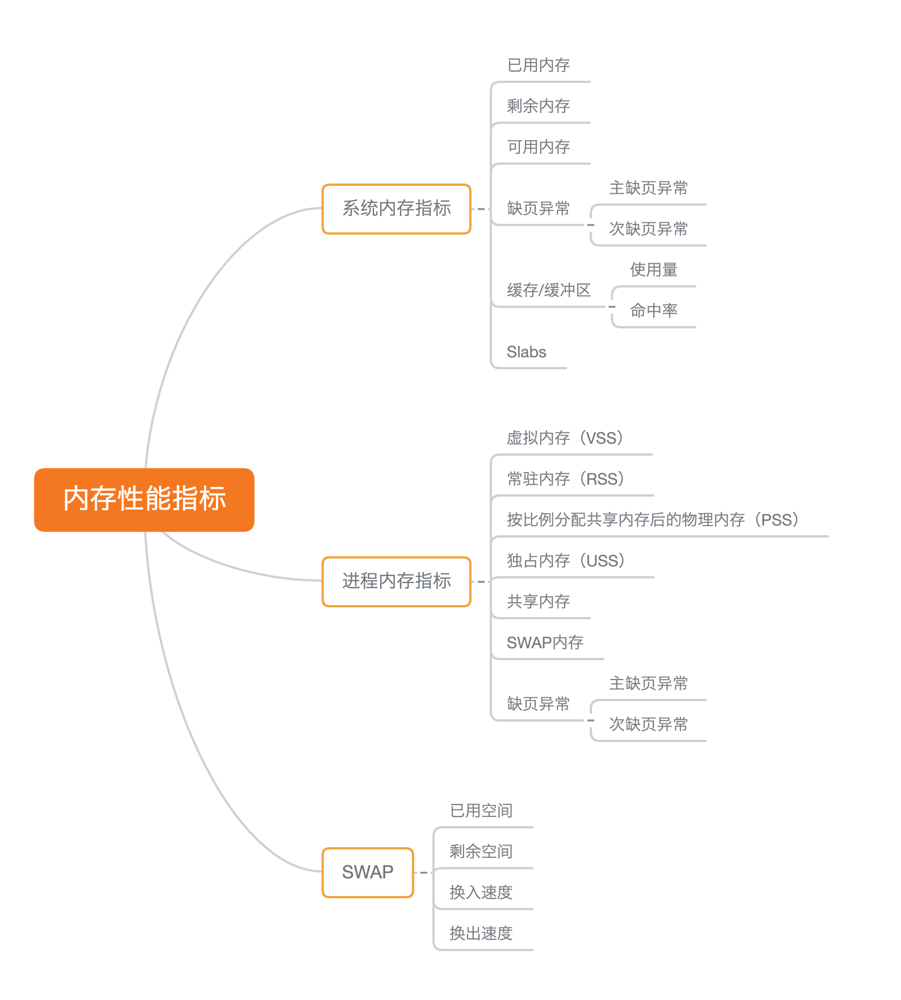

# 02 到底怎么理解“平均负载”?

uptime 最后三个数字分别表示 1、5、15 分钟得平均负载(load average)。

平均负载：单位时间内，系统处于可运行状态和不可中断状态的平均进程数。(简单理解就是活跃进程数)
当平均负载比 cpu 个数大的时候，系统已经出现了过载。当平均负载高于cpu数量 70%的时候，就应该分析排查负载高的问题了。

平均负载高可能是cpu密集型进程导致的；也不一定代表cpu使用率高，也可能是 IO 更加繁忙了。

- stress linux 系统压力测试工具
- sysstat 包含了 mpstat (多和cpu性能分析工具) 和 pidstat(进程性能分析工具)


# 03 CPU 上下文切换什么意思
cpu 上下文： CPU 寄存器和程序计数器

- 进程上下文切换。进程调度的时候
- 线程上下文切换。线程是调度的基本单位，进程是资源拥有的基本单位。同进程内的线程切换消耗更少资源
- 中断上下文切换。中断会打断进程的正常调度和执行，转而调用中断处理程序，相应设备事件。不涉及到用户态


# 04 经常说的 cpu 上下文切换什么意思？

过多的上下⽂切换，会把 CPU 时间消耗在寄存器、内核栈以及虚拟内存等数据的保存和恢复上，缩短进程真正运⾏的时间，成了系统性能⼤幅下降的⼀个元凶。

使用vmstat 查询上下文切换情况。

```
❯ vmstat 5 # 每隔5s输出一次数据
procs -----------memory---------- ---swap-- -----io---- -system-- ------cpu-----
 r  b   swpd   free   buff  cache   si   so    bi    bo   in   cs us sy id wa st
 1  0      0 6880312 548160 6785520    0    0    19    14    1    0  2  1 97  0  0
```

- cs(context switch) 每秒上下文切换次数
- in(interrupt)每秒中断次数
- r(running or runnable) 就绪队列长度，正在运行和等待 cpu 的进程数
- b(blocked) 处于不可中断睡眠状态的进程数

使用 pidstat -w 查看每个进程的上下文切换情况

- 所谓⾃愿上下⽂切换，是指进程⽆法获取所需资源，导致的上下⽂切换。⽐如说， I/O、内存等系统资源不⾜时，就会发⽣⾃愿上下⽂切换。
- ⽽⾮⾃愿上下⽂切换，则是指进程由于时间⽚已到等原因，被系统强制调度，进⽽发⽣的上下⽂切换。⽐如说，⼤量进程都在争抢 CPU 时，就容易发⽣⾮⾃愿上下⽂切换。

sysbench 多线程基准测试工具， 模拟上线文切换过多场景。

每秒上下文切换多少次正常？

这个数值其实取决于系统本身的 CPU 性能。在我看来，如果系统的上下⽂切换次数⽐较稳定，那么
从数百到⼀万以内，都应该算是正常的。但当上下⽂切换次数超过⼀万次，或者切换次数出现数量级的增⻓时，就很可能已经出现了性能问题。

这时，你还需要根据上下⽂切换的类型，再做具体分析。⽐⽅说：

- ⾃愿上下⽂切换变多了，说明进程都在等待资源，有可能发⽣了 I/O 等其他问题；
- ⾮⾃愿上下⽂切换变多了，说明进程都在被强制调度，也就是都在争抢 CPU，说明 CPU 的确成了瓶颈；
- 中断次数变多了，说明 CPU 被中断处理程序占⽤，还需要通过查看 /proc/interrupts ⽂件来分析具体的中断类型。


# 05 某个应用 cpu 使用率 100%，该怎么办？

除了空闲时间之外的其他时间占总 CPU 时间的百分比。性能分析工具一般给出的是一段时间的平均 cpu 使用率，注意时间间隔的设置。
多个工具对比保证时间间隔一致。

- top : 默认显示的是所有 cpu 的平均值
- pidstat: 每个进程 cpu 使用率情况
- ps :  每个进程资源使用

使用 perf 分析 cpu 性能问题

- perf top 可以实时显示占用 cpu 时钟最多的函数或者指令，可以用来查找热点函数
- perf record 记录，perf report 解析展示。
- perf 加上参数-g 开启调用关系的采样
- `perf top -g -p pid`

# 06 系统 cpu 很高，为啥找不到高 cpu 的应用

execsnoop 是一个专为短时进程设计的工具。通过 ftrace 实时监控进程的 exec() 行为，并输出短时进程的基本信息。

碰到无法解释的 cpu 使用率情况，首先想到可能是短时应用导致的问题，比如：

- 应用里直接调用了其他二进制程序，这些程序通常运行时间短，top 也不容易发现
- 应用本身不停崩溃重启，启动资源初始化，很可能占用相当多 cpu


# 07 系统中出现大量不可中断进程和僵尸进程怎么办？(上)

等待IO的 cpu使用率(以下简称为iowait)升高。当 iowait 升高时，进程可能得不到因硬件的响应，而长时间处于不可中断状态。

dstat 吸收了vmstat, iostat, ifstat 等工具的优点，可以同时观察系统的cpu,io,网络和内存使用。

- 不可中断状态，表示进程正在跟硬件交互，为了保护进程数据和硬件的⼀致性，系统不允许其他进程或中断打断这个进程。进程⻓时间处于不可中断状态，通常表示系统有 I/O 性能问题。
- 僵⼫进程表示进程已经退出，但它的⽗进程还没有回收⼦进程占⽤的资源。短暂的僵⼫状态我们通常不必理会，但进程⻓时间处于僵⼫状态，就应该注意了，可能有应⽤程序没有正常处理⼦进程的退出。

# 08 系统中出现大量不可中断进程和僵尸进程怎么办？(下)

```
$ dstat 1 10
You did not select any stats, using -cdngy by default.
--total-cpu-usage-- -dsk/total- -net/total- ---paging-- ---system--
usr sys idl wai stl| read writ| recv send| in out | int csw 0 0 96 4 0|1219k 408k| 0 0 | 0 0 | 42 885
0 0 2 98 0| 34M 0 | 198B 790B| 0 0 | 42 138
0 0 0 100 0| 34M 0 | 66B 342B| 0 0 | 42 135
0 0 84 16 0|5633k 0 | 66B 342B| 0 0 | 52 177
0 3 39 58 0| 22M 0 | 66B 342B| 0 0 | 43 144
0 0 0 100 0| 34M 0 | 200B 450B| 0 0 | 46 147
0 0 2 98 0| 34M 0 | 66B 342B| 0 0 | 45 134
0 0 0 100 0| 34M 0 | 66B 342B| 0 0 | 39 131
0 0 83 17 0|5633k 0 | 66B 342B| 0 0 | 46 168
0 3 39 59 0| 22M 0 | 66B 342B| 0 0 | 37 134
```

每当iowait(wai)升高，磁盘的读请求(read)都会很大，说明iowait的升高和磁盘读请求有关。

然后使用 pidstat -d 1 10 (间隔1s输出20组)  观察进程的 io 使用情况。等待io的进程一般是不可中断状态(D)

使用 strce 跟踪系统调用 strace -p pid 。但是如果是僵尸进程这里会失败(operation not permitted)。

再使用 perf record -g 记录和 perf report 解析结果。

open(dis, o_RDONLY|O_DIRECT|O_LARGEFILE, 0755)。使用了O_DIRECT 打开磁盘，绕过了系统缓存，直接对磁盘进行读写。


僵尸进程：找到父进程，然后在父进程里解决。

pstree -aps pid 可以找到  pid 父进程。然后看看父进程代码，是否调用 wait()/waitpid()，或是否注册SIGCHLD信号的处理函数。


# 09 怎么理解软中断？

- 上半部对应硬件中断，⽤来快速处理中断。包括网络收发、定时、调度、RCU 锁等各种类型
- 下半部对应软中断，⽤来异步处理上半部未完成的⼯作。

查看：

- /proc/softirqs 软中断运行情况
- /proc/interrups 硬中断运行情况


# 10 软中断cpu使用率升高该怎么办

- sar 系统活动报告工具
- hping3 可以构造 tcp/ip 协议包的工具。可以模拟 syn flood 攻击
- tcpdump 网络抓包工具


# 11 如何迅速分析系统 cpu 瓶颈

cpu 性能指标：

- cpu 使用率(用户cpu, 系统cpu, IOWAIT，软中断，硬中断，窃取 cpu，客户 cpu)
- 平均负载 (大于 cpu 个数负载比较重了)
- 进程上下文切换: 自愿上下文切换、非自愿上下文切换
- CPU 缓存命中率

性能工具：

- 平均负载：uptime
- 上下文切换：vmstat
- cpu使用率升高：top, perf
- 可不中断进程和僵尸进程：top  + strace + perf
- 软中断：top + /proc/softirqs, sar, tcpdump

性能指标和性能工具联系起来：

- 从 cpu 性能指标出发。查看某个性能指标时，清楚知道哪些工具可以做到


- 知道工具能提供哪些指标


- 先尝试 top,vmstat,pidstat 基本包含了所有重要的 cpu 性能指标


# 12 cpu性能优化的几个思路

评估性能优化效果：

- 确定性能的量化指标
- 测试优化前后的性能指标

应用程序优化：

- 编译器优化。优化选项
- 算法优化。低复杂度
- 异步处理
- 多线程替代多进程
- 善用缓存

系统优化：

- cpu 绑定。进程绑定到一个或者多个 cpu 上，提高 cpu 缓存命中率
- cpu 独占。进一步将 cpu 分组，通过 cpu 亲和性为其分配进程
- 优先级调整。nice 命令
- 为进程设置资源限制。linux cgroups
- numa优化。支持 numa 的处理器会划分成多个 node，每个 node 都有自己的本地内存空间。让 cpu 尽可能只访问本地内存
- 中断负载均衡。开启irqbalance 服务或者配置 smp_affinity, 把中断处理过程自动负载均衡多个 cpu 上


# 15 linux内存是怎么工作的
只有内核才可以直接访问物理内存。linux 内核给每个进程都提供了一个独立的虚拟地址空间，并且这个地址空间是连续的。
虚拟地址空间又分为内核空间和用户空间。

只有实际使用的虚拟内存才分配物理内存，并且分配后的物理内存，通过内存映射管理。

可以手动设置 进程的 oom_adj 从而调整 oom_score。 oom_adj 范围是 [-17,15], 数值越大进程越容易被 OOM 杀死。

查看内存使用： free, top

# 16 怎么理解内存中的 Buffer 和 Cache

- Buffers 是对原始磁盘块的临时存储，也就是用来缓存磁盘的数据。用来合并分散写入，优化读写
- Cached 是从磁盘读取文件的页缓存，用来缓存从文件读取的数据。下次访问数据可以直接从内存快速获取

- Buffer 既可以用作“将要写入磁盘数据的缓存”，也可以用作“从磁盘读取数据的缓存”
- Cache 既可以用作”从文件读取数据的页缓存“， 也可以用作”写文件的页缓存“。

Buffer是对磁盘数据的缓存，Cache 是文件系统数据的缓存，它们都会用在读请求，也会用在写请求中。


# 17 如何利用系统缓存优化程序的运行效率

缓存命中率

- cachestat: 操作系统缓存的读写命中情况
- cachetop: 每个进程的缓存命中情况

指定文件在内存中的缓存大小：

- pcstat 基于 go 的工具，查看文件在内存中的缓存大小和缓存比例

# 18 内存泄露该如何定位和处理

memleak 可以跟踪系统或指定进程的内存分配、释放请求。分配了动态内存一定要记得释放。


# 19 为什么系统的 swap 变高了？(上)

(应用程序修改过暂时还写入磁盘的数据)脏页需要先写入磁盘，然后才能进行内存释放，一般两种方式写入磁盘：

- 应用程序中，通过系统调用 fsync, 把脏页同步回磁盘中
- 交给系统，由内核线程 pdflush 负责脏页刷新

# 20 为什么系统的 swap 变高了？(下)

在内存资源紧张时，Linux 会通过 Swap ，把不常访问的匿名⻚换出到磁盘中，下次访问的时候再从磁盘换⼊到内存中来。
你可以设置 /proc/sys/vm/min_free_kbytes，来调整系统定期回收内存的阈值；
也可以设置 /proc/sys/vm/swappiness，来调整⽂件⻚和匿名⻚的回收倾向。

当 Swap 变⾼时，你可以⽤ sar、/proc/zoneinfo、/proc/pid/status 等⽅法，查看系统和进程的内存使⽤情况，进⽽找出 Swap 升⾼的根源和受影响的进程。


# 21 如何快准狠找到系统内存的问题？

内存性能指标



根据指标找工具


根据工具查指标


内存问题分析过程


常见优化思路：

- 最好禁止 swap 
- 减少内存动态分配。可以用内存池、大页(HugePage)等
- 尽量使用缓存和缓冲区访问数据
- 使用 cgroups 等方式限制进程内存使用情况
- 通过 /proc/pid/oom_adj 调整核心应用的 oom_score


# 22 Linux 性能优化答疑

### 内存回收与 OOM

三种方式回收内存：

- 基于 LRU 算法回收内存
- Swap 机制，回收不常访问的匿名也页
- OOM，杀掉占用大量内存的进程。 `dmesg | grep -i "Out of memory"`


# 23 Linux文件系统是怎么工作的？

虚拟文件系统(VFS)，定义了一套所有文件系统都支持的数据结构和标准接口。 

- df 查看文件系统的磁盘空间使用
- 目录项和索引节点缓存。 slabtop


# 24 Linux 磁盘 IO 是怎么工作的？(上)

- 机械磁盘(HDD, Hard Disk Driver)。随机 IO 比连续 IO 慢很多
- 固态磁盘(SSD, Solid State Disk)。

linux内核支持 4 种 IO 调度算法，分别是：

- NONE。不适用任何 IO 调度器
- NOOP。先入先出队列，只做一些基本请求合并，常用于 ssd
- CFQ。完全公平调度器
- DeadLine: 分别为读写创建不同的IO队列

存储系统 IO 的工作原理：

- 文件系统层
- 通用块层
- 设备层

# 25 Linux 磁盘 IO 是怎么工作的？(下)

磁盘性能指标：

- 使用率
- 饱和度。繁忙程度
- IOPS。每秒的IO请求数
- 吞吐量，每秒 IO 请求大小
- 响应时间

fio 测试磁盘的 IOPS、吞吐量和响应时间等指标。

磁盘 IO 观测：

- iostat 每个磁盘使用率、IOPS、吞吐量等各种常见性能指标 (实际来自  /proc/diskstats)
- pidstat, iotop 观测进程的 IO


# 26 如何找出狂打日志的内鬼？

- top 观察 cpu 和内存使用情况
- iostat 观察磁盘 io 情况
- pidstat, iotop 观察进程IO 情况
- 读写文件必须通过系统调用，观察系统调可以知道系统正在写的文件。 strace -p pid
- lsof -p pid 查看进程打开文件
