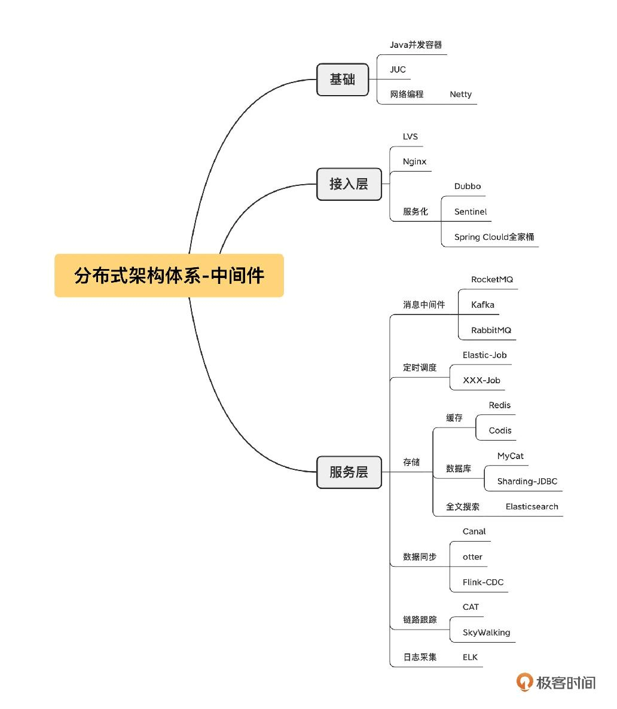
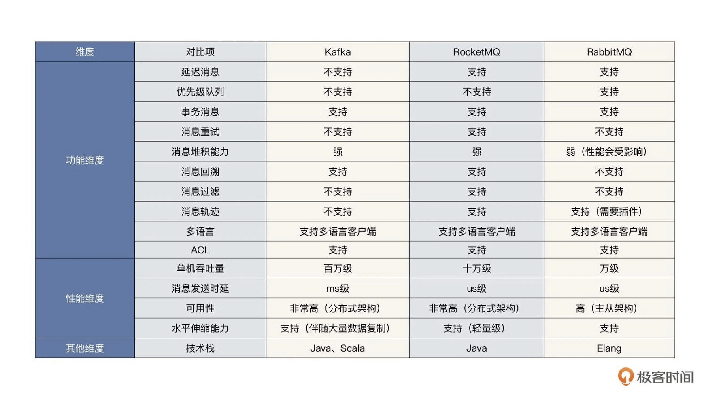
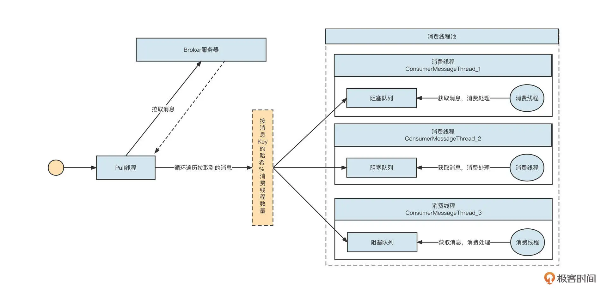
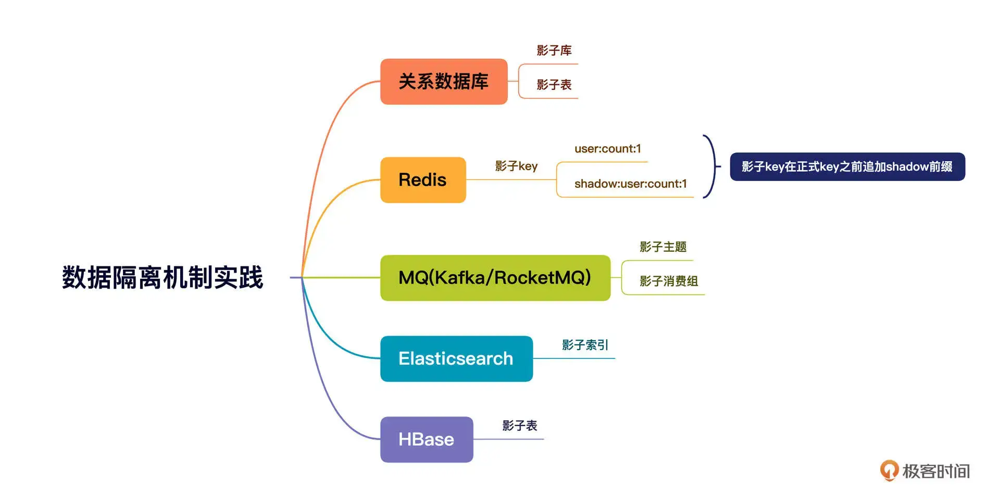

# 01 中间件生态（上）：有哪些类型的中间件？

中间件是游离于业务需求之外，专门为了处理项目中涉及高可用、高性能、高并发等技术需求而引入的一个个技术组件。它的一个重要作用就是能够实现业务代码与技术功能之间解耦合。

# 02 中间件生态（下）：同类型的中间件如何进行选型？

- 本地缓存中间件：Guava Cache 和 Caffeine
- 分布式缓存中间件： Redis, Memcache
- 全文索引中间件：Elasticsearch。场景：一个是宽表、解决跨库 Join，另一个就是全文搜索
  - 分库分表在面对多维度查询时将变得力不从心: 使用数据异构 + 宽表。引入 Canal 数据同步工具，订阅 MySQL 的 Binglog，将增量数据同步到 Elasticsearch 中，实现数据访问层面的读写分离。
- 分布式日志中间件：进行日志采集的机器上安装一个 filebeat 工具，用来采集服务器的日志，并将它们存储到消息中间件中。然后，
  在需要采集的机器中安装 Logstash 进程，通过 Logstash 将日志数据存储到 Elasticsearch 服务器，用户可以通过 Kibana 查询存储在 Elasticsearch 中的日志数据

# 03 数组与链表：存储设计的基石有哪些？

- ArrayList
- LinkedList
- HashMap

# 04 红黑树：图解红黑树的构造过程与应用场景

- TreeMap: 红黑树。 可以用来实现一致性哈希
- LinkedhashMap:  LinkedList 和 HashMap 的结合体。实现 lru
- PriorityQueue: 堆

# 05 多线程：多线程编程有哪些常见的设计模式？

如何复用线程：线程池。内部是 while + 阻塞队列的机制，确保线程的 run 方法不会结束。在有任务执行时运行任务，无任务运行时则通过阻塞队列阻塞线程。

- Future模式

它指的是主线程向另外一个线程提交任务时，无须等待任务执行完毕，而是立即返回一个凭证，也就是 Future。这时主线程还可以做其他的事情，不会阻塞。
等到需要异步执行结果时，主线程调用 Future 的 get 方法，如果异步任务已经执行完毕，则立即获取结果；如果任务还没执行完，则主线程阻塞，等待执行结果。

Future 模式的核心要领是将多个请求进行异步化处理，并且可以得到返回结果。常用线程池的方式实现。

- 生产者、消费者模式

# 06 锁：如何理解锁的同步阻塞队列与条件队列？

# 07 NIO：手撸一个简易的主从多Reactor线程模型

在等待数据阶段，如果发起网络调用后，在服务端数据没有准备好的情况下客户端会阻塞，我们称为阻塞 IO；如果数据没有准备好，但网络调用会立即返回，我们称之为非阻塞 IO。

在数据传输阶段，如果发起网络调用的线程还可以做其他事情，我们称之为异步，否则称之为同步。

BIO 的全称同步阻塞 IO，还有 NIO 的全称同步非阻塞 IO。NIO 模型更适合需要大量在线活跃连接的场景，常见于服务端；BIO 模型则适合只需要支持少量连接的场景。

主从多 Reactor 模型。它的核心设计理念是让线程分工明确，相互协作。Main Reactor 线程池主要负责连接建立，SubReactor 线程池主要负责网络的读写，而编码、解码和业务执行则需要具体情况具体分析。

# 08 Netty：如何优雅地处理网络读写，制定网络通信协议？

经典的协议设计方法是：协议头+ body 的设计理念

# 08 加餐 中间件底层的通用设计理念

数据结构、多线程编程（并发编程）、网络编程（NIO、Netty）、内存管理、文件编程、领域知识

# 09 技术选型：如何选择微服务框架和注册中心？

Dubbo vs Spring Cloud

注册中心： Zookeeper (CP); Eureka(AP) 模型

# 10 设计原理：Dubbo核心设计原理剖析

Dubbo 提供了下面五种策略：

- failover，失败后选择另外一台服务提供者进行重试，重试次数可配置，通常适合实现幂等服务的场景；
- failfast，快速失败，失败后立即返回错误；
- failsafe，调用失败后打印错误日志，返回成功，通常用于记录审计日志等场景；
- failback，调用失败后，返回成功，但会在后台定时无限次重试，重启后不再重试；
- forking，并发调用，收到第一个响应结果后返回给客户端。通常适合实时性要求比较高的场景。但这一策略浪费服务器资源，通常可以通过 forks 参数设置并发调用度。

# 11 案例：如何基于Dubbo进行网关设计？

网关设计至少包含三方面：签名验证；服务配置；限流

# 12 案例：如何进行蓝绿发布？

蓝绿发布的实现要点是对应用分别部署蓝、绿两套环境，在版本稳定后由一套环境对外提供服务，当需要发布新版本时，将新版本一次性部署到没有流量的环境，
待部署成功后再逐步将流量切换到新版本。如果新版本在验证阶段遇到严重的问题，可以直接将流量切回老版本，实现应用发布的快速回滚。

蓝绿发布的底层原理是借助 Dubbo 内置的标签路由功能，其核心思路是，当服务发起调用时，经过服务发现得到一个服务提供者列表，
但是并不直接使用这些服务提供者进行负载均衡，而是在进行负载均衡之前，先按照路由规则对这些提供者进行过滤，挑选符合路由规则的服务提供者列表进行服务调用，从而实现服务的动态分组。

# 13 技术选型：如何根据应用场景选择合适的消息中间件？

异步解耦与削峰填谷

# 14 性能之道：RocketMQ与Kafka高性能设计对比

Kafka 中文件的布局是以 Topic/partition 为主 ，每一个分区拥有一个物理文件夹，Kafka 在分区级别实现文件顺序写。如果一个 Kafka 集群中有成百上千个主题，
每一个主题又有上百个分区，消息在高并发写入时，IO 操作就会显得很零散，效果相当于随机 IO。
也就是说，Kafka 在消息写入时的 IO 性能，会随着 topic 、分区数量的增长先上升，后下降。

而 RocketMQ 在消息写入时追求极致的顺序写，所有的消息不分主题一律顺序写入 commitlog 文件， topic 和 分区数量的增加不会影响写入顺序。

根据我的实践经验，当磁盘是 SSD 时，采用同样的配置，Kafka 的吞吐量要超过 RocketMQ，我认为这里的主要原因是单文件顺序写入很难充分发挥磁盘 IO 的性能。

# 15 案例：消息中间件如何实现蓝绿？

- 基于消息主题。发送时候的时候将消息发送到不同的主题，消费端对各个消费组进行分工
- 基于消息属性。使用同一个主题，每个消息增加一个属性 color 存储消息颜色，消费端使用不同的消费组来消费消息

# 16 案例：如何提升RocketMQ顺序消费性能？

实现一个消费者至少需要涉及队列自动负载、消息拉取、消息消费、位点提交、消费重试等几个部分。

提升并发：降低锁的粒度。只有 key 不同的消息才必须保证顺序性。根据消息的 key 哈希到本地不同的消费队列。

# 17 运维：如何运维日均亿级的消息集群？

## 集群部署

核心业务要按业务域进行规划，并且通常采用 RocketMQ。例如我们可以划分出订单、运单、财金等业务域。业务域内尽量独占。

日志采集类通常采用 Kafka，并且也要搭建几套日志集群，做好拆分，控制好影响的范围。

## 集群扩容

中间件的运维必须遵循一个最基本的原则：中间件所做的变更要对业务无感知。即，中间件做的任何变更不需要业务方配合，也不会影响正在运行的业务，当然为了安全起见，还是需要将变更操作通知业务方，做一些必要的检查工作。

kafka涉及到分区重分配。

## 集群缩容

大促结束后，为了节省资源，通常需要对集群进行缩容处理。将节点从集群中移除的基本原则是，存储在这些节点上的消息必须完成消费，否则会造成消息消费丢失。

## 分区扩容

除了在集群维度扩容和缩容外，无论是 RocketMQ 还是 Kafka 都支持分区级别的扩容。

## 分区缩容

Kafka 目前不支持分区缩容，也就是说，一个主题的分区数量只能增加不能减少。而 RocketMQ 可以无缝实现缩容。

## 位点重置(回溯)

RocketMQ 不需要停止消费组就可以进行位点回溯。
kafka 中在进行位点重置之前，首先需要停止该消费组内所有的消费者

# 18 案例：如何排查RocketMQ消息发送超时故障？
## 解决方案

RocketMQ 中和 IO 相关的线程参数有两个，分别是 serverSelectorThreads（默认值为 3）和 serverWorkerThreads（默认值为 8）。

在 Netty 中，serverSelectorThreads 就是 WorkGroup，即所谓的 IO 线程池。每一个线程池会持有一个 NIO 中的 Selector 对象用来进行事件选择，所有的通道会轮流注册在这 3 个线程中，绑定在一个线程中的所有 Channel 会串行进行网络读写操作。

我们的 MQ 服务器的配置，CPU 的核数都在 48C 及以上，用 3 个线程来做这件事显然太“小家子气”，这个参数可以调优。

## 发送超时兜底策略

为了尽可能避免这样的问题出现，消息中间件领域解决超时的另一个思路是：增加快速失败的最大等待时长，并减少消息发送的超时时间，增加重试次数。

1. 增加 Broker 端快速失败的等待时长。这里建议为 1000。在 Broker 的配置文件中增加如下配置：`maxWaitTimeMillsInQueue=1000`
2. 减少超时时间，增加重试次数。

# 19 案例：如何排查RocketMQ消息消费积压问题？
通常情况下，RocketMQ 消息发送问题很可能与服务端有直接关系，而 RocketMQ 消费端遇到的一些性能问题通常与消费进程自身有关系。

另外，消费积压的时候，可以简单关注一下这个集群其他消费者的情况。如果其他消费者没有积压，只有你负责的消费组有积压，那就一定是消费端代码的问题了。

在这里最后再强调一遍，查看线程栈并不只是去查看线程状态为 BLOCKED、TIME_WRATING 的线程，RUNNABLE 的线程状态同样需要查看。因为在一些网络操作中（例如，HTTP 请求等待返回结果时、MySQL 写入 / 查询等待获取执行结果时），线程的状态也是 RUNNABLE。

# 20 技术选型：分布式定时调度框架的功能和未来
定时调度通常的功能需求，它们包括触发器、任务可视化管理、分布式部署、数据分片、故障转移、任务依赖等。

- Quartz
- ElasticJob (适合大数据量)
- XXL-JOB (扩展性强，调度和任务执行解耦)

# 21 设计理念：如何基于ZooKeeper设计准实时架构？
基于 ZooKeeper 实现元信息配置管理与实时感知。

## 基于 ZooKeeper 的事件通知机制

ElasticJob 利用了 ZooKeeper 的强一致性与事件监听机制。

事件注册的底层使用的是 ZooKeeper 的 watch，每一个监听器在一个特定的节点处监听，一旦节点信息发生变化，ZooKeeper 就会通知执行注册的事件监听器，执行对应的业务处理。

一个节点信息的变化包括：节点创建、节点值内容变更、节点删除、子节点新增、子节点删除、子节点内容变更等。

# 22 案例：使用分布式调度框架该考虑哪些问题？
在中间件应用领域，定时调度框架通常和 MQ 等中间件组合使用，联合完成分布式环境下事务的最终一致性。

## 设计方案(分布式事务)

如何保证数据库写入和消息发送这两个分布式操作的一致性: 本地消息表 + 定时任务。

我们首先需要在数据库创建一张本地消息表，表的结构大致如下：消息待发送表 msg_send_record (id, account_no, state, create_time)

创建了消息发送本地记录表之后，用户注册的流程将变成：

1. 开启数据库本地事务；
2. insert into user 表（用户注册表）；
3. insert into msg_send_record，并且存储账户的唯一编号、状态，其中状态的初始值为 0；
4. 提交本地事务。

这样做的目的是，保证 user 表和 msg_send_record 的事务一致性，如果用户信息成功存入 user 表，msg_send_record 表中必然存在一条对应的记录，
后续我们只需要根据 msg_send_record 表中的记录发送一条对应的 MQ 消息即可。

当然，为了保证 msg_send_record 的写入不至于带来太大的性能损耗，通常我们会采取下面几个措施。

- 如果在分库分表环境中，msg_send_record 采取的分库策略与 user 表一致，我们要保证这个过程是一个本地事务，不至于出现跨库 Join 的情况。
- 为 account_no、创建时间这两个字段添加索引。
- 定时清除 msg_send_record 表中的数据，这个表不需要保留太长时间，尽量控制单表数据量。

数据成功写入消息待发送表后，接下来我们需要引入定时调度程序，定时扫描 msg_send_record 中的记录，将消息发送到 MQ 中。

定时调度程序的数据处理策略主要有三步。首先，按照分页机制从数据库中拉取一批数据；然后，根据用户账户查询用户表，构建消息体（用户账户、用户注册时间）；
最后，将消息发送到消息服务器（这里必须提供重试机制）。

如何解决调度延迟：ElasticJob 可以通过支持流式任务解决这个问题。具体的思路是：将任务配置为按照分钟级进行调度，例如每分钟执行一次调度。
每次调度按照分页去查找数据，处理完一批数据，再查询下一批，如果查到待处理数据，就继续处理数据，直到没有待处理数据时，才结束本次业务处理。
如果本次处理时间超过了一个调度周期，那么利用 ElasticJob 的任务错过补偿执行机制会再触发一次调度。

假设我们的业务逻辑要根据不同的类型发送不到不同的 MQ 集群中，部分主题可能一直发送失败，最后影响到其他主题的正常发送。
如何解决？

消息待发送表 msg_send_record 增加两个字段：retry_count(当前重试次数); 下一次调度最小时间(next_select_time)。
在处理数据时，如果第一次处理数据失败了，我们需要将重试次数加一，并设置下一次调度的最小时间。例如，用当前时间加一分钟，意味着一分钟内流式处理任务将不再拉取该数据，这就给了其他数据执行机会。

# 23 案例：如何在生产环境进行全链路压测？
全链路压测就是在生产环境对我们的系统进行压测，压测流量的行进方向和真实用户的请求流量是一致的，也就是说压测流量会完全覆盖真实的业务请求链路。

压测前:主要任务是构建压测数据。全链路压测的核心目标是高保真模拟真实请求。但目前市面上的性能压测实践基本都是通过 JMeter 来人工模拟接口的数据最终生成测试请求的，这样无法反馈用户的真实行为。全链路压测最期望的结果是对真实用户请求日志进行脱敏和清洗，然后将其存入数据仓库中。在真正进行压测时，根据数据仓库中的数据模拟用户的真实行为。

压测运行时:主要包括请求打标、透传以及各主流中间件的数据隔离，这是全链路压测的基座。

压测后:压测结束后，我们需要生成压测报告并实时监控压测过程，一旦压测过程中系统扛不住，要立马提供熔断压测，避免对生产环境造成影响。

## 流量染色与透传机制

由于流量染色标记需要在整个调用链中传播，在进行数据存储或查询时，都需要根据该标记来路由。所以，为了不侵入代码，把流量染色标记存储在本地线程上下文中是最合适的。
(阿里巴巴开源了 transmittable-thread-local 类库)。

## 数据隔离机制

根据本地线程上下文中的流量标记，选择对应的数据源。

# 如何学习中间件

- 技术操作能力(多动手)。学习路径: 关系数据库；缓存和队列；redis和kafka；负载均衡；编程语言；操作系统
- 原理理解能力。看源码
- 综合判断能力。梳理技术栈，连接知识点
  - 消息积压：消费能力不行了？网络阻塞了？还是计算能力到头了

阅读源码的方法分享给你。

- 了解这款软件的使用场景、以及它在架构设计中将承担的责任。
- 寻找官方文档，从整体上把握这款软件的设计理念。
- 搭建自己的开发调试环境，运行官方提供的 Demo 示例，为后续深入研究打下基础。
- 先研究主干流程再专注分支流程，注意切割，逐个击破。
