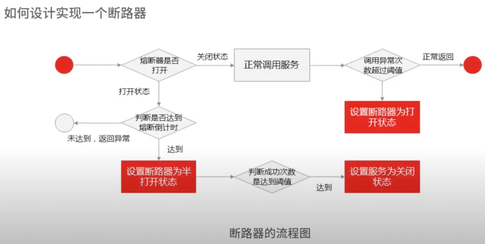

# 开篇

- 架构原理与技术认知
- 分布式技术原理与设计
- 中间件常用原理和设计问题
- 数据库原理与设计
- 分布式缓存与设计
- 互联网高性能高可用设计


# 1.三个技术认知

- 架构设计认知
- 分析问题认知
- 能力边界认知:合理的技术设计功能性架构；高可用、高性能、高扩展，容灾性。
- 知识体系、方法论、认知能力、驾驭系统边界的能力


# 2.如何架构师视角回答架构设计方案

示例：评论系统：风控、图片、广告、消息系统。。。

- 复杂来源
  - 功能性复杂度
  - 非功能性复杂度：高性能、高可用、扩展性、安全性、低成本。。。
- 解决方案: 比如引用消息队列解耦。1.消息队列(kafka等) 2. redis队列 3.mysql 。对比可行性和优缺点
- 评估标准
  - 点评系统功能性复杂度
  - 非功能性复杂度：无单点原则、水平扩展、可降级（限流、降级、熔断）
- 技术实现: 落地实现和深层原理


# 3.面试官如何考察与 CAP 有关的分布式理论？

CAP:

- Consistency: 一致性
- Availability: 可用性
- Partition tolerance: 分区容忍性

BASE:

- Basically Available : 基本可用。服务降级、流量削峰
- Soft State: 软状态。 允许系统中数据存在中间状态
- Eventually Consistent: 最终一致性

比如分布式锁:

- 存在问题：setnx，通过redis 实现锁和超时时间控制锁的失效时间
- 理论指导：redis 这种 AP 模型架构应用于 CP 的场景，在底层技术选型上就是错误的
- 知识体系：存储、复制、一致性，多维度多角度对比
- 技术判断力：造轮子能力

# 4.亿级商品存储下，如何深度回答分布式系统的原理性问题？

- 如何设计海量商品高扩展架构
- 分库分表时，基于 hash 和一致性 hash 数据分片如何实现
- 促销时热点商品的存储策略
- 强一致性和最终一致性的共识算法如何实现？

考察数据的存储、分布、复制和相关协议和算法

分布式存储-数据分片-复制-数据副本-数据容错-一致性-协议算法

案例：

hash 分片

- hash 分片。根据 id 取模
- 如何解决 hash 分片缺点（均匀分布和扩展性）：一致性哈希
- 一致性哈希：节点和数据都映射到哈希环，存储节点一般用 ip 映射进行 hash，数据从环上顺时针找到第一个存储节点。
    - 虚拟节点解决数据倾斜问题
    - hash 分片难以解决热点商品问题

范围分片

- 分片信息。数据量、qps、健康状态等
- 给元数据做一个服务集群，通过一致性算法复制数据
  - 给分片元数据做集群服务，通过 ETCD 存储分片信息
  - 存储节点定时向元数据服务集群同步心跳和分片信息
  - client 请求过来时，元数据服务节点只需要做好高可用和缓存即可

ETCD 算法原理，RAFT 算法原理。

- paxos 解决了什么问题?
- basic paxos 工作流程?
- paxos 和 raft 区别是什么？

- 副本少(共识节点少) : Paxos,raft
- 副本多(共识节点多) : Gossip


# 5.海量并发场景下，如何回答分布式事务一致性问题？

事务一致性

- 商品系统: 扣减库存
- 促销系统: 扣减优惠券
- 订单系统: 生成订单

回答方式：

1. 介绍主流实现分布式事务一致性的方案(2pc,3pc,TCC,基于消息队列)
2. 汇出可实现方案和关键知识点

两阶段提交(互联网一般不用):

- 准备（协调者Coordinator): 事务管理器
- 提交（参与者Participant): 具体执行操作的资源管理器
- 问题：死锁问题、性能问题、事务不一致

基于 MQ 的可靠消息投递：应对高并发场景下分布式事务时，通过放弃强一致性，选择最终一致性提高可用性

订单系统 -> Mq -> 优惠券系统。 (RabbitMQ, RocketMQ)

- MQ 自动应答机制导致的消息丢失：手动应答
- 消息积压：人工死信队列

通过数据库状态，保证消息不丢失。处理完成之后修改数据库状态已完成


# 6 分布式系统中，如何回答锁的实现原理？

分布式锁：多个系统共享资源

- 分布式锁的原理
- 秒杀系统场景

设计分布式锁问题：

- 可用性问题：无论如何都要保证锁服务可用
- 死锁问题：一定可以获得锁，即使锁住某个资源的客户端在释放之前崩溃或者网络不可达
- 数据不一致：集群同步产生的不一致，新进程可能拿到锁，老进程认为自己还持有锁，就出现2 个进程拿到同一个锁问题

以扣减库存问题为例：

- 基于关系数据库实现分布式锁。
  - 先查询是否存在记录，为了防止幻读加行锁 `select for update` 锁住这行数据，然后查询和插入的 sql 同一个事务提交。可能交叉死锁(四种隔离级别)
  - 基于乐观锁。
    - select 同时获取 ver 值。`select amount,old_ver from order where order_id=xxx`
    - update同时检查ver是否和第 2 步获取的值相同。`update order set ver=old_ver+1,amount=yy where order_id=xx and ver=old_ver`
    - 如果更新结果的记录数为 1 表示更新成功，如果为 0 表示已经被其他应用更新过了，做异常处理

- 基于分布式缓存实现分布式锁。(避免访问数据库，提高响应能力)
  - 加锁 `set lock_key unique_value nx px 10000`
    - lock_key 是 key 键
    - unique_value 是客户端生成的唯一标识
    - NX 代表只在 lock_key 不存在时，才对 lock_key 进行设置
    - PX 10000 表示过期时间 10s，避免客户端异常无法释放锁

  - 解锁。通过 lua 脚本保证原子性

```
// 释放锁，先比较 unique_value 是否相等，避免误释放锁
if redis.call("get", KEYS[1]) == ARGV[1] then
    return redis.call("del", KEYS[1])
else:
    return 0
end
```

  - 优缺点、超时时间设置问题、集群下分布式锁可靠性问题

    - 优点：高效、实现方便、避免单点故障
    - 缺点：
      - 不合理超时时间(业务执行太久): 基于续约的方式，守护线程检查并且续期。
      - redlock 算法解决分布式锁可靠性问题：超过半数 redis 实例加锁成功，并且总耗时没超过锁的有效时间，就是加锁成功


对于分布式锁，从可用性、死锁、脑裂、等问题展开回答各种分布式锁的实现方案、优缺点和适用场景。
四个锁设计原则：

- 互斥性: 只有一个可以获取
- 高可用: 不能单点风险
- 锁释放: 失效机制，保证可以释放，即使碰到了崩溃
- 可重入: 一个节点获取之后还可以继续获取


# 7 RPC：如何在面试中展现出“造轮子”的能力？

对于整条 RPC 调用链路，怎么设置 RPC 超时时间？考虑哪些问题

- 超时和重试
- 哪些可以重传，哪些不可以
- 超过了重试次数，降级会对商品详情页有什么影响

思路(结合理论和落地实践)：

- 结合 TP99 请求耗时和业务场景综合衡量
- RPC调用方式：下游服务的串并行调用方式，服务之前是否存在上下服务依赖
- 那些是核心服务和非核心服务，核心服务是否有备用方案，非核心是否有降级策略

从两个角度：

- 优化 RPC网络通信性能：高并发下选择高性能的网络编程 IO 模型
- 选择合适的 RPC 序列化方式：提升封包和解包的性能

RPC 原理：

- 网络通信
- 网络传输二进制数据，序列化和反序列化
- RPC协议：数据头和消息体。数据头一般用于身份识别；消息体主要是请求的业务参数信息和扩展属性等

过程(协议、序列化和反序列化、网络通信)：

- 调用方持续把请求参数对象序列化成二进制数据，经过 TCP 传输给服务提供方
- 服务提供方从 tcp 通道里接收到二进制数据
- 根据 RPC 协议，提供方把二进制分割出不同的请求数据，经过反序列化还原出对象，找到对应的实现类完成方法调用
- 提供方把执行结果序列化之后，回写到对应的 tcp 通道里
- 调用方读取到应答的数据包之后，反序列化成应答对象

协议、序列化和反序列化、网络通信:

- 序列化方式
  - json: 基于文本，空间开销大
  - Hessian: 紧凑的二进制序列化框架，性能和体积表现比较好
  - Protobuf: Google公司的序列化标准，序列化之后体积比 json，hessian 还要小，兼容性也不错。pb 为啥体积小？
    - 编解码大多采用位移运算，比 JSON/XML 的字符匹配效率高
    - pb定义了Varint 类型，使用变长编码压缩数值类型。 简单来说，值越小的数字，使用越少的字节数表示 。负数通过 zigzag 编码实现用无符号数表示有符号数，对负数数据可以更好的压缩。
    - 采取 Tag-Value (Varint 类型)或 Tag-Length-Value(字符串或其他对象类型)，无 json 或 xml 内冗余字符。由于tag只有一个字节，其性能开销很小。

- 提升网络通信性能
  - 同步阻塞(BIO)，同步非阻塞，多路复用(NIO)，信号驱动，异步IO(AIO)


# 8 MQ：如何回答消息队列的丢失、重复与积压问题

交易服务 -> 消息中间件 -> 扣减京豆

引入 MQ 目的：

- 系统接口: 隔离上下游变化带来的不稳定因素
- 流量控制: 秒杀场景，实现削峰填谷，根据下游处理能力自动调节流量

问题：

- 引入 MQ 影响数据传输一致性(不丢失)
- 消费处理能力不足消息积压

如何保证不丢失？

- 如何知道有丢失
- 哪些环节可能丢失
- 如何确保消息不丢失

消息丢失环节：

- 生产阶段: 正常收到 ack 表示成功，只要处理好返回值和异常，这个阶段不会丢失
- 存储阶段: 一般交给 MQ 中间件来保证，比如 broker 副本，保证一个消息至少同步两个节点再返回
- 消费阶段: 执行完之后再提交确认，就可以保证不丢失

如何进行消息检测：

生产端，每个消息都指定一个全局唯一 ID 或者附加一个连续自增的版本号，然后消费端做对应的版本校验。
用拦截器，将版本号注入消息，然后接受者通过检测版本号连续性或者消费状态。不侵入业务代码。

重复消息如何解决(幂等性): 数据库增加消息日志表，再根据消息记录，异步更新京豆的余额。

全局自增 id 方式：

- 数据库自增主键: 自增；不重复；数据库宕机不可用
- uuid : 无需、极低概率重复、一直可用
- redis: 递增、rdb 持久化可能有重复、redis 宕机不可用
- snowflake: 递增、不会重复、时钟回拨可能重复

如何解决消息积压问题(一般是消费端)？

- 线上突发问题临时扩容，增加消费者数量，降级非核心服务。通过扩容和降级抗住流量。(kafka 不能超过分区数量)
- 排查异常。监控、日志等分析业务逻辑代码问题，优化消费处理逻辑

消息中间件：

- 如何选型
- 队列模型和发布订阅区别
- 消息队列是如何实现高吞吐的
- 序列化、传输协议、内存管理问题


# 9 如何回答 MySQL 的索引原理与优化问题？

- InnoDB 索引原理

- B+树优势: 索引原理和优势
  - 相比 b 树：只有叶子节点存储数据，相同 IO 次数下可以查询更多节点; 叶子节点使用双链表链接，适合基于范围的顺序查找
  - 相比二叉树：树的高度比较小，IO 次数少
  - 相比 hash: hash 不适合范围查找

- mysql 执行计划

- 索引失效情况

- 如何建立高效索引
  - 前缀索引: 使用前缀
  - 覆盖索引: 避免回表
  - 联合索引: 最左匹配。区分大的放在前边

# 10 如何回答 MySQL 的事务隔离级别和锁的机制

隔离级别：

- 读未提交
- 读已提交
- 可重复读
- 串行化

脏读：读到了未提交数据。

- 读未提交才会出现
- 升级隔离级别

不可重复读：两次读取中间被修改。升级隔离级别

幻读：重复读取到之前不存在的数据（有别的事务插入）。

- nextkey lock

死锁：

- 互斥
- 持有并保持。打破：一次性申请所有资源
- 不可剥夺。打破：占用部分资源的线程进一步申请其他资源
- 循环等待。打破：按顺序申请


# 11 读多写少：MySQL 如何优化数据查询方案？

读写分离是首选方案。主从架构

MySQL主从复制原理: 依赖于 binlog

三个阶段：

- 主库：写入 binlog，提交事务，返回响应
  - 主库收到客户端提交事务请求后，先写入 binlog，再提交事务，更新引擎中的数据，事务提交之后，返回客户端操作成功响应

- 同步：主库 log dump 线程

- 从库：IO 线程、写入 relay log、返回响应
  - 从库会创建一个专门的 IO 线程，连接主库的log dump 线程，来接收主库的 binlog 日志，再把 binlog 信息写入 relay log 的
  中继日志里，再返回给主库“复制成功”响应
  - 从库会创建一个用于回放 binlog 的线程，读取 relay log 中继日志，回放 binlog 更新引擎中的数据，最终实现主从一致性

从库太多对主库资源消耗多，一般 2-3 个从库。mysql是异步模式，一旦主库宕机可能丢失。

主从复制模型：

- 同步复制：事务线程等待所有从库复制成功响应
- 异步复制：事务线程完全不等待从库复制响应
- 半同步复制：等待一部分。(兼容二者优点)

主从复制延迟问题：

- 数据冗余。避免从库重新查询数据。注意参数大小，过大消息占用带宽和时间
- 缓存。写入主库同时写入缓存，可能有缓存不一致(分布式锁)
- 如果读取请求量不大，直接读取主库。

主库和从库访问：

- 修改代码，指定读取主库还是从库
- 代理中间件。有一定性能损耗

复制状态机：通过日志复制和回放方式实现集群中所有节点内的状态一致性。


# 12 写多读少：MySQL 如何优化数据存储方案？

分库分表，垂直、水平、垂直和水平拆分。

- 何时分表：数据量过大执行事务缓慢考虑分表
- 何时分库：高并发，一个实例撑不住，请求分散到多个实例

如何分片:

- 垂直拆分: 业务相关性。单库-> 商品库，订单库，其他库
- 水平拆分：一个表到多个表。哈希分片；范围分片(比如时间分片，可能不均匀、字段类型比如商品的品类)
- 结合：垂直把不同类型数据存储到不同库，再结合水平使单表数据保持合理范围


数据查询问题：

- 如何 count：同步到 es、单表或者 hdfs (new sql)


# 13 缓存原理：应对面试你要掌握 Redis 哪些原理？

redis线程模型：

- redis 只有单线程么: redis 网络 IO 是单线程的，持久化、集群等操作是由另外线程来执行的
- redis 为何这么快：内存操作；单线程避免竞争、加锁等；IO 多路复用(reactor模型)
- redis4.0 之后，增加多线程支持，主要用在大数据的异步删除功能上。
- redis6.0之后，新增了多线程IO的读写并发能力

redis 持久化方式：

- AOF 日志：记录所有操作命令，以文本形式追加到文件
- RDB 快照：某一时刻内存数据，以二进制形式写入磁盘。
  - save会阻塞主线程，bgsave用子线程处理，不会阻塞
  - 快照时候可以修改数据么。
    - 如果主线程执行读操作，主线程和 bgsave 互不影响
    - 如果主线程执行写操作，修改的数据会复制一份副本，然后 bgsave 子进程会把该副本写入 rdb 文件，这个过程主线程仍然可以修改原来的数据
- 混合持久化：redis4.0 之后新增混合持久化，结合二者优点

如何实现高可用？

- 主从同步: 一主多从。需要手动恢复 master
- 哨兵: 主动服务器宕机，自动恢复
- redis 集群: 分布式。通过哈希槽映射。16384 个 slot。可以平均分配或者手动分配slot


# 14 缓存策略：面试中如何回答缓存穿透、雪崩等问题？

以商品详情页为例。

缓存穿透：查询不存在的数据穿透到数据库。可以恶意攻击

- 设置默认值

缓存并发：大量并发查询击穿数据库

- 分布式锁

缓存雪崩：集体失效雪崩

- 随机失效，打散失效
- 缓存不过期

热点数据：时间排序（lru）

业务分离：binlog + cannal + MQ

坑：数据库和缓存一致性、容量限制、数据大小


# 15 如何向面试官证明你做的系统是高可用的？
功能 -> 模块 -> 系统 -> 多个系统

- 首先保证稳定性和可用性
- 然后才是基于高流量下的承载能力

SLA: 衡量指标，几个 9。如何计算不可用时间


- 2个9，基本可用。年度不可用小于88小时
- 3个9，较高可用。年度不可用小于9小时
- 4个9，自动恢复的高可用。 小于 53 分钟 (注意上图有错误，不应该是小时)
- 5个9，极高可用性。 小于 5分钟

一年停机影响时间请求量占比，排除高低峰期影响。

- 可评估
- 可监控
  - 维度：基础设施、应用监控、存储监控(db,es,redis,mq)
  - 类型：系统指标(cpu/内存/磁盘)；网络(带宽、网络 IO、CDN、DNS、安全策略、负载均衡)
  - 工具：zabbix, open-falcon, prometheus
  - 监控报警策略：时间维度、报警级别、阈值设置
- 可保证

应急处理流程:


# 16 如何从架构师角度回答系统容错、降级等高可用问题？

网关 -> 商品系统 -> 促销系统 -> 积分系统

雪崩：局部引起全局故障

- 科学方法评估系统可用性指标
- 实时监控预警检测可用性
- 系统架构设计保证系统可用性


熔断设计：断路器模式。关闭(正常)、半开(尝试调用)、全开(返回错误不调用)。hystrix




降级原理：放弃非核心功能或者服务，保证核心可用性

如何做降级设计：

- 读操作降级: 数据兜底
- 写操作降级: 先写缓存或者 mq ，再异步写入

降级设计原则：

- 读操作降级的原则，就是取舍非核心服务
- 写操作就是强一致性转成最终一致性

降级开关，参数化配置。


# 17 如何向面试官证明你做的系统是高性能的

业务相关稳定性、延迟还是一致性。

- 并发度=吞吐量x延迟
- 吞吐量: 单位时间内处理能力
- 延迟：请求到响应的时间
- TP(top percentile): T99, 相比于性能均值意义。
  - It's 99th percentile. It means that 99% of the requests should be faster than given latency. In other words only 1% of the requests are allowed to be slower.
  - P99.9：许多大型的互联网公司会采用P99.9值，也就是99.9%用户耗时作为指标，意思就是1000个用户里面，999个用户的耗时上限，通过测量与优化该值，
    就可保证绝大多数用户的使用体验。 至于P99.99值，优化成本过高，而且服务响应由于网络波动、系统抖动等不能解决之情况，因此大多数时候都不考虑该指标。

全链路视角：

- 请求 url
- DSN解析: dns缓存和预解析
- 建立tcp连接
- 服务器响应：后端性能
  - 基础设施：cpu、io、网络、内存利用率等
  - 数据库: sql查询时间、并发数、连接数、缓存命中率
- 前台渲染
  - 白屏时间：减少文件加载体积
  - 首屏时间：2秒以内用户觉得快
- 请求完成


如何找到性能瓶颈：

- 设计阶段：定义性能目标
- 开发阶段：走查代码和业务流程
- 测试阶段：压测发现系统性能峰值

定位问题：

- 定位延迟问题：jstack, 性能分析工具，jprofiler分析内存、垃圾回收、线程运行情况
- 吞吐：结合 cpu 指标，检查磁盘 IO，网络带宽，工作线程


# 18 如何从架构师角度回答怎么应对千万级流量的问题？

全链路分析。

前端优化：

- 减少请求次数: 增加缓存控制；减少图片请求（雪碧图）；减少脚本请求（压缩)
- 页面静态化：cdn 节点
- 边缘计算：计算能力放到距离用户最近的 cdn

后端优化：

- 基础
- 网络
- 架构

明确指标 - 保护系统 - 用户体验 - 快速扩容

- 限流
- 快速扩容，应对不时之需，通过预估留好部分资源池
- 系统优化：需求、设计、研发、测试、上线、运行

回答：

- 结合业务，识别关键服务，针对关键服务性能设计与测试，确保关键服务没问题。然后为非关键服务提供降级和熔断处理方案。
- 深入对技术的理解。任何问题都可以按照时间和空间拆分成为简单问题，逐个攻破


# 案例串联 如何让系统抗住双十一的预约抢购活动？

- 商品预约: 展示详情页
- 等待抢购: 等待倒计时
- 商品抢购: 提交订单，排队等结果，成功后，扣减库存，生成订单
- 订单支付: 支付成功更新订单状态，通知用户购买成功

如何保证每个用户都有抢购资格？

- 使用分布式锁。怎么保证锁可靠性

抢购阶段如何流量控制？

- 页面静态化
- 服务端限流。限流算法

扣减库存：

- 基于缓存。redis + lua

生成订单：

- 订单分库分表。可以通过用户 id 取模分片到多个节点，提高并发能力

要点：

- 流量削峰: 异步下单，消费者处理提单请求
- 扣减库存: redis 单点问题 或者主从切换不一致问题
- 分库分表
- 带宽占用大：单独子域名绑定独立的网络服务器，dns 设计和优化
- 分布式事务一致性，可靠消息投递机制：消息本地存储，异步重试实现消息补偿


# 彩蛋 互联网架构设计面试，你需要掌握的知识体系

架构师体系 + 实践。
设计、规划、演进。

- 基础技术架构
- 业务架构
- 开发技能

四个角度：

- 存储：分布式存储。
  - 分片：范围分片、hash(哈希取模、虚拟桶、一致性哈希)
  - 复制：强一致性、弱一致性、最终一致性
  - 协议：两阶段提交、paxos、向量时钟、rwn 协议、raft 协议
  - 选举：分布式锁、脑裂、租约（双主问题）
  - 基础理论：CAP、BASE、PACELC

- 分布式计算：并行计算、分布式计算、云计算
  - 分布式并行计算框架 Hadoop 中的 MapRecude 思想
  - 基于流式计算框架 Storm，Spark、Flink 架构设计方案

- 输入输出。网络模型、连接复用、序列化/反序列化、RPC、MQ消息队列等
  - 网络设备如何处理流量：中断和缓存
  - 操作系统如何处理流量：IO 模型：select/poll/epoll，多路复用
  - 应用系统如何处理流量：NIO、reactor 模式、netty 框架原理
  - 线程如何处理: 多线程设计模式

- 控制器
  - 流量调度: 负载均衡、路由、熔断、限流、降级
  - 资源调度: Mesos, Yarn 基于计算资源调度；HDFS，GlusterFS、Ceph 基于存储资源；Kubernetes、Mesos 基于容器资源调度


# 结束语 程序员的道、术、势

思维过程最重要。

- 专业技术(道)
- 分析能力(术)
- 顺势而为(势)

如果你是架构负责人，如何驾驭团队呢？

- 立规矩。找所有研发谈话，明确告知做事的准则和底线
- 建系统。推进新系统建设过程中，老系统不出问题，保证业务正常
- 定节奏。按照新节奏做事

老人的四条建议:

- 敏感思考能力
- 良好表达能力：会表达、敢表达、表达准确
- 惊艳：惊艳到自己
- 认知：对“地位、格局、方法论、手段”有明确认知

新人四条建议：

- 有计划、有积累
- 学习时间管理、四象限
- 自己定位自己
- 善于归纳总结和思考

职业发展阶段：做下不做上、做下也做上、做上不做下

# 参考资料

- 视频: https://www.youtube.com/watch?v=MVG6KBQHjJY&list=PL5d0qARooeQizrhA4vJP5pJjAVwD90wo1&index=1
- 文稿：https://learn.lianglianglee.com/%E4%B8%93%E6%A0%8F/%E6%9E%B6%E6%9E%84%E8%AE%BE%E8%AE%A1%E9%9D%A2%E8%AF%95%E7%B2%BE%E8%AE%B2
