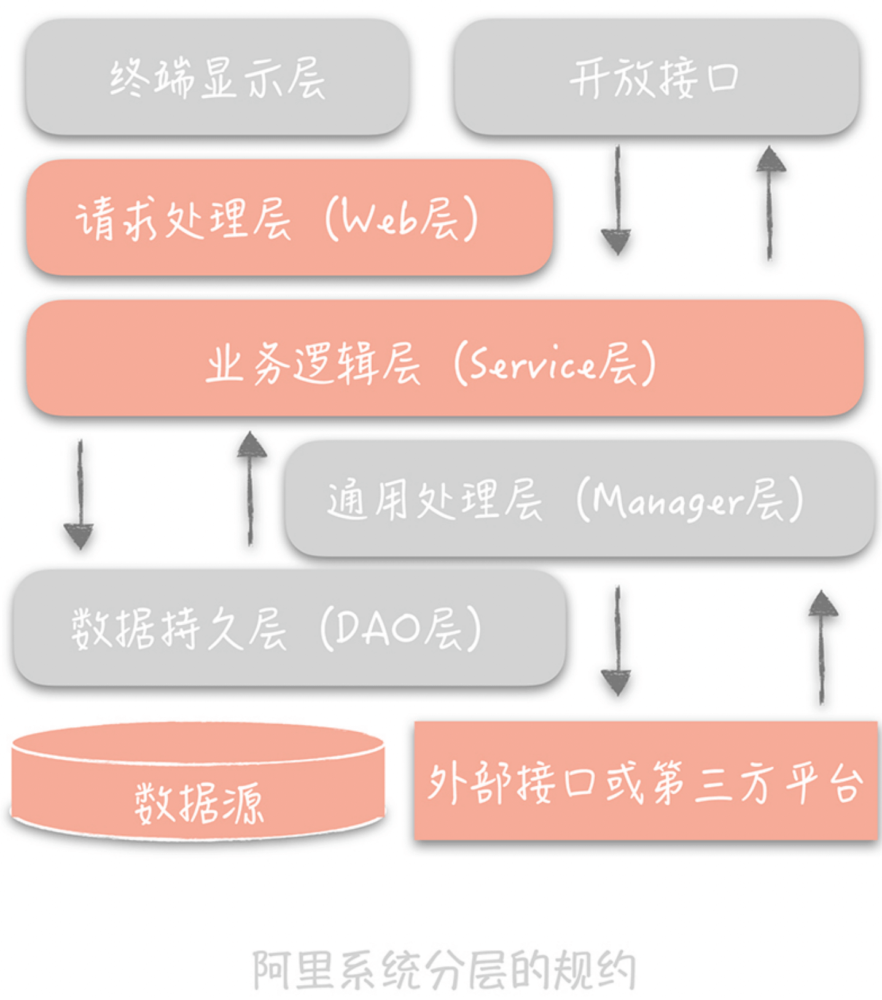
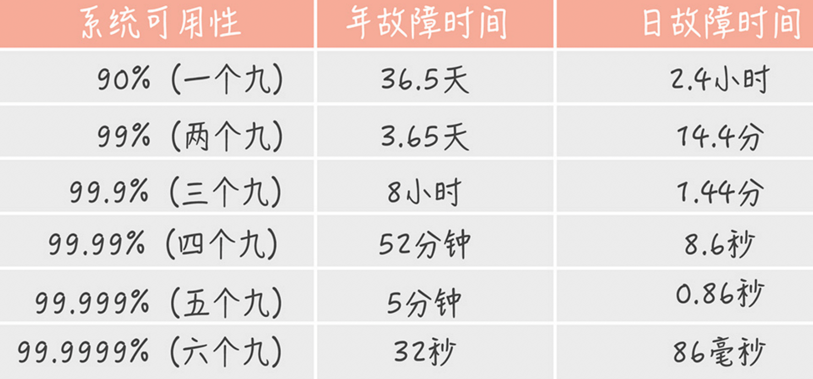
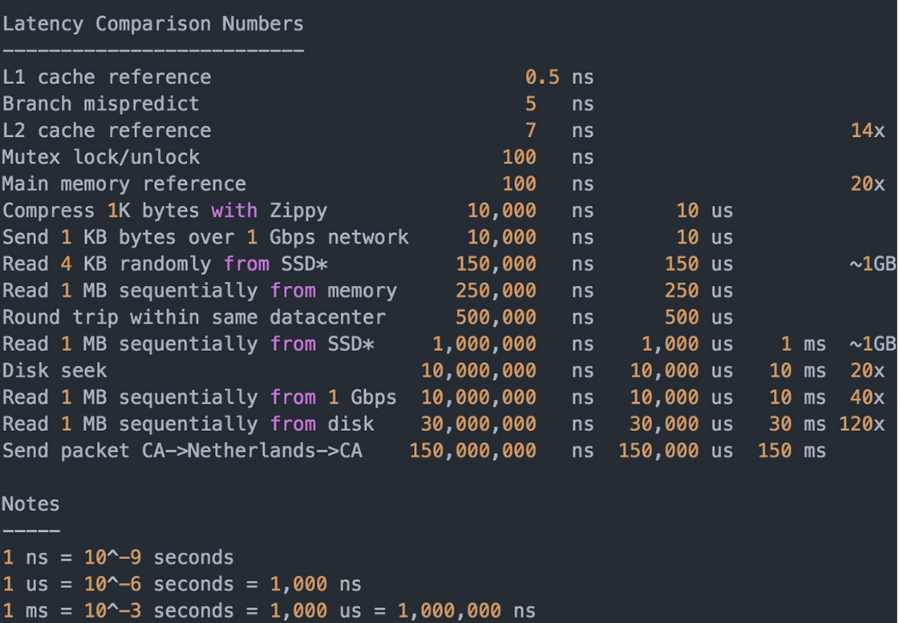
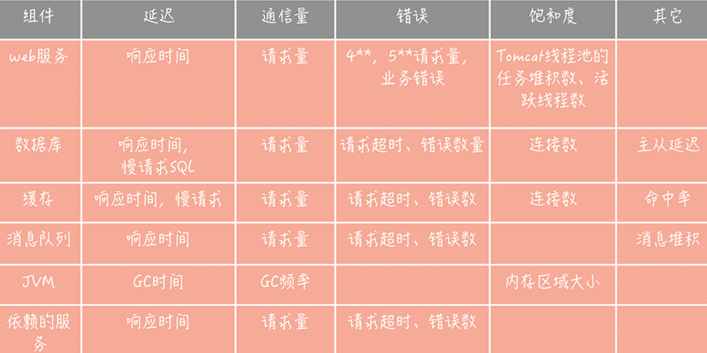

# 01 高并发系统：通用设计方法？

- scale-out(横向扩展), scale-up(纵向扩展)
- 缓存
- 异步


# 02 架构分层

三层架构：表现层-逻辑层-数据访问层




# 03 如何提升系统性能

高并发系统目标：高性能、高可用、高扩展

性能优化原则：问题导向；二八原则；数据支撑；可持续

性能度量：分位值。90 分位为例，把这段时间请求的响应时间从小到大排序，假如一共 100 个请求，
那么排在第 90 位的响应时间就算是 90分位值。

通常这么表述优化目标：每秒一万次请求量下，响应时间 99 分位值在 10ms 以下。
健康系统 9 分位值应该控制在 200ms 以下，不超过 1s 的请求占比要在 99.99% 以上。

高并发性能优化：

- 提高系统的处理核心数。但是要找到拐点，并行处理会在一个拐点后因为争抢资源反而导致处理能力下降
- 减少单词任务响应时间
  - cpu密集：减少运算、高效算法。使用 perf 工具
  - IO密集：


# 04 系统如何高可用(HA)

MTBF（Mean Time Between Failure）: 是平均故障间隔的意思，代表两次故障的间隔时间，也就是系统正常运转的平均时间。这个时间越长，系统稳定性越高。

MTTR（Mean Time To Repair）: 表示故障的平均恢复时间，也可以理解为平均故障时间。这个值越小，故障对于用户的影响越小。

可用性与 MTBF 和 MTTR 的值息息相关，我们可以用下面的公式表示它们之间的关系：

Availability = MTBF / (MTBF + MTTR)

这个公式计算出的结果是一个比例，而这个比例代表着系统的可用性。一般来说，我们会使用几个九来描述系统的可用性。
核心系统一般要 4 个 9，非核心的 达到3个 9.



设计思路：

- 系统设计：如何自动发现和转移故障。具体方法:
  - failover(故障转移)
    - 对等节点: 随机访问一个可用节点
    - 非对等(主备):分布式一致性算法。paxos, raft
  - 超时控制。
  - 降级。保证核心服务，牺牲非核心服务
  - 限流熔断

- 系统运维。
  - 灰度发布
  - 故障演练：混沌工程。


# 05 如何让系统易于扩展

瓶颈点：数据库、缓存、依赖的第三方、负载均衡、交换机带宽等。

设计思路：

- 拆分：先业务拆分；之后数据库二次拆分
- 业务拆分：业务维度、重要性维度、请求来源


# 07 如何减少频繁创建数据库连接的性能损耗？
数据库**连接池**有两个最重要的配置：**最小连接数和最大连接数，**它们控制着从连接池中获取连接的流程：

- 如果当前连接数小于最小连接数，则创建新的连接处理数据库请求；
- 如果连接池中有空闲连接则复用空闲连接；
- 如果空闲池中没有连接并且当前连接数小于最大连接数，则创建新的连接处理请求；
- 如果当前连接数已经大于等于最大连接数，则按照配置中设定的时间（C3P0 的连接池配置是 checkoutTimeout）等待旧的连接可用；
- 如果等待超过了这个设定时间则向用户抛出错误。

对于数据库连接池，根据我的经验，一般在线上我建议最小连接数控制在 10 左右，最大连接数控制在 20～30 左右即可。


用线程池预先创建线程,JDK 1.5 中引入的 ThreadPoolExecutor 就是一种线程池的实现，它有两个重要的参数：coreThreadCount 和 maxThreadCount，
这两个参数控制着线程池的执行过程。

- 如果线程池中的线程数少于 coreThreadCount 时，处理新的任务时会创建新的线程；
- 如果线程数大于 coreThreadCount 则把任务丢到一个队列里面，由当前空闲的线程执行；
- 当队列中的任务堆积满了的时候，则继续创建线程，直到达到 maxThreadCount；
- 当线程数达到 maxTheadCount 时还有新的任务提交，那么我们就不得不将它们丢弃了。


# 08 数据库优化方案(一): 如何主从分离

1. 主从复制(一主多从，主写从读)

主从复制的过程：首先从库在连接到主节点时会创建一个 IO 线程，用以请求主库更新的 binlog，并且把接收到的 binlog 信息写入一个叫做 relay log 的日志文件中，
而主库也会创建一个 log dump 线程来发送 binlog 给从库；同时，从库还会创建一个 SQL 线程读取 relay log 中的内容，并且在从库中做回放，最终实现主从的一致性。
这是一种比较常见的主从复制方式。一般一个主库最多 3 到 5 个从库。

主从复制延迟如何解决(尽量不去从库查):

- 消息队列发送消息冗余。这样不用从主库查询信息(优先方案)
- 写缓存，然后优先查询缓存 (可能缓存不一致)
- 查询主库。要确认查询量不大才可以直接查询主库

如果主从延迟过高超过秒级别，最好加上告警。

2. 如何访问数据库

- TDDL (Taobao Distributed Data Layer): 中间件把 sql 发给指定的数据源。适合小团队使用
- 代理层方案。Cobar, Atlas, DBProxy。适合中大型团队使用，性能稍微有损耗


# 09 数据库优化方案(一): 如何分库分表

## 如何做垂直拆分

专库专用，业务耦合度高的拆分到单独的库中。

## 如何对数据库做水平拆分

单一数据表按照某一规则拆分到多个数据库和多个数据表中。

1. 按照某一个字段的 hash 值。
2. 按照某个字段的区间，常用时间字段

## 引入问题解决

- 映射表。只用两个 id 作为映射新建表
- join。在业务层代码做


# 10 发号器：分库分表后 id 全局唯一性？

- uuid。不太适合作为主键，不自增，写入也会导致太多页分裂。
- snowflake 算法。时钟回拨问题。根据业务改造


# 11. NoSQL

- redis, LevelDB KV 存储，高性能读写
- Hbase, Cassandra 列式存储。离线数据统计
- MongoDB，CouchDB，文档型数据库，模式自由
- ElasticSearch, 倒排索引，搜索引擎

LSM树(Log-Structured Merge Tree): 牺牲了一定读取性能换取写入高性能。Hbase, Cassandra, LevelDB 使用这种算法作为存储的引擎。
(随机 IO -> 顺序 IO)

使用开源组件一定要有很强的运维能力支撑。


# 12 缓存



缓存分类：

- 静态缓存
- 分布式缓存
- 热点本地缓存。通常通过过期更新，过期时间比较短

缓存的不足：

- 读多写少场景，命令中率才高
- 缓存不一致
- 内存容量预估，一定要设置过期时间保证是热点数据
- 运维成本


# 13. 缓存使用姿势（一）：如何选择缓存读写策略？

### Cache Aside(旁路缓存)策略

以数据库中的数据为准，缓存是按需加载的。日常业务使用最多的场景

读取策略:

- 从缓存读取数据
- 缓存命中直接返回
- 缓存不命中，去数据库查询
- 查询到数据后，将数据写入缓存，并返回给用户

更新策略：

- 先更新数据库，然后删除缓存（注意是删除缓存，不是更新缓存，而且顺序不能交换）

### Read/Write Through(读穿/写穿) 策略
用户只和缓存交互，缓存和数据库通信，写入或者读取。

### Write Back(写回) 策略
写入数据时候只写缓存，并且把缓存块标记为脏的。脏块只有再次使用时候才会将数据写入到后端存储。
(日志异步刷盘、消息队列异步写入大多采用这种策略)


# 14. 缓存使用姿势（二）：缓存如何做到高可用？
分布式缓存高可用方案

- 客户端方案
- 中间代理方案
- 服务端方案。 redis sentinel

### 客户端方案

- 缓存数据分片：hash 分片算法和一致性哈希分片(推荐 4-6 个节点)
- 客户端优先读取 slave，失败了穿透到 master 读取
- 多副本

### 中间代理方案

Mcrouter, Twemproxy, Codis

### 服务端方案

redis sentinel， redis cluster


# 15. 缓存使用姿势（三）：缓存穿透怎么办

核心系统缓存命中率应该在 99% 以上，非核心系统要在 90% 以上。

穿透：缓存查不到数据， 穿透到数据库查询的情况。比如查询不存在用户。解决方法:

1. 回种空值。查询到的空值也写入缓存然后设置较短超时时间
2. 布隆过滤器。如果查询不存在直接返回空值。缺点: 错率概率；不支持删除元素

热点数据并发回源（狗庄效应）：分布式锁或者后台线程定时加载


# 16. CDN: 静态资源如何加速

- 对于 APP 来说，静态资源主要是图片，视频，流媒体资源
- 对于网站，js，css，html 文件等

CDN（Content Delivery Network/Content Distribution Network，内容分发网络）。简单来说，CDN 就是将静态的资源分发到，
位于多个地理位置机房中的服务器上，因此它能很好地解决数据就近访问的问题，也就加快了静态资源的访问速度。

1. 如何让用户请求到达 CDN 节点

通过 CNAME 记录，返回另一个域名，也就是当前的域名解析要跳转到另一个域名的解析上。

一种是 Local DNS，它是由你的运营商提供的 DNS，一般域名解析的第一站会到这里；另一种是权威 DNS，它的含义是自身数据库中存储了这个域名对应关系的 DNS。

2. 如何找到离用户最近的 CDN 节点

GSLB（Global Server Load Balance，全局负载均衡）, 它的含义是对于部署在不同地域的服务器之间做负载均衡，下面可能管理了很多的本地负载均衡组件。它有两方面的作用：
一方面，它是一种负载均衡服务器，负载均衡，顾名思义嘛，指的是让流量平均分配使得下面管理的服务器的负载更平均；
另一方面，它还需要保证流量流经的服务器与流量源头在地缘上是比较接近的。


# 17. 消息队列：秒杀如何处理上万次下单请求？
异步处理，削峰填谷，解耦合。

使用队列削峰时，需要根据队列处理时间、写入流量大小、数据库处理能力做好评估，决定部署多少消费者处理。


# 18. 消息投递：如何保证消息仅仅被消费一次？
1. 生产过程丢失: 重传
2. 消息队列中丢失。
  - 1.如果你需要确保消息一条都不能丢失，那么建议不要开启消息队列的同步刷盘，而是需要使用集群的方式来解决，可以配置当所有 ISR Follower 都接收到消息才返回成功。
  - 2.如果对消息的丢失有一定的容忍度，那么建议不部署集群，即使以集群方式部署，也建议配置只发送给一个 Follower 就可以返回成功了。
  - 3.我们的业务系统一般对于消息的丢失有一定的容忍度，比如说以上面的红包系统为例，如果红包消息丢失了，我们只要后续给没有发送红包的用户补发红包就好了。
3. 消费者。一定要等到消息接收和处理完成后才能更新消费进度，但是消费可能重复

如何保证只消费一次：幂等

- 生产者幂等。kafka 0.11 后支持幂等
- 消费者幂等
  - 消息包含全局 id，记录到数据库
  - 业务层。增加乐观锁


# 19. 消息队列：如何降低延迟？

监控消息延迟：

- 监控消息堆积
- 通过生成监控消息的方式来监控消息的延迟情况。对比生成的时间差阈值

减少消费延迟：

- 优化消费代码性能。线程池处理
- 增加消费者数量。对于 kafka 需要同时增加分区，消费者大于分区数多余消费者不会消费
- 消费者空转问题。拉不到消息可以 sleep 10-100 ms

零拷贝：

磁盘 -> 内核缓冲区 -> 用户缓冲区 -> socket缓冲区 -> 网卡缓冲区

操作系统提供了 sendfile 函数可以减少拷贝次数。 磁盘 -> 内核缓冲区 -> socket 缓冲区 -> 网卡缓冲区


# 20. 当问到项目经历时，面试官究竟想要了解什么？

- 针对复杂需求你设计了什么方案，技术难点是什么，如何解决的？
- 项目中会遇到的诡异的问题，排查思路
- 性能问题如何优化的


# 21. 系统架构：每秒 1 万次请求的系统要做服务化拆分么？

- 按照业务横向拆分。
- 业务无关服务抽取出来，做成单独服务。


# 22. 微服务架构：系统架构如何改造

微服务拆分原则：

- 单一服务内部功能的高内聚，低耦合
- 关注服务拆分粒度，先粗略拆分，再逐渐细化
- 一边产品迭代，一边服务化拆分: 优先剥离比较独立的服务； 优先拆分被依赖服务
- 服务接口定义可扩展性。比如参数类型封装成类

服务化带来的问题和解决思路：

- 跨进程调用。注册中心
- 依赖关系。服务治理
- 链路追踪


# 23. RPC框架：10 万 qps 如何实现毫秒级服务调用？

- 合适的网络模型: epoll。 tcp_nodelay 最好开启
- 序列化方式。性能、包体大小、跨语言。 json, protobuf

# 24. 注册中心：：分布式系统如何寻址？

ZooKeeper, ETCD, Eureka等。

- 提供服务地址的存储
- 当存储内容变化，推送给客户端

服务状态管理：

- 主动探测。
- 心跳机制（推荐）。摘除的节点超过一定比例要告警


# 25. 分布式 Trace: 横跨几十个分布式组件的慢请求如何排查？

我们采用 traceId + spanId 这两个数据维度来记录服务之间的调用关系（这里 traceId 就是 requestId），也就是使用 traceId 串起单次请求，
用 spanId 记录每一次 RPC 调用。

开源方案：Zipkin, Jaeger


# 26. 负载均衡：怎么提升系统扩展能力

负载均衡类型：

- 代理类的负载均衡服务。LVS, Ngingx
- 客户端负载均衡服务

负载均衡策略：

- 静态策略: RoundRobin(轮询)，带权重轮询， ip_hash, url_hash
- 动态策略: 选择负载小, 空闲的服务

检测节点故障： 淘宝开源的 nginx 模块 nginx_upstream_check_module


# 27. API网关

API 网关（API Gateway）不是一个开源组件，而是一种架构模式，它是将一些服务共有的功能整合在一起，独立部署为单独的一层，
用来解决一些服务治理的问题。你可以把它看作系统的边界，它可以对出入系统的流量做统一的管控。

API 网关可以分为两类：一类叫做入口网关，一类叫做出口网关。网关作用：

- 提供统一接入地址，和协议转换
- 植入服务治理策略，比如限流、熔断、流量控制和分流
- 认证和授权
- 黑白名单
- 记录访问日志

开源网关：Kong (nginx运行lua), Zuul(Spring Cloud), Tyk(Go)


# 28. 多机房部署：跨地域分布式系统如何做？

多机房部署的含义是：在不同的 IDC 机房中，部署多套服务，这些服务共享同一份业务数据，并且都可以承接来自用户的流量。

跨机房数据传输的延迟：

1. 北京同地双机房之间的专线延迟一般在 1ms~3ms。如果有大量跨机房调用会有延迟放大
2. 国内异地双机房之间的专线延迟会在 50ms 之内。避免跨机房的数据库和缓存操作
3. 国际化的服务，需要部署跨国的双机房，那么机房之间的延迟就更高了, 100-200ms。避免跨机房同步调用，只做异步同步

逐步迭代多机房部署方案：

1. 同城双活。不考虑城市级别容灾。尽量只调用本机房服务，降低延迟。跨机房写如果请求不高，可以容忍
2. 异地多活。只写本机房的数据存储，再用同步方案同步到异地机房。 尽量保证用户读取自己的数据时，读取数据主库所在机房
  - 主从复制。一个机房部署主库，异地机房部署从库，主从复制实现同步
  - 消息队列

# 29. Service Mesh: 如何屏蔽服务化系统的服务治理细节
Service Mesh 主要处理服务之间的通信，它的主要实现形式就是在应用程序同主机上部署一个代理程序，一般来讲，我们将这个代理程序称为“Sidecar（边车）”，
服务之间的通信也从之前的，客户端和服务端直连，变成了下面这种形式:

RPC 客户端将数据包先发送给，与自身同主机部署的 Sidecar，在 Sidecar 中经过服务发现、负载均衡、服务路由、流量控制之后，
再将数据发往指定服务节点的 Sidecar，在服务节点的 Sidecar 中，经过记录访问日志、记录分布式追踪日志、限流之后，再将数据发送给 RPC 服务端。

1. Service Mesh 分为数据平面和控制平面。数据平面主要负责数据的传输；控制平面用来控制服务治理策略的植入。出于性能的考虑，一般会把服务治理策略植入到数据平面中，控制平面负责服务治理策略数据的下发。
2. Sidecar 的植入方式目前主要有两种实现方式，一种是使用 iptables 实现流量的劫持；另一种是通过轻量级客户端来实现流量转发


# 30. 服务端监控怎么做

监控指标：延迟、通信量、错误和饱和度

- 延迟: 请求响应时间，接口、访问数据库和缓存等
- 通信量: 吞吐量，单位时间请求量大小
- 错误: 返回错误、业务错误
- 饱和度: 资源利用率，cpu/内存/磁盘/连接数使用率



如何采集指标：

- agent （服务端角度）
- 代码埋点（客户端角度）
- 日志 (Filebeat, Fluentd, Flume)

监控数据的处理和存储：

- ELK 收集和展示
- 访问趋势报表
- 性能报表
- 资源报表


# 31. 应用性能管理：使用体验如何监控？
应用性能管理（Application Performance Management，简称 APM），它的含义是：对应用各个层面做全方位的监测，
期望及时发现可能存在的问题，并加以解决，从而提升系统的性能和可用性。

如何搭建 APM 系统：

- agent 方式在客户端植入 sdk，采样收集以后通过固定接口发送给服务端。(固定接口和服务端称为 APM 通道服务)

格式：

- 系统部分。协议版本，消息头、消息体、业务消息体长度
- 消息头：应用表示(appkey)，消息时间戳，签名，加密秘钥
- 端消息体：主要存储客户端的一些相关信息，主要有客户端版本号、SDK 版本号、IDFA、IDFV、IMEI、机器型号、渠道号、运营商、网络类型、操作系统类型、国家、地区、经纬度等等。由于这些信息有些比较敏感，所以我们一般会对信息加密；
- 业务消息体：也就是真正要采集的数据，这些数据也需要加密。

数据被采集到 APM 通道服务之后，我们先对 JSON 消息做解析，得到具体的数据，然后发送到消息队列里面。从消息队列里面消费到数据之后，会写一份数据到 Elasticsearch 中，作为原始数据保存起来，再写一份到统计平台，以形成客户端的报表。

监控用户哪些信息？

- 客户端网络。DNS 解析
- 异常事件：登录失败、下单失败、浏览商品信息失败、评论列表加载失败、无法评论留言等


# 32. 压力测试：怎样设计全链路压测平台？
压力测试指的是，在高并发大流量下，进行的测试，测试人员可以通过观察系统在峰值负载下的表现，从而找到系统中存在的性能隐患。

压力测试的过程中，我们不能只针对某一个核心模块来做压测，而需要将接入层、所有后端服务、数据库、缓存、消息队列、中间件以及依赖的第三方服务系统及其资源，
都纳入压力测试的目标之中。因为，一旦用户的访问行为增加，包含上述组件服务的整个链路都会受到不确定的大流量的冲击，因此，
它们都需要依赖压力测试来发现可能存在的性能瓶颈，这种针对整个调用链路执行的压力测试也称为“全链路压测”。

如何搭建全链路压测平台？

- 流量隔离：正式环境如何区分压测流量和正式流量
- 风险控制: 避免影响用户访问

模块：

- 流量构造和产生模块
- 压测数据隔离模块
- 系统健康度检查和压测流量干预模块

具体介绍各个模块：

- 压测数据产生：GoReplay 劫持并且记录流量；http 头标记压测请求
- 数据隔离：搭建 mock 服务，数据写到影子库（复制一份线上数据）
- 如何实施：逐渐增加流量；阈值监控告警


# 33. 配置管理
如何配置管理？

- 配置文件。修改后重启才生效
- 配置中心: Apollo, Disconf, Spring Cloud Config

如何实现的？

- 配置信息储存。Disconf,Apollo(Mysql), QConf(ZooKeeper)，微博使用redis, 美图使用 Etcd
- 变更推送。
    - 轮询。注意大量拉取带宽问题，可以通过md5、时间戳比对等决定是否拉取最新配置
    - 长连接。复杂但是更加实时
- 高可用(5个9)。配置中心客户端两级缓存：内存缓存；文件缓存。客户端拉到之后先同步写入内存(提升性能)，再异步写入文件缓存(灾备)。


# 34. 降级熔断：如何屏蔽非核心系统故障影响？

## 雪崩是如何发生的？

被调用方资源耗尽，引发级联错误，发生雪崩。(分布式系统最怕某个组件响应慢，拖垮整个系统)

## 熔断机制如何做？

这个机制参考的是电路中保险丝的保护机制，当电路超负荷运转的时候，保险丝会断开电路，保证整体电路不受损害。
而服务治理中的熔断机制指的是在发起服务调用的时候，如果返回错误或者超时的次数超过一定阈值，则后续的请求不再发向远程服务而是暂时返回错误。

这种实现方式在云计算领域又称为断路器模式，在这种模式下，服务调用方为每一个调用的服务维护一个有限状态机，
在这个状态机中会有三种状态：关闭（调用远程服务）、半打开（尝试调用远程服务）和打开（返回错误）。这三种状态之间切换的过程是下面这个样子。

- 当调用失败的次数累积到一定的阈值时，熔断状态从关闭态切换到打开态。一般在实现时，如果调用成功一次，就会重置调用失败次数。
- 当熔断处于打开状态时，我们会启动一个超时计时器，当计时器超时后，状态切换到半打开态。你也可以通过设置一个定时器，定期地探测服务是否恢复。
- 在熔断处于半打开状态时，请求可以达到后端服务，如果累计一定的成功次数后，状态切换到关闭态；如果出现调用失败的情况，则切换到打开态

一般内部服务调用或者调用基础组件 redis/mysql 等引入熔断器。

## 降级如何做？(返回降级数据、降频、异步写入)

相比熔断来说，降级是一个更大的概念。因为它是站在整体系统负载的角度上，放弃部分非核心功能或者服务，保证整体的可用性的方法，是一种有损的系统容错方式。
(熔断也是降级的一种，除此之外还有限流降级、开关降级等等)。

- 读数据场景。直接返回降级数据或者缓存数据
- 轮询接口：降低轮询频率。一定要验证开关可用性
- 写数据：同步写改成异步写入，牺牲一致性和时效性保证可用性。


# 35. 流量控制：高并发系统中我们如何操纵流量？

## 什么是限流？

限流指的是通过限制到达系统的并发请求数量，保证系统能够正常响应部分用户请求，而对于超过限制的流量，则只能通过拒绝服务的方式保证整体系统的可用性。
限流策略一般部署在服务的入口层，比如 API 网关中，这样可以对系统整体流量做塑形。而在微服务架构中，你也可以在 RPC 客户端中引入限流的策略，来保证单个服务不会被过大的流量压垮

多个维度：

- 你可以对系统每分钟处理多少请求做限制；
- 可以针对单个接口设置每分钟请求流量的限制；
- 可以限制单个 IP、用户 ID 或者设备 ID 在一段时间内发送请求的数量；
- 对于服务于多个第三方应用的开放平台来说，每一个第三方应用对于平台方来说都有一个唯一的 appkey 来标识，那么你也可以限制单个 appkey 的访问接口的速率。

## 限流算法

- 固定窗口
- 滑动窗口
- 漏桶（匀速）
- 令牌桶（支持突发流量，实际应用更多）。一般根据压测结果调整阈值(放到配置中心)


# 37. 计数系统设计(一)： 面对海量数据的计数器如何做？

微博的评论数、点赞数、转发数、浏览数、表态数等等。用户的粉丝数、关注数、发布微博数，私信数等。

### 计数在业务上的特点：

- 数据量巨大，千亿甚至万亿级别
- 访问量大，性能要求高。几十甚至百万 qps，要求毫秒级别返回
- 可用性，数字准确性要求高

### 支持高并发的计数系统如何设计

- 初期。`select repost_count, comment_count, praise_count, view_count from t_weibo_count where weibo_id = ?`
- 分库分表。根据 weibo_id 或者时间分片。按照时间会导致不均匀，可以用 hash 方式
- 完全使用 redis 计数。如果并发写入量大使用消息队列削峰，同时可以通过合并请求的方式批量写减少redis压力

### 如何降低存储成本

改造 redis：

- 使用 long 而不是 string 存储数字
- 去除原生 redis 多余指针。存储一个 kv 只需要 8(weibo_id) + 4(转发数) 12 个字节
- 压缩转发数+评论数+点赞数等，减少多次存储 weibo_id
- SSD 硬盘存储冷数据(dump到磁盘)。如果需要读取冷数据，使用单独的 IO 线程异步把冷数据从 ssd 中加载到单独的 cold cache 中(Pika,SSDB)


# 38. 计数系统设计(二)：50 万 qps 下如何设计未读数系统？

当有人 @你、评论你、给你的博文点赞或者给你发送私信的时候，你会收到相应的未读提醒；

要如何记录未读数呢？其实，这个需求可以用上节课提到的通用计数系统来实现，因为二者的场景非常相似。

你可以在计数系统中增加一块儿内存区域，以用户 ID 为 Key 存储多个未读数，当有人 @ 你时，增加你的未读 @的计数；
当有人评论你时，增加你的未读评论的计数，以此类推。当你点击了未读数字进入通知页面，查看 @ 你或者评论你的消息时，重置这些未读计数为零。
相信通过上一节课的学习，你已经非常熟悉这一类系统的设计了，不再赘述。

### 系统通知的未读数要如何设计？

系统通知实际上是存储在一个大的列表中的，这个列表对所有用户共享，也就是所有人看到的都是同一份系统通知的数据。
不过不同的人最近看到的消息不同，所以每个人会有不同的未读数。因此，你可以记录一下在这个列表中每个人看过最后一条消息的 ID，
然后统计这个 ID 之后有多少条消息，这就是未读数了。

有几个关键点：

- 用户访问系统通知页面需要设置未读数为 0，需要将用户最近看过的通知 ID 设置为最新一条系统通知 ID
- 如果最近看过的通知 ID 为空，认为是新用户，返回未读数 0
- 最近用未登录用户，可以清空最近看过的通知 ID，节省空间

红点场景也适用：全量通知用户的手段。为每个用户存储一个时间戳，代表最近点过红点时间，用户点了就把时间重置为当前时间。
然后，也记录一个全局时间，标识最新一次打点时间，如果后台操作给全部用户打点，就更新这个时间戳为当前时间。
判断是否展示红点只需要判断用户时间戳和全局时间戳大小，如果用户时间戳小于全局，代表用户点击之后又有红点推送，则展示红点，
否则不展示红点。

### 信息流未读数设计方案

信息流未读数更加复杂：

- 基于关注关系
- 请求量极大，并发极高
- 每个人关注不同

可以使用快照方式：

- 首先，在通用计数器中记录每一个用户发布的博文数；
- 然后在 Redis 或者 Memcached 中记录一个人所有关注人的博文数快照，当用户点击未读消息重置未读数为 0 时，将他关注所有人的博文数刷新到快照中；
- 这样，他关注所有人的博文总数减去快照中的博文总数就是他的信息流未读数。


# 39. 信息流设计(一): 通用信息流系统的推模式如何做？

信息流称为时间线(TimeLine)。

### 设计信息流关注点

- 延迟数据。关注的人发了微博后，短时间需要出现在你的信息流中
- 高并发
- 信息流拉取性能。需要聚合的数据比较多


### 基于推模式实现信息流系统

推模式是指用户发送一条微博后，主动将这条微博推送给他的粉丝，从而实现微博的分发，也能以此实现微博信息流的聚合。
可以放到缓存或者 mysql 里存储。

假如用户 A 有三个粉丝 B、C、D，如果用 SQL 表示 A 发布一条微博时系统做的事情，那么就像下面展示的这个样子：

```sql
insert into outbox(userId, feedId, create_time) values("A", $feedId, $current_time); // 写入 A 的发件箱
insert into inbox(userId, feedId, create_time) values("B", $feedId, $current_time); // 写入 B 的收件箱
insert into inbox(userId, feedId, create_time) values("C", $feedId, $current_time); // 写入 C 的收件箱
insert into inbox(userId, feedId, create_time) values("D", $feedId, $current_time); // 写入 D 的收件箱
```

当我们要查询 B 的信息流时，只需要执行下面这条 SQL 就可以了：`select feedId from inbox where userId = "B";`

如果你想要提升读取信息流的性能，可以把收件箱的数据存储在缓存里面，每次获取信息流的时候直接从缓存中读取就好了。

### 推模式的问题和解决思路

- 消息延迟。对于大 v 有很多粉丝，会有比较高的延迟
  - 多线程并行写入消息
  - 写入性能更高的存储引擎 (TokuDB)
- 存储成本高。比如大 v 有一亿粉丝，那每个微博都会产生一亿条数据。
  - 定期清理只是保留最近一个月数据
- 扩展性问题。比如支持分组之后，还要维护分组的收件箱
- 取消关注和删除微博之后，处理更复杂。一般是取数据再判断是否关注和是否删除 

推(push) 模式比较适合粉丝数比较有限的场景，比如朋友圈（最多几千好友）。


# 40. 信息流设计(二): 信息流拉模式如何做？

### 使用拉(pull)模式设计信息流

拉模式，就是指用户主动拉取他关注的所有人的微博，将这些微博按照发布时间的倒序进行排序和聚合之后，生成信息流数据的方法。

这个逻辑我还用 SQL 的形式直观地表达出来，方便你理解。假设用户 A 关注了用户 B、C、D，那么当用户 B 发送一条微博的时候，他会执行这样的操作：

```sql
insert into outbox(userId, feedId, create_time) values("B", $feedId, $current_time); // 写入 B 的发件箱
```

当用户 A 想要获取他的信息流的时候，就要聚合 B、C、D 三个用户收件箱的内容了：

```sql
select feedId from outbox where userId in (select userId from follower where fanId = "A") order by create_time desc
```

拉模式相比推模式优点：(因为用户关注一般是有上限的)

- 解决了推送延迟问题
- 存储成本大大降低
- 容易实现分组

拉模式的问题：

- 查询和聚合成本高。一般存储在缓存中，只缓存用户最近几天的微博 id
- 缓存节点带宽成本高(多副本)


### 推拉结合的方案

比如一开始是推模式，如何使用拉模式优化：

- 大 v 发布微博的时候，只推送给活跃用户
  - 粉丝超过阈值比如 50 万的用户算是大 v
  - 最近几天微博有过操作的用户算是活跃的
  - 存储大v 的活跃粉丝列表(保持定长，定期剔除)，异步把非活跃用户插入到粉丝收件箱

如果业务量特别大，还是使用拉模式可以更好支撑业务。


# 41. 数据迁移如何做？

### 如何平滑迁移数据库数据

- 在线迁移。不停机
- 保证数据完整性，新旧一致
- 出问题回滚

### 双写方案

1. 将新的库配置为源库的从库，用来同步数据；如果需要将数据同步到多库多表，那么可以使用一些第三方工具获取 Binlog 的增量日志（比如开源工具 Canal），
在获取增量日志之后就可以按照分库分表的逻辑写入到新的库表中了。

2. 同时，我们需要改造业务代码，在数据写入的时候，不仅要写入旧库，也要写入新库。当然，基于性能的考虑，我们可以异步地写入新库，
只要保证旧库写入成功即可。但是，我们需要注意的是，需要将写入新库失败的数据记录在单独的日志中，这样方便后续对这些数据补写，保证新库和旧库的数据一致性。

3. 然后，我们就可以开始校验数据了。由于数据库中数据量很大，做全量的数据校验不太现实。你可以抽取部分数据，具体数据量依据总体数据量而定，只要保证这些数据是一致的就可以。

4. 如果一切顺利，我们就可以将读流量切换到新库了。由于担心一次切换全量读流量可能会对系统产生未知的影响，所以这里最好采用灰度的方式
来切换，如开始切换 10% 的流量，如果没有问题再切换到 50% 的流量，最后再切换到 100%。

5. 由于有双写的存在，所以在切换的过程中出现任何的问题，都可以将读写流量随时切换到旧库去，保障系统的性能。

6. 在观察了几天发现数据的迁移没有问题之后，就可以将数据库的双写改造成只写新库，数据的迁移也就完成了。

其中，最容易出问题的步骤就是数据校验的工作，所以，我建议你在未开始迁移数据之前先写好数据校验的工具或者脚本，在测试环境上测试充分之后，再开始正式的数据迁移。

- 优点：随时回滚，风险降低
- 缺点：时间周期长，应用有改造成本

### 级联同步方案
这种方案也比较简单，比较适合数据从自建机房向云上迁移的场景。因为迁移上云，最担心云上的环境和自建机房的环境不一致，会导致数据库在云上运行时，因为参数配置或者硬件环境不同出现问题。
所以，我们会在自建机房准备一个备库，在云上环境上准备一个新库，通过级联同步的方式在自建机房留下一个可回滚的数据库，具体的步骤如下：

1. 先将新库配置为旧库的从库，用作数据同步；
2. 再将一个备库配置为新库的从库，用作数据的备份；
3. 等到三个库的写入一致后，将数据库的读流量切换到新库；
4. 然后暂停应用的写入，将业务的写入流量切换到新库（由于这里需要暂停应用的写入，所以需要安排在业务的低峰期）。

- 优点：容易实施，业务上无改造成本
- 缺点：有损的，需要低峰期执行，把影响降到最低

### 数据迁移时如何预热缓存
缓存迁移的重点是保持缓存热度。

- 使用副本组预热缓存
- 改造副本组方案预热缓存。缓存写入的时候异步写入云上的副本组


# 结束语：学不可以已

- 突发问题的根本原因是什么？
- 以后如何避免同类问题再次发生？
- 解决这个问题的最优思路是什么？
