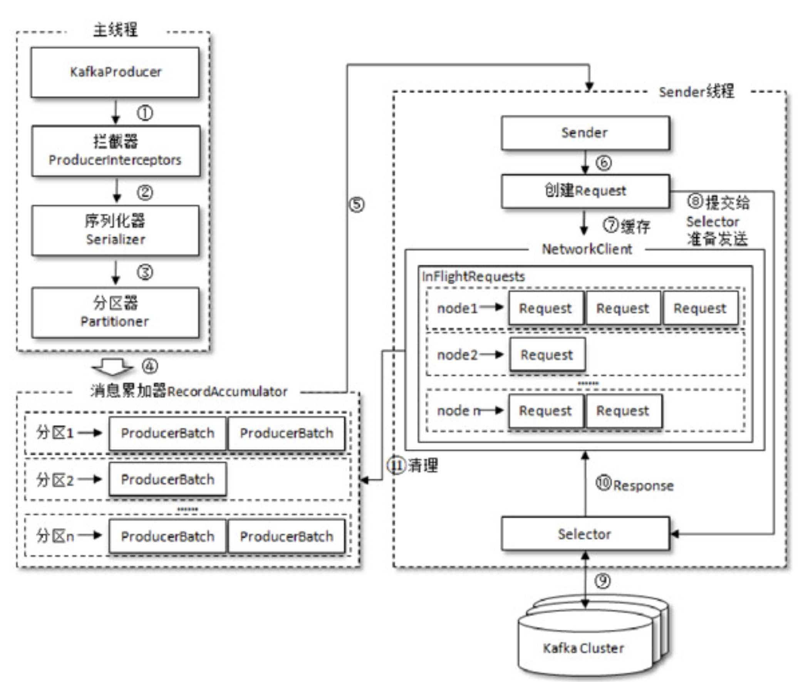
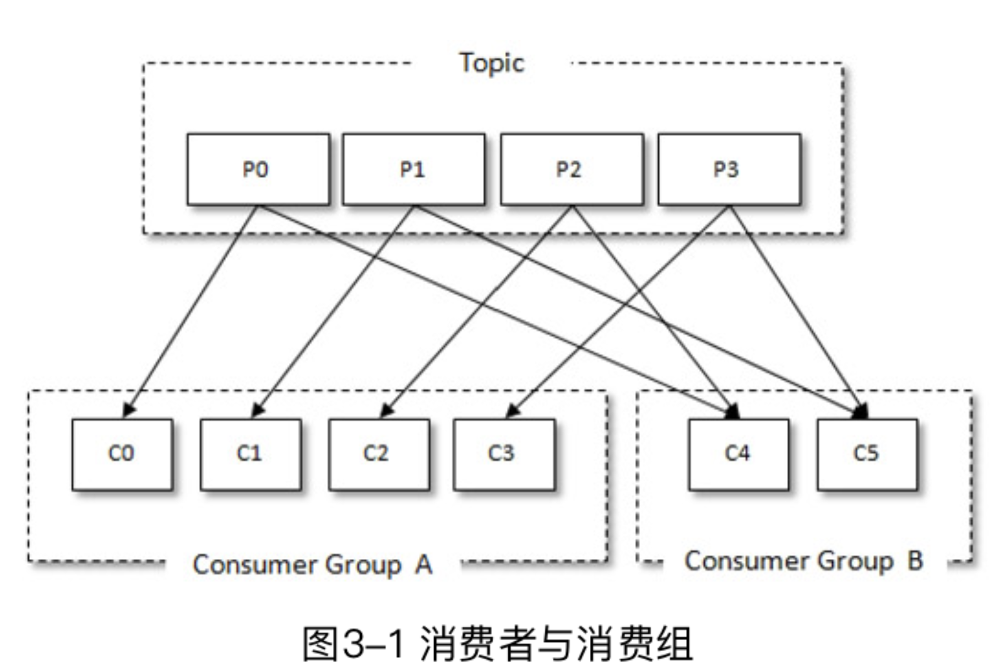

# 1. 初识 Kafka

- 消息系统: 还提供了顺序性保证和回溯消费的功能。
- 存储系统：持久化和多副本
- 流式处理平台：提供了完整的流式处理类库

本书代码：https://github.com/hiddenzzh/kafka_book_demo

### 1.1 基本概念

Producer, Broker, Consumer。通过 ZooKeeper 管理元数据、控制器的选举等操作。一个或者多个 Broker 组成了一个kafka集群。

- 主题(topic): 消息以主题为单位进行归纳，生产者发送消息到特定主题，消费者订阅主题并且消费
- 分区(partition): 一个主题只属于单个分区，同一个主题下的不同分区包含消息是不同的，在存储层可以看作一个可追加的日志文件。
消息追加的时候都会分配一个偏移量(offset)。offset是消息在分区中的唯一标识，通过它保证分区内的有序性。修改分区数量水平扩展。
分区有多副本机制(replica)，副本之间是一主多从关系，leader 负责写请求，follower同步消息。


# 2. 生产者

### 2.1 客户端开发

一个正常的生产逻辑需要具备以下几个步骤：

- （1）配置生产者客户端参数及创建相应的生产者实例。
- （2）构建待发送的消息。
- （3）发送消息。
- （4）关闭生产者实例。

发送消息主要有三种模式：发后即忘（fire-and-forget）、同步（sync）及异步（async）。

- fire-and-forget: 直接调用 send()
- sync: 调用 send 之后调用 get() 等待
- async: 传入回调 callback

```java
package chapter2;

import org.apache.kafka.clients.producer.*;
import org.apache.kafka.common.serialization.StringSerializer;

import java.util.Properties;
import java.util.concurrent.TimeUnit;

public class KafkaProducerAnalysis {
    public static final String brokerList = "localhost:9092";
    public static final String topic = "topic-demo";

    public static Properties initConfig() {
        Properties props = new Properties();
        props.put("bootstrap.servers", brokerList);
        props.put("key.serializer",
                "org.apache.kafka.common.serialization.StringSerializer");
        props.put("value.serializer",
                "org.apache.kafka.common.serialization.StringSerializer");
        props.put("client.id", "producer.client.id.demo");
        return props;
    }

    public static void main(String[] args) throws InterruptedException {
        Properties props = initConfig();
        KafkaProducer<String, String> producer = new KafkaProducer<>(props);

        ProducerRecord<String, String> record = new ProducerRecord<>(topic, "hello, Kafka!");
        try {
            producer.send(record);
//            producer.send(record, new Callback() {
//                @Override
//                public void onCompletion(RecordMetadata metadata, Exception exception) {
//                        System.out.println(metadata.partition() + ":" + metadata.offset());
//                    if (exception == null) {
//                    }
//                }
//            });
        } catch (Exception e) {
            e.printStackTrace();
        }
//        TimeUnit.SECONDS.sleep(5);
    }
}
```

自定义分区器的实现：


```java
package chapter2;

import org.apache.kafka.clients.producer.Partitioner;
import org.apache.kafka.common.Cluster;
import org.apache.kafka.common.PartitionInfo;
import org.apache.kafka.common.utils.Utils;

import java.util.List;
import java.util.Map;
import java.util.concurrent.atomic.AtomicInteger;

/*
 * 自定义分区器
 * props.put(ProducerConfig.PARTITIONER_CLASS_CONFIG, DemoPartitioner.class.getName());

*/
public class DemoPartitioner implements Partitioner {
    private final AtomicInteger counter = new AtomicInteger(0);

    @Override
    public int partition(String topic, Object key, byte[] keyBytes,
                         Object value, byte[] valueBytes, Cluster cluster) {
        List<PartitionInfo> partitions = cluster.partitionsForTopic(topic);
        int numPartitions = partitions.size();
        if (null == keyBytes) {
            return counter.getAndIncrement() % numPartitions;
        } else
            return Utils.toPositive(Utils.murmur2(keyBytes)) % numPartitions;
    }

    @Override
    public void close() {
    }

    @Override
    public void configure(Map<String, ?> configs) {
    }
}
```

### 2.2 原理分析



### 2.3 重要生产者参数

- acks: 指定分区中必须要有多少个副本接受这条消息，生产者才被认为写成功
- max.request.size: 限制生产者客户端能发送的消息的最大值。默认 1M
- retries, retry.backoff.ms: 生产者重试次数和间隔
- compression.type: 指定消息压缩方式，默认 "none"，还可以配置为 "gzip", "snappy", "lz4"
- connections.max.idle.ms: 多久关闭闲置的连接
- linger.ms: 指定生产者发送 ProducerBatch 之前等待更多消息 (ProducerRecord) 加入 ProducerBatch 的时间
- receive.buffer.bytes: socket 接受消息缓冲区(SO_RECBUF) 大小，默认 32kb
- send.buffer.bytes: 设置socket发送消息缓冲区(SO_SNDBUF) 大小，默认 128kb
- request.timeout.ms


# 3. 消费者

### 3.1 消费者和消费者组

每个消费者都有一个对应的消费者组(逻辑概念)，消息发布到topic 后，只会投递给订阅它的每个消费组中的一个消费者。



### 3.2 客户端开发

一个正常的消费逻辑需要具备以下几个步骤：

- （1）配置消费者客户端参数及创建相应的消费者实例。
- （2）订阅主题。
- （3）拉取消息并消费。
- （4）提交消费位移。
- （5）关闭消费者实例。

```java
package chapter3;

import lombok.extern.slf4j.Slf4j;
import org.apache.kafka.clients.consumer.ConsumerRecord;
import org.apache.kafka.clients.consumer.ConsumerRecords;
import org.apache.kafka.clients.consumer.KafkaConsumer;

import java.time.Duration;
import java.util.Arrays;
import java.util.Properties;
import java.util.concurrent.atomic.AtomicBoolean;

/**
 * 代码清单3-1
 * Created by 朱小厮 on 2018/7/22.
 */
@Slf4j
public class KafkaConsumerAnalysis {
    public static final String brokerList = "localhost:9092";
    public static final String topic = "topic-demo";
    public static final String groupId = "group.demo";
    public static final AtomicBoolean isRunning = new AtomicBoolean(true);

    public static Properties initConfig() {
        Properties props = new Properties();
        props.put("key.deserializer",
                "org.apache.kafka.common.serialization.StringDeserializer");
        props.put("value.deserializer",
                "org.apache.kafka.common.serialization.StringDeserializer");
        props.put("bootstrap.servers", brokerList);
        props.put("group.id", groupId); // 消费者组名称，设置成有业务意义的名字
        props.put("client.id", "consumer.client.id.demo");
        return props;
    }

    public static void main(String[] args) {
        Properties props = initConfig();
        KafkaConsumer<String, String> consumer = new KafkaConsumer<>(props);
        consumer.subscribe(Arrays.asList(topic)); // 订阅topic主题

        try {
            while (isRunning.get()) {
                ConsumerRecords<String, String> records =
                        consumer.poll(Duration.ofMillis(1000)); // 拉模式
                for (ConsumerRecord<String, String> record : records) {
                    System.out.println("topic = " + record.topic()
                            + ", partition = " + record.partition()
                            + ", offset = " + record.offset());
                    System.out.println("key = " + record.key()
                            + ", value = " + record.value());
                    //do something to process record.
                }
            }
        } catch (Exception e) {
            log.error("occur exception ", e);
        } finally {
            consumer.close();
        }
    }
}
```

消费者使用 offset 表示消费者消费到分区中某个消息所在的位置。消费者在消费完消息之后需要执行消费位移的提交。
默认有自动位移提交 enable.auto.commit 为 true。如果设置为 false 可以手动提交。 

- commitSync
- commitAsync

seek 方法可以从特定位置读取消息。

Producer 是非线程安全的。多线程消费，分区是消费线程的最小化分单位

# 4. 主题和分区
