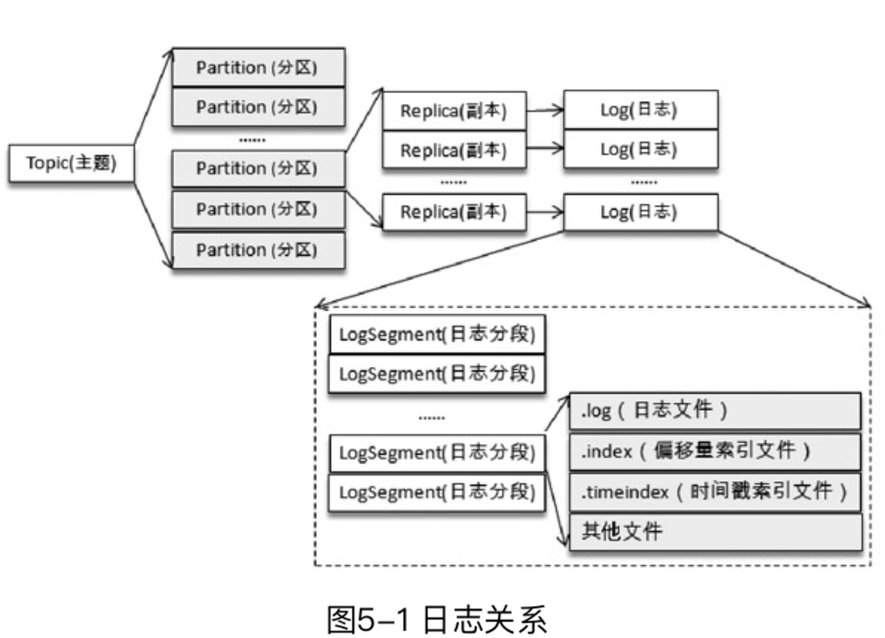
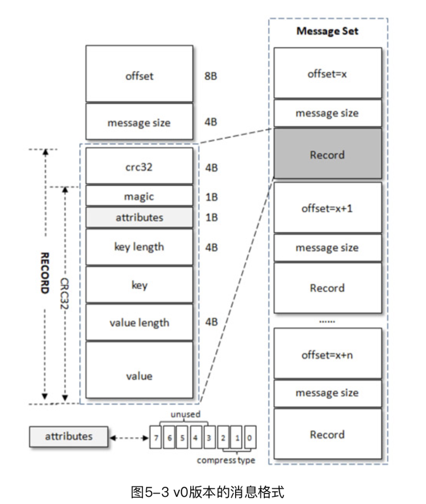
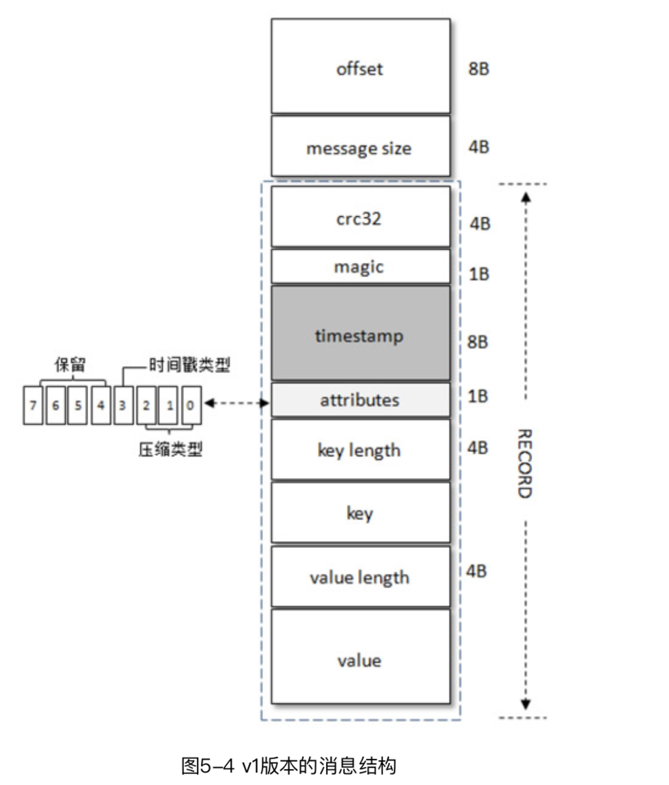

# 1. 初识 Kafka

- 消息系统: 还提供了顺序性保证和回溯消费的功能。
- 存储系统：持久化和多副本
- 流式处理平台：提供了完整的流式处理类库

本书代码：https://github.com/hiddenzzh/kafka_book_demo

1. leader会维护一个与其基本保持同步的Replica列表，该列表称为ISR(in-sync Replica)，每个Partition都会有一个ISR，而且是由leader动态维护
2. 如果一个follower比一个leader落后太多，或者超过一定时间未发起数据复制请求，则leader将其从ISR中移除
3. 当ISR中所有Replica都向Leader发送ACK时，leader才commit，这时候producer才能认为一个请求中的消息都commit了。

### 1.1 基本概念

Producer, Broker, Consumer。通过 ZooKeeper 管理元数据、控制器的选举等操作。一个或者多个 Broker 组成了一个kafka集群。

- 主题(topic): 消息以主题为单位进行归纳，生产者发送消息到特定主题，消费者订阅主题并且消费
- 分区(partition): 一个主题只属于单个分区，同一个主题下的不同分区包含消息是不同的，在存储层可以看作一个可追加的日志文件。
消息追加的时候都会分配一个偏移量(offset)。offset是消息在分区中的唯一标识，通过它保证分区内的有序性。修改分区数量水平扩展。
分区有多副本机制(replica)，副本之间是一主多从关系，leader 负责写请求，follower同步消息。


# 2. 生产者

### 2.1 客户端开发

一个正常的生产逻辑需要具备以下几个步骤：

- （1）配置生产者客户端参数及创建相应的生产者实例。
- （2）构建待发送的消息。
- （3）发送消息。
- （4）关闭生产者实例。

发送消息主要有三种模式：发后即忘（fire-and-forget）、同步（sync）及异步（async）。

- fire-and-forget: 直接调用 send()
- sync: 调用 send 之后调用 get() 等待
- async: 传入回调 callback

```java
package chapter2;

import org.apache.kafka.clients.producer.*;
import org.apache.kafka.common.serialization.StringSerializer;

import java.util.Properties;
import java.util.concurrent.TimeUnit;

public class KafkaProducerAnalysis {
    public static final String brokerList = "localhost:9092";
    public static final String topic = "topic-demo";

    public static Properties initConfig() {
        Properties props = new Properties();
        props.put("bootstrap.servers", brokerList);
        props.put("key.serializer",
                "org.apache.kafka.common.serialization.StringSerializer");
        props.put("value.serializer",
                "org.apache.kafka.common.serialization.StringSerializer");
        props.put("client.id", "producer.client.id.demo");
        return props;
    }

    public static void main(String[] args) throws InterruptedException {
        Properties props = initConfig();
        KafkaProducer<String, String> producer = new KafkaProducer<>(props);

        ProducerRecord<String, String> record = new ProducerRecord<>(topic, "hello, Kafka!");
        try {
            producer.send(record);
//            producer.send(record, new Callback() {
//                @Override
//                public void onCompletion(RecordMetadata metadata, Exception exception) {
//                        System.out.println(metadata.partition() + ":" + metadata.offset());
//                    if (exception == null) {
//                    }
//                }
//            });
        } catch (Exception e) {
            e.printStackTrace();
        }
//        TimeUnit.SECONDS.sleep(5);
    }
}
```

自定义分区器的实现：


```java
package chapter2;

import org.apache.kafka.clients.producer.Partitioner;
import org.apache.kafka.common.Cluster;
import org.apache.kafka.common.PartitionInfo;
import org.apache.kafka.common.utils.Utils;

import java.util.List;
import java.util.Map;
import java.util.concurrent.atomic.AtomicInteger;

/*
 * 自定义分区器
 * props.put(ProducerConfig.PARTITIONER_CLASS_CONFIG, DemoPartitioner.class.getName());

*/
public class DemoPartitioner implements Partitioner {
    private final AtomicInteger counter = new AtomicInteger(0);

    @Override
    public int partition(String topic, Object key, byte[] keyBytes,
                         Object value, byte[] valueBytes, Cluster cluster) {
        List<PartitionInfo> partitions = cluster.partitionsForTopic(topic);
        int numPartitions = partitions.size();
        if (null == keyBytes) {
            return counter.getAndIncrement() % numPartitions;
        } else
            return Utils.toPositive(Utils.murmur2(keyBytes)) % numPartitions;
    }

    @Override
    public void close() {
    }

    @Override
    public void configure(Map<String, ?> configs) {
    }
}
```

### 2.2 原理分析


### 2.3 重要生产者参数

- acks: 指定分区中必须要有多少个副本接受这条消息，生产者才被认为写成功
- max.request.size: 限制生产者客户端能发送的消息的最大值。默认 1M
- retries, retry.backoff.ms: 生产者重试次数和间隔
- compression.type: 指定消息压缩方式，默认 "none"，还可以配置为 "gzip", "snappy", "lz4"
- connections.max.idle.ms: 多久关闭闲置的连接
- linger.ms: 指定生产者发送 ProducerBatch 之前等待更多消息 (ProducerRecord) 加入 ProducerBatch 的时间
- receive.buffer.bytes: socket 接受消息缓冲区(SO_RECBUF) 大小，默认 32kb
- send.buffer.bytes: 设置socket发送消息缓冲区(SO_SNDBUF) 大小，默认 128kb
- request.timeout.ms


# 3. 消费者

### 3.1 消费者和消费者组

每个消费者都有一个对应的消费者组(逻辑概念)，消息发布到topic 后，只会投递给订阅它的每个消费组中的一个消费者。
消费者组是Kafka实现单播和广播两种消息模型的手段。同一个topic，每个消费者组都可以拿到相同的全部数据。


### 3.2 客户端开发

一个正常的消费逻辑需要具备以下几个步骤：

- （1）配置消费者客户端参数及创建相应的消费者实例。
- （2）订阅主题。
- （3）拉取消息并消费。
- （4）提交消费位移。
- （5）关闭消费者实例。

```java
package chapter3;

import lombok.extern.slf4j.Slf4j;
import org.apache.kafka.clients.consumer.ConsumerRecord;
import org.apache.kafka.clients.consumer.ConsumerRecords;
import org.apache.kafka.clients.consumer.KafkaConsumer;

import java.time.Duration;
import java.util.Arrays;
import java.util.Properties;
import java.util.concurrent.atomic.AtomicBoolean;

/**
 * 代码清单3-1
 * Created by 朱小厮 on 2018/7/22.
 */
@Slf4j
public class KafkaConsumerAnalysis {
    public static final String brokerList = "localhost:9092";
    public static final String topic = "topic-demo";
    public static final String groupId = "group.demo";
    public static final AtomicBoolean isRunning = new AtomicBoolean(true);

    public static Properties initConfig() {
        Properties props = new Properties();
        props.put("key.deserializer",
                "org.apache.kafka.common.serialization.StringDeserializer");
        props.put("value.deserializer",
                "org.apache.kafka.common.serialization.StringDeserializer");
        props.put("bootstrap.servers", brokerList);
        props.put("group.id", groupId); // 消费者组名称，设置成有业务意义的名字
        props.put("client.id", "consumer.client.id.demo");
        return props;
    }

    public static void main(String[] args) {
        Properties props = initConfig();
        KafkaConsumer<String, String> consumer = new KafkaConsumer<>(props);
        consumer.subscribe(Arrays.asList(topic)); // 订阅topic主题

        try {
            while (isRunning.get()) {
                ConsumerRecords<String, String> records =
                        consumer.poll(Duration.ofMillis(1000)); // 拉模式
                for (ConsumerRecord<String, String> record : records) {
                    System.out.println("topic = " + record.topic()
                            + ", partition = " + record.partition()
                            + ", offset = " + record.offset());
                    System.out.println("key = " + record.key()
                            + ", value = " + record.value());
                    //do something to process record.
                }
            }
        } catch (Exception e) {
            log.error("occur exception ", e);
        } finally {
            consumer.close();
        }
    }
}
```

消费者使用 offset 表示消费者消费到分区中某个消息所在的位置。消费者在消费完消息之后需要执行消费位移的提交。
默认有自动位移提交 enable.auto.commit 为 true。如果设置为 false 可以手动提交。

- commitSync
- commitAsync

seek 方法可以从特定位置读取消息。

Producer 是非线程安全的。多线程消费，分区是消费线程的最小化分单位


# 4. 主题和分区

### 4.1 主题管理

```
kafka-topics.sh --zookeeper localhost:2181/kafka--create --topic topic-create --partitions 4 --replication-factor 2
```

### KafkaAdminClient


```java
package chapter4;

import org.apache.kafka.clients.admin.*;
import org.apache.kafka.common.config.ConfigResource;

import java.util.Collections;
import java.util.HashMap;
import java.util.Map;
import java.util.Properties;
import java.util.concurrent.ExecutionException;

public class KafkaAdminConfigOperation {

    public static void main(String[] args) throws ExecutionException, InterruptedException {
        describeTopicConfig();
    }

    //Config(entries=[ConfigEntry(name=compression.type, value=producer, source=DEFAULT_CONFIG, isSensitive=false, isReadOnly=false, synonyms=[]), ConfigEntry(name=leader.replication.throttled.replicas, value=, source=DEFAULT_CONFIG, isSensitive=false, isReadOnly=false, synonyms=[]), ConfigEntry(name=message.downconversion.enable, value=true, source=DEFAULT_CONFIG, isSensitive=false, isReadOnly=false, synonyms=[]), ConfigEntry(name=min.insync.replicas, value=1, source=DEFAULT_CONFIG, isSensitive=false, isReadOnly=false, synonyms=[]), ConfigEntry(name=segment.jitter.ms, value=0, source=DEFAULT_CONFIG, isSensitive=false, isReadOnly=false, synonyms=[]), ConfigEntry(name=cleanup.policy, value=delete, source=DEFAULT_CONFIG, isSensitive=false, isReadOnly=false, synonyms=[]), ConfigEntry(name=flush.ms, value=9223372036854775807, source=DEFAULT_CONFIG, isSensitive=false, isReadOnly=false, synonyms=[]), ConfigEntry(name=follower.replication.throttled.replicas, value=, source=DEFAULT_CONFIG, isSensitive=false, isReadOnly=false, synonyms=[]), ConfigEntry(name=segment.bytes, value=1073741824, source=STATIC_BROKER_CONFIG, isSensitive=false, isReadOnly=false, synonyms=[]), ConfigEntry(name=retention.ms, value=604800000, source=DEFAULT_CONFIG, isSensitive=false, isReadOnly=false, synonyms=[]), ConfigEntry(name=flush.messages, value=9223372036854775807, source=DEFAULT_CONFIG, isSensitive=false, isReadOnly=false, synonyms=[]), ConfigEntry(name=message.format.version, value=2.0-IV1, source=DEFAULT_CONFIG, isSensitive=false, isReadOnly=false, synonyms=[]), ConfigEntry(name=file.delete.delay.ms, value=60000, source=DEFAULT_CONFIG, isSensitive=false, isReadOnly=false, synonyms=[]), ConfigEntry(name=max.message.bytes, value=1000012, source=DEFAULT_CONFIG, isSensitive=false, isReadOnly=false, synonyms=[]), ConfigEntry(name=min.compaction.lag.ms, value=0, source=DEFAULT_CONFIG, isSensitive=false, isReadOnly=false, synonyms=[]), ConfigEntry(name=message.timestamp.type, value=CreateTime, source=DEFAULT_CONFIG, isSensitive=false, isReadOnly=false, synonyms=[]), ConfigEntry(name=preallocate, value=false, source=DEFAULT_CONFIG, isSensitive=false, isReadOnly=false, synonyms=[]), ConfigEntry(name=min.cleanable.dirty.ratio, value=0.5, source=DEFAULT_CONFIG, isSensitive=false, isReadOnly=false, synonyms=[]), ConfigEntry(name=index.interval.bytes, value=4096, source=DEFAULT_CONFIG, isSensitive=false, isReadOnly=false, synonyms=[]), ConfigEntry(name=unclean.leader.election.enable, value=false, source=DEFAULT_CONFIG, isSensitive=false, isReadOnly=false, synonyms=[]), ConfigEntry(name=retention.bytes, value=-1, source=DEFAULT_CONFIG, isSensitive=false, isReadOnly=false, synonyms=[]), ConfigEntry(name=delete.retention.ms, value=86400000, source=DEFAULT_CONFIG, isSensitive=false, isReadOnly=false, synonyms=[]), ConfigEntry(name=segment.ms, value=604800000, source=DEFAULT_CONFIG, isSensitive=false, isReadOnly=false, synonyms=[]), ConfigEntry(name=message.timestamp.difference.max.ms, value=9223372036854775807, source=DEFAULT_CONFIG, isSensitive=false, isReadOnly=false, synonyms=[]), ConfigEntry(name=segment.index.bytes, value=10485760, source=DEFAULT_CONFIG, isSensitive=false, isReadOnly=false, synonyms=[])])
    public static void describeTopicConfig() throws ExecutionException,
            InterruptedException {
        String brokerList =  "localhost:9092";
        String topic = "topic-admin";

        Properties props = new Properties();
        props.put(AdminClientConfig.BOOTSTRAP_SERVERS_CONFIG, brokerList);
        props.put(AdminClientConfig.REQUEST_TIMEOUT_MS_CONFIG, 30000);
        AdminClient client = AdminClient.create(props);

        ConfigResource resource =
                new ConfigResource(ConfigResource.Type.TOPIC, topic);
        DescribeConfigsResult result =
                client.describeConfigs(Collections.singleton(resource));
        Config config = result.all().get().get(resource);
        System.out.println(config);
        client.close();
    }
}
```

### 4.3 分区的管理

只有 leader 副本对外提供读写服务，flollwer 副本只负责内部进行消息的同步。

### 4.4 选择合适分区数

- kafka-producer-perf-test.sh
- kafka-consumer-perf-test.sh

分区越多吞吐越高么？一旦分区数目超过某个阈值之后，相应的吞吐量也会下降。
建议用同样的机器配置做一个吞吐量测试。
一般情况下，根据预估的吞吐量及是否与key相关的规则来设定分区数即可，后期可以通过增加分区数、增加broker或分区重分配等手段来进行改进。如果一定要给一个准则，则建议将分区数设定为集群中broker的倍数，即假定集群中有3个broker节点，可以设定分区数为3、6、9等，至于倍数的选定可以参考预估的吞吐量。


# 5. 日志存储

### 5.1 文件目录布局



### 5.2 日志格式演变



v1 就比 v0 多了时间戳



kafka 实现的压缩方式是将多条一起压缩，在 broker 也是保持压缩状态，在端到端之间做压缩和解压。
配置 compression.type 配置压缩方式或者不压缩。

1[](./5-7消息v2.png)

### 5.3 日志索引

- 偏移量索引文件用来建立消息偏移量（offset）到物理地址之间的映射关系，方便快速定位消息所在的物理文件位置；
- 时间戳索引文件则根据指定的时间戳（timestamp）来查找对应的偏移量信息。

### 5.4 日志清理

kafka 提供了两种日志清理策略：

- 日志删除(log retention): 删除不符合条件的日志分段
- 日志压缩(log compaction): 针对每个消息的 key 进行整合，对于相同 key 的不同 value 值，只保留最后一个版本

### 5.5 磁盘存储

顺序写磁盘速度很快，甚至比 随机 写内存快。kafka 使用顺序追加、页缓存、零拷贝等技术提升性能。

- 页缓存：磁盘中的数据缓存到内存中。kafka 中大量使用页缓存是其实现高吞吐的重要因素之一
- 磁盘 IO。linux 磁盘 io 策略
- 零拷贝(zero-copy)。将数据直接从磁盘文件复制到网卡设备中，减少内核和用户模式之间的上下文切换。依赖 linux sendfile()。
zero-copy 通过 DMA(Direct Memroy Access)技术将文件内容复制到内核模式下的 read buffer 中。


# 6. 深入服务端

### 6.1 协议设计
kafka 自定义了一组基于 tcp 的二进制协议，遵守协议就可以发消息给 kafka。每种协议类型由对应的请求和响应。
Request 包含请求头和请求体。

### 6.2 时间轮

基于时间轮自定义实现了一个用于延时功能的定时器(SystemTimer)，插入和删除O(1)。
Kafka 中的时间轮(TimingWheel)是一个存储定时任务的环形队列，底层采用数组实现，数组中的每个元素可以存放一个
定时任务列表(TimerTaskList)，TimerTaskList是一个环形的双向链表，链表每一项都是定时任务项(TimerTaskEntry)，
其中封装了真正的定时任务（TimerTask)。

### 6.3 延时操作

### 6.4 控制器
kafka集群中会有一个或者多个 broker，其中一个 broker 会被选举为控制器(kafka controller)，负责管理整个集群中所有分区和副本的状态。

合理关闭： kafka-server-stop.sh 修改脚本

### 6.5 参数解密


# 7. 深入客户端

### 7.1 分区分配策略

partition.assignment.strategy 设置消费者和订阅主题之间的分区分配策略:

- RangeAssignor: 按照消费者总数和分区总数进行整除运算来获得一个跨度，然后将分区按照跨度平均分配
- RoundRobinAssignor: 将消费组内所有消费者和消费者订阅的所有主题的分区按照字典序排序，轮询将分区依次分配给每个消费者
- StickyAssignor: 目的分区尽可能均匀；尽可能和上次分配一致

### 7.2 消费者协调器和组协调器

GroupCoordinator 是 kafka 服务端用于管理消费组的组件，消费者客户端中的 ConsumerCoordinator 组件负责和 GroupCoordinator 交互。
如果消费者发生变化触发再均衡操作。

### 7.3 __consumer_offsets 剖析

位移提交最终会保存到 kafka 内部主题 __consumer_offsets 中。
使用 kafka-console-consumer.sh 查看  __consumer_offsets 中的内容。

### 7.4 事务

消息传输保障有 3 个层级：

- at most once(至多一次)：消息可能丢失，但是绝对不会重复传输
- at least once(最少一次)：消息绝不会丢失，但是可能重复传输
- exactly once(恰好一次)：每条消息肯定会被传输一次且仅传输一次

kafka 从0.11.0.0 版本引入了幂等和事务这两个特性，一次实现 EOS(exactly once semantics)。

幂等：多次调用的结果和调用一次一致。只需要设置客户端参数 `properties.put("enable.idempotence", true);`
kafka 为了实现生产者幂等，引入了 producer id 和序列号 sequence number 两个概念。
broker 会在内存中为每一对 <PID, 分区> 维护一个序列号，只有消息序列号的值(SN_new)比 broker 中维护的 SN_old 大 1，
broker 才会接受。(SN_new=SN_old+1)。

kafka 幂等只能保证单个生产者会话 (session) 中单分区的幂等。

事务可以保证多个分区写入操作的原子性。通过客户端参数显示设置 `properties.put("transactional.id", "transactionId")`，
同时也要打开幂等特性。


# 8. 可靠性探究

### 8.1 副本剖析

当 ISR 集合中的一个 follower 副本滞后 leader 副本的时间超过 replica.lag.time.max.ms 指定的值判定为同步失败。

### 8.2 日志同步机制

kafka 使用的更像是微软的 PacificA 算法。

### 8.3 可靠性分析

- 副本数：一般设置副本数为 3 可以满足大部分场景对可靠性的要求，国内部分银行会设置副本数为 5 提升可靠性。
- 客户端 acks 设置。如果 acks=-1 leader 副本在写入本地日志之后还要等待 ISR 中的 follower 副本全部同步完成才告知生产者成功提交
- 设置同步刷盘策略（一般应该由多副本保证），broker 参数 log.flush.interval.messages 和 log.flush.interval.ms
  调整同步刷盘策略，不过会比较损耗性能。
- 开启 enable.auto.commit 自动位移提交功能可能导致 重复消费和消息丢失的问题。


# 9. Kafka 应用

### 9.1 命令行工具

位于 $KAFKA_HOME/bin 目录下的命令行工具

- kafka.consumer-groups.sh 查看或者变更消费组信息
- kafka-consumer.groups.sh 重置消费者组内消费位移
- kafka-delete-records.sh 删除指定位置前的消息

### 9.2 Kafka Connect

Kafka Connect 为在 kafka 和外部数据库存储系统之间移动数据提供了一种可靠的可伸缩的实现方式。
包含两个核心概念：Source 负责导入数据到 kafka，Sink 负责从 kafka 导出数据。

connect-standalone.sh 实现独立模式运行 kafka connect。

### 9.3 Kafka Mirror Maker

用于两个集群之间同步数据的一个工具。kafka-mirror-maker.sh

### 9.4 Kafka Streams

高吞吐、高可用、低延时让 kafka 成为流式处理系统中完美的数据来源。
Kafka Streams 是一个用于处理和分析数据的客户端库。它先把存储在 kafka 中的数据进行处理和分析，然后将最终所得到的的数据
结果回写到 kafka 或发送到外部系统。


# 10. Kafka 监控

监控维度：集群信息、broker 信息、主题信息和消费组信息。一般还好配置告警模块

### 10.1 监控数据来源

集群层面的指标可以用 JMX (Java Managment Extension， Java 管理扩展)来获取。

### 10.2 消费滞后

消息中间件中留存的消息与消费的消息之间的差值就是消息堆积量，也成为消费之后（Lag）量。

### 10.3 同步失效分区

处于同步失效或功能失效的副本统称为失效副本，包含它的分区就是同步失效分区。

### 10.4 监控指标说明

### 10.5 监控模块

监控架构主要分为数据采集、数据存储、数据展示三个部分。


# 11. 高级应用

### 11.1 过期时间（TTL)

TTL(Time To Live，过期时间)。通过在消费者客户端拦截器实现

### 11.2 延时队列

延时消息是消费者等待特定时间之后，才能获取这个消息进行消费。如下场景：

- 订单系统，客户下单之后有 30 分钟进行支付，如果没有成功支付，对这个订单进行异常处理，就可以用延时队列处理这些订单
- 订单完成之后 1 小时通知用户进行评价
- 遥控智能设备，指定时间之后执行操作

可行的方案：发送延时消息的时候先投递到一个 kafka 内部主题(比如delay_topic)中，然后通过一个自定义的服务拉取这些内部主题
中的消息，并将满足条件的消息投递到真实的主题中，消费者订阅的还是真实的主题。

### 11.3 死信队列和重试队列

由于某些原因消息无法被正确投递，为了确保消息不会无故丢弃，一般放到一个特殊的队列称为死信队列。
后续可以通过消费这个死信队列中的内容来分析当时遇到的异常情况，改善和优化系统。

### 11.4 消息路由

kafka 默认用主题进行路由，但是如果还想进一步消息路由，需要自己实现。
可以在消息headers中加入一个键为 "routingkey"、值为特定业务表示的 Header，然后消费端中使用拦截器挑选特定业务标识的消息。

### 11.5 消息轨迹

通过封装客户端，保证正常生产消费的同时添加相应的轨迹信息埋点逻辑。

### 11.6 消息审计

消息生产、存储和消费的整个过程之间对消息个数和延迟的审计，以此检测是否有消息丢失、是否数据重复、端到端延迟等内容。

### 11.7 消息代理

Kafka Rest Proxy 可以不用客户端的情况下实现发送消息、消费消息、查看集群状态、执行管理操作等功能。

### 11.8 消息中间件选型

RabbitMQ/Kafka/RocketMQ

选型维度：

- 功能维度
  - 优先级队列
  - 延时队列
  - 重试队列
  - 死信队列
  - 消费模式: push/pull
  - 广播消费: 点对点(p2p)，还是发布订阅(Pub/Sub)
  - 回溯消费
  - 消息堆积+持久化
  - 消息轨迹
  - 消息审计
  - 消息过滤
  - 多租户。
  - 多协议支持
  - 跨语言支持
  - 流量控制：调整发送速度。通常的流控方法有 stop-and-wait，滑动窗口、令牌桶等
  - 消息顺序性
  - 安全机制
  - 消息幂等性。消息语义：至多一次；至少一次；精确一次
  - 事务性消息：要么发送成功，要么失败
- 性能维度
- 可靠性和可用性。金融支付领域 RabbitMQ 多，日志处理、大数据 kafka 多。
- 运维管理。申请、审核、监控、告警、管理、容灾、部署等
- 社区和生态


# 12. Kafka 和 Spark 集成
