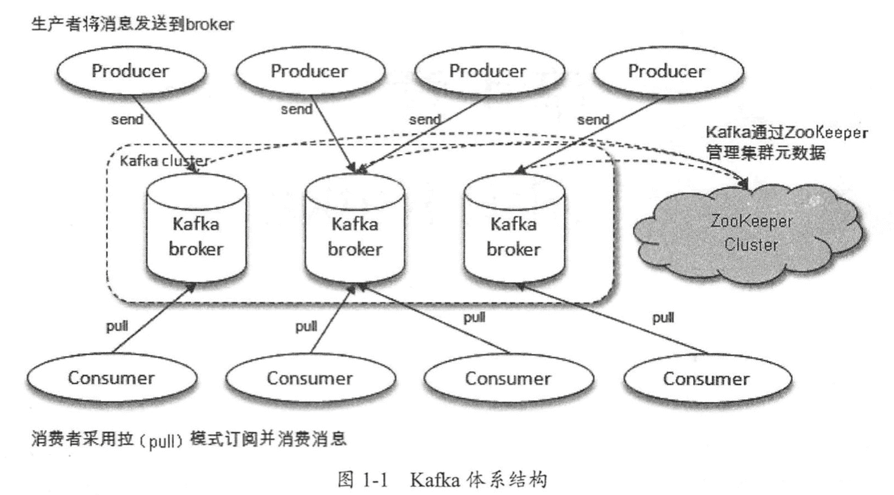
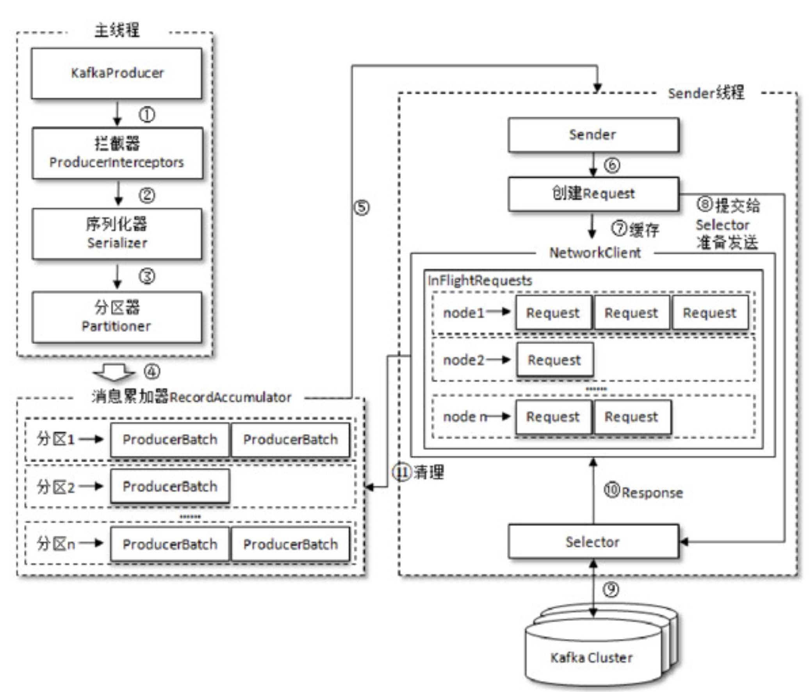
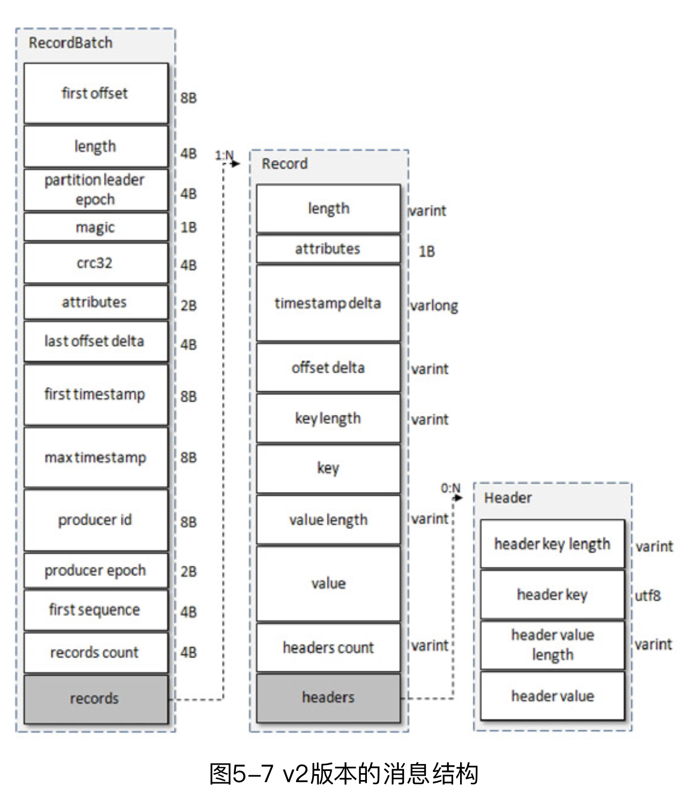
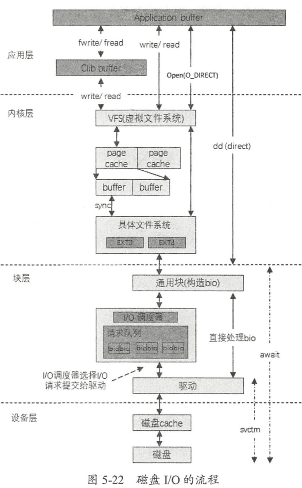
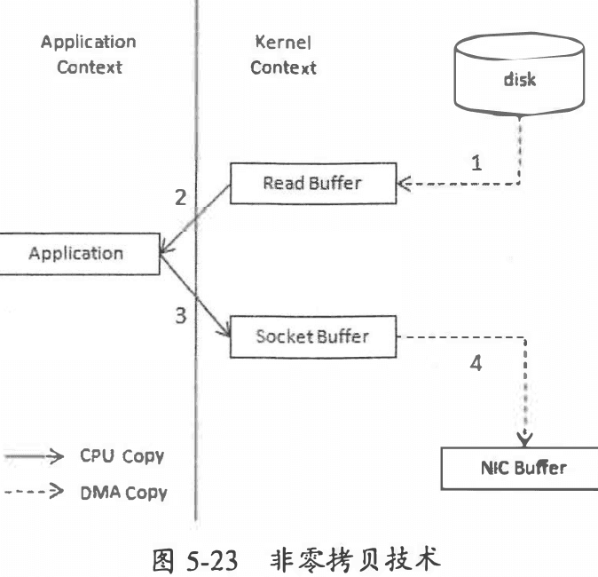
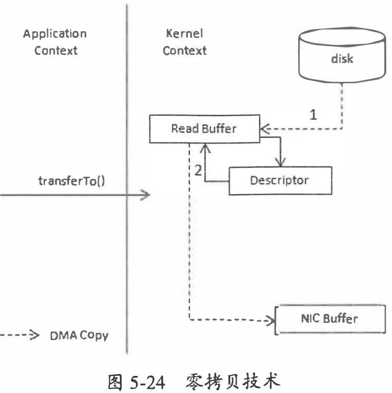
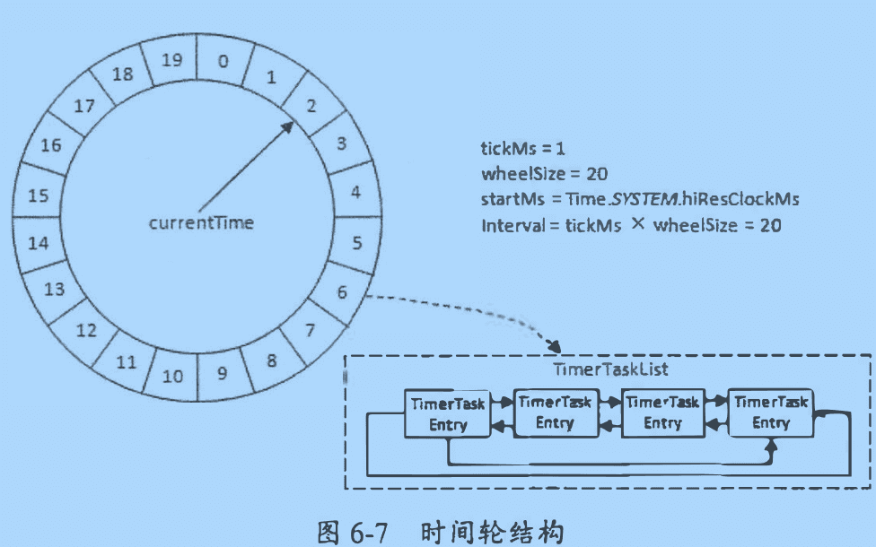
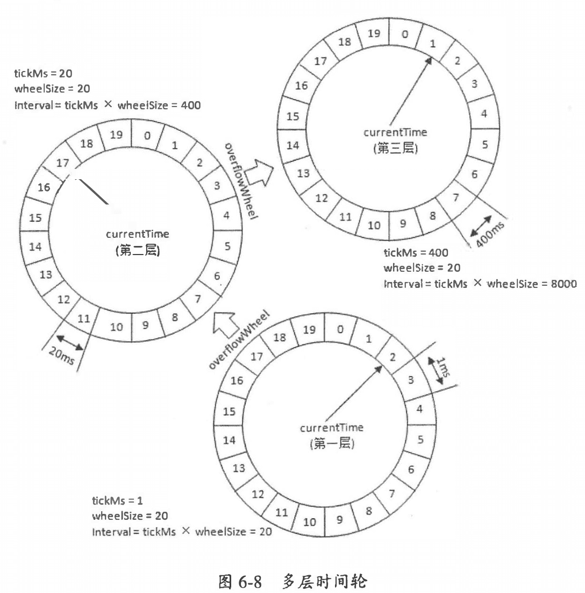

# 1. 初识 Kafka

- 消息系统: 还提供了顺序性保证和回溯消费的功能。系统解耦，冗余存储、削峰、缓冲、异步通信、扩展性、可恢复性等
- 存储系统：持久化和多副本
- 流式处理平台：提供了完整的流式处理类库

本书代码：https://github.com/hiddenzzh/kafka_book_demo

1. leader会维护一个与其基本保持同步的Replica列表，该列表称为ISR(in-sync Replica)，每个Partition都会有一个ISR，而且是由leader动态维护
2. 如果一个follower比一个leader落后太多，或者超过一定时间未发起数据复制请求，则leader将其从ISR中移除
3. 当ISR中所有Replica都向Leader发送ACK时，leader才commit，这时候producer才能认为一个请求中的消息都commit了。

## 1.1 基本概念

Producer, Broker, Consumer。通过 ZooKeeper 管理元数据、控制器的选举等操作。一个或者多个 Broker 组成了一个kafka集群。



- 主题(topic): 消息以主题为单位进行归纳，生产者发送消息到特定主题，消费者订阅主题并且消费
- 分区(partition): 一个主题只属于单个分区，同一个主题下的不同分区包含消息是不同的，在存储层可以看作一个可追加的日志文件。
消息追加的时候都会分配一个偏移量(offset)。offset是消息在分区中的唯一标识，通过它保证分区内的有序性。修改分区数量水平扩展。
分区有多副本机制(replica)，副本之间是一主多从关系，leader 负责写请求，follower同步消息。leader失败后从follower选举
leader 对外服务。

分区中所有副本统称为AR(Assigned Replicas)，所有与 leader 副本保持一定程度同步的副本（包括 leader 副本）组成 ISR (In-Sync Replicas)。
与 leader 副本同步之后过多的副本（不包括 leader副本）组成 OSR(Out-of-Sync Replicas)。 AR=ISR+OSR ，正常情况下 AR=ISR。

- HW(Hight watermark)高水位，标识一个特定的消息偏移量(offset)，消费者只能拉取到这个 offset 之后的消息。
- LEO(Log End Offset)，标识当前日志中下一条待写入消息的 offset


## 1.3 生产与消费

```sh
# 创建分区数是 4，副本因子 3 的 topic (topic-demo)
bin/kafka-topics.sh --zookeeper localhost: 2181/kafka --create --topic topic-demo --replication-factor 3 --partitions 4
# 订阅
bin/kafka console co口sumer. sh --bootstrap- server localhost:9092 --topic topic-demo
# 发送消息
bin/kafka-console-producer.sh --broker-list localhost: 9092 topic top工c-demo
```

## 1.4 服务端参数配置

配置路径 `$KAFKA_HOME/config/server.properties`


# 2. 生产者

## 2.1 客户端开发

一个正常的生产逻辑需要具备以下几个步骤：

- （1）配置生产者客户端参数及创建相应的生产者实例。
- （2）构建待发送的消息。
- （3）发送消息。
- （4）关闭生产者实例。

发送消息主要有三种模式：发后即忘（fire-and-forget）、同步（sync）及异步（async）。

- fire-and-forget: 直接调用 send()。 性能最高，可靠性最差
- sync: 调用 send 之后调用 get() 等待
- async: 传入回调 callback。Kafka 在返回响应时调用该函数来实现异步的发送确认。并且回调函数的的调用也保证分区有序

KafkaProducer中一般会 发生两种类型 的异常:可重试的异常和不可重试的异常。常见的可 重试异常有:NetworkException、LeaderNotAvailableException, UnknownTopicOrPart廿ionException、
NotEnoughReplicasException、NotCoordinatorException 等。可以配置重试次数

```java
package chapter2;

import org.apache.kafka.clients.producer.*;
import org.apache.kafka.common.serialization.StringSerializer;

import java.util.Properties;
import java.util.concurrent.TimeUnit;

public class KafkaProducerAnalysis {
    public static final String brokerList = "localhost:9092";
    public static final String topic = "topic-demo";

    public static Properties initConfig() {
        Properties props = new Properties();
        props.put("bootstrap.servers", brokerList);
        props.put("key.serializer",
                "org.apache.kafka.common.serialization.StringSerializer");
        props.put("value.serializer",
                "org.apache.kafka.common.serialization.StringSerializer");
        props.put("client.id", "producer.client.id.demo");
        return props;
    }

    public static void main(String[] args) throws InterruptedException {
        Properties props = initConfig();
        KafkaProducer<String, String> producer = new KafkaProducer<>(props);

        ProducerRecord<String, String> record = new ProducerRecord<>(topic, "hello, Kafka!");
        try {
            producer.send(record);
//            producer.send(record, new Callback() {
//                @Override
//                public void onCompletion(RecordMetadata metadata, Exception exception) {
//                        System.out.println(metadata.partition() + ":" + metadata.offset());
//                    if (exception == null) {
//                    }
//                }
//            });
        } catch (Exception e) {
            e.printStackTrace();
        }
//        TimeUnit.SECONDS.sleep(5);
    }
}
```

### 2.1.4 分区器

消息在通过send()方法发往broker 的过程中， 有可能需要经过拦截器(Interceptor)、 序列 化器(Serializer)和分区器(Part山oner)的一 系列作用之后才能被真正地发往 broker。
如果 key 不为 null，那 么默认的分区器会对 key 进行哈 希(采 用 MurmurHash2 算法 ，具备高运算性能及低碰撞率)，
最终根据得到 的哈希值来计算分区号， 拥有相同 key 的消息会被写入同一个分区 。 如果 key 为 null，那么消息将会以轮询的方式发往主题内的各个可用分区。

自定义分区器的实现：

```java
package chapter2;

import org.apache.kafka.clients.producer.Partitioner;
import org.apache.kafka.common.Cluster;
import org.apache.kafka.common.PartitionInfo;
import org.apache.kafka.common.utils.Utils;

import java.util.List;
import java.util.Map;
import java.util.concurrent.atomic.AtomicInteger;

/*
 * 自定义分区器。需要通过配置参数 partitioner. class 来显式 指定 这个分区器
 # 比如一般大型电商都有多个仓库，可以将仓库的名称或 ID作为 key来灵活地记录 商品信息。
 * props.put(ProducerConfig.PARTITIONER_CLASS_CONFIG, DemoPartitioner.class.getName());
*/
public class DemoPartitioner implements Partitioner {
    private final AtomicInteger counter = new AtomicInteger(0);

    @Override
    public int partition(String topic, Object key, byte[] keyBytes,
                         Object value, byte[] valueBytes, Cluster cluster) {
        List<PartitionInfo> partitions = cluster.partitionsForTopic(topic);
        int numPartitions = partitions.size();
        if (null == keyBytes) {
            return counter.getAndIncrement() % numPartitions;
        } else
            return Utils.toPositive(Utils.murmur2(keyBytes)) % numPartitions;
    }

    @Override
    public void close() {
    }

    @Override
    public void configure(Map<String, ?> configs) {
    }
}
```
### 生产者拦截器

生产者拦截器既可以用来在消息发送前做一些准备工作， 比如按照某个规则过滤不符合要 求的消息、修改消息的内容等，
也可以用来在发送回调逻辑前做一些定制化的需求，比如统计类工作。

## 2.2 原理分析




## 2.3 重要生产者参数

- acks: 指定分区中必须要有多少个副本接受这条消息，生产者才被认为写成功。 acks 是生产者客户端中一个非常重要 的参数 ，它涉及消息的可靠性和吞吐 量之间的权衡。 acks参数有3种类型的值(都是字符串类型)
  - acks="1" (默认)。生产者发送消息之后，只要分区的 leader副本成功写入消息，那么它就会收到来自服务端的成功响应。
    折中方案。消息写入 leader 副本并 返回成功响应给生产者，且在被其他 follower 副本拉取之前 leader 副本崩溃，那么此 时消息还是会丢失
  - acks="0" 。生产者发送消息之后不需要等待任何服务端的响应。最大吞吐
  - acks="-1/all"。生产者在消息发送之后，需要等待 ISR 中的所有副本都成功 写入消息之后才能够收到来自服务端的成功响应。(最高可靠,leader宕机也不丢失，生产者收到异常告知此次发送失败)
- max.request.size: 限制生产者客户端能发送的消息的最大值。默认 1M
- retries, retry.backoff.ms: 生产者重试次数和间隔。在需要保证消息顺序的场合建议把参数 max.in.flight . requests .per.connection 配置为 1
- compression.type: 指定消息压缩方式，默认 "none"，还可以配置为 "gzip", "snappy", "lz4"
- connections.max.idle.ms: 多久关闭闲置的连接
- linger.ms: 指定生产者发送 ProducerBatch 之前等待更多消息 (ProducerRecord) 加入 ProducerBatch 的时间
  - 生产者客户端会在 ProducerBatch 被填满或等待时间超过 linger .ms 值时发迭出去。增大这个参数的值会增加消息的延迟，但是同时能提升一定的吞 吐量。 这个linger.ms参数与TCP协议中的Nagle算法有异曲同工之妙。
- receive.buffer.bytes: socket 接受消息缓冲区(SO_RECBUF) 大小，默认 32kb。设置-1 则使用操作系统默认值
- send.buffer.bytes: 设置socket发送消息缓冲区(SO_SNDBUF) 大小，默认 128kb
- request.timeout.ms: 这个参数用来配置 Producer等待请求响应的最长时间，默认值为 30000 (ms)


# 3. 消费者

## 3.1 消费者和消费者组

每个消费者都有一个对应的消费者组(逻辑概念)，消息发布到topic 后，只会投递给订阅它的每个消费组中的一个消费者。
消费者组是Kafka实现单播和广播两种消息模型的手段。同一个topic，每个消费者组都可以拿到相同的全部数据。

- 如果所有的消费者都隶属于同一个消费组，那么所有的消息都会被均衡地投递给每一 个消费者，即每条消息只会被一个消费者处理，这就相当千点对点模式的应用。
- 如果所有的消费者都隶属于不同的消费组，那么所有的消息都会被广播给所有的消费者，即每条消息会被所有的消费者处理，这就相当于发布/订阅模式的应用。

相同消费者组 id 的都是同属一个消费者组，消费者内消费者数量如果多余分区数，多余的消费者会无法消费(无法分配分区)。
不同消费者组会接收到同样的消息。(广播)


## 3.2 客户端开发

一个正常的消费逻辑需要具备以下几个步骤：

- （1）配置消费者客户端参数及创建相应的消费者实例。
- （2）订阅主题。
- （3）拉取消息并消费。(拉取模式)
- （4）提交消费位移。
- （5）关闭消费者实例。

```java
package chapter3;

import lombok.extern.slf4j.Slf4j;
import org.apache.kafka.clients.consumer.ConsumerRecord;
import org.apache.kafka.clients.consumer.ConsumerRecords;
import org.apache.kafka.clients.consumer.KafkaConsumer;

import java.time.Duration;
import java.util.Arrays;
import java.util.Properties;
import java.util.concurrent.atomic.AtomicBoolean;

@Slf4j
public class KafkaConsumerAnalysis {
    public static final String brokerList = "localhost:9092";
    public static final String topic = "topic-demo";
    public static final String groupId = "group.demo";
    public static final AtomicBoolean isRunning = new AtomicBoolean(true);

    public static Properties initConfig() {
        Properties props = new Properties();
        props.put("key.deserializer",
                "org.apache.kafka.common.serialization.StringDeserializer");
        props.put("value.deserializer",
                "org.apache.kafka.common.serialization.StringDeserializer");
        props.put("bootstrap.servers", brokerList);   // Kafka 集 群所需的 broker 地 址清 单
        props.put("group.id", groupId); // 消费者组名称，设置成有业务意义的名字
        props.put("client.id", "consumer.client.id.demo"); // 这个参数用来 设定KafkaConsumer对应的客户端过
        return props;
    }

    public static void main(String[] args) {
        Properties props = initConfig();
        KafkaConsumer<String, String> consumer = new KafkaConsumer<>(props);
        consumer.subscribe(Arrays.asList(topic)); // 订阅topic主题。一个消费者可以订阅多个主题。支持正则

        try {
            while (isRunning.get()) {
                ConsumerRecords<String, String> records =
                        consumer.poll(Duration.ofMillis(1000)); // 拉模式。poll()方法返回的是所订阅主题(分区)上的一组消息
                for (ConsumerRecord<String, String> record : records) { // 遍历每一条消息 ConsumerRecord
                    System.out.println("topic = " + record.topic()
                            + ", partition = " + record.partition()
                            + ", offset = " + record.offset());
                    System.out.println("key = " + record.key()
                            + ", value = " + record.value());
                    //do something to process record.
                }
            }
        } catch (Exception e) {
            log.error("occur exception ", e);
        } finally {
            consumer.close();
        }
    }
}
```

### 3.2.5 位移提交

在旧消费者客户端中，消费位移是存储在 ZooKeeper 中的 。 而在新消费者客户端中，消费 位移存储在 Kafka 内部的主题consumer offsets 中 。
这里把将消费位移存储起来(持久化)的 动作称为“提交’ ，消费者在消费完消息之后需要执行消费位移的提交。
消费者使用 offset 表示消费者消费到分区中某个消息所在的位置。消费者在消费完消息之后需要执行消费位移的提交。

KafkaConsumer 类提供 了 position(TopicPartition)和 committed(TopicPartition)两个方法来分 别获取上面所说的 position 和 committed offset 的值
位移提交的 具体 时机的把握也很有讲究，有可能会造成 重复消费 和消息丢失的现象。

在 Kafka 中默认的消费位移的提交方式是**自动提交**，这个由消费者客户端参数 enable.auto.commit 配置，默认值为 true。
当然这个默认的自动提交不是每消费一条消息 就提交一次，而是定期提交，这个定期的周期时间由客户端参数 auto.commit.interval.ms 配置，默认值为 5 秒，
此参数生效的前提是 enable.auto.commit 参数为 true。正常情况下自动提交不会发生消息丢失或者重复消费现象。

默认有自动位移提交 enable.auto.commit 为 true。如果设置为 false 可以手动提交。让程序员在逻辑合适的地方进行位移提交。

- commitSync 同步提交
- commitAsync 异步提交。执行的时候消费者线程不会被阻塞 ，可能在提交消费位移的结果还未返回之前就开始了新一次的拉取操作

### 3.2.6 控制或关闭消费

使用 pause()和 resume()方法来分别实现暂停某些分区在拉取操作时返回数据给客户端和恢复某些分区向客户端返回数据的操作。
跳出循环以后一定要显式地执行关闭动作以释放运行过程中占用的各种系统资源，包括内 存资源、 Socket 连接等。 KafkaConsumer 提供了 close()方法来实现关闭。

### 3.2.7 指定位移消费
在 Kafka 中 每当消费者查找不到所记录的消费位移 时， 就会根据消费者客户端参数 auto.offset.reset 的配置来决定从何处开始进行消费。
选项有 "lastest", "earliest", "none"(抛异常)。

seek 方法可以从特定位置读取消息，可以实现追前消费或者回溯消费。也可将消费位移保存在数据库活 redis中， 在下次消费的时候可以读取存储在数据表中
的消费位移并通过seek()方法指向这个具体的位置。

```java
// seek()方法中的参数 partit工on 表示分区，而 offset 参数用来指定从分区的哪个位置 开始消费。
public void seek(TopicPartit工on part工tion , long offset)
```

### 3.2.8 再均衡

再均衡是指分区的所属权从一个消费者转移到另一消费者的行为，它为消费组具备高可用性和伸缩性提供保障，
使我们可以既方便又安全地删除消费组内的消费者或往消费组内添加消费者。不过在再均衡发生期间， 消费组内的消费者是无法读取消息的。

- `void onPartitionsRevoked(Collection<TopicPartition> partitions)`
  - 这个方法会在再均衡开始之前和消费者停止读取消息之后被调用。 可以通过这个回调方法 来处理消费位移的提交，以此来避免 一 些不必要的重复消费现象的发生。 参数 partitions 表 示再均衡前所分配到的分区。
- `void onPartitionsRevoked(Collection<TopicPartition> partitions)`
  - 这个方法会在重新分配分区之后和消费者开始读取消费之前被调用。参数 partitions 表 示再均衡后所分配到的分区。

### 3.2.9 消费者拦截器

消费者拦 截器主要在消费到消息或在提交消费位移时进行一些定制化的操作。比如可以判断消息时间和当前时间差，过滤过时消息。

### 3.2.10 多线程实现

KatkaProd ucer是线程安全的， 然而KafkaConsumer却是非线程安全的。 KafkaConsumer中 定义了 一 个acquire()方法，
用来检测当前是否只有一个线程在操作， 若有其他线程正在操作则会抛出异常。
KafkaConsumer中的每个公用方法在执行所要执行的动作之前都会调用这个acquire()方法， 只有wakeup()方法是个例外。
它仅通过线程操作计数标记的方式来检测线程是否发生了并 发操作，以此保证只有一 个线程在操作。acquire/release方法成对出现，表示相应的加 锁和解锁操作。

通过多线程提高消费能力：
- 线程封闭。为每一个线程实例化一个 KafkaConsumer 对象(消费线程)。
  - 一个线程对应一 个Kafka Consumer实例， 我们可以称之为消费线程。 一 个消费线程可以消 费一个或多个分区中的消息， 所有的消费线程都隶属于同一个消费组
  - 这种实现并发度取决于分区数，多余的消费者线程空闲
- 第二种方式是多个消费线程同时消费同一 个分区， 这个通过assign()、seek()等 方法实现， 这样可以打破原有的消费线程的个数不能超过分区数的限制， 进一步提高了消费的 能力。
  - 实现复杂，容易出错(不推荐)
- 将处理模块改成多线程方式（瓶颈）。不过顺序处理就比较难了，可以通过加锁的共享变量处理

### 3.2.11 重要消费者参数

- fetch.min.bytes:该参数用来配置 Consumer 在一次拉取请求(调用 poll()方法)中能从 Kafka 中拉取的最小 数据量，默认值为 1 (B) 。
- fetch.max.bytes:该参数与 fetch .max .bytes 参数对应，它用来配置 Consumer在一次拉取请求中从 Kafka 中拉取的最大数据量，默认值50MB
- max.poll.records 这个参数用来配置 Consumer 在 一 次拉取请求中拉取的最大消息数，默认值为 500 (条)。如果消息的大小都比较小，则可以适当调大这个参数值来提升一定的消费速度。


# 4. 主题和分区

## 4.1 主题管理

create,list,describe,alter,delete。可以通过 kafka-topics.sh --help 查看帮助

```sh
# 创建主题
kafka-topics.sh --zookeeper localhost:2181/kafka--create --topic topic-create --partitions 4 --replication-factor 2
```
创建主题时， 实质上是在 ZoKo eeper中的 /brokers/topics节点下创建与 该主题对应的子节点并写入分区副本分配方案，
并且在 /conig/topics/节点下创建与 该主题对应的子节点并写入主题 相关的配置信息(这个步骤 可以省略不执行)


## 4.2 初识KafkaAdminClient
通过 API 方式提供管理功能

```java
package chapter4;

import org.apache.kafka.clients.admin.*;
import org.apache.kafka.common.config.ConfigResource;

import java.util.Collections;
import java.util.HashMap;
import java.util.Map;
import java.util.Properties;
import java.util.concurrent.ExecutionException;

public class KafkaAdminConfigOperation {

    public static void main(String[] args) throws ExecutionException, InterruptedException {
        describeTopicConfig();
    }

    //Config(entries=[ConfigEntry(name=compression.type, value=producer, source=DEFAULT_CONFIG, isSensitive=false, isReadOnly=false, synonyms=[]), ConfigEntry(name=leader.replication.throttled.replicas, value=, source=DEFAULT_CONFIG, isSensitive=false, isReadOnly=false, synonyms=[]), ConfigEntry(name=message.downconversion.enable, value=true, source=DEFAULT_CONFIG, isSensitive=false, isReadOnly=false, synonyms=[]), ConfigEntry(name=min.insync.replicas, value=1, source=DEFAULT_CONFIG, isSensitive=false, isReadOnly=false, synonyms=[]), ConfigEntry(name=segment.jitter.ms, value=0, source=DEFAULT_CONFIG, isSensitive=false, isReadOnly=false, synonyms=[]), ConfigEntry(name=cleanup.policy, value=delete, source=DEFAULT_CONFIG, isSensitive=false, isReadOnly=false, synonyms=[]), ConfigEntry(name=flush.ms, value=9223372036854775807, source=DEFAULT_CONFIG, isSensitive=false, isReadOnly=false, synonyms=[]), ConfigEntry(name=follower.replication.throttled.replicas, value=, source=DEFAULT_CONFIG, isSensitive=false, isReadOnly=false, synonyms=[]), ConfigEntry(name=segment.bytes, value=1073741824, source=STATIC_BROKER_CONFIG, isSensitive=false, isReadOnly=false, synonyms=[]), ConfigEntry(name=retention.ms, value=604800000, source=DEFAULT_CONFIG, isSensitive=false, isReadOnly=false, synonyms=[]), ConfigEntry(name=flush.messages, value=9223372036854775807, source=DEFAULT_CONFIG, isSensitive=false, isReadOnly=false, synonyms=[]), ConfigEntry(name=message.format.version, value=2.0-IV1, source=DEFAULT_CONFIG, isSensitive=false, isReadOnly=false, synonyms=[]), ConfigEntry(name=file.delete.delay.ms, value=60000, source=DEFAULT_CONFIG, isSensitive=false, isReadOnly=false, synonyms=[]), ConfigEntry(name=max.message.bytes, value=1000012, source=DEFAULT_CONFIG, isSensitive=false, isReadOnly=false, synonyms=[]), ConfigEntry(name=min.compaction.lag.ms, value=0, source=DEFAULT_CONFIG, isSensitive=false, isReadOnly=false, synonyms=[]), ConfigEntry(name=message.timestamp.type, value=CreateTime, source=DEFAULT_CONFIG, isSensitive=false, isReadOnly=false, synonyms=[]), ConfigEntry(name=preallocate, value=false, source=DEFAULT_CONFIG, isSensitive=false, isReadOnly=false, synonyms=[]), ConfigEntry(name=min.cleanable.dirty.ratio, value=0.5, source=DEFAULT_CONFIG, isSensitive=false, isReadOnly=false, synonyms=[]), ConfigEntry(name=index.interval.bytes, value=4096, source=DEFAULT_CONFIG, isSensitive=false, isReadOnly=false, synonyms=[]), ConfigEntry(name=unclean.leader.election.enable, value=false, source=DEFAULT_CONFIG, isSensitive=false, isReadOnly=false, synonyms=[]), ConfigEntry(name=retention.bytes, value=-1, source=DEFAULT_CONFIG, isSensitive=false, isReadOnly=false, synonyms=[]), ConfigEntry(name=delete.retention.ms, value=86400000, source=DEFAULT_CONFIG, isSensitive=false, isReadOnly=false, synonyms=[]), ConfigEntry(name=segment.ms, value=604800000, source=DEFAULT_CONFIG, isSensitive=false, isReadOnly=false, synonyms=[]), ConfigEntry(name=message.timestamp.difference.max.ms, value=9223372036854775807, source=DEFAULT_CONFIG, isSensitive=false, isReadOnly=false, synonyms=[]), ConfigEntry(name=segment.index.bytes, value=10485760, source=DEFAULT_CONFIG, isSensitive=false, isReadOnly=false, synonyms=[])])
    public static void describeTopicConfig() throws ExecutionException,
            InterruptedException {
        String brokerList =  "localhost:9092";
        String topic = "topic-admin";

        Properties props = new Properties();
        props.put(AdminClientConfig.BOOTSTRAP_SERVERS_CONFIG, brokerList);
        props.put(AdminClientConfig.REQUEST_TIMEOUT_MS_CONFIG, 30000);
        AdminClient client = AdminClient.create(props);

        ConfigResource resource =
                new ConfigResource(ConfigResource.Type.TOPIC, topic);
        DescribeConfigsResult result =
                client.describeConfigs(Collections.singleton(resource));
        Config config = result.all().get().get(resource);
        System.out.println(config);
        client.close();
    }
}
```

## 4.3 分区的管理

## 4.3.1 优先副本的选举
只有 leader 副本对外提供读写服务，flollwer 副本只负责内部进行消息的同步。
为了能够有效地治理负载失衡的情况，Kafka引入了优先副本(preferred replica)的概念。所谓的优先副本 是指在 AR 集合列表中的第 一个副本

所谓的优先副本的选举是指通过一 定的方式促使优先副本选举为 leader副本， 以此来促进 集群的负载均衡， 这一行为也可以称为 “ 分区平衡 ” 。
不推荐自动执行(auto.leader.rebalance.enable 设置成 true)。

Kafka中kafka-perferred-replica-election.sh脚本提供了对分区leader副本进行重新平衡的功能。优先副本的选举过程是一个安全的过程，Kafka客户端 可以自动感知分区leader副本的变更。
在实际生产环境中， 一 般使用path-to-json-file参数来分批、 手动地执行优先副本 的选举操作。 尤其是在应对大规模的Kafka集群时， 理应杜绝采用非path-to-json-file
参数的选举操作方式。 同时，优先副本的选举操作也要注意避开业务高峰期， 以免带来性能方 面的负面影响。

### 4.3.2 分区重分配
Kafka提供了kafka-reassign-partitions.sh脚本来执行分区重分配的工作， 它可以在集群扩容、broker 节点失效时对分区进行迁移。
首先创建需要 一 个包含主题清单的 JSON文件， 其次根据主题清单和broker 节点清单生成一份重分配方案， 最后根据这份方案执行具体的重分配动作。

### 4.3.3 复制限流
分区重分配本质在于数据复制，先增加新的副本，然后进行数据同步， 最后删除旧的副本来达到最终的目的。
如果集群中某个主题或某个分区的流量在某段时间内特别大， 那么只靠减小粒度是不足以应对的， 这时就需要有一个限流的机制，
可以对副本间的复制流量加以限制来保证重分配期间整体服务不会受太大的影响 。

副本间的复制限流有两种实现方式:kafka-config.sh脚本和kafka-reassign-partitions.sh(配合 throttle参数)脚本。

### 4.3.4 修改副本因子

修改副本因子的功能也是通过重分配所使用的kafka-reassign-partition.sh脚本实现的，可以增加或者减少副本。(注意分区不能减少)

## 4.4 选择合适分区数

### 4.4.1 性能测试工具

- kafka-producer-perf-test.sh
- kafka-consumer-perf-test.sh

### 4.4.2 分区越多吞吐越高么？
一旦分区数目超过某个阈值之后，相应的吞吐量也会下降。建议用同样的机器配置做一个吞吐量测试。
一般情况下，根据预估的吞吐量及是否与key相关的规则来设定分区数即可，后期可以通过增加分区数、增加broker或分区重分配等手段来进行改进。
如果一定要给一个准则，则建议将分区数设定为集群中broker的倍数，即假定集群中有3个broker节点，可以设定分区数为3、6、9等，至于倍数的选定可以参考预估的吞吐量。

### 4.4.3 分区数的上限
比如使用 `ulimit -n 65535` 命令将上限提高到 65535, 这样足以应对大多数的应用情况， 再高也完全没有必要了。
或者修改 limits.conf 文件（针对所有用户而且在任何 shell 都生效），ulimit 命令只是针对当前 shell 的设定。
也可以通过在 `/etc/profile` 文件中增加 ulimit 的设置语句全局生效。

### 4.4.4 考量因素
有些应用场景会要求主题中的消息都能保证顺序性， 这种情况下在创建主题时可以设定分 区数为I, 通过分区有序性的这一特性来达到主题有序性的目的。
如果一定要 给一个准则，则建议将分区数设定为集群中 broker 的倍数，即假定集群中有 3 个 broker 节点， 可以设定分区数为 3、 6、 9 等， 至于倍数的选定可以参考预估的吞吐量。


# 5. 日志存储

## 5.1 文件目录布局

为了防止Log过大，kafka又引入了日志分段(Log Segment)的概念，将Log切分为多个Log Segment, 相当于一个巨型文件被平均分配为多个相对较小的文件，
这样也便于消息的维护和清理。Log在物理上只以文件夹的形式存储，而每个 LogSegment对应于磁盘上的一个日志文件 和两个索引文件， 以及可能的其他文件(比如以
".txnindex"为后缀的事务索引文件)
只有最后一个 LogSegment 才能执行写入操作(我们称之为activeSegment)。每个LogSegment中的日志文件 (以 " .log"为文件后缀)都有对应的两个索引文件:
偏移量索引文件(以".index"为文件后缀)和时间戳索引文件(以".timeindex"为文件后缀)。


## 5.2 日志格式演变


v1 就比 v0 多了时间戳


kafka 实现的压缩方式是将多条一起压缩，在 broker 也是保持压缩状态，在端到端之间做压缩和解压。
配置 compression.type 配置压缩方式或者不压缩。



 v2版本又节省了很多空间，因为它将多个消息(Record) 打包存放到单个 RecordBatch 中，又通过Varints编码极大地节省了空间。

## 5.3 日志索引

- 偏移量索引文件用来建立消息偏移量（offset）到物理地址之间的映射关系，方便快速定位消息所在的物理文件位置；
  - | 相对偏移量(relativeOffset) | position |
- 时间戳索引文件则根据指定的时间戳（timestamp）来查找对应的偏移量信息。
  - | 当前日志分段最大时间戳(timestamp) | relativeOffset |

## 5.4 日志清理

kafka 提供了两种日志清理策略：

- 日志删除(log retention): 按照一定的保留策略直接删除不符合条件的日志分段
- 日志压缩(log compaction): 针对每个消息的 key 进行整合，对于相同 key 的不同 value 值，只保留最后一个版本(合并)

### 5.4.1 日志删除

在Kafka 的日志管理器中会有一个专门的日志删除任务来周期性地检测和删除不符合 保留条 件的日志分段文件，
这个周期可以通过broker端参数log.retention.check.interval.ms来配置 ，默认值为300000, 即5分钟。当前日志分段的保留策略有3 种:

- 基于时间的保留策略。默认情况下只配置 了log.re七ention.hours参数， 其值为 168, 故默认情况下日志分段文件的保留时间为7天。
- 基于日志大小的保留策略。日志删除任务会检查当前日志的大小是否超过设定的阀值 (retentionSize)来寻找可删除的 日志分段的文件集合(deletableSegments)
- 基于日志起始偏移量的保留策略。判断依据是某日志分段的下一个日志分段的起始偏移量 baseOffset 是否小于等于 logStartOffset

### 5.4.2 日志压缩 (log compaction)
Log Compaction对千有相同key的不同value值， 只保 留最后 一 个版本。如果应用只关心key对应的最新value值，则可以开启Kafka的日志清理功能，
Kafka会定期将相同key的消息进行合并， 只保留最新的value值。

## 5.5 磁盘存储
顺序写磁盘速度很快，甚至比 随机 写内存快。kafka 使用顺序追加、页缓存、零拷贝等技术提升性能。

### 5.5.1 页缓存
页缓存是操作系统实现的一种主要的磁盘缓存，以此用来减少对磁盘I/0的操作。 具体来说，就是把磁盘中的数据缓存到内存中，
把对磁盘的访间变为对内存的访问。Kafka中大量使用了页缓存， 这是Kafka实现高吞吐的重要因素之一。

### 5.5.2 磁盘IO流程


linux 系统中的 IO 调度策略有 4 种：
- NOOP(No Operation):简单的 FIFO 队列
- CFQ(Completely Fair Queuing): 按照 IO 请求的地址进行排序。默认的算法，对于通用服务器最好的选择(可能有饿死现象)
- DEADLINE: CFQ基础上解决饿死极端情况。额外为读IO 和写 IO 提供了 FIFO 队列
- ANTICIPATORY: 在 DEADL即E 的基础上，为每个读 I/O 都设置了 6ms 的等待时间窗口 。

建议根据不同的业务需求来测试并选择合适的磁盘调度算法。(文件系统推荐 EXT4 或 XFS)

### 5.5.3 零拷贝
零拷贝(zero-copy): 所谓的零拷贝是指将数据直接从磁盘文件复制到网卡设备中，而不需要经由应用程序手 。零拷贝大大提高了应用程序的性能，
减少了内核和用户模式之间的上下文切换 。 对 Linux 操作系统而言，零拷贝技术依赖于底层的 sendfile()方法实现 。 对应于 Java 语言，
FileChannal.transferTo()方法的底层实现就是 sendfile()方法。

考虑把文件展示给用户，抽象成 read, write 过程。先从磁盘复制到内存中，然后通过 socket 传输给用户，中间经历过 4 次复制：

- (1)调用read()时， 文件A中的内容被复制到了内核模式下的Read Buffer中。
- (2)CPU控制将内核模式数据复制到用户模式下。
- (3)调用writ(e )时， 将用户模式下的内容复制到内核模式下的Sockte Buffre 中。
- (4)将内核模式下的Sockte Buffer的数据复制到网卡设备中传送



零拷贝技术可以直接请求内核把磁盘中的数据传输给 socket。零拷贝技术通过DMA (DirectMemoryAccess) 技术将文件内容复制到内核模式下的Read Buffer 中。
不过没有数据被复制到 Socket Buffer, 相反只有包含数据的位置和长度的信息的文 件描述符被加到 Socket Buffer 中。 DMA 引擎直接将数据从内核模式中传递到网卡设备(协议引擎)。




# 6. 深入服务端

## 6.1 协议设计
kafka 自定义了一组基于 tcp 的二进制协议，遵守协议就可以发消息给 kafka。每种协议类型由对应的请求和响应。
Request 包含请求头和请求体。协议请求头中包含4个域(和eld) : api_key、 api_version、 correlation—id和client id。

## 6.2 时间轮 (TimingWheel)

基于时间轮自定义实现了一个用于延时功能的定时器(SystemTimer)，插入和删除O(1)。用于实现延时操作。
Kafka 中的时间轮(TimingWheel)是一个存储定时任务的环形队列，底层采用数组实现，数组中的每个元素可以存放一个
定时任务列表(TimerTaskList)，TimerTaskList是一个环形的双向链表，链表每一项都是定时任务项(TimerTaskEntry)，
其中封装了真正的定时任务（TimerTask)。



Kafka 为此引入了层级时间轮的概念， 当任务的到期时间超过了当前时间轮所表示的时间范围时， 就会尝试添加到上层时间轮中。
第二层时间轮同样也有自己的指针, 每当第一层时间轮走完一个周期，第二层时间轮的指针就会推进一格。



Kafka 中的 TimingWheel专门用来执行插入和删除 TimerTaskEntry 的操作， 而 DelayQueue专门负责时间推进的任务。
由于queue是一个延迟队列，如果队列中的expireTime没有到达，该操作会阻塞住，直到expireTime到达

```
private[timer] class TimingWheel(tickMs: Long, wheelSize: Int, startMs: Long, taskCounter: AtomicInteger, queue: DelayQueue[TimerTaskList]) {
  private[this] val interval = tickMs * wheelSize
  private[this] val buckets = Array.tabulate[TimerTaskList](wheelSize) { _ => new TimerTaskList(taskCounter) }
  private[this] var currentTime = startMs - (startMs % tickMs) // rounding down to multiple of tickMs
}
```

参考：

- [「动图」 秒懂 Kafka 时间轮（TimingWheel）](https://mp.weixin.qq.com/s/WC_XIFllMKPFjm2Vrg8JJw)
- [Kafka 时间轮(TimingWheel)](https://blog.csdn.net/uxiAD7442KMy1X86DtM3/article/details/109233656)

## 6.3 延时操作

在将 消息写入 leader 副本的本地日志文件之后，Kafka会创建一 个延时的生产操作(DelayedProduce),用来处理消息正常写入所有副本或超时的清况，
以返回相应的响应结果给客户端。

## 6.4 控制器
kafka集群中会有一个或者多个 broker，其中一个 broker 会被选举为控制器(kafka controller)，负责管理整个集群中所有分区和副本的状态。

### 6.4.1 控制器的选举及异常恢复
Kafka中的控制器选举工作依赖于ZooKeeper, 成功竞选为控制器的broker会在ZooKeeper中创建/controller 这个临时(EPHEMERAL)节点，

### 6.4.2 优雅关闭
合理关闭： kafka-server-stop.sh 修改脚本。
`kill -s TERM $PIDS` 或者 `kill -15 $PIDS` 的方式来关闭进程。

### 6.4.3 分区 leader 的选举
选举策略：OftlinePartitionLeaderElectionStrategy, ReassignPartitionLeaderElectionStrategy,  ControlledShutdownPartitionLeaderElectionStrategy

## 6.5 参数解密
broker端没有显式配置 listeners (或 advertised. listeners)使用 IP地址， 那么最好将 bootstrap.server 配置成主机名而不要使用 IP 地址，
因为 Kafka 内部使用的是 全称域名(FullyQualifiedDomainName)。

- broker.id: 在 Kafka 集群 中 ，每个 broker 都 有唯一的 id (也可以记作 brokerld)值用来区分彼此。 broker 在启动时会在 ZooKeeper 中的 /brokers/ids 路径下创建一个以当前 brokerId为名称的虚节点， broker 的健康状态检查就依 赖于此虚节点
- bootstrap.servers: 这个参数配置的是用来发现 Kafka 集群元数据信息的服务地址


# 7. 深入客户端

## 7.1 分区分配策略

partition.assignment.strategy 设置消费者和订阅主题之间的分区分配策略，三种分配策略：

- RangeAssignor: 按照消费者总数和分区总数进行整除运算来获得一个跨度，然后将分区按照跨度平均分配，尽可能均匀分配给所有消费者
  - 对于每一个主题，RangeAssignor策略会将消费组内所有订阅这个主题的消费者按照名称的字典序排序，然后为每个消费者划分固定的分区范围，
    如果不够平均分配，那么字典序靠前的消费者会被多分配一个分区。
- RoundRobinAssignor: 将消费组内所有消费者和消费者订阅的所有主题的分区按照字典序排序，轮询将分区依次分配给每个消费者
- StickyAssignor: 目的分区尽可能均匀(优先级高)；尽可能和上次分配的保持相同
  - 优点就是可以使分区重分配具备"黏性"减少不必要的分区移动(即一个分区剥离之前的消费者，转而分配给另一个新的消费者)

### 7.1.4 自定义分区分配策略

自定义的分配策略必须要实现 org.apache.kafka.clients.consumer.intemals.PartitionAssignor 接口。
比如可以让消费者和 broker 节点处于同一个机架。

## 7.2 消费者协调器和组协调器

多个消费者之间的分区分配是需要协同的，一切都是交由消费者协调器(ConsumerCoordinator)和组协调器 (GroupCoordinator)来完成的，
它们之间使用一套组协调协议进行交互。

GroupCoordinator 是 kafka 服务端用于管理消费组的组件，消费者客户端中的 ConsumerCoordinator 组件负责和 GroupCoordinator 交互。
如果消费者发生变化触发再均衡操作。

### 7.2.1 旧版消费者客户端的问题

通过ZooKeeper 所提供的Watcher, 每个消费者就可以监听消费组和Kafka集群的状态。这种方式下每个消费者 对ZooKeeper的相关路径分别进行监听，
当触发再均衡操作时， 一个消费组下的所有消费者会同时进行再均衡操作，而消费者之间并不知道彼此操作的结果，这样可能导致Kafka工作在一个不正确的状态。
与此同时，这种严重依赖于Zookeeper集群的做法还有两个比较严重的问题 。

1. 羊群效应(Herd Errect): 指ZooKeeper中一个被监听的节点变化，大量的Watcher通知被发送到客户端，导致在通知期间的其他操作延迟 ，也有可能发生类似死锁的情况 。
2. 脑裂问题(Split Brain): 消费者进行再均衡操作时每个消费者都与ZooKeeper进行 通信以判断消费者或 broker变化的情况，由于ZooKeeper本身的特性，
   可能导致在同一时刻各个消费者获取的状态不一致，这样会导致异常问题发生 。

### 7.2.2 再均衡的原理
新版的消费者客户端对此进行了重新设计，将全部消费组分成多个子集， 每个消费组的子集在服务端对应一个GroupCoordinator对其进行管理
- GroupCoordinator Kafka 服务端中用于管理消费组的组件
- 客户端中的 ConsumerCoordinator 组件负责和 GroupCoordinator 交互

触发再均衡操作场景：

- 新消费者加入消费者组
- 有消费者宕机下线。未必真下线，长时间 GC、网络延迟等长时间未向 GroupCoordinator 发送心跳，会被认为下线
- 消费者主动退出。发送 LeaveGroupRequest 请求。比如客户端调用 unsubscribe() 取消某些主题订阅
- 消费组所对应的GroupCoorinator节点发生了变更。
- 消费组内所订阅的任一主题或者主题的分区数量发生变化 。

以有消费者加入消费组时为例，消费者、消费组及组协调器之间会经历 一 下几个阶段。

1. 第一阶段(FIND_COORDINATOR)
  - 消费者需要确定所属消费者组对应的 GroupCoordinator 所在的 broker
  - 如果消费者已经保存了与消费者组对应的 GroupCoordinator 节点信息，并与它网络连接正常，进入第二阶段
  - 否则，向集群中某个节点(负载最小的节点leastLoadedNode)发送 FindCoordinatorRequest 请求查找对应的 GroupCoordinator
  -  分区 leader 副本所在的 broker 节点，既扮演 GroupCoordinator 角色，又扮演保存分区分配方案和组内消费者位移的角色
2. 第二阶段(JOIN_GROUP)
  - 成功找到 GroupCoordinator 之后进入加入消费组阶段，消费者会向 GroupCoordinator 发送 JoinGroupRequest 请求并处理响应
  - JoinGroupRequest 中的 group protocols 域为数组类型，取决于消 费者客户端参数 partition.assignment.strategy 的配置。
  - 消费者在发送 JoinGroupRequest 请求之后会阻塞等待 Kafka 服务端的响应。服务端在收到JoinGroupRequest 请求 后会交由 GroupCoordinator 来进行处理
    - 选举消费组 leader。选举比较随意：如果是第一个消费者即为 leader，否则从 GroupCoordinator 保存的消费者哈希表中取第一个键值对
    - 选举分区分配策略。
      - 每个消费者可以设置自己的分区分配策略，所以根据各个消费者投票来定。(这里投票不会与各个消费者交互，而是根据各个消费者报上来的分配策略实施)
      - 每个消费者都支持的 candidates 候选里选一个支持最多的策略。(否则抛异常)
  - 在此之后， Kafka 服务端就要发送 JoinGroupResponse 响应给各个消费者， leader 消费者和 其他普通消费者收到的响应内容并不相同
    - Kafka 发送给普通消费者的 JoinGroupResponse 中的 members 内容为空，而只有 leader 消 费者的 JoinGroupResponse 中的 members 包含有效数据。
    - Kafka 把分区分配 的具体分配交还给客户端，自身并不参与具体的分配细节，这样即使以后分区分配的策略发生 了变更，也只需要重启消费端的应用即可，而不需要重启服务端。
3. 第三阶段(SYNC_GROUP)
  - leader 消费者根据在第二阶段中选举出来的分区分配策略来实施具体的分区分配，在此之 后需要将分配的方案同步给各个消费者。
    此时 leader 不直接和其他普通消费者同步分配方案，而是通过 GroupCoordinator 这个中间人负责转发和同步分配方案
  - 同步阶段， 各个消费者会向 GroupCoordinator 发送 SyncGroupRequest 请求来同步分配方案。 只有 leader 消费者发送的SyncGroupRequest请求中才包含具体的分区分配方案
  - GroupCoordinator 将从leader消费者发送过来的分配方案提取出来，连同整个消费组的元数据信息一起存入 Kafka 的 consumer offsets 主题中 ，
    最后发送响应给各个消费者以提供给各个消费者各自所属的分配方案。
  - 消费者收到所属分配方案后调用PartitionAssignor 中的 onAssignment()方法。随后再调用 ConsumerRebalanceListener 中的 OnPartitionAssigned()方法 。
    之后开启心跳任务 ，消费者定期向服务端的 GroupCoordinator 发送 HeartbeatRequest 来确定彼此在线。
4. 第四阶段(HEARTBEAT)
  - 进入这个阶段之后，消 费组中的所有消费者就会处于正常工作状态。此时消费者可以通过 OffsetFetchRequest 请求获取上次提交的消 费位移并 从此处继续消费 。
  - 消费者通过向 GroupCoordinator 发送心跳(独立心跳线程)来维持它们与消费组的从属关系，以及它们对分区的所有权关系。
  - 如果心跳过期，GroupCoordinator 也会认为这个消费者 己经死亡，就会触发一次再均衡行为

## 7.3 `__consumer_offsets` 剖析

位移提交最终会保存到 kafka 内部主题 `__consumer_offsets` 中。
客户端使用 OffsetCommitRequest 提交消费位移, 在处理完消费位移之后， Kafka返回 OffsetCommitResponse给客户端。
与消费位移对应的消息也只定义了 key 和 value 字段的具体内容，不依赖具体版本。
使用 kafka-console-consumer.sh 查看  `__consumer_offsets` 中的内容。

## 7.4 事务

消息传输保障有 3 个层级：

- at most once(至多一次)：消息可能丢失，但是绝对不会重复传输
- at least once(最少一次)：消息绝不会丢失，但是可能重复传输。(kafka)
- exactly once(恰好一次)：每条消息肯定会被传输一次且仅传输一次

kakfa 对应的语义(生产和消费者角度)：

- 由于 kafka 在网络问题中可能无法判断是否提交，生产者可以多次重试，重试过程可能造成消息重复写入，所以这里 kafka 为至少一次。
- 消费者可能崩溃前没提交位移造成重复消费(at least once)； 或者先提交后处理然后还没处理完崩溃，造成消息丢失(at most once)


kafka 从0.11.0.0 版本引入了幂等和事务这两个特性，一次实现 EOS(exactly once semantics)。

### 7.4.2 幂等

幂等：多次调用的结果和调用一次一致。
生产者重试的时候可能重复写入，而用 kafka 幂等功能可以避免。只需要设置客户端参数 `properties.put("enable.idempotence", true);`
不过如果要确保军等性功能正常，还需要确保生产者客户端的 retries 、 acks 、 max.in. flight.requests.per. connect工on 这几个参数不被配置错。

kafka 为了实现生产者幂等，引入了 producer id(PID) 和序列号 sequence number 两个概念。生产者每发送一 条消息就会将`<PID， 分区>`对应的序列号的值加1。
broker 会在内存中为每一对 `<PID, 分区>` 维护一个序列号，只有消息序列号的值(SN_new)比 broker 中维护的 SN_old 大 1，
broker 才会接受。(SN_new=SN_old+1)。

- 如果 `SN_new < SN_old + 1`  说明消息被重复写入，broker 可以直接丢弃它
- 如果 `SN_new > SN_old + 1`  说明有消息尚未写入，出现乱序暗示消息可能丢失。对生产者抛出一个严重异常(后续操作也会抛) OutOfOrderSequenceException

kafka 幂等只能保证单个生产者会话 (session) 中单分区的幂等。

### 7.4.3 事务

事务可以弥补幂等性不能跨分区的缺陷。事务可以保证多个分区写入操作的原子性。
Kafka 中的事务可以使应用程序将消费消息、生产消息 、 提交消费位移当作原子操作来处理，同时成功或失败，即使该生产或消费会跨多个分区 。

为了实现事务，应用程序必须提供唯一的 transactionalld，这个 transactionalld 通过客户端 参数 transactional.id 来显式设置。
`properties .put (”transactional .id”,”transactionid”),` 。同时也要设置幂等， enable.idempotentce 设置 true。

kafka 提供了和事务相关的 5 个方法。initTransactions()方法用来初始化事务，这个方法能够执行的前提是配置了 transactionalld。
beginTransaction()方法用来开启 事务: sendOffsetsToTransaction()方法为消费者提供在事务 内的位移提交 的操作;
commitTransaction()方法用来提交事务 : abortTransaction()方法用来中止 事务 ，类似于事务回滚 。

消费者有一个参数 isolation.level，默认是 read_uncommitted，意思是消费者可以看到(消费到)未提交的事务，当然对于已提交事务
也是可见的。设置为 read_committed，表示消费端应用不可以看到尚未提交的事务内的消息。
不过在 KafkaConsumer 内部会缓存这些消息，直到生产者执行 commitTransaction()方法之后它才能将这些消息推送给消费端应用。
反之，如果生产者执行了 abortTransaction()方法，那么 KafkaConsumer 会将这些缓存的消息丢弃而不推送给消费端应用。

日志文件中有控制消息两种类型: COMMIT和ABORT, 分别用来表征事务已经 成功提交或已经被成功中止。
KaflcaConsumer可以通过这个控制消息来判断对应的事务是被提 交了还是被中止了，然后结合参数isolation.level配置的隔离级别来决定是否将相应的消
息返回给消费端应用。

为了实现事务的功能， Kafka还引入了事务协调器(TransactionCoordinator)来负责处理事 务， 这一点可以类比一下组协调器(GroupCoordinator)。

通过 consume-transform-produce 流程（消费-转换-生产）流程看事务实现原理：

1. 查找 TransactionCoordinator
2. 获取 PID（producer id)
2. 开启事务。通过 KafkaProducer 的 beginTransaction()
4. Consume-Transform-Produce
  - AddPartitionsToTxnRequest 请求。生产者给一个新的分区发送数据前，需要先向 TransactionCoordinator 发请求。
    - 请求会让TransactionCoordinator将`<transactionld, TopicPartion>`的对应关系存储在主题 `_transaction_state`中，有了这个对照关系之后，我们就可以在后续的步骤中为每个分区设置COMMIT或ABORT标记，
  - ProduceRequest。发送消息到自定义主题中
  - AddOffsetsToTxnRequest。通过KafkaProducer的 sendOffsetsToTransaction()方法可以在一个事务批次里处理消息的消费和发送，
  - TxnOffsetCommitRequest。在处理完AddOffsetsToTxnRequest 之后， 生产者还会发送TxnOffsetCommitRequest请求给GroupCoordinator, 从而将本次事务中 包含的消费位移信息offsets存储到主题`_consumer_offsets`中，
5. 提交或终止事务。commitTransaction() or abortTransaction
  - EndTxnRequest。通知提交还是终止事务
  - WriteTxnMarkersRequest。由 TransactionCoordinator 发给事务中各个分区 leader 节点，节点会在收到之后在相应的分区写入控制消息
  - 写入最终的 COMPLETE_COMMIT或COMPLETE_ABORT 到 `__transaction_state` 表明事务结束。此时可以删除该主题中所有关于该事务的消息


# 8. 可靠性探究

## 8.1 副本剖析

概念回顾：

- 副本。相对于分区而言的，副本是特定分区的副本
- 一个分区有一个或多个副本，其中一个 leader 副本(对外服务)，其余 follower 副本(只负责数据同步)，各个副本位于不同broker 节点。
- 分区中所有副本统称为 AR，ISR 指和 leader 副本保持同步状态的副本集合O包括leader)
- LEO标识每个分区中最后一条消息的下一个位置，分区的每个副本都有自己的LEO, ISR中最小的LEO即为HW, 俗称高水位，消费者只能拉取到HW之前的消息

生产者发送消息首先会被写入分区 leader 副本，不过还需要等待ISR集合中所有follower副本同步完之后才被认为已提交，之后才会更
新分区的 HW，进而消费者可以消费到这条消息。

### 8.1.1 失效副本

在ISR集合之外，也就是处于同步失效或功能失效(比如副本处于 非存活状态)的副本统称为失效副本，失效副本对应的分区也就称为同步失效分区。
当 ISR 集合中的一个 follower 副本滞后 leader 副本的时间超过 replica.lag.time.max.ms 指定的值判定为同步失败，需要将其剔除ISR集合。

一般两种情况会导致副本失效：

- follower 副本进程卡住，一段时间内没有想 leader 部分发起同步请求，比如频繁 GC
- follower 副本进程同步过慢，一段时间内都无法追赶上 leader 副本，比如 IO 开销过大

### 8.1.2 ISR 的伸缩

Kafka 在启动的时候会开启两个与ISR相关的定时任务，名称分别为"isr-expiration"和 isr-change-propagation"。
isr-expiration任务会周期性地检测每个分区是否需要缩减其ISR集合。

- 检测到 ISR 集合中有实效副本就收缩 ISR 集合。
  - 如果某个分区的ISR集合 发生变更， 则会将变更后的数据记录到ZooKeeper 对应的`/brokers/topics/<topic>/partition/state`节点中
- 有副本赶上 leader（副本的 LEO 是否不小于leader的HW)，同样更新 zookeeper

### 8.1.3 LEO 与 HW
本地副本是指对应的Log分配在当前 的broker节点上，远程副本是指对应的Log分配在其他的 broker节点上。
leader副本的 HW 很重要，直接影响分区数据对消费者可见性。

### 8.1.4 Leader Epoch 的介入
leader切换过程可能导致数据丢失或者 leader 和 follower 数据不一致的问题。
在需要截断数 据的时候使用 leader epoch 作为参考依据而不是原本的 HW。 leader epoch 代表 leader 的纪元信息( epoch)，
初始值为 0。每当 leader 变更一次， leader epoch 的值就会加 l，相当于为 leader 增设了一个版本号。

- 应对丢失。重启后不是先阶段日志而是发送 OffsetsForLeaderEpochRequest 请求，看作用来查找 follower 副本当前 LeaderEpoch 的 LEO
- 应对不一致。

### 8.1.5 为什么不支持读写分离
在Kafka中，生产者写入消息、 消费者读取消息的操作都是与leader副本进行交互的， 从而实现的是一种主写主读的生产消费模型。
主写从读2 个很明显的缺点：

1. 数据一致性问题
2. 延时问题。时延敏感场景不太适合主写从读

kafka 主写主读优点：简化代码逻辑；负载粒度细化均摊；没有延时影响；副本稳定的情况下，不会出现数据不一致

## 8.2 日志同步机制

日 志同步机制的一个基本原则就是:如果告知客户端已经成功提交了某条消息，那么即使 leader 宅机，也要保证新选举出来的leader中能够包含这条消息。

kafka 使用的更像是微软的 PacificA 算法。
在 Kafka 中动态维护着一个 ISR 集合，处千 ISR 集合内的节点保待与 leader 相同的高水位 CHW) , 
只有位列其中的副本 (unclean.leader.election.enable 配置为 false) 才有 资格被选为新的 leader。

## 8.3 可靠性分析

- 副本数：一般设置副本数为 3 可以满足大部分场景对可靠性的要求，国内部分银行会设置副本数为 5 提升可靠性。
- 客户端 acks 设置。如果 acks=-1 leader 副本在写入本地日志之后还要等待 ISR 中的 follower 副本全部同步完成才告知生产者成功提交，最大程度提高消息可靠性
- 设置同步刷盘策略（一般交给操作系统），broker 参数 log.flush.interval.messages 和 log.flush.interval.ms
  调整同步刷盘策略，不过会比较损耗性能。(一般倾向于通过多副本而不是性能底下的同步刷盘)
- 开启 enable.auto.commit 自动位移提交功能可能导致 重复消费和消息丢失的问题。对于高可靠性应用应该设置为 false，手动提交位移。
  - 原则：如果消息没有被成功消费，不能提交对应的消费位移。对高可靠性应用宁可重复消费也不能丢失（可以暂存到死信队列）
- 消费端可以回溯消费，通过此功能对漏掉的消息回补


# 9. Kafka 应用

## 9.1 命令行工具

位于 $KAFKA_HOME/bin 目录下的命令行工具

- kafka.consumer-groups.sh 查看或者变更消费组信息
- kafka-consumer.groups.sh reset-offsets 重置消费者组内消费位移
- kafka-delete-records.sh 删除指定位置前的消息, json 文件配置要删除的分区和对应位置

## 9.2 Kafka Connect

Kafka Connect 为在 kafka 和外部数据库存储系统之间移动数据提供了一种可靠的可伸缩的实现方式。Kafka Connect 可以简单快捷地将数据从 Kafka 中导入或导出，
数据 范围涵盖关系型数据库、 日志和度痲数据、 Hadoop 和数据仓库、 NoSQL 数据存储、 搜索索引等。
包含两个核心概念：Source 负责导入数据到 kafka，Sink 负责从 kafka 导出数据。

connect-standalone.sh 实现独立模式运行 kafka connect。

## 9.3 Kafka Mirror Maker

用于两个集群之间同步数据的一个工具。kafka-mirror-maker.sh
Kafka Mirror Maker两个集群之间同步数据的个工具，其实现原理是通过从源集群中消费消息，然后将悄息生产到目标集群中。(同类产品 uReplicator)

## 9.4 Kafka Streams

高吞吐、高可用、低延时让 kafka 成为流式处理系统中完美的数据来源。
Kafka Streams 是一个用于处理和分析数据的客户端库。它先把存储在 kafka 中的数据进行处理和分析，然后将最终所得到的的数据
结果回写到 kafka 或发送到外部系统。


# 10. Kafka 监控

目前的 Kafka 监控产品有很多，比如 Kakf a Manager、Kakf aEagle、KafkaMonitor、KafkaOffsetMonitor、KafkaWeb Console、Burrow等它们都有各自的优缺点。
监控维度：集群信息、broker 信息、主题信息和消费组信息四个方面。一般还要配置告警模块

## 10.1 监控数据来源

集群层面的指标可以用 JMX (Java Managment Extension， Java 管理扩展)来获取。(需要 kafka 开启)

## 10.2 消费滞后

消息堆积是消费滞后(Lag)的一 种表现形式，消息中间件中留存的消息与消费的消息之间的差值即为消息堆积量，也称为消费滞后(Lag)量。
非常关心的一个指标。

## 10.3 同步失效分区

失效副本的概念:处于同步失效或功能失效(比如处于非活跃状态) 的副本统称为失效副本。 而包含失效副本的分区也就称为同步失效分区。
运行良好的 kafka 集群中失效分区个数应该是 0，否则应该告警(如果 kafka 正在做分区重分配，这个值也会大于0)

集群层面的问题一般也就是两个方面:

- 资源瓶颈(broker 在硬件资源上遇到瓶颈 网络、cpu、IO等); 硬件层面的指标可以关注 CPU 的使用率、网络流入/流出速度、磁盘的读/写速度、 iowait、 ioutil 等， 也可以适当地关注下文件句柄数、 Socket 句柄数及内存等方面 。
- 负载不均衡。

## 10.4 监控指标说明

可以通过 JConsole 工具和 Kafka官方文档 (http://kafka.apache.org/documentation/#monitoring)来一一探索指标的 奥秘。

## 10.5 监控模块

kafka监控架构主要分为数据采集、数据存储、数据展示三个部分。


# 11. 高级应用

## 11.1 过期时间（TTL)

TTL(Time To Live，过期时间)。通过在消费者客户端拦截器实现过期消息过滤。

## 11.2 延时队列

常见实现方式：数据库轮询、时间轮、redis等。
延时消息是消费者等待特定时间之后，才能获取这个消息进行消费。如下场景：

- 订单系统，客户下单之后有 30 分钟进行支付，如果没有成功支付，对这个订单进行异常处理，就可以用延时队列处理这些订单
- 订单完成之后 1 小时通知用户进行评价
- 遥控智能设备，指定时间之后执行操作

可行的方案：发送延时消息的时候先投递到一个 kafka 内部主题(比如delay_topic)中，然后通过一个自定义的服务拉取这些内部主题
中的消息，并将满足条件的消息投递到真实的主题中，消费者订阅的还是真实的主题。

对于延时队列的封装实现，如果要求延时精度不是那么高， 则建议使用延时等级的实现方案，毕竟实现起来简单明了。 反之，
如果要求高精度或自定义延时时间，那么可以选择单层文件时间轮的方案。

## 11.3 死信队列和重试队列

由于某些原因消息无法被正确投递，为了确保消息不会无故丢弃，一般放到一个特殊的队列称为死信队列。
后续可以通过消费这个死信队列中的内容来分析当时遇到的异常情况，改善和优化系统。

## 11.4 消息路由

kafka 默认用主题进行路由，但是如果还想进一步消息路由，需要自己实现。
可以在消息headers中加入一个键为 "routingkey"、值为特定业务表示的 Header，然后消费端中使用拦截器挑选特定业务标识的消息。

## 11.5 消息轨迹

消息轨迹指的是一条消息从生产者发出， 经由 broker存储， 再到消费者消费的整个过程中，各个相关节点的状态、时间、地点等数据汇聚而成的完整链路信息
常见方式是通过封装客户端，保证正常生产消费的同时添加相应的轨迹信息埋点逻辑。

## 11.6 消息审计

消息生产、存储和消费的整个过程之间对消息个数和延迟的审计，以此检测是否有消息丢失、是否数据重复、端到端延迟等内容。
目前与消息审计有关的产品也有多个， 比如Chaperone (Uber)、 Confluent Control Center、 Kafka Monitor (Linked.In) , 它们主要通过在消息体(value字段)或在消息头(headers字段) 中内嵌消息对应的时间戳timestamp或全局的唯 一 标识ID (或者是两者兼备)来实现消息的审计功能。

## 11.7 消息代理

Kafka Rest Proxy 可以不用客户端的情况下实现发送消息、消费消息、查看集群状态、执行管理操作等功能。(通过 http resfual api 请求)

## 11.8 消息中间件选型

ActiveMQ、RabbitMQ、Kafka、RocketMQ、ZeroMQ

- RabbitMQ: Erlang语言实现 的AMQP协议的消息中间件。
- RocketMQ: 阿里开源的消息中间件，目前已经捐献给Apache 基金会，它是由 Java语言开 发的，具备 高吞吐量、高可用性、适合大规模分布式系统应用等特点

http://www.infoq.com/cn/articles/kafka-vs-rabbitmq

选型维度：

- 功能维度
  - 优先级队列: 优先级高的有被优先消费的特权
  - 延时队列
  - 重试队列
  - 死信队列
  - 消费模式: push/pull
  - 广播消费: 点对点(p2p)、还是发布订阅(Pub/Sub)(一对多广播)
  - 回溯消费
  - 消息堆积+持久化
  - 消息轨迹
  - 消息审计
  - 消息过滤: kakfa通过不同主题或者客户端拦截器。
  - 多租户。实现多用户的环境下 公用相同的系统或程序组件，并且仍可以确保各用户间数据的隔离性
  - 多协议支持: 一般消息层面的协议有 AMQP, MQTT、STOMP、XMPP 等(消息领域中的 JMS 更多的是一个规范而不是一个协议
  - 跨语言支持
  - 流量控制：调整发送速度。通常的流控方法有 stop-and-wait，滑动窗口、令牌桶等
  - 消息顺序性
  - 安全机制: 身份认证和权限控制
  - 消息幂等性。
    - 消息语义：至多一次(可能丢失绝不会重复)；至少一次(可能重复绝不会丢失)；精确一次(可能丢失)。业务去重
    - 支持单个生产者单分区单会话的幕等性
  - 事务性消息：要么发送成功，要么失败

- 性能维度
  - qps: Kafka的单机QPS可以维待在十万级别，甚至可以达到百万级
  - 网卡：如果带宽1Gbps，要达到百万吞吐，消息体不能超过 1GB/8/1000000 约等于 134B
  - 时延

- 可靠性和可用性。可靠性是指对消息不丢失的保障程度;而消息中间件的可用性是指无故障运行的时间百分比，通常用几个9来衡量。
  - Kafka 采用的是类似 PacificA 的一致性协 议，通过 ISR On-Sync-Replica) 来保证多副本之间的同步，并且支持强一致性语义(通过acks实现)
  - 金融支付领域 RabbitMQ 多，日志处理、大数据 kafka 多。
  - kafka 水平扩展能力，基本可以达到线性容量提升水平

- 运维管理。申请、审核、监控、告警、管理、容灾、部署等

- 社区和生态

消息中间件大道至简: 一发一存一消费， 没有最好的消息中间件， 只有最合适的消息中间件。

# 12. Kafka 和 Spark 集成
