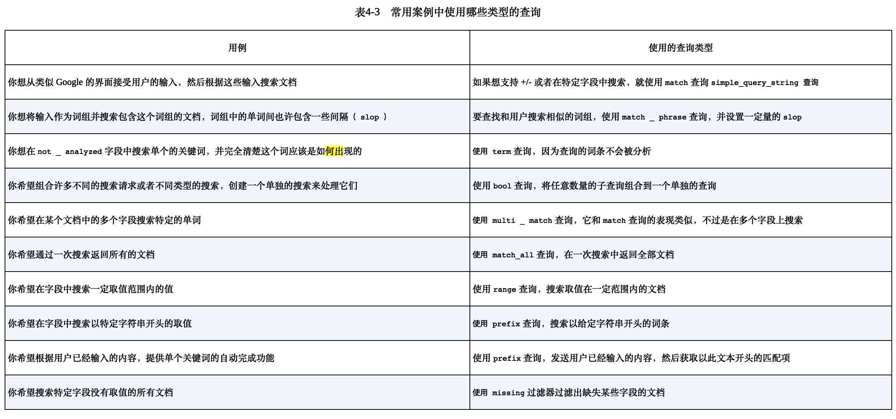

# TODO

构造数据自己实践一下 es 查询。

# 1. Elasticsearch 介绍

### 解决搜索问题
Elasticsearch 建立在 Apache Lucene 之上的开源分布式搜索引擎。
计算文档相关性使用的是 TF-IDF(term frequency-inverse document frequency)

- 词频
- 逆文档词频: 如果某个单词在所有文档中比较少见，该词权重越高


### 使用案例

- 作为主要的后端系统。不支持事务
- 添加到现有系统。保持数据同步
- 和现有工具一同使用。ELK

### 组织数据

Elasticsearch 以文档方式存储数据

### 安装

安装完成之后 打开 http://localhost:9200


# 2. 深入功能


- 逻辑设计
- 物理设计。配置决定了集群的性能、可扩展性和可用性

### 文档、类型和索引

索引-类型-ID 的组合唯一确定了某篇文档

文档: 自包含，层次型，结构灵活，无模式。

类型：是文档的逻辑容器。不同类型最好放入不同结构的文档 。每个类型中字段的定义称为映射。

索引：是映射类型的容器。索引由一个或多个称为分片的数据块组成


# 3. 索引，更新和删除数据

核心类型：字符串；数值；日期(默认解析ISO 8601)；布尔

字符串如果索引类型是 analyzed，会转化为小写并且分词。

### 3.5 更新数据

更新文档包括:

- 检索现有文档。必须打开 `_source`
- 进行指定的修改
- 删除旧的文档，在其原有位置索引新的文档

使用更新 API:

- 发送部分文档

```sh
curl -XPOST 'localhost:9200/get-together/group/2/_update' -d '{
　"doc": {
　　"organizer": "Roy"
　}
}'
```

- 使用 upsert 创建不存在的文档。默认脚本语言是 Groovy

ES 通过 version 乐观锁来进行并发更新的控制：

- 冲突发生的时候可以使用重试操作。retry_on_conflict 参数可以让 es 自动重试
- 索引文档的时候使用版本号

### 3.6 删除数据

- 通过 id 删除单个文档
- 单个请求删除多个文档
- 删除映射类型，包括其中的文档
- 删除匹配某个查询的所有文档

删除索引。

除了删除索引还可以关闭。 `curl -XPOST 'localhost:9200/online-shop/_close'`


# 4 搜索数据

确定搜索范围，尽量限制在最小范围和类型，增加响应速度。

请求搜索的基本模块：

- query。使用查询 DSL和过滤 DSL 配置
- size: 返回文档数量
- from：分页
- _source: 指定_source 字段如何返回
- sort: 默认排序基于文档得分。sort 可以额外控制

```sh
curl 'localhost:9200/get-together/group/_search' -d '
{
  "query": {
    "match_all": {}
  },
  "from" 0,
  "size": 10,
  "_source": ["name", "organizer"],
  "sort": ["created_on": "desc"]
}'
```

### 4.2 查询和过滤 DSL

由于不计算得分，过滤器处理更少，并且可以被缓存。

```sh
curl 'localhost:9200/get-together/_search' -d '
{
  "query": {
    "filtered": {
      "query" {
        "match": {
          "title": "hadoop"
        }
      }
    }
  },
  "filter": {
    "term": {
      "host": "andy"
    }
  }
}'
```

- match_all 查询
- query_string 查询
- term 查询和 term 过滤器
- terms 查询，搜索某个文档那个字段中的多个词条
- match 查询和 term 过滤器
- phrase_prefix 查询，词组中最后一个词条进行前缀匹配。对于提供搜索框里的自动完成功能很有用，输入词条就可以提示。最好用
  max_expansions 限制最大的前缀扩展数量
  - multiple_match: 可以搜索多个字段中的值

### 4.3 组合查询或者复合查询

- bool 查询:允许在单独的查询组合任意数量的查询，指定的查询子句表名哪些部分是 must/should/must_not

### 4.4 超越 match 和过滤器查询

范围查询：

```sh
curl 'localhost:9200/get-together/_search' -d '
{
  "query": {
    "range": {
      "created_on": {
        "gt": "2011-06-01",
        "lt": "2012-06-01"
      }
    }
  }
}'
```

前缀查询：(如果需要可以先转成小写)

```sh
curl 'localhost:9200/get-together/_search' -d '
{
  "query": {
      "prefix": {
        "title": "liber"
      }
    }
  }
}'
```

wildcard 查询: 类似 shell globbing 的工作方式

### 4.5 使用过滤器查询字段的存在性

- exists 过滤器
- missing 过滤器

### 4.6 为任务选择最好的查询




# 5. 分析数据

什么是分析： 文档被发送并加入到倒排索引之前，es 对其进行的操作。

- 字符过滤：字符过滤器转变字符
- 文本切分为分词
- 分词过滤：分词过滤器转变每个分词
- 分词索引：分词存储到索引中

为文档使用分析器：

- 创建索引的时候，为特定的索引进行设置
- 在 es 配置文件设置全局分析器

### 5.3 使用分析 API 来分析文本

向 es 发送任何文本，然后指定使用的分析器、分词器、或者分词过滤器，然后获取分析的分词。

### 5.4 分析器、分词器和分词过滤器

内置分析器：

标准分析器、简单分析器、空白分析器、停用词分析器、关键词分析器、模式分析器、语言和多语言分析器、雪球分析器

分词器：

标准分词器、关键词分词器、字母分词器、小写分词器、空白分词器、模式分词器、UAX URL 电子邮件分词器、路径层次分词器

分词过滤器(接收从分词器出来的分词，然后为索引数据做准):

标准分词过滤器、小写分词器过滤器、长度分词过滤器(限定长度)、停用词分词过滤器
截断分词过滤器、修剪分词过滤器和限制分词过滤器，颠倒分词过滤器、唯一分词过滤器、ASCII 折叠分词过滤器、同义词分词过滤器

### 5.5 N 元语侧边 N 元语法和滑动窗口

n 元语法：将一个单词切分多个子单词

侧边：每个分词都从最前端开始构建

### 5.6 提取词干

单词缩减到基本或者词根。


# 6 使用相关性进行搜索

### 6.1 文档打分如何运作

Lucene 的打分机制是一个公式，将考量的文档作为输入，使用不同的因素来确定该文档得分(score)。
词频(Term-frequency), 逆文档词频(IDF，次数越多越不重要）

TF-IDF 公式计算得分

### 6.2 其他打分方法

- Okapi BM25;
- DFR 相似度
- IB(Information based)相似度
- LM Dirichlet 相似度
- LM Jelinek Mercer 相似度

需要一个良好的测试框架评估算法的变化。

### 6.3 boosting

boosting 是一个可以用来修改文档相关性的程序，可以在查询或者索引期间修改(不推荐)。
考虑 boost 的相对值， name boost 3 倍意味着 name 字段的重要性大概是其他字段 3 倍。

### 6.4 使用 explain 理解文档是被如何评分的

explain=true。可以查看为什么一个文档和某个查询没有被匹配，有性能开销，不要在生产环境使用。

```sh
curl -XPOST 'localhost:9200/get-together/_search?pretty' -d '{
　"query": {
　　"match": {
      "description": "elasticsearch"
    }
　},
  "explain": true
}
```

### 6.5 使用查询打分来减小评分操作的性能影响
下列情况可能导致打分变成资源密集操作：

- 使用脚本的评分
= 进行 phrase 词组陈哈训，搜索一定距离出现的词，使用很大的 slop 值

可以使用再打分(rescoring)针对返回结果进行第二轮得分计算。

### 6.6 使用 function_score 定制得分

function_score 允许用户指定任何数量的任意函数，让它们作用于匹配了初始查询的文档，
修改其得分，从而到达精细化控制结果相关性的目的。

- weight 函数：得分乘以一个常数

### 6.8 使用脚本排序

es 还允许使用脚本在文档返回前对其进行排序，当用户需要在某个不存在的文档字段上排序时非常有用。

### 6.9 字段数据
需要在某个字段上进行排序或返回一些聚集时，es 需要快速决定，对于每个匹配的文档而言，哪些词条是用于排序或者聚集的。


# 7. 使用聚集(aggregation)来探索数据

获取文档的统计数据。

- 度量型(metrics): 一组文档的统计分析，可以得到诸如最小值，最大值，标准差等度量值。
- 桶(bucket):将匹配的文档切分为一个或多个容器（桶），然后告诉你每个桶里的文档数量

### 7.1 理解聚集的结构

### 7.2 度量聚集

单独统计：

```sh
URI = localhost:9200/get-together/event/_search
curl "$URI?pretty&search_type=count" -d '
{
    "aggregations": {
        "attendees_avg": {
            "avg": {
                "script": "doc['"'attendees'"'].values.length"
            }
        }
    }
}'
```

高级统计：extended_stats，获取平方值、方差和标准差。根据文档统计的，具有 100% 准确性
(注意你的需求是精确统计还是近似统计，近似统计可以限制内存和 cpu 使用。)

近似统计：

- 百分位。可以发现所有值中的 x% 比这个值低。比如看看大多数购物车在哪个价格区间
- 基数(cardinality)：某个字段中唯一值的数量。比如获取访问某站点的唯一 IP 地址数量

### 7.3 多桶型聚集

- 词条聚集(terms aggregation): 文档中某个词条频率。发现搜索场景中有意义的词
- 范围聚集：根据文档落入哪些数值、日期、或者 ip 地址范围创建不同的桶。分析固定期望数据
- 直方图聚集：定义间距值
- 嵌套聚集、反嵌套聚集、子聚集：针对文档关系执行聚集
- 地理距离聚集和地理散列格聚集：根据地理位置创建桶


# 8. 文档间的关系

一般像是日志这种文档之间没有什么关系，但是有些文档之间有一定的关系，
比如对象类型、嵌套文档、父子关系和反规范化。

### 8.1 定义关系

- 对象类型：允许一个对象作为文档字段的值(通常用来处理一对一关系)
- 嵌套：将地址保存在单独的 Lucene 文档中
- 父子关系：为不同数据类型使用完全独立的 es 文档
- 反规范化：对数据进行复制，达到表示关系的目的。可以表达多对多关系
- 应用端的连接：当数据少，并且可以承受规范化的开销时，可以很好运作

### 8.2 将对象作为字段值(适合一对一关系)

```sh
curl -XPOST 'localhost:9200/get-together/event-object/1' -d '{
    "title": "title",
    "location": {
        "name" "name",
        "address": "chapter 8"
    }
}`
```

es 会进行扁平化处理， location.name 这种形式。

不足：

- 对象之间没有边界
- 更新一个单独的对象需要索引整个文档

### 8.3 嵌套类型

嵌套映射看起来和对象文档差不多，但是需要使用 type 为 nested 而不是 object。 底层使用分块实现。

### 8.4 父子关系：关联分隔的文档(一对多)
某个类型定义为同索引中另一个类型的子辈，用于需要经常更新文档或其间关系的时候。

嵌套和父子结构对于一对多的关系来说非常好用。

### 8.5 反规范化：使用冗余的数据管理（多对多）

