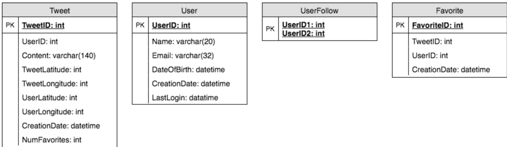
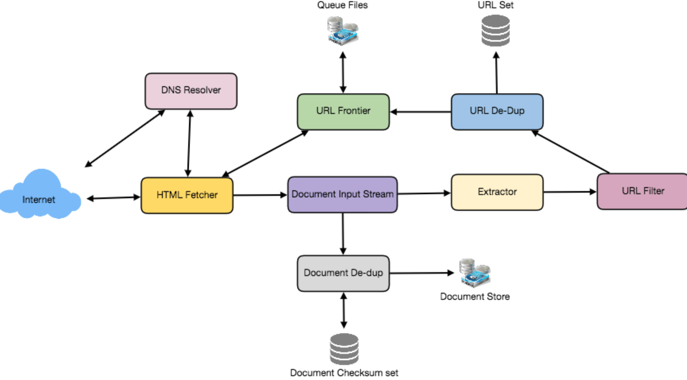
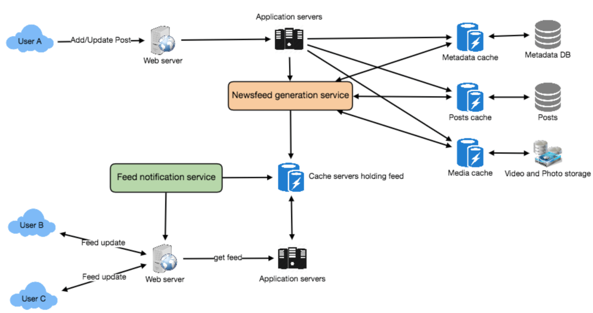
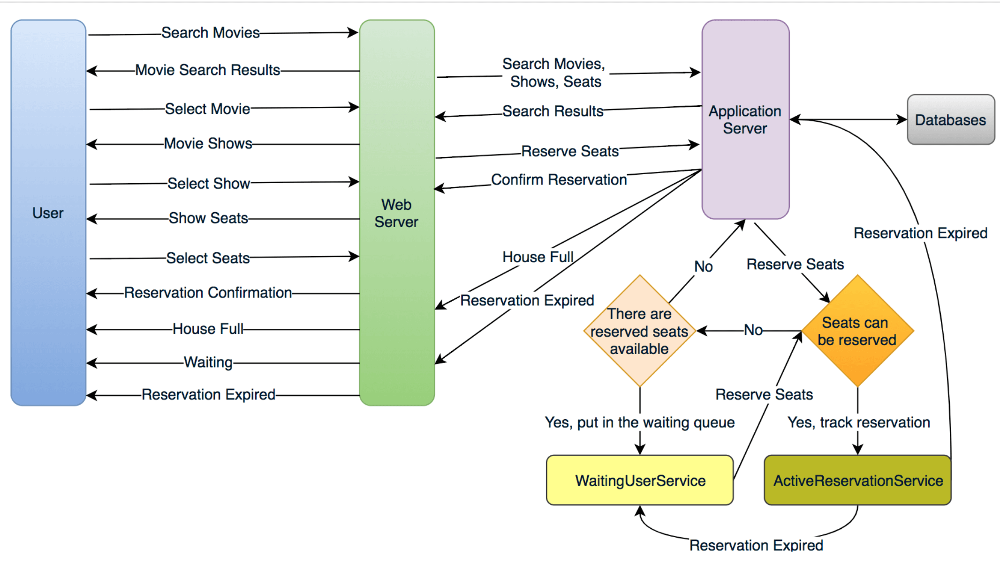

《Grokking System Design》 讲后端系统设计的一本书

# Load Balancing

负载均衡，剔除异常节点等。 (random, round-robin, random with weighting for memory or cpu ulilization)

- Between user and web server
- Between web servers and internal platform layer
- Between internal platform layer and databases

ways to implement load balancing:

1. Smart clients
2. Hardware Load Balancers (设备一般比较贵)
3. Sofrware Load Balancers (HAproxy, Nginx)


# Caching

1. Application server cache (应用层缓存)
2. Distributed cache (每个节点缓存部分数据)
3. Global cache
4. Content Distribution Network(CDN) 静态文件

Cache Invalidation: 缓存失效。解决缓存一直性问题

- Write-through cache: 数据同时写入缓存和数据库。如果写入量大太高有延迟
- Write-around cache: 旁路写入缓存。可能有缓存失效(cache miss)问题
- Write-back cache: 直接写缓存就返回，之后定期或者条件触发写入到数据库。支持高并发写入，但是可能数据会丢失

Cache eviction policies: (缓存剔除)

- First In First Out(FIFO)
- Last in First Out(LIFO)
- Least Recently Used(LRU)
- Most Recently Used(MRU)
- Least Frequently Used(LFU)
- Random Replacement(RR)


# Sharding or Data Partitoining

1. Partitioning Methods

- Horizontal partitioning
- Vertical Partitioning
- Directory Based Partitioning: create a lookup service, map between key to its DB server

2. Partitioning Criteria

- Key or hash-based partitioning
- List partitioning
- Round-robing partitioning
- Composite partitioning

3. Common Problems of Sharding

- Joins and Denormalication。比如通过数据冗余避免 join
- Referential integrity。避免外键约束，业务层做
- Rebalancing


# Indexes(索引)

rapid random lookups and efficient access of ordered records

- 数据库索引 (B+树形结构)
- hash 索引 (kv存储)
- 倒排索引 (ElasticSearch搜索引擎)


# Proxies

A proxy server is an intermediary piece of hardware/software that sits between the client and the back-end server.
It receives requests from clients and relays them to the origin servers. Typically, proxies are used to filter requests or log requests,
or sometimes transform requests (by adding/removing headers, encrypting/decrypting, or compression).
Another advantage of a proxy server is that its cache can serve a lot of requests. If multiple clients access a particular resource, the proxy server can cache it and serve all clients without going to the remote server.

(batch several request into one)


# Queues

- 削峰填谷
- 解耦


# Redundancy and Replciation

- 避免单点故障。出故障 failover 转移
- shared-nothing architecture


# SQL vs NoSQL

- SQL: store data in rows and columns. Mysql, Postgres, SQLite
- Nosql:
  - key-value stores: Redis,Dynamo
  - Document Database: MongoDB, CouchDB
  - Wide-Column Database: 列式存储。大数据集分析。HBase, Cassandra
  - Graph Database: 地理位置存储。 Neo4J, InfiniteGraph

区别：

- Schema: sql需要固定的 schema，nosql 可以不需要
- Querying: SQL vs UnQL(unstructured query language)
- Scalability: nosql 方便水平扩展
- Reliablility or ACID。 nosql 为了性能和扩展性牺牲了 ACID 特性

Reasons to use SQL database:

- 保证 ACID ，比如金融和财务场景
- 数据是结构化和非易变的

Reasons to use NoSQL database:

- 大数据量无结构
- 云端计算和存储
- 快速开发


# CAP Theorem
三者最多只能满足两个

- Consistency: All nodes see the same data at the same time. Consistency is achieved by updating several nodes before allowing further reads.
- Availability: Every request gets a response on success/failure. Availability is achieved by replicating the data across different servers.
- Partition tolerance: System continues to work despite message loss or partial failure. A system that is partition-tolerant can
  sustain any amount of network failure that doesn’t result in a failure of the entire network.
  Data is sufficiently replicated across combinations of nodes and networks to keep the system up through intermittent outages.


# Consistent Hashing

普通的 hash 有什么缺点：

- 不是水平扩展的。增加或者删除节点导致之前映射失效
- 无法负载均衡，有数据倾斜问题

一致性哈希可以降低增删节点时候的映射重新分配，更容易扩缩容。

As a typical hash function, consistent hashing maps a key to an integer. Suppose the output of the hash function is in the range of [0, 256).
Imagine that the integers in the range are placed on a ring such that the values are wrapped around.

Here’s how consistent hashing works:
1. Given a list of cache servers, hash them to integers in the range.
2. To map a key to a server,
    - Hash it to a single integer.
    - Move clockwise on the ring until finding the first cache it encounters.
    - That cache is the one that contains the key. See animation below as an example: key1 maps to cache A; key2 maps to cache C.

为了防止数据倾斜，一致性哈希引入了"vritual replicas" 虚拟节点，让一个机器节点映射到多个虚拟节点上。


# Long-Polling vs Websockets vs Server-Sent Events

- Long-Polling: ajax 轮询
- Websockets: 全双工
- Server-Sent (SSEs)


# System Design Interviews(SDI): A step by step guide (系统设计步骤)

高并发、高性能、高可用

### 1. Requirements clarifications (需求陈述)

- Here are some questions for designing Twitter that should be answered before moving on to next steps:
- Will users of our service be able to post tweets and follow other people? Should we also design to create and display user’s timeline?
- Will tweets contain photos and videos?
- Are we focusing on backend only or are we developing front-end too? Will users be able to search tweets?
- Do we need to display hot trending topics?
- Would there be any push notification for new (or important) tweets?

### 2. System interface definition (系统接口定义)
确保需求和理解一致，并定义好接口

- postTweet(user_id, tweet_data, tweet_location, user_location, timestamp, ...)
- generateTimeline(user_id, current_time, user_location, ...)
- markTweetFavorite(user_id, tweet_id, timestamp, ...)

### 3. Back-of-the-envelope estimationA (粗略估算)
估算系统的扩展性

- What scale is expected from the system (e.g., number of new tweets, number of tweet views, how many timeline generations per sec., etc.)?
- How much storage would we need? We’ll have different numbers if users can have photos and videos in their tweets.
- What network bandwidth usage are we expecting? This would be crucial in deciding how would we manage traffic and balance load between servers.

### 4. Defining data model (数据模型定义)
比如类似推特的服务设计：

- User: UserID, Name, Email, DoB, CreationData, LastLogin, etc.
- Tweet: TweetID, Content, TweetLocation, NumberOfLikes, TimeStamp, etc.
- UserFollowos: UserdID1, UserID2
- FavoriteTweets: UserID, TweetID, TimeStamp

考虑应该用 sql 还是 nosql 等存储？

### 5. High-level design (高层设计)
画出来系统设计图，大概 5-6 个盒子图表示关键组件(服务、数据库、缓存等交互)。

### 6. Detailed design (细节设计)
优缺点、技术选型，挑选两三个组件详细介绍

- Since we’ll be storing a huge amount of data, how should we partition our data to distribute it to multiple databases? Should we try to store all the data of a user on the same database? What issue can it cause?
- How would we handle hot users, who tweet a lot or follow lots of people?
- Since user’s timeline will contain most recent (and relevant) tweets, should we try to store our data in such a way that is optimized to scan latest tweets?
- How much and at which layer should we introduce cache to speed things up?
- What components need better load balancing?

### 7. Identifying and resolving bottlenecks (识别改善瓶颈)
单点故障、副本、监控等维度。

- Is there any single point of failure in our system? What are we doing to mitigate it?
- Do we’ve enough replicas of the data so that if we lose a few servers, we can still serve our users?
- Similarly, do we’ve enough copies of different services running, such that a few failures will not cause total system shutdown?
- How are we monitoring the performance of our service? Do we get alerts whenever critical components fail or their performance degrade?


# Designing a URL Shortening service like TinyURL (短网址系统)

### 1. Why do we need URL shortening?

缩短网址、追踪用户访问、网址隐藏

### 2. Requirements and Goals of the System

Functional Requirements:

1. Given a URL, our service should generate a shorter and unique alias of it.
2. When users access a shorter URL, our service should redirect them to the original link.
3. Users should optionally be able to pick a custom alias for their URL.
4. Links will expire after a specific timespan automatically; users should also be able to specify expiration time.

Non-Functional Requirements:

1. The system should be highly available. This is required because if our service is down, all the URL redirections will start failing.
2. URL redirection should happen in real-time with minimum latency.
3. Shortened links should not be guessable (not predictable).

Extended Requirements:

1. Analytics, e.g., how many times a redirection happened?
2. Our service should also be accessible through REST APIs by other services.

### 3. Capacity Estimation and Constraints

- Traffic estimates: 500 million / (30 days * 24 hours * 3600 seconds) ~= 200 URLs/s; 50 billion / (30 days * 24 hours * 3600 sec) ~= 19K/s
- Storage estimates: 500 million * 5 years * 12 months = 30 billion; 30 billion * 500 bytes = 15 TB
- Bandwidth estimates: 200 * 500 bytes = 100 KB/s; 19K * 500 bytes ~= 9 MB/s
- Memory estimates: 19K * 500 bytes ~= 9 MB/s;  缓存20% 0.2 * 1.7 billion * 500 bytes ~= 170GB

Assuming 500 million new URLs per month and 100:1 read:write ratio, following is the summary of the high level estimates for our service: 上边的列个表格

### 4. System APIs

```
creatURL(api_dev_key, original_url, custom_alias=None user_name=None, expire_date=None)
deleteURL(api_dev_key, url_key)
```

### 5. Database Design

URL表(URL)： OriginURL(varchar 512), CreationDate(datetime), ExpirationDate(datetime), UserID(int)

用户表(User): Name(varchar 20), Email(varchar 32), CreationDate(datetime), LastLogin(datetime)

可以用 nosql (Dynamo or Cassandra)，用 nosql 不要直接在 URL 表存用户 id，单独一个表存关系。

### 6. Basic System Design and Algorithm

如何生成短网址的最后 6 位。 比如 http://tinyurl.com/jlg8zpc。 提供两种方式：

1. 先计算唯一 hash，不如md5，之后编码base62/base64等。这里可以用 md5 + base64 之后取前面 6 位，如果冲突了可以取别的位置
   或者交换字符。

2. Generateing keys offline。预计算好放到库里。

### 7. Data Partitioning and Replication

- range based partitioning
- hash based partitioning

### 8. Cache

Memcache 缓存经常访问的 url。LRU 剔除算法比较好。

### 9. Load Balancer(LB)
简单的 round robin 就可以，更好的是根据机器负载智能做均衡

### 10. Purging or DB cleanup
- 惰性删除过期的 url。
- 定期删除
- 所有 url 加上固定的 2 年默认过期

### 11 .Telemetry
根据用户、访问时间、地理位置等做分析。

### 12. Security and Permissioins
设置不同用户的访问策略


# Designing Instagram (图片分享服务)

### 1. Why Instagram?

支持上传分享图片和视频，关注他人。每个用户时间线(timeline)包括其关注的高热度图片。

### 2. Requirements and Goals of the System

Functional Requirements

1. Users should be able to upload/download/view photos.
2. Users can perform searches based on photo/video titles.
3. Users can follow other users.
4. The system should be able to generate and display a user’s timeline consisting of top photos from all the people the user follows.

Non-functional Requirements

1. Our service needs to be highly available.
2. The acceptable latency of the system is 200ms for timeline generation.
3. Consistency can take a hit (in the interest of availability), if a user doesn’t see a photo for a while, it should be fine.
4. The system should be highly reliable, any photo/video uploaded should not be lost.

### 3. Some Design Considerations
The system would be read-heavy, so we will focus on building a system that can retrieve photos quickly.

1. Practically users can upload as many photos as they like. Efficient management of storage should be a crucial factor while designing this system.
2. Low latency is expected while reading images.
3. Data should be 100% reliable. If a user uploads an image, the system will guarantee that it will never be lost.

### 4. Capacity Estimation and Constraints
- Let’s assume we have 300M total users, with 1M daily active users.
- 2M new photos every day, 23 new photos every second.
- Average photo file size => 200KB
- Total space required for 1 day of photos 2M * 200KB => 400 GB
- Total space required for 5 years: 400GB * 365 (days a year) * 5 (years) ~= 712 TB

### 5. High Level System Design
Image Hosting System, Image Storage, Image Metadata

### 6. Database Schema


图片可以存储在 HDFS or S3(亚马逊云)

### 7 Component Design
图片读取和写入分离。

### 8 Reliability and Redundancy
通过冗余避免单点失败

### 9. Data Sharding

- Partitioning based on userID
- Partitioning based on photoID

### 10. Ranking and Timeline Generation
需要把用户关注的最新和最热的相关图片生成时间线。

- 预先计算。专用服务持续生成用户的时间线然后存在 UserTimeline 表，只需要查询这张表即可。

1. pull。客户端拉取时间线，大部分时间如果没有更新就拉取了空数据
2. push。服务端推送数据。用户关注太多会比较耗时
3. hybrid。推拉结合

### 11. Timeline Creation with Sharded Data
photoID 包含时间信息方便排序

### 12 Cache and Load balancing
cdn + lru cache


# Designing Dropbox (文件存储)

### 1. Why Cloud Storage
方便跨设备和系统同步

- availability
- reliablility and durability
- scalability

### 2. Requirements and Goals of the System
What do we wish to achieve from a Cloud Storage system? Here are the top-level requirements for our system:

1. Users should be able to upload and download their files/photos from any device.
2. Users should be able to share files or folders with other users.
3. Our service should support automatic synchronization between devices, i.e., after updating a file on one device, it should get synchronized on all devices.
4. The system should support storing large files up to a GB.
5. ACID-ity is required. Atomicity, Consistency, Isolation and Durability of all file operations should be guaranteed.
6. Our system should support offline editing. Users should be able to add/delete/modify files while offline, and as soon as they come online, all their changes should be synced to the remote servers and other online devices.

Extended Requirements

- The system should support snapshotting of the data, so that users can go back to any version of the files.


### 3. Some Design Considerations

- We should expect huge read and write volumes.
- Read to write ratio is expected to be nearly the same.
- Internally, files can be stored in small parts or chunks (say 4MB), this can provide a lot of benefits e.g. all failed operations shall only be retried for smaller parts of a file. If a user fails to upload a file, then only the failing chunk will be retried.
- We can reduce the amount of data exchange by transferring updated chunks only.
- By removing duplicate chunks, we can save storage space and bandwidth usage.
- Keeping a local copy of the metadata (file name, size, etc.) with the client can save us a lot of round trips to the server.
- For small changes, clients can intelligently upload the diffs instead of the whole chunk.

### 4. Capacity Estimation and Constraints
- Let’s assume that we have 500M total users, and 100M daily active users (DAU).
- Let’s assume that on average each user connects from three different devices.
- On average if a user has 200 files/photos, we will have 100 billion total files.
- Let’s assume that average file size is 100KB, this would give us ten petabytes of total storage. 100B * 100KB => 10PB
- Let’s also assume that we will have one million active connections per minute.

### 5. High Level Design
- client
- block server -> cloud storage
- metadata serve -> metadata storage
- synchronization server

### 6. Component Design

#### a. client
  - upload and download files
  - detect fiel changes in the workspace folder
  - handle conflict due to offline or ocncurrent updates

优化：

- 如何高效传输？文件分块，部分更新的话可以节省带宽
- 本地需要保存远信息么？需要，可以离线更新
- 客户端如何监听其他客户端更新。http 长轮询

可以把客户端分成 4 个部分：

- internal metadata database
- chunker
- watcher
- indexer

#### b. metadata database
存储四个对象信息：chunks, files, users, devices

#### c. synchronization service
同步其他客户端和 server 信息。

#### d. message queing service
- request queue: clients requests to update metadata database sent to request queue first
- response queue: delivering the update messages to each client

#### e. cloud/block storage
stores chunks of files uploaded by the users

### 7. File Processing Workflow
1. Client A uploads chunks to cloud storage.
2. Client A updates metadata and commits changes.
3. Client A gets confirmation, and notifications are sent to Clients B and C about the changes.
4. Client B and C receive metadata changes and download updated chunks.

### 8. Data Deduplication(去重)
- post-process deduplication
- inline deduplication (计算 chunk md5)

### 9. Metadata Partitioning
- vertical partitioning
- range based partitioning
- hash-based partitioning

### 10. Caching
hot files/chunks, use memcache and lru

### 11. Load Balancer(LB)
- clients and block server
- clients and metadata servers

### 12. Security and Permissioins
storing permissions of each file in our metadata DB to reflect what files are visible or modifiable by user


# Designing Facebook Messenger

### 1. What is Facebook Messenger?
基于文本的实时消息服务

### 2. Requirements and Goals of the System

Functional Requirements:

1. Messenger should support one-on-one conversations between users.
2. Messenger should keep track of online/offline statuses of its users.
3. Messenger should support persistent storage of chat history.

Non-functional Requirements:

1. Users should have real-time chat experience with minimum latency.
2. Our system should be highly consistent; users should be able to see the same chat history on all their devices.
3. Messenger’s high availability is desirable; we can tolerate lower availability in the interest of consistency.

Extended Requirements:

- Group Chats: Messenger should support multiple people talking to each other in a group.
- Push notifications: Messenger should be able to notify users of new messages when they are offline.

### 3. Capacity Estimation and Constraints
假设500万用户每天发 40 条消息

- Storage Estimation: 20 billion messages * 100 bytes => 2 TB/day, 2 TB * 365 days * 5 years ~= 3.6 PB
- Bandwidth Estimation: 2 TB / 86400 sec ~= 25 MB/s

### 4. High Level Design
- chat server
- data storage

流程:

1. User-A sends a message to User-B through the chat server.
2. The server receives the message and sends an acknowledgment to User-A.
3. The server stores the message in its database and sends the message to User-B.
4. User-B receives the message and sends the acknowledgment to the server.
5. The server notifies User-A that the message has been delivered successfully to User-B.

### 5 Detailed Component Design

#### a. Messages Handling

- pull model
- push model (http long polling or websocket)

问题：

- 如何和服务端连接： http long polling or websocket
- server 如何转发链接：维护 hash table, user id to connection object
- server 收到一个下线的消息怎么办：客户端底层实现重试
- 需要多少server： 500万用户，单机 50K 并发连接需要 10k server
- 哪个服务器保持了对哪个用户的连接：load balancer in front of chat servers
- how should the server process a "deliver message" rquest:
  - store message in database
  - send the message to receiver
  - send ack to sender
- 对每个 client，消息带上序列号

#### b. Storing and retrieving the messages from database

- sql or nosql: wide-column database like HBase. (关系数据库或者 mongodb 这种不适合)
  - quick small updates; and range based searches
- how should clients efficiently fetch data from server: 分页查询

#### c. Managing user's status

1. Whenever a client starts the app, it can pull current status of all users in their friends’ list.
2. Whenever a user sends a message to another user that has gone offline, we can send a failure to the sender and update the status on the client.
3. Whenever a user comes online, the server can always broadcast that status with a delay of few seconds to see if the user does not go offline immediately.
4. Client’s can pull the status from the server about those users that are being shown on the user’s viewport. This should not be a frequent operation, as the server is broadcasting the online status of users and we can live with the stale offline status of users for a while.
5. Whenever the client starts a new chat with another user, we can pull the status at that time.

### 6. Data partitioning
- partitioning based on userID (not messageId)

### 7. Cache
We can cache a few recent messages (say last 15) in a few recent conversations that are visible in user’s viewport (say last 5). Since we decided to store all of the user’s messages on one shard, cache for a user should completely reside on one machine too.

### 8. Load balancing
LB in front of chat servers.

### 9. Fault tolerance and Replication
- when chat server fails: client automatically reconnect if connection is lost
- 消息需要副本存储么 Reed-Solomon encoding

### 10. Extended Requirements
- group chat。GroupChatID
- Push notifications. Notification server


# Designing Twitter (微博)

### 1. What is Twitter?
社交网络支持发帖，关注等

### 2. Requirements and Goals of the System
Functional Requirements

1. Users should be able to post new tweets.
2. A user should be able to follow other users.
3. Users should be able to mark tweets favorite.
4. The service should be able to create and display user’s timeline consisting of top tweets from all the people the user follows.
5. Tweets can contain photos and videos.

Non-functional Requirements

1. Our service needs to be highly available.
2. Acceptable latency of the system is 200ms for timeline generation.
3. Consistency can take a hit (in the interest of availability), if a user doesn’t see a tweet for a while, it should be fine.

Extended Requirements

1. Searching tweets.
2. Reply to a tweet.
3. Trending topics – current hot topics/searches.
4. Tagging other users.
5. Tweet Notification.
6. Who to follow? Suggestions?
7. Moments.

### 3. Capacity Estimation and Constraints
假设 200 万日过，每天发帖100 million (1亿)，每个用户平均关注 200 人，注册用户10 亿

- 每天产生推特数：200M DAU * ((2 + 5) * 20 tweets) => 28B/day
- Storage Estimation: 100M * (280 + 30) bytes => 30GB/day (每个推特 30 字节); (100M/5 photos * 200KB) + (100M/10 videos * 2MB) ~= 24TB/day
- Bandwidth Estimation: since total ingress is 24TB per day, this would translate into 290MB/sec.

### 4. System APIs
```
# 发帖
tweet(api_dev_key, tweet_data, tweet_location, user_location, media_ids,
```

### 5. High-level design
clients -> load balancer -> app server -> DB and File storage

### 6. Database Schema


### 7. Data Sharding
- sharding based on userID
- combine sharding by TweetID and Tweet creation time (推特 id 需要包含时间信息)

### 8. Cache
- caceh hot tweets and users (LRU)
- use lined list cache user recent tweets (3days)

### 9. Timeline Generation
参考 Facebook Newsfeed

### 10. Replcation and Fault Tolerance
主从复制

### 11. Load Balancing
- Between Clients and Application servers
- Between Application servers and database replication servers and
- Between Aggregation servers and Cache server.

### 12. Monitoring
指标收集：

1. New tweets per day/second, what is the daily peak?
2. Timeline delivery stats, how many tweets per day/second our service is delivering.
3. Average latency that is seen by the user to refresh timeline.

### 13. Extended Requirements
- how to serve feeds: 预生成 feed
- Retweet: 转发可以只保存原推特 id
- tranding topics: 查询、搜索、转发、点赞热度作为权重


# Designing Youtube or Netflix (视频分享网站)

### 1. Why Youtube
上传、查看、分享视频等

### 2. Requirements and Goals of the System

Functional Requirements:

1. Users should be able to upload videos.
2. Users should be able to share and view videos.
3. Users can perform searches based on video titles.
4. Our services should be able to record stats of videos, e.g., likes/dislikes, total number of views, etc.
5. Users should be able to add and view comments on videos.

Non-Functional Requirements:

1. The system should be highly reliable, any video uploaded should not be lost.
2. The system should be highly available. Consistency can take a hit (in the interest of availability), if a user doesn’t see a video for a while, it should be fine.
3. Users should have real time experience while watching videos and should not feel any lag.

### 3. Capacity Estimation and Constraints
- Storage Estimation: 500 hours * 60 min * 50MB => 1500 GB/min (25 GB/sec)
- Bandwidth estimates: 500 hours * 60 mins * 10MB => 300GB/min (5GB/sec)

### 4. System APIs
```
uploadVideo(api_dev_key, video_title, vide_description, tags[], category_id, default_language, recording_details, video_contents)
searchVideo(api_dev_key, search_query, user_location, maximum_videos_to_return, page_token)
```

### 5. Hign Level Design

1. Processing Queue: 视频处理队列。视频转码、封面生成、存储
2. Encoder: 转码多种格式
3. Thumbnails generator: 封面生成
4. Video and Thumbnails storage: distributed file storage
5. User Database
6. Video metadata storage

### 6. Database Schema
Videos metadata can be stored in a SQL database. Following information should be stored with each video:

- VideoID
- Title
- Description
- Size
- Thumbnail
- Uploader/User
- Total number of likes
- Total number of dislikes
- Total number of views

For each video comment, we need to store following information:

- CommentID
- VideoID
- UserID
- Comment
- TimeOfCreation

User data storage - MySql

- UserID, Name, email, address, age, registration details etc.

### 7. Detailed Component Design

- where videos store : HDFS or GlusterFS (现在一般都是用云服务存储文件)
- read traffic: 读写分离
- thumbnails store: BigTable。 （云服务存储）
- video uploads: 支持断点续传
- video encoding: 处理队列

### 8. Metadata sharding
- based on userID
- based on videoID

### 9. Video Deduplication
video matching algorithms (Block Matching, Phase Correlation) 查重

### 10. Load Balancing
use consistent hashing amoung cache servers

### 11. Cache
We can introduce a cache for metadata servers to cache hot database rows. Using Memcache to cache the data and
Application servers before hitting database can quickly check if the cache has the desired rows.
Least Recently Used (LRU) can be a reasonable cache eviction policy for our system. Under this policy, we discard the least recently viewed row first.

### 12. Content Delivery Network (CDN)
- CDNs replicate content in multiple places. There’s a better chance of videos being closer to the user and with fewer hops, videos will stream from a friendlier network.
- CDN machines make heavy use of caching and can mostly serve videos out of memory.

### 13. Fault Tolerance
一致性哈希


# Designing Typeahead Suggestion (实时补全)

### 1. What is Typeahead Suggestions?
实时补全查询

### 2. Requirements and Goals of the System
Functional Requirements: As the user types in their query, our service should suggest top 10 terms starting with whatever user has typed.
Non-function Requirements: The suggestions should appear in real-time. The user should be able to see the suggestions within 200ms.

### 3. Basic System Design and Algorithm
匹配给定前缀; 内存存储提高性能； 数据结构(Trie前缀树)

- 大小写敏感：为了简化假设不区分大小写
- find top suggestions: 可以根据每个单词被搜索次数作为权重
- 遍历子树要多久：注意层数太深
- can store top suggestions with each node: store top 10 suggestions at each node that can return to the user
- how would build this trie: bottom up
- how to update trie: 离线定期更新
- update frequencies of typeahead suggestions: add and substract frequencies based on Exponential Moving Average(EMA)
- remove a term from the trie: remove when regular updates , add filtering layter on each server
- different ranking criteria for suggestions: 其他因子：哦用户位置，语言、统计数据、搜索历史等

### 4. Permanent Storage of the Trie
定期快照 trie 存在文件里，防止机器重启丢失

### 5. Scale Estimation
假设每秒 60k 请求

- Storage Estimation: 100 million * 30 bytes => 3 GB

### 6. Data Partition
- range based partitioning
- based on the maximum capacity of the server
- based on the hash of the term

### 7. Cache
cache top search items

### 9. Fault Tolerance
主从复制

### 10 Typeahead Client
1. The client should only try hitting the server if the user has not pressed any key for 50ms.
2. If the user is constantly typing, the client can cancel the in-progress requests.
3. Initially, the client can wait until the user enters a couple of characters.
4. Clients can pre-fetch some data from the server to save future requests.
5. Clients can store the recent history of suggestions locally. Recent history has a very high rate of being reused.
6. Establishing an early connection with server turns out to be one of the most important factors. As soon as the user opens the search engine website, the client can open a connection with the server. So when user types in the first character, client doesn’t waste time in establishing the connection.
7. The server can push some part of their cache to CDNs and Internet Service Providers (ISPs) for efficiency.

### 11 Personalization
记录用户个性化请求并优先返回


# Designing Twitter Search

### 1. What is Twitter Search
推特用户可以更新他们的状态，每个状态包含纯本文。设计系统支持所有用户状态的搜索

### 2. Requirements and Goals of the System

- Let’s assume Twitter has 1.5 billion total users with 800 million daily active users.
- On the average Twitter gets 400 million status updates every day.
- Average size of a status is 300 bytes.
- Let’s assume there will be 500M searches every day.
- The search query will consist of multiple words combined with AND/OR. We need to design a system that can efficiently store and query user statuses.

### 3. Capacity Estimation and Constraints

- Storage Capacity: 400M*300 = 112GB/day

### 4. System APIs

```
search(api_dev_key, search_terms, maximum_results_to_return, sort, page_token)
```

### 5. High Level System Design

clients -> app server -> storage server and index server

### 6. Detailed Component Design

- Storage: 112GB * 365days * 5 = 200 TB
- Index。大的 hash table，倒排索引。 word -> [pids]
- sharding based on words (扩容可能需要重分配或者一致性哈希)
- based on the status id: 需要聚合服务器聚合结果

### 7. Fault Tolerance
index server 数据主从复制

### 8. Cache
hot status objects in memory (LRU)

### 9. Load Balancing

- clients and app server
- app server and backend server

### 10. Ranking
通过社交图距离、流行度和相关性排序？计算分数并且和 index 存储到一起


# Designing a Web Crawler

### 1. What is a Web Crawler
爬虫系统

- To test web pages and links for valid syntax and structure.
- To monitor sites to see when their structure or contents change.
- To maintain mirror sites for popular Web sites.
- To search for copyright infringements.
- To build a special-purpose index, e.g., one that has some understanding of the content stored in multimedia files on the Web.

### 2. Requirements and Goals of the System

- Scalability: Our service needs to be scalable such that it can crawl the entire Web, and can be used to fetch hundreds of millions of Web documents.
- Extensibility: Our service should be designed in a modular way, with the expectation that new functionality will be added to it. There could be newer document types that needs to be downloaded and processed in the future.

### 3. Some Design Considerations

- only for html: 本设计暂时只支持 html，支持扩展支持其他媒体类型(比如图片，视频)
- 页面数：15亿左右页面
- robots协议: robot.txt 遵守协议

### 4. Capacity Estimation and Constraints
四周之类抓取 15 亿页面。

- speed: 15B / (4 weeks * 7 days * 86400 sec) ~= 6200 pages/sec
- storage: 15B * (100KB + 500) ~= 1.5 petabytes。1.5 petabytes / 0.7 ~= 2.14 petabytes (30%冗余)

### 5. High Level design

1. Pick a URL from the unvisited URL list.
2. Determine the IP Address of its host-name.
3. Establishing a connection to the host to download the corresponding document.
4. Parse the document contents to look for new URLs.
5. Add the new URLs to the list of unvisited URLs.
6. Process the downloaded document, e.g., store it or index its contents, etc.
7. Go back to step 1

- breadth first or depth first: 通常广度优先，针对单个网址的可以深度优先
- path-ascending crawling

实现爬虫的难点：

1. 大容量页面。页面内容可能很多，需要优先级判断抓取那些部分
2. 页面变化频率。抓取之后页面可能很快变化了

一个最小的爬虫需要包含以下组件：

- URL frontier: 存储 url 列表和优先级
- HTTP Fetcher: 抓取页面
- Extractor: 从 html 提取数据
- Duplicate Eliminator: 确保内容不会被提取重复
- Datastore: 存储抓取的页面、url 和其他元信息

### 6. Detailed Component Design


1. URL frontier: 存储 url 列表和优先级
  - 每个机器放 url 子队列
  - 大量链接存储到磁盘，增加一个 buffer 提供入队和出队

2. HTTP Fetcher: 抓取页面
  - 缓存域名对应的 robots 协议文件

3. Document input stream(DIS): 方便多个模块处理

4. Document Dedupe test: 64bit checksum, MD5 or SHA

5. Url filters: 黑名单等。比如根据域名、前缀、协议

6. Domain name resolution: caching dns results by building local DNS server

7. url dedupe test: store url fixed checksum; 布隆过滤器；

8. checkpointing: 快照。如果失败了可以从上一个检查点重启

### 7. Fault tolerance
一致性哈希用来分配负载。

### 8. Data Partitioning
Since we are distributing URLs based on the hostnames, we can store these data on the same host.
So, each host will store its set of URLs that need to be visited, checksums of all the previously visited URLs and checksums of all the downloaded documents.
Since we will be using extended hashing, we can assume that URLs will be redistributed from overloaded hosts.

### 9. Crawler Traps
AOPIC algorithm (Adaptive Online Page Importance Computation), can help mitigating common types of bot- traps. AOPIC solves this problem by using a credit system.

1. Start with a set of N seed pages.
2. Before crawling starts, allocate a fixed X amount of credit to each page.
3. Select a page P with the highest amount of credit (or select a random page if all pages have the same amount of credit).
4. Crawl page P (let’s say that P had 100 credits when it was crawled).
5. Extract all the links from page P (let’s say there are 10 of them).
6. Set the credits of P to 0.
7. Take a 10% “tax” and allocate it to a Lambda page.
8. Allocate an equal amount of credits each link found on page P from P’s original credit after subtracting the tax, so: (100 (P credits) - 10 (10% tax))/10 (links) = 9 credits per each link.
9. Repeat from step 3.


# Designing Facebook's Newsfeed (信息流)
### 1. What is Facebook's newsfeed?
包括一系列更新行为，比如状态更新，其他用户动态（用户关注的）。

In other words, it’s a compilation of a complete scrollable version of your and your friends’ life story from photos, videos, locations, status updates and other activities.

### 2. Requirements and Goals of the System
Functional requirements:

1. Newsfeed will be generated based on the posts from the people, pages, and groups that a user follows.
2. A user may have many friends and follow a large number of pages/groups.
3. Feeds may contain images, videos or just text.
4. Our service should support appending new posts, as they arrive, to the newsfeed for all active users.

Non-functional requirements:

1. Our system should be able to generate any user’s newsfeed in real-time - maximum latency seen by the end user could be 2s.
2. A post shouldn’t take more than 5s to make it to a user’s feed assuming a new newsfeed request comes in.

### 3. Capacity Estimation and Constraints
假设一个用户拥有 300 好友，关注200 页面。

- Traffic estimates: Let’s assume 300M daily active users, with each user fetching their timeline an average of five times a day. This will result in 1.5B newsfeed requests per day or approximately 17,500 requests per second.
- Storage estimates: On average, let’s assume, we would need to have around 500 posts in every user’s feed that we want
  to keep in memory for a quick fetch. Let’s also assume that on average each post would be 1KB in size.
  This would mean that we need to store roughly 500KB of data per user. To store all this data for all the active users, we would need 150TB of memory. If a server can hold 100GB, we would need around 1500 machines to keep the top 500 posts in memory for all active users.

### 4. System APIs
```
getUserFeed(api_dev_key, user_id, since_id, count, max_id, exclude_replies)
```

### 5. Database Design
User表，Entity表(page,group)， FeedItem(or Post表)

- A User can follow entities and can become friends with other users.
- Both users and entities can post FeedItems which can contain text, images or videos.
- Each FeedItem will have a UserID which would point to the User who created it. For simplicity, let’s assume that only users can create feed items, although on Facebook, Pages can post feed item too.
- Each FeedItem can optionally have an EntityID pointing to the page or the group where that post was created.

### 6. High Level System Design

Feed generation: Newsfeed is generated from the posts (or feed items) of users and entities (pages and groups) that a user follows. So, whenever our system receives a request to generate the feed for a user (say Jane), we will perform following steps:

1. Retrieve IDs of all users and entities that Jane follows.
2. Retrieve latest, most popular and relevant posts for those IDs. These are the potential posts that we can show in Jane’s newsfeed.
3. Rank these posts, based on the relevance to Jane. This represents Jane’s current feed.
4. Store this feed in the cache and return top posts (say 20) to be rendered on Jane’s feed.
5. On the front-end when Jane reaches the end of her current feed, she can fetch next 20 posts from the server and so on.


Feed publishing: Whenever Jane loads her newsfeed page, she has to request and pull feed items from the server.
When she reaches the end of her current feed, she can pull more data from the server. For newer items either the server can notify Jane and then she can pull,
or the server can push these new posts. We will discuss these options in detail later.


1. Web servers:To maintaina connection with theu ser.This connection will be used to transfer data between the user and the server.
2. Application server:To execute the workflows of storing new posts in the database servers.We would also need some application servers to retrieve and push the newsfeed to the end user.
3. Metadata database and cache:To store the metadata about Users,Pages and Groups.
4. Posts database and cache:To store metadata about posts and their contents.
5. Video and photo storage,and cache:Blob storage,to store all the media included in the posts.
6. Newsfeed generation service:To gather and rank all the relevant posts for a user to generate newsfeed and store in the cache. This service would also receive live updates and will add these newer feed items to any user’s timeline.
7. Feed notification service:To notify the user that there are newer items available for their newsfeed.



### 7. Detailed Component Design

#### a. Feed generation

- offline generation for newsfeed。专用服务不断生成用户newsfeed存储在内存 (linked hash map)。使用 redis 的话 zset
- how many feed items for a user's feed in memory: 500 根据用户调整
- should generate newsfeed for all users: 根据用户登录行为

#### b. Feed Publishing
fanout: the process of pushing a post to all the followers is called a fanout.
the push approach is called fanout-on-write, while the pull approach is called fanout-on-load.

1. pull model or fan-out-on-load: 最近 feed 放到内存客户端拉取。不好确定拉取节奏，拉到空数据
2. push model or fan-out-on-write: 写扩散到所有关注者的 feed。缺点是大 v 用户有太多用户需要推送
3. hybrid (推拉结合)
  - 只 push 那些关注者只有几百几千的用户
  - 对于大 v 用户，让关注者去拉取
  - 或者对于 fan out，只去 push 到那些在线用户，离线用户可以之后处理

问题：

- how many feed items each request:  根据移动还是网页端，让 client 决定并且给一个最大 limit 限制(比如 20)
- should notify user if new posts avaiable: 对于移动设备可以用 pull to refresh 获取新的 posts

### 8. Feed Ranking
最直接的方式是根据创建时间。如今的 ranking 算法会把重要的 post 排序到最前面。
根据点赞数、评论、分享、更新、图片视频等构建一个简单的 ranking 系统排序，可能要包括用户粘性、留存、广告收益等。

### 9. Data Partitioning

- sharding posts and metadata
- sharding feed data: based on userID 


# Designing Yelp or Newarby Friends

### 1. Why Yelp or Proximity Server?
用可以搜索附近的餐厅、商场等。

### 2. Requirements and Goals of the System
Functional Requirements:

1. Users should be able to add/delete/update Places.
2. Given their location (longitude/latitude), users should be able to find all nearby places within a given radius.
3. Users should be able to add feedback/review about a place. The feedback can have pictures, text, and a rating.

Non-functional Requirements:

1. Users should have real-time search experience with minimum latency.
2. Our service should support a heavy search load. There will be a lot of search requests compared to adding a new place.

### 3. Scale Estimation

500M places and 100K qps

### 4. Database Schema
Each location can have following fields:

1. LocationID (8 bytes): Uniquely identifies a location.
2. Name (256 bytes)
3. Latitude (8 bytes)
4. Longitude (8 bytes)
5. Description (512 bytes)
6. Category (1 byte): E.g., coffee shop, restaurant, theater, etc.

We also need to store reviews, photos, and ratings of a Place. We can have a separate table to store reviews for Places:

1. LocationID (8 bytes)
2. ReviewID (4 bytes): Uniquely identifies a review, assuming any location will not have more than 2^32 reviews.
3. ReviewText (512 bytes)
4. Rating (1 byte): how many stars a place gets out of ten.

### 5. System APIs

```
search(api_dev_key, search_terms, user_location, radius_filter, maximum_results_to_return, category_filter, sort, page_token)
```

### 6. Basic System Design and Algorithm
地点对应的位置是不常变化的。

#### a. SQL solution

`Select * from Places where Latitude between X-D and X+D and Longitude between Y-D and Y+D`

#### b. Grids
We can divide the whole map into smaller grids to group locations into smaller sets. Each grid will store all the Places residing within a certain range of longitude and latitude.

- What could be a reasonable grid size? Grid size could be equal to the distance we would like to query since we also want to reduce the number of grids

`Select * from Places where Latitude between X-D and X+D and Longitude between Y-D and Y+D and GridID in (GridID, GridID1, GridID2, ..., GridID8)`

- Should we keep our index in memory?  key: gridid, value: places in grid
- How much memory will we need to store the index? 10miles, 20 million grids need 4GB

#### c. Dynamic size grids

- What data-structure can hold this information? (QuadTree)A tree in which each node has four children can serve our purpose.
- How will we build QuadTree? We will start with one node that would represent the whole world in one grid.
- How will we find the grid for a given location? We will start with the root node and search downward to find our required node/grid.
- How will we find neighboring grids of a given grid? Since only leaf nodes contain a list of locations, we can connect all leaf nodes with a doubly linked list.
- What will be the search workflow? We will first find the node that contains the user’s location. If that node has enough desired places, we can return them to the user. If not, we will keep expanding to the neighboring nodes 
- How much memory will be needed to store the QuadTree? For each Place, if we cache only LocationID and Lat/Long, we would need 12GB to store all places.
- How would we insert a new Place into our system? Whenever a new Place is added by a user, we need to insert it into the databases, as well as, in the QuadTree. 

### 7. Data Partitioning

- sharding based on regions (zip code)
- based on locationID (需要聚合多个服务器结果)

### 8. Replication and Fault Tolerance
主从复制 failover.

- What if both primary and secondary servers die at the same time? We have to allocate a new server and rebuild the same QuadTree on it.
- How can we efficiently retrieve a mapping between Places and QuadTree server? We have to build a reverse index that will map all the Places to their QuadTree server.

### 9. Cache
hot places lru cache

### 10. Load Balancing(LB)

- client and app server
- app server and backend server

### 11. Ranking
rank 信息同时存到 db 和 QuadTree, QuadTree 可以在系统负载低的时候低频更新。


# Designing Uber backend (打车服务)

ride-sharing service like Uber.

### 1. Whaat is Uber?
打车服务

### 2. Requirements and Goals of the System

There are two kinds of users in our system 1) Drivers 2) Customers.

- Drivers need to regularly notify the service about their current location and their availability to pick passengers.
- Passengers get to see all the nearby available drivers.
- Customer can request a ride; nearby drivers are notified that a customer is ready to be picked up.
- Once a driver and customer accept a ride, they can constantly see each other’s current location, until the trip finishes.
- Upon reaching the destination, the driver marks the journey complete to become available for the next ride.

### 3. Capacity Estimation and Constraints

- Let’s assume we have 300M customer and 1M drivers, with 1M daily active customers and 500K daily active drivers.
- Let’s assume 1M daily rides.
- Let’s assume that all active drivers notify their current location every three seconds.
- Once a customer puts a request for a ride, the system should be able to contact drivers in real-time.

### 4. Basic System Design and Algorithm
为了避免 QuadTree 频繁更新，使用一个 hash 存储司机最后一次位置。

maintain a hash table that will store the current location reported by drivers; let’s call this DriverLocationHT.

- distribute hash table to multiple servers (for scalability, performance, and fault tolerance)
- How can we efficiently broadcast driver’s location to customers? We can have a Push Model, where the server will push the positions to all the relevant users.
- How much memory we need to store all these subscriptions? As we have estimated above we will have 1M daily active customers and 500K daily active drivers。 (500K * 3) + (500K * 5 * 8 ) ~= 21 MB
- How much bandwidth we need to broadcast the driver’s location to customers? 2.5M * 19 bytes => 47.5 MB/s
- How can we efficiently implement Notification service? We can either use HTTP long polling or push notifications.
- How about if clients pull information about nearby drivers from the server? 拉取模型更简单

How would “Request Ride” use case work?

1. The customer will put a request for a ride.
2. One of the Aggregator servers will take the request and asks QuadTree servers to return nearby drivers.
3. The Aggregator server collects all the results and sorts them by ratings.
4. The Aggregator server will send a notification to the top (say three) drivers simultaneously, whichever driver accepts the request first will be assigned the ride. The other drivers will receive a cancellation request. If none of the three drivers respond, the Aggregator will request a ride from the next three drivers from the list.
5. Once a driver accepts a request, the customer is notified.

### 5. Fault Tolerance and Replication
What if a Driver Location server or Notification server dies? We would need replicas of these servers, so that if the primary dies the secondary can take control.
Also, we can store this data in some persistent storage like SSDs that can provide fast IOs; this will ensure that if both primary and secondary servers die we can recover the data from the persistent storage.

### 6. Ranking
While searching for top 10 drivers within a given radius, we can ask each partition of the QuadTree to return top 10 drivers with maximum rating. 
The aggregator server can then determine top 10 drivers among all the drivers returned by different partitions.


# Design BookMyShow (在线订票服务)

### 1. What is an online movie ticket booking system?
在线购买电影票

### 2. Requirements and Goals of the System
Functional Requirements:

1. Our ticket booking service should be able to list down different cities where its affiliate cinemas are located.
2. Once the user selects the city, the service should display the movies released in that particular city.
3. Once the user selects the movie, the service should display the cinemas running that movie and its available shows.
4. The user should be able to select the show at a particular cinema and book their tickets.
5. The service should be able to show the user the seating arrangement of the cinema hall. The user should be able to select multiple seats according to their preference.
6. The user should be able to distinguish available seats from the booked ones.
7. Users should be able to put a hold on the seats for five minutes before they make a payment to finalize the booking.
8. The user should be able to wait if there is a chance that seats might become available – e.g. when holds by other users expire.
9. Waiting customers should be serviced fairly in a first come first serve manner.

Non-Functional Requirements:

1. The system would need to be highly concurrent. There will be multiple booking requests for the same seat at any particular point in time. The service should handle this gracefully and fairly.
2. The core thing of the service is ticket booking which means financial transactions. This means that the system should be secure and the database ACID compliant.

### 3. Some Design Considerations
1. For simplicity, let’s assume our service doesn’t require user authentication.
2. The system will not handle partial ticket orders. Either user gets all the tickets they want, or they get nothing.
3. Fairness is mandatory for the system.
4. To stop system abuse, we can restrict users not to book more than ten seats.
5. We can assume that traffic would spike on popular/much-awaited movie releases, and the seats fill up pretty fast. The system should be scalable, highly available to cope up with the surge in traffic.

### 4. Capacity Estimation
- Traffic estimates: 3 billion page per month and sells 10 million tickets a month
- Storage estimates: 500 cities * 10 cinemas * 2000 seats * 2 shows * (50+50) bytes = 2GB / day bytes = 1GB

### 5. System APIs
```
SearchMovies(api_dev_key, keyword, city, lat_long, radius, start_datetime, end_datetime, postal_code, includeSpellcheck, results_per_page, sorting_order)
```

### 6. Database Design
Here are a few observations about the data we are going to store: 

1. Each City can have multiple Cinemas.
2. Each Cinema will have multiple halls.
3. Each Movie will have many Shows, and each Show will have multiple Bookings.
4. A user can have multiple bookings.

### 7. High Level Design

At a high level, our web servers will manage Users’ sessions, and application servers will handle all the ticket management, 
storing data in the databases and work with cache servers to process reservations.

ticket booking workflow



We need two daemon services, one to keep track of all active reservations and to remove any expired reservation from the system, 
let’s call it ActiveReservationService. The other service would be keeping track of all the waiting user requests, 
and as soon as the required number of seats become available, it’ll notify the (the longest waiting) user to choose the seats, let’s call it WaitingUserService.

#### a. ActiveReservationService (预定)

memory linked hashmap

#### b. WaitingUserService

keep all the waiting users of a show in memory in a linked hashmap。
Clients can use Long Polling for keeping themselve updated for their reservation status. Whenever seats become available, the server can use this request to notify the user.

### 9. Concurrency

如何防止两个用户购买了同一张票？ mysql lock rows before we can update them (互斥锁)。
其使用 redis 防止超卖或者放到队列串行化比较好，mysql 并发高了性能有问题。

### 10. Fault Tolerance
主从复制

### 11. Data Partitioning

- based on showID is better than movieID
- ActiveReservationService and WaitingUserService partitioning: Our web servers will manage all the active users’ sessions and handle all the communication with the users. 
  We can use Consistent Hashing to allocate application servers for both ActiveReservationService and WaitingUserService based upon the ‘ShowID’. 
