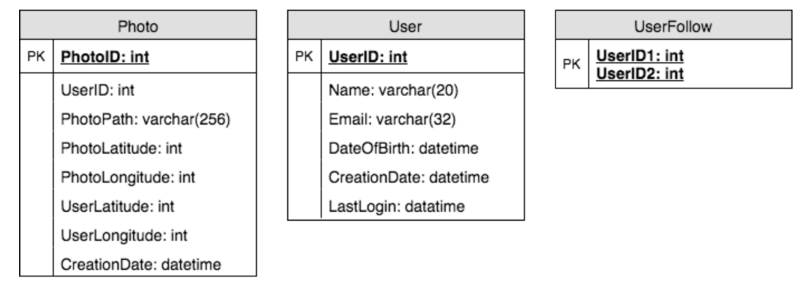

《Grokking System Design》 将系统设计的一本书

# Load Balancing

负载均衡，剔除异常节点等。 (random, round-robin, random with weighting for memory or cpu ulilization)

- Between user and web server
- Between web servers and internal platform layer
- Between internal platform layer and databases

ways to implement load balancing:

1. Smart clients
2. Hardware Load Balancers (设备一般比较贵)
3. Sofrware Load Balancers (HAproxy, Nginx)


# Caching

1. Application server cache (应用层缓存)
2. Distributed cache (每个节点缓存部分数据)
3. Global cache
4. Content Distribution Network(CDN) 静态文件

Cache Invalidation: 缓存失效。解决缓存一直性问题

- Write-through cache: 数据同时写入缓存和数据库。如果写入量大太高有延迟
- Write-around cache: 旁路写入缓存。可能有缓存失效(cache miss)问题
- Write-back cache: 直接写缓存就返回，之后定期或者条件触发写入到数据库。支持高并发写入，但是可能数据会丢失

Cache eviction policies: (缓存剔除)

- First In First Out(FIFO)
- Last in First Out(LIFO)
- Least Recently Used(LRU)
- Most Recently Used(MRU)
- Least Frequently Used(LFU)
- Random Replacement(RR)


# Sharding or Data Partitoining

1. Partitioning Methods

- Horizontal partitioning
- Vertical Partitioning
- Directory Based Partitioning: create a lookup service, map between key to its DB server

2. Partitioning Criteria

- Key or hash-based partitioning
- List partitioning
- Round-robing partitioning
- Composite partitioning

3. Common Problems of Sharding

- Joins and Denormalication。比如通过数据冗余避免 join
- Referential integrity。避免外键约束，业务层做
- Rebalancing


# Indexes(索引)

rapid random lookups and efficient access of ordered records

- 数据库索引 (B+树形结构)
- hash 索引 (kv存储)
- 倒排索引 (ElasticSearch搜索引擎)


# Proxies

A proxy server is an intermediary piece of hardware/software that sits between the client and the back-end server.
It receives requests from clients and relays them to the origin servers. Typically, proxies are used to filter requests or log requests,
or sometimes transform requests (by adding/removing headers, encrypting/decrypting, or compression).
Another advantage of a proxy server is that its cache can serve a lot of requests. If multiple clients access a particular resource, the proxy server can cache it and serve all clients without going to the remote server.

(batch several request into one)


# Queues

- 削峰填谷
- 解耦


# Redundancy and Replciation

- 避免单点故障。出故障 failover 转移
- shared-nothing architecture


# SQL vs NoSQL

- SQL: store data in rows and columns. Mysql, Postgres, SQLite
- Nosql:
  - key-value stores: Redis,Dynamo
  - Document Database: MongoDB, CouchDB
  - Wide-Column Database: 列式存储。大数据集分析。HBase, Cassandra
  - Graph Database: 地理位置存储。 Neo4J, InfiniteGraph

区别：

- Schema: sql需要固定的 schema，nosql 可以不需要
- Querying: SQL vs UnQL(unstructured query language)
- Scalability: nosql 方便水平扩展
- Reliablility or ACID。 nosql 为了性能和扩展性牺牲了 ACID 特性

Reasons to use SQL database:

- 保证 ACID ，比如金融和财务场景
- 数据是结构化和非易变的

Reasons to use NoSQL database:

- 大数据量无结构
- 云端计算和存储
- 快速开发


# CAP Theorem
三者最多只能满足两个

- Consistency: All nodes see the same data at the same time. Consistency is achieved by updating several nodes before allowing further reads.
- Availability: Every request gets a response on success/failure. Availability is achieved by replicating the data across different servers.
- Partition tolerance: System continues to work despite message loss or partial failure. A system that is partition-tolerant can
  sustain any amount of network failure that doesn’t result in a failure of the entire network.
  Data is sufficiently replicated across combinations of nodes and networks to keep the system up through intermittent outages.


# Consistent Hashing

普通的 hash 有什么缺点：

- 不是水平扩展的。增加或者删除节点导致之前映射失效
- 无法负载均衡，有数据倾斜问题

一致性哈希可以降低增删节点时候的映射重新分配，更容易扩缩容。

As a typical hash function, consistent hashing maps a key to an integer. Suppose the output of the hash function is in the range of [0, 256).
Imagine that the integers in the range are placed on a ring such that the values are wrapped around.

Here’s how consistent hashing works:
1. Given a list of cache servers, hash them to integers in the range.
2. To map a key to a server,
    - Hash it to a single integer.
    - Move clockwise on the ring until finding the first cache it encounters.
    - That cache is the one that contains the key. See animation below as an example: key1 maps to cache A; key2 maps to cache C.

为了防止数据倾斜，一致性哈希引入了"vritual replicas" 虚拟节点，让一个机器节点映射到多个虚拟节点上。


# Long-Polling vs Websockets vs Server-Sent Events

- Long-Polling: ajax 轮询
- Websockets: 全双工
- Server-Sent (SSEs)


# System Design Interviews(SDI): A step by step guide (系统设计步骤)

高并发、高性能、高可用

### 1. Requirements clarifications (需求陈述)

- Here are some questions for designing Twitter that should be answered before moving on to next steps:
- Will users of our service be able to post tweets and follow other people? Should we also design to create and display user’s timeline?
- Will tweets contain photos and videos?
- Are we focusing on backend only or are we developing front-end too? Will users be able to search tweets?
- Do we need to display hot trending topics?
- Would there be any push notification for new (or important) tweets?

### 2. System interface definition (系统接口定义)
确保需求和理解一致，并定义好接口

- postTweet(user_id, tweet_data, tweet_location, user_location, timestamp, ...)
- generateTimeline(user_id, current_time, user_location, ...)
- markTweetFavorite(user_id, tweet_id, timestamp, ...)

### 3. Back-of-the-envelope estimationA (粗略估算)
估算系统的扩展性

- What scale is expected from the system (e.g., number of new tweets, number of tweet views, how many timeline generations per sec., etc.)?
- How much storage would we need? We’ll have different numbers if users can have photos and videos in their tweets.
- What network bandwidth usage are we expecting? This would be crucial in deciding how would we manage traffic and balance load between servers.

### 4. Defining data model (数据模型定义)
比如类似推特的服务设计：

- User: UserID, Name, Email, DoB, CreationData, LastLogin, etc.
- Tweet: TweetID, Content, TweetLocation, NumberOfLikes, TimeStamp, etc.
- UserFollowos: UserdID1, UserID2
- FavoriteTweets: UserID, TweetID, TimeStamp

考虑应该用 sql 还是 nosql 等存储？

### 5. High-level design (高层设计)
画出来系统设计图，大概 5-6 个盒子图表示关键组件(服务、数据库、缓存等交互)。

### 6. Detailed design (细节设计)
优缺点、技术选型，挑选两三个组件详细介绍

- Since we’ll be storing a huge amount of data, how should we partition our data to distribute it to multiple databases? Should we try to store all the data of a user on the same database? What issue can it cause?
- How would we handle hot users, who tweet a lot or follow lots of people?
- Since user’s timeline will contain most recent (and relevant) tweets, should we try to store our data in such a way that is optimized to scan latest tweets?
- How much and at which layer should we introduce cache to speed things up?
- What components need better load balancing?

### 7. Identifying and resolving bottlenecks (识别改善瓶颈)
单点故障、副本、监控等维度。

- Is there any single point of failure in our system? What are we doing to mitigate it?
- Do we’ve enough replicas of the data so that if we lose a few servers, we can still serve our users?
- Similarly, do we’ve enough copies of different services running, such that a few failures will not cause total system shutdown?
- How are we monitoring the performance of our service? Do we get alerts whenever critical components fail or their performance degrade?


# Designing a URL Shortening service like TinyURL (短网址系统)

### 1. Why do we need URL shortening?

缩短网址、追踪用户访问、网址隐藏

### 2. Requirements and Goals of the System

Functional Requirements:

1. Given a URL, our service should generate a shorter and unique alias of it.
2. When users access a shorter URL, our service should redirect them to the original link.
3. Users should optionally be able to pick a custom alias for their URL.
4. Links will expire after a specific timespan automatically; users should also be able to specify expiration time.

Non-Functional Requirements:

1. The system should be highly available. This is required because if our service is down, all the URL redirections will start failing.
2. URL redirection should happen in real-time with minimum latency.
3. Shortened links should not be guessable (not predictable).

Extended Requirements:

1. Analytics, e.g., how many times a redirection happened?
2. Our service should also be accessible through REST APIs by other services.

### 3. Capacity Estimation and Constraints

- Traffic estimates: 500 million / (30 days * 24 hours * 3600 seconds) ~= 200 URLs/s; 50 billion / (30 days * 24 hours * 3600 sec) ~= 19K/s
- Storage estimates: 500 million * 5 years * 12 months = 30 billion; 30 billion * 500 bytes = 15 TB
- Bandwidth estimates: 200 * 500 bytes = 100 KB/s; 19K * 500 bytes ~= 9 MB/s
- Memory estimates: 19K * 500 bytes ~= 9 MB/s;  缓存20% 0.2 * 1.7 billion * 500 bytes ~= 170GB

Assuming 500 million new URLs per month and 100:1 read:write ratio, following is the summary of the high level estimates for our service: 上边的列个表格

### 4. System APIs

```
creatURL(api_dev_key, original_url, custom_alias=None user_name=None, expire_date=None)
deleteURL(api_dev_key, url_key)
```

### 5. Database Design

URL表(URL)： OriginURL(varchar 512), CreationDate(datetime), ExpirationDate(datetime), UserID(int)

用户表(User): Name(varchar 20), Email(varchar 32), CreationDate(datetime), LastLogin(datetime)

可以用 nosql (Dynamo or Cassandra)，用 nosql 不要直接在 URL 表存用户 id，单独一个表存关系。

### 6. Basic System Design and Algorithm

如何生成短网址的最后 6 位。 比如 http://tinyurl.com/jlg8zpc。 提供两种方式：

1. 先计算唯一 hash，不如md5，之后编码base62/base64等。这里可以用 md5 + base64 之后取前面 6 位，如果冲突了可以取别的位置
   或者交换字符。

2. Generateing keys offline。预计算好放到库里。

### 7. Data Partitioning and Replication

- range based partitioning
- hash based partitioning

### 8. Cache

Memcache 缓存经常访问的 url。LRU 剔除算法比较好。

### 9. Load Balancer(LB)
简单的 round robin 就可以，更好的是根据机器负载智能做均衡

### 10. Purging or DB cleanup
- 惰性删除过期的 url。
- 定期删除
- 所有 url 加上固定的 2 年默认过期

### 11 .Telemetry
根据用户、访问时间、地理位置等做分析。

### 12. Security and Permissioins
设置不同用户的访问策略


# Designing Instagram (图片分享服务)

### 1. Why Instagram?

支持上传分享图片和视频，关注他人。每个用户时间线(timeline)包括其关注的高热度图片。

### 2. Requirements and Goals of the System

Functional Requirements

1. Users should be able to upload/download/view photos.
2. Users can perform searches based on photo/video titles.
3. Users can follow other users.
4. The system should be able to generate and display a user’s timeline consisting of top photos from all the people the user follows.

Non-functional Requirements

1. Our service needs to be highly available.
2. The acceptable latency of the system is 200ms for timeline generation.
3. Consistency can take a hit (in the interest of availability), if a user doesn’t see a photo for a while, it should be fine.
4. The system should be highly reliable, any photo/video uploaded should not be lost.

### 3. Some Design Considerations
The system would be read-heavy, so we will focus on building a system that can retrieve photos quickly.

1. Practically users can upload as many photos as they like. Efficient management of storage should be a crucial factor while designing this system.
2. Low latency is expected while reading images.
3. Data should be 100% reliable. If a user uploads an image, the system will guarantee that it will never be lost.

### 4. Capacity Estimation and Constraints
- Let’s assume we have 300M total users, with 1M daily active users.
- 2M new photos every day, 23 new photos every second.
- Average photo file size => 200KB
- Total space required for 1 day of photos 2M * 200KB => 400 GB
- Total space required for 5 years: 400GB * 365 (days a year) * 5 (years) ~= 712 TB

### 5. High Level System Design
Image Hosting System, Image Storage, Image Metadata

### 6. Database Schema



图片可以存储在 HDFS or S3(亚马逊云)

### 7 Component Design
图片读取和写入分离。

### 8 Reliability and Redundancy
通过冗余避免单点失败

### 9. Data Sharding

- Partitioning based on userID
- Partitioning based on photoID

### 10. Ranking and Timeline Generation
需要把用户关注的最新和最热的相关图片生成时间线。

- 预先计算。专用服务持续生成用户的时间线然后存在 UserTimeline 表，只需要查询这张表即可。

1. pull。客户端拉取时间线，大部分时间如果没有更新就拉取了空数据
2. push。服务端推送数据。用户关注太多会比较耗时
3. hybrid。推拉结合

### 11. Timeline Creation with Sharded Data
photoID 包含时间信息方便排序

### 12 Cache and Load balancing
cdn + lru cache


# Designing Dropbox (文件存储)

### 1. Why Cloud Storage
方便跨设备和系统同步

- availability
- reliablility and durability
- scalability

### 2. Requirements and Goals of the System
What do we wish to achieve from a Cloud Storage system? Here are the top-level requirements for our system:

1. Users should be able to upload and download their files/photos from any device.
2. Users should be able to share files or folders with other users.
3. Our service should support automatic synchronization between devices, i.e., after updating a file on one device, it should get synchronized on all devices.
4. The system should support storing large files up to a GB.
5. ACID-ity is required. Atomicity, Consistency, Isolation and Durability of all file operations should be guaranteed.
6. Our system should support offline editing. Users should be able to add/delete/modify files while offline, and as soon as they come online, all their changes should be synced to the remote servers and other online devices.

Extended Requirements

- The system should support snapshotting of the data, so that users can go back to any version of the files.


### 3. Some Design Considerations

- We should expect huge read and write volumes.
- Read to write ratio is expected to be nearly the same.
- Internally, files can be stored in small parts or chunks (say 4MB), this can provide a lot of benefits e.g. all failed operations shall only be retried for smaller parts of a file. If a user fails to upload a file, then only the failing chunk will be retried.
- We can reduce the amount of data exchange by transferring updated chunks only.
- By removing duplicate chunks, we can save storage space and bandwidth usage.
- Keeping a local copy of the metadata (file name, size, etc.) with the client can save us a lot of round trips to the server.
- For small changes, clients can intelligently upload the diffs instead of the whole chunk.

### 4. Capacity Estimation and Constraints
- Let’s assume that we have 500M total users, and 100M daily active users (DAU).
- Let’s assume that on average each user connects from three different devices.
- On average if a user has 200 files/photos, we will have 100 billion total files.
- Let’s assume that average file size is 100KB, this would give us ten petabytes of total storage. 100B * 100KB => 10PB
- Let’s also assume that we will have one million active connections per minute.

### 5. High Level Design
- client
- block server -> cloud storage
- metadata serve -> metadata storage
- synchronization server

### 6. Component Design

#### a. client
  - upload and download files
  - detect fiel changes in the workspace folder
  - handle conflict due to offline or ocncurrent updates

优化：

- 如何高效传输？文件分块，部分更新的话可以节省带宽
- 本地需要保存远信息么？需要，可以离线更新
- 客户端如何监听其他客户端更新。http 长轮询

可以把客户端分成 4 个部分：

- internal metadata database
- chunker
- watcher
- indexer

#### b. metadata database
存储四个对象信息：chunks, files, users, devices

#### c. synchronization service
同步其他客户端和 server 信息。

#### d. message queing service
- request queue: clients requests to update metadata database sent to request queue first
- response queue: delivering the update messages to each client

#### e. cloud/block storage
stores chunks of files uploaded by the users

### 7. File Processing Workflow
1. Client A uploads chunks to cloud storage.
2. Client A updates metadata and commits changes.
3. Client A gets confirmation, and notifications are sent to Clients B and C about the changes.
4. Client B and C receive metadata changes and download updated chunks.

### 8. Data Deduplication(去重)
- post-process deduplication
- inline deduplication (计算 chunk md5)

### 9. Metadata Partitioning
- vertical partitioning
- range based partitioning
- hash-based partitioning

### 10. Caching
hot files/chunks, use memcache and lru

### 11. Load Balancer(LB)
- clients and block server
- clients and metadata servers

### 12. Security and Permissioins
storing permissions of each file in our metadata DB to reflect what files are visible or modifiable by user


# Designing Facebook Messenger

### 1. What is Facebook Messenger?
基于文本的实时消息服务

### 2. Requirements and Goals of the System

