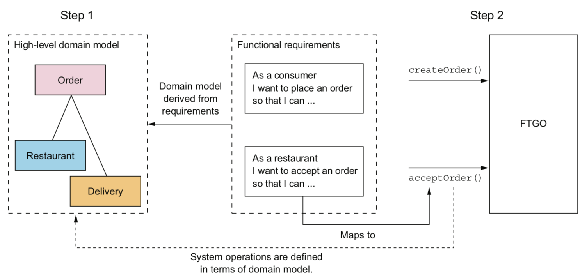

# 1. 逃离单体地狱

> 没有银弹。

微服务：把应用程序功能性分解为一组服务的架构风格。每个服务是一组专注的、内聚的功能职责组成。
每个服务是松耦合的，有自己的私有数据库，通过 API 通信。每个服务可以独立开发，部署，测试和扩展。

好处：

- 持续交付和部署
- 容易维护
- 独立部署，扩展
- 团队自治
- 实现和采纳新技术
- 更好的容错性

缺点：

- 服务拆分和定义是一项挑战（糟糕的是搞成了分布式单体应用）
- 分布式系统带来的各种复杂性，使开发、部署和测试变得更困难
- 跨服务开发需要协调多个团队。服务部署可能要按照依赖关系排序
- 什么阶段使用微服务？初创公司几乎都是从单体应用开始

模式：模式是针对特定上下文中发生的问题的可重用解决方案。

常用的模式结构包括；

- 需求:必须解决的问题和围绕这个问题的特定上下文环境。优先级排序
- 结果上下文。好处，弊端，问题。
- 相关模式：前导；后续，替代；泛化；特化

服务拆分相关模式：

- 根据业务能力分解，围绕业务功能组织服务
- 根据子域分解，子域围绕领域驱动设计(DDD)来组织服务

通信相关模式：

- 服务风格：哪一种 IPC
- 服务发现
- 可靠性
- 事务性消息：事件动作和数据库事务集成
- 外部 API

实现事务管理的数据一致性相关模式：Saga 模式

查询数据：CQRS（命令查询职责隔离）

部署模式：通过命令行或者界面部署和管理服务。部署平台往往基于虚拟机，容器

可观测性：

- 健康检查 API
- 日志聚合: 集中式日志服务器来检索和触发报警
- 分布式追踪：为外部请求分配唯一 ID，用于各个服务之间追踪
- 异常跟踪：异常发送到跟踪服务
- 应用指标：指标服务器
- 审计日志：记录用户行为

自动化测试相关模式：

- 消费端驱动的契约测试
- 消费端契约测试
- 服务组件测试

基础设置和边界问题：可观测性模式和服务发现模式

安全相关模式：API Gateway。 （访问令牌模式）

# 2. 服务的拆分策略

软件架构4+1(场景)视图模型：

- 逻辑视图
- 实现视图
- 进程视图
- 部署视图

什么是服务：单一的可独立部署的软件组件， 它实现了一些有用的功能。实现应用程序模块化，松耦合。

微服务的大小『不是』重要考虑因素。如果你的服务出发其他服务同步更新，可能没有实现松耦合。

### 2.2 为应用程序定义微服务架构

##### 2.2.1 识别系统操作

- 定义系统操作。起点是用户需求，包含用户故事和相关用户场景。
  - 1. 创建由关键类组成的抽象领域模型，这些关键类提供了用于系统操作的词汇表
  - 2. 确定系统操作， 并根据领域模型描述每个系统操作的行为
    - 命令型：创建，更新或者删除数据。命令对应的参数，返回值和行为（行为包括前置条件和后置条件）
    - 查询型：查询和读取数据的系统操作

##### 2.2.2 根据业务能力进行服务拆分

业务能力：能为公司或组织产生价值的商业活动。

- 供应商管理
- 消费者管理
- 订单或者和执行
- 会计记账
- 其他

##### 2.2.3 根据子域进行服务拆分

领域驱动设计

领域的边界称为限界上下文(bounded context)

##### 2.2.4 拆分的指导原则

单一职责: 改变类应该只有一个理由

闭包原则: 包中包含的所有类应该是对同类变化的一个集合。

##### 2.2.5 拆分单体为微服务的难点

- 网络延迟。批处理
- 同步进程间通信导致可用性降低
- 服务之间维持数据一致性。Saga
- 获取一致的数据视图
- 上帝类。整个应用程序中使用到的全局类

##### 2.2.6 定义服务 API

- 把系统操作分配给服务
- 确定支持服务协作所需要的 API

# 3. 微服务架构中的进程间通信

### 3.1 进程间通信

交互方式两个纬度：

- 一对一
- 一对多

- 同步
- 异步

API 演化:

- 语义化版本控制。MAJOR.MINOR.PATCH

消息格式：

- 文本。json/xml，易于修改
- 二进制

### 3.2 基于同步远程过程调用模式的通信

- REST

rest 没有 IDL，但是有 Open API 规范。
grpc 不太好处理获取多个资源的情况

- gRPC

使用二进制格式的 Protocol Buffers

- 使用断路器模式处理局部故障：断路器在连续失败次数超过指定阈值的一段时间内，这个代理会立即拒绝其他调用。

开发可靠的远程过程调用代理：

- 网络超时
- 限制客户端向服务器发出请求的数量
- 断路器模式：失败超过一定阈值就启动断路器，让后续调用立刻失败。之后客户端继续尝试，如果调用成功，则解除断路器.

Netflix Hystrix 是 个实现这些和其它模式的开源库。

从服务失效故障中恢复

- 返回错误
- 返回默认值或者缓存响应

##### 3.2.4 使用服务发现

两种模式

- 服务及其客户直接与服务注册表交互
- 通过部署基础设置来处理服务发现(更推荐)

### 3.3 基于异步消息模式的通信

- 点对点
- 发布订阅

- 无代理架构: ZeroMQ

- 基于代理的消息

Apache ActiveMQ/RabbitMQ/Apache Kafka，还有基于云的消息服务 AWS Kinesis, SQS 等。

##### 3.3.5 处理并发和消息顺序

通常使用分片键让消息落到同一个分片，而且该分片中的消息始终由同一个接收方实例读取，保证按顺序处理这些消息。

##### 3.3.6 处理重置消息
大部分消息代理保证至少一次

- 编写幂等消息处理程序。
- 跟踪消息并处理重复项。比如在数据库中记录message id 来去重。

##### 3.3.7 事务性消息

数据库更新和消息发送都必须在事务中进行。

- 使用数据表作为消息队列（事务性发件箱）
- 通过轮询模式发布事件
- 使用事务日志拖尾(tailing)模式发布事件
  - Debezium
  - LinkedIn Databus
  - DynamoDB streams
  - Eventuate Tram

### 3.4 使用异步消息提高可用性

同步消息会降低可用性。（要求依赖的所有同步服务都可用）

# 4 使用 Saga 管理事务

Saga 这个术语最早出现在一篇研究数据库事务的论文当中。

### 4.1 微服务下的事务管理

传统方式式采用分布式事务 XA，XA 采用两阶段提交 。

一个Saga表示需要更新多个服务中数据的一个系统操作。Saga由一连串的本地事务组成。
每一个本地事务负责更新它所在服务的私有数据库。

挑战：缺乏隔离；回滚更改

如果一个事务失败了，必须通过补偿事务撤销之前的更新。

### 4.2 Saga 的协调模式

- 协同式(choreography)
- 编排式(orchestration)

### 4.3 解决隔离问题

Saga包含三种类型事务：

- 可补偿性事务
- 关键性事务
- 可重复性事务

# 5. 微服务架构中的业务逻辑设计

事务脚本模式通常是实现简单业务逻辑的好方法，复杂业务逻辑应该考虑面向对象的领域模型模式。

创建或者更新聚合时应当发布领域事件。

# 6. 使用事件溯源开发业务逻辑

什么是事件溯源：以事件为中心的技术，用于实现业务逻辑和聚合的持久化。聚合作为一系列事件存储在数据库中。
每个事件代表聚合的状态变化。聚合的业务逻辑围绕生成和使用这些事件的要求而构建。

event_id, event_type, entity_type, entity_id, event_data

幂等方式处理消息：可以使用相同的消息多次安全低调用消息接收方

# 7. 在微服务架构中实现查询

通常两种模式：

- API 组合模式：让拥有数据的服务的客户端负责调用服务，并组合服务返回的查询结果。(优先使用)
- CQRS(命令查询职责隔离)模式：维护了一个或者多个视图数据库，唯一目的是支持查询。

API组合模式弊端：

- 额外开销
- 可用性降低风险。如果服务挂了，可以返回默认数据，缓存的数据，或者不完整数据
- 缺乏事务数据一致性

# 8 外部 API 模式

使用 API 的客户端一共有四种：
- web 应用程序
- 浏览器 js 程序
- 移动应用(iOS/Android)
- 第三方开发人员编写的应用程序

移动网络（和互联网）的延迟通常是局域网的100倍。

API Geteway 模式：API Geteway是一种服务，该服务是外部 API 客户端进入基于微服务应用程序的入口点。
负责请求路由，API 组合，身份验证，流量控制，速度限制等功能。负责请求路由，API 组合和协议转换。

- 请求路由：类似 nginx 反向代理
- API 组合：提供粗粒度 API 暴露给客户端
- 协议转换：客户端协议和内部协议转换
- 边缘功能：身份验证，访问授权，速率限制，缓存，指标收集，请求日志

API Geteway 使用分层模块化架构，API 层由每个客户端单独的模块实现，公共层处理公有功能，比如身份验证。

后端前置：为每种类型的客户端实现单独的 API Gateway。

- 好处: 封装了应用程序内部结构，减少客户端和应用程序之间的往返次数，简化客户端代码
- 弊端：必须开发、部署和管理的高可用组件

Netflix Faclor

API Gateway 设计难题：

- 性能和可扩展性
- 使用响应式编程抽象编写可维护的代码。Futures 库
- 处理局部故障。API Gateway  在调用服务时使用断路器模式。
- 服务发现，监控等

使用：

- 现成的  API Gateway 产品或者服务。灵活性低，几乎不支持 API 组合
  - AWS API Gateway
  - 产品化的 API Gateway: Kong , Traefik。需要自己运维
- 使用 API Gateway 框架或者 web 框架自己开发
  - 实现定义路由规则的机制以简化复杂代码
  - 正确实现 HTTP 代理行为，包括如何处理 HTTP 头
  - Netflix Zuul(实现边缘路由功能), Spring Cloud Zuul
  - Spring Cloud Gateway

使用GraphQL 来实现 API Gateway

# 9. 微服务架构中的测试策略(上)

测试用例：用于特定目标的一组测试输入、执行条件和预期结果。

验证被测系统（System under Test, SUT)，一组相关的测试用例集构成一个测试套件（test suite)

自动化测试通常包含4个阶段：

- 设置环境
- 执行测试
- 验证结果
- 清理环境

测试金字塔：

- 端到端测试
- 组件测试
- 集成测试
- 单元测试

两种类型的测试替身(test double)： 桩(stub)和模拟(mock)。

- stub: 代替依赖项来向被测系统发送调用的返回值
- mock: 验证被测系统是否正确调用了依赖项

# 10. 微服务架构中的测试策略(下)

### 10.1 编写集成测试

### 10.2 编写组件测试

使用 Gherkin 编写组件测试

- 进程内组件测试：常驻内存的桩和 mock 代替依赖的服务
- 进程外组件测试：使用比如 docker 之类的来运行服务。

### 10.3 端到端测试

# 11 开发面向生产环境的微服务应用

安全性、可配置性、可观测性

### 11.1 开发安全的服务

- 身份验证：密码或者 api 密钥
- 访问授权：角色和访问控制
- 审计：跟踪用户所有操作
- 安全的进程间通信：tls 加密

三个关键思想：

- API Gateway 负责验证客户端身份
- API Gateway 和服务使用透明令牌(比如JWT)来传递有关主体的信息
- 服务使用令牌获取主题的身份和角色

### 11.2 设计可配置的服务

- 推送模型: 通过在部署设施类似操作系统环境变量或者配置文件的方式，将配置属性传给服务实例
- 拉取模型: 从配置服务器读取需要的配置属性
 

##### 使用基于推送的外部化配置

比如指定 docker 容器环境变量，然后应用启动的时候去读取。

缺点: 如果配置更新了，需要重启服务才能读取到新的环境变量。配置分散到了众多服务当中。

##### 使用基于拉取的外部化配置

多种方法可以实现配置服务器：

- 版本控制系统，比如git
- sql 和 nosql 数据库
- 专用配置服务器。比如国内携程开源的 Apollo。 Sprint Cloud Config Server, Hashicorp Vault, AES Parameter Store

优点：

- 集中配置，容易管理
- 敏感数据透明解密
- 动态重新配置。轮询检测等

### 11.3 设计可观测的服务

##### 健康检查 API (公开返回服务运行状况的接口)

`GET  /health`

- 实现健康检查: 一种简单方法是实例是否可以访问其他外部基础设施服务
- 调用健康检查: 配置基础设施以调用接口

##### 日志聚合（集中式日志记录服务器，提供搜索和告警）

服务如何生成日志：

- 日志库。很多语言都有内置或者第三方库
- 记录的位置：写入到文件系统通常不是最好的方法，服务应该把日志输出到 stdout，由基础设施决定如何处理日志的输出

日志聚合的基础设施(聚合日志，存储日志和搜索日志），流行的 ELK 套件：

- Elasticsearch: 面向文本搜索的 NoSQL 数据库，用作日志记录服务器
- Logstash：聚合服务日志并将其写入 Elasticsearch 日志流水线
- Kinana: Elasticsearch 可视化工具

##### 分布式跟踪

为每一个在服务之间跳转的外部请求分配唯一 ID，并在提供可视化和分析的集中式服务器中记录它如何从一个服务流向下一个服务。

使用追踪工具类库： 使用拦截器或者 AOP(面向切面编程). Spring Cloud Sleuth

分布式追踪服务器：流行的是 Open Zipkin

##### 应用程序指标(服务运维指标，公开给指标服务器)

监控和告警。 基础设施指标（cpu，内存，磁盘利用率）; 应用程序指标（请求延迟和请求数）；业务指标（订单数等）

指标定期采样，指标样本具有三个属性：

- 名称
- 值：数值
- 时间戳：样本的时间

收集服务层面的指标：使用框架或者第三方库的 api 

把指标发送给指标服务器：推送或者拉取。 Prometheus 使用的就是拉取模型,通过 Grafna 查看指标。还可以设置告警

##### 异常跟踪（报告异常，比如 sentry 之类的）

sentry 就挺好用

##### 审核日志记录（记录用户操作）

主要存储在数据表中

- 审计日志
- AOP
- 事件溯源

### 使用微服务基底模式开发服务

微服务基底是处理这些问题的框架或者一组框架。

比如 java的 Spring Boo / Spring Cloud。golang 的 go-kit, go-micro。缺点是这些都和语言绑定。

服务网格(service mesh): 把所有进出服务的网络流量通过一个网络层进行路由，这个网络层负责解决包括断路器，
分布式追踪，服务发现，负载均衡和基于规则的流量路由等具有共性的需求。

当前 service mesh 实现：

- Istio
- Linkerd (最成熟)
- Conduit

# 12 部署微服务应用

生产环境必须实现4个功能：

- 服务管理接口: 开发人员可以创建、更新和配置服务。理想情况下这个接口是一个可供命令行和图形部署工具调用的 rest api
- 运行时服务管理：确保始终运行所需数量的服务实例。崩溃重启
- 监控：服务正在做什么？日志文件；应用指标
- 请求路由：用户请求路由到服务

### 12.1 部署模式：基于语言特定的发布包格式

可以执行的 JAR/WAR 文件

好处：

- 快速部署
- 高效的资源利用

缺点：

- 缺乏技术栈的封装
- 无法约束服务实例消耗的资源
- 服务之间缺少隔离
- 难以自动判定放置服务实例的位置

尽量避免使用，除非所获效率的价值远在其他所有考量之上

### 12.2 部署模式：将服务部署为虚拟机

作为虚拟机镜像打包的服务部署到生产环境中，每个服务实例都是一个虚拟机。

优点：封装了技术栈；服务实例隔离；使用成熟云计算基础设施；

缺点：资源利用率低；部署速度慢；系统管理开销

### 12.3 服务部署为容器

将作为容器镜像打包的服务部署到生产环境，每个服务实例都是一个容器。

容器镜像：由应用程序和运行服务所需的依赖软件组成的文件系统镜像

好处：封装技术栈；实例隔离；资源受限

弊端：大量容器镜像管理工作

### 12.4 使用 Kubernets 部署

docker 编排框架，是 docker 之上的一个软件层，将一组计算机硬件资源转变为用于运行服务的单一资源池。

- 资源管理: 一组计算机视为 cpu、内存和存储卷构成的资源池，将计算机集群视为一台计算机
- 调度: 选择要运行容器的机器
- 服务管理：负载均衡，滚动升级等

Istio 服务网格

### 12.5 Serverless 部署

AWS Lambda

# 13 微服务架构的重构策略

### 13.1 重构需要考虑的问题

单体应用：交付缓慢；充满故障；可扩展性差

不要试图做『一步到位，推倒重来』式的改造。

绞杀者应用模式。

- 尽早并且频繁体现出价值。先把高价值部分迁移到微服务
- 尽可能减少对单体的修改
- 部署基础设施还为时过早。推迟投资到基础设施建设

### 13.2 重构为微服务的策略

- 新功能实现为服务
- 隔离表现层和后端
- 通过将功能提取到服务中分解单体

### 13.3 设计服务与单体的协作方式

### 13.1.1 设计集成胶水

- 设计集成胶水API 
- 设计交互方式和进程间通信
- 设计反腐层（不同领域模型之间进行转换）
- 发布和订阅领域事件

### 在服务和单体之间维持数据一致性

### 处理身份认证和访问授权

- jwt
