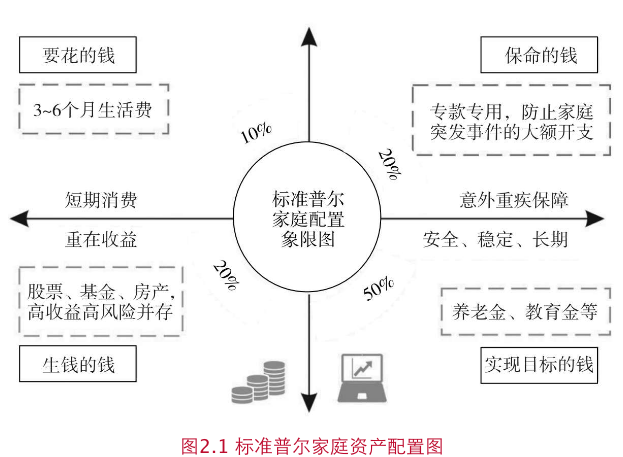

兴全基金理财实验室的书籍《这样做，迈出理财第一步》读书笔记

# 1. 开始理财投资，认真对待你的钱

“逐乐投资”：挣不到钱，为了参与乐趣。

复利三大要点：本金、增长率和时间。

七二法则：一笔投资通过复利，增值 1 倍所需要的时间为 72 除以该投资年化收益所得的商。
假设投资 100万想要变成 200 万，年化收益 10%的情况下，大概需要 7.2 年；如果年化 5%，大概 14.4 年。

逆向投资。

理财的不确定性让人畏惧不前，关在在于第一步。

- 评估 风险承受能力
- 根据自己的实际情况指定投资目标。保守、稳健、平衡、激进
- 构建投资组合。
- 寻找优质基金构建组合

# 2. 像选择伴侣一样选择基金

更长周期看，选择基金比择时重要。
投资之前先了解自己的风险偏好。大部分投资者可以分为投资型、储蓄型、消费型和负债型。

风险偏好：保守型、稳健型、平衡型、成长型、进取型。测试了一下自己目前是成长型(R1-R4)。
R1(货币市场基金)，R2（普通债券基金），R3（股票、混合、可转债基金），R4(), R5(大宗商品基金)。
针对风险承受能力，寻找对应风险等级的性价比最高的产品。寻找适合自己的投资方式，严控风险，长久获利。

基金的分类：

- 股票型：投资股票比例不低于 80%
- 债券型：债券比例不低于 80%，主要投资对象是国债、金融债、企业债、公司债、可转债等
- 混合型：同时购买股票和债券
- 货币型：主要投资 1 年以后的债务工具，比如短期国债、商业票据、大额可转让存单、逆回购等。收益稳定，“准储蓄”产品
- 商品类：黄金等大宗商品
- QDII：境外资本市场的股票、债券、货币、商品等
- FOF: 投资其他基金的基金

分散投资：确定股票投资和安全资产的分配比例

- 第一层是在股票型、债券型、货币型之间确定比例
- 第二层是在同一类资产中选择不同的产品和权重，形成组合

桥水基金-瑞.达利欧: 用户 15-20 个良好的，不相关的回报流，能大大降低风险，又不减少预期收益。

资产配置的原则是相关性较低的资产，比如股债平衡。

家庭资产配置图，根据情况动态配置：

- 要花的钱，或者 3-6 个月生活费。一般放在货币基金
- 保命钱。20%。解决突发事件，比如失业，重大疾病
- 钱生钱。一般 20%。创造收益。适当高风险获取高回报
- 实现目标的钱。50%。 人生阶段目标。养老金、教育基金。长期稳健增值

### 如何选基？

历史业绩、第三方评级、基金经理、投研平台、风险指标

- 历史业绩：持久力而不是爆发力。历史业绩不代表未来，但是营销机构还是喜欢宣传。冠军魔咒。

  - 坚决长期持有一只业绩稳定且投资风格持续稳定的基金，远比在不同基金之间换来换去，随波逐流收益高
  - 债券型基金。4433 法则
  - 货币型基金：不可唯收益论。安全性、便利性、收益性

- 夏普比率：除了收益，还要关注风险。超额收益和风险之比
- 最大回撤：简易有效的风险指标。

  - 回撤：某一段时间产品净值从最高点回落到最低点的幅度。
  - 最大回撤：某一个历史时间点后推，产品净值走到最低点时的收益率回撤幅度最大值。

- 评级机构。比如晨星评级机构。目前有 7 大评级机构。
- 基金经理。选择优秀的基金经理，跳槽率?
- 基金公司：后台背景怎么样？整体业绩才是团队实力的表现。

  - 权益型基金：关注平台选股能力
  - 固收型基金：规模效应明显。平台优势、规模效应、信用研究框架、风控能力
  - 内参指标：基金经理和公司自己买了么？

### 基金界的新生儿 FOF

基金中的基金，不低于 80% 投资其他基金。

CDR: 人民币购买国外上市公司股票

### 私募基金

面向特定投资者。

# 3. 投资实战：选择买入和卖出时点

逆向投资不是每个人都能控制好。重要的是资产配置，胜过择时。

### 择时困境

- 市场难以预测。
  - 不要预测股市。
  - 择时需要对抗人性，让你感觉好的投资常常是错的。
  - 不是择时都没有价值，尤其是追寻大概率正确的时候
  - 羊群效应。

- 会买的是徒弟，会卖的是师傅。
  - 寻找合适的买点不等于最低点
  - 好基金下跌可能是一个好时机
  - 市场狂热时，谨慎入场
  - 经济低估是挑选股票好时机。足够防御性、安全边际、增长能力强的公司；下一次经济高涨期领头羊公司

- 卖点
  - 心理学上有"确认偏差"。避免不一致现象，只相信自己相信的。及时修正错误，理性投资者
  - 基金赎回信号1：股市泡沫破裂。当心暴跌风险。基金公司研报是否有提示风险
  - 基金赎回信号2：投资团队信任危机。连续三年排名是后 1/4考虑更换。基金经理自身职业操守(老鼠仓)
  - 基金赎回信号3：基金风格严重水土不服。等下一波风口，不如选择一只表现稳定且可以长期战胜市场的基金

- 频繁交易：收益的隐形杀手
  - 频繁交易手续费高
  - 涨跌趋势更难判断。季度报公布的是上一季度末该基金十大重仓股和债券持仓。
  - 长期投资。买入并长期持有价值被低估且有竞争优势的公司。闲钱投资
  - 持久 8 年以上亏损概率几乎为 0。A 股周期大概 3-5 年
  - 选择优秀的长跑基金：评级机构（3-5 年收益和夏普比率）；坚持长期持有；

- 打赢投资心理战。
  - 好的投资理念有助于长期的投资过程中受益
  - 正确管理好投资恐惧。
    - 恐惧亏损。闲钱投资、控制仓位、分散品种
    - 恐惧立场。一个是获利不愿了结，一个是亏损不愿意离场。理性决策，根据企业的基本面和未来发展变化决定
    - 恐惧错过机会。不要投资不懂的东西，赚自己理解的钱，能力圈。
  - 摆脱情绪影响，盯紧基金投资的“仪表盘”。（易得性直觉），根据数据理性决策。
  - 钝感力。不要对风吹草动过分敏感
  - 远离傲慢与偏见。盲目偏见和过度自信，对市场保持敬畏，市场“是怎样”和“会怎样”比“应该怎样”更重要，接受市场比试图和市场博弈更明智。
  - 格雷厄姆的书《聪明的投资者》。有耐心、独立思考、情绪稳定(驾驭情绪）、对人性和机构的行为有敏锐洞察力。钟摆效应
  - 伟大投资者的特质。独立思考、情绪稳定、对人性和机构的行为特点有敏锐洞察力。

- 基金套住了怎么办
  - 投资标的价格回归内在价值。市场长期是称重机
  - 震荡行情不妨清点投资。关注长期业绩稳定良好

- 如何区分“短期波动“ 还是 ”止损信号“
  - 基金亏损，需要关注基金经理投资水平而不是下跌幅度。和同期基准比较，如果长期垫底考虑割肉更换
  - 市场波动因素。热点流失导致亏损，建议离场
  - 亏损时审视自己。投资的初衷和目的，是否和自己的初衷和理念背离，及时反省和调整。
  - 大跌怎么办？真正优质的公司最终还会涨回来。反思资产质量。大跌也许是"拔掉叶草种鲜花"的好机会。
  - 大跌真的可怕至极么？大跌反而是买入优质公司股票好机会。大跌一般两种情形：估值过高；经济预期悲观
  - 大跌如何应对。反思手中资产的质量，抛弃劣质资产，重新寻找物美价廉的资产；学会等待，等到牛市来临。
  - 心态最重要，决定结果的不是头脑而是毅力。选择长期表现优异的基金，中长期出色，少有“大起大落”，更经得起时间考验
  - 浮亏是不是真亏？只要没割肉就不是真亏，这种自我安慰是自欺欺人。区分正常波动和永久损失风险(基本面变差)，避免永久本金亏损

- 基金定投：无招胜有招
  - 均摊成本，平抑风险。定投尤其适用于震荡行情
  - 克服人性弱点，拒绝追涨杀跌
  - 妙手难觅，俗手易行。找到足够的安全边际，比抓住一只牛股更重要

- 这样定投，收益更高
  - 红利再投资长时间看来收益更高（除非不看好后来的市场，就选择现金分红落袋为安）
  - 价值平均法。每个定投期增长固定的额度。动态定投

# 4. 买基金有哪些坑

### 买基金如何稳赚不赔--关于基金投资的误解

- 买基金能一夜暴富么？ 基金是一种稳健的增值工具，适合长期投资，不要有幻想一夜暴富的心态，不良心态会影响你的投资结果。
- 投资和投机：投资不是拼一时之快，而是遵守严格的纪律。如何平衡目标收益和风险
- 债券基金也不是稳赚不赔，债券波动幅度远小于股票，风险相对较小。
- 定投一定稳赚不赔？震荡向下市场中会持续出现账面浮亏，不用过于担忧。定期对基金”体检“，比较业绩基准决定是否要赎回。

### 投资中自己挖的坑

- 净值越低越值得买？涨跌和净值没有相关性，不要”恐高“。重要的是对基金经理和投研团队的选择，同事参考长期收益表现。净值高低都是浮云
- 很多人喜欢买净值低的基金，其实和收益毫无关系。买入和卖出的理由只有一个，就是公司的基本面发生了变化
- 不要喜新厌旧。跟风往往买在高点
- 很多人抢一定是好产品？好发难做，难发好做。对市场要有判断，不要在高点认购，敢于在低位布局。明白爆款之后的原因，不要被误导

### 买在最低点，卖在最高点。市场涨跌引起的投资幻觉

- 牛市思维让你在下跌中遭受损失，熊市思维让你错误良机。正反两面思考，不断检视，资产配置，控制风险，控制仓位(25%-75%)
- 重仓股大跌是赎回信号么？应该充分信任管理人的投资能力。犯错不可怕，从错误中学习。
- 基金应该买涨不买跌么？审慎判断，理性分析。很多时候下跌反而是好的买入时机
- 亏钱的基金要割肉么？行为偏差：拔掉鲜花浇灌野草。忘掉投资成本，客观分析。（主动基金的经理会进行调仓）。分清优劣，不要捂着差的基金不放手
- 跌了 50%要等涨回来了？许多投资者被套以后会失去理性操作的能力，甚至放弃操作。等着一只很差的基金解套是非理性的。警惕”心理账户“的影响
- 买入及今后可以一劳永逸么？不可取
  - 流动性需求。如果需要取出，可以根据比例分别取出
  - 风险承受能力改变。考虑业绩赎回差的
- 基金经理不会回答你的那些事
  - 没有人能预测明天涨跌，但是专业者能够判断长期价格走势。抓住大概率准确的投资机会
- 分红是发红包么？羊毛出在羊身上，持币还是持基的问题。上涨行情，持基的回报大于持币，否则持基的风险大于持币。
- 业绩冠军值得买么？历史业绩不代表未来；基金经理换了
- 短跑冠军能赢么？冠军魔咒，持续表现占据中上就已经可以脱颖而出
- 根据排名选择基金的正确方式。
  - 关注持续收益。路遥知马力
  - 关注兄弟基金表现。基金公司的综合实力，留心一枝独秀
  - 星级
  - 风险调整后收益。夏普比率等
- 曾经优秀，今年业绩差是不是不行了？长跑冠军不一定是常胜将军。一旦碰到了优秀的基金经理，就不要轻易放弃
- 指数基金更赚钱？A 股有效性不强波动大，散户多，很多基金经理可以跑赢指数，不像美股 (我近期A股基金的投资策略已经逐渐放弃指数)
- 高风险一定高收益？更高的投资风险不一定高收益，而是更加不确定的结果。较高收益和更大亏损的可能。

### 基金冷门小知识

- 基金能当成股票投资么？不能，相信基金经理的能力，不要频繁交易，手续费比股票更贵。
- 基金的ABC (不同类型含义不同)
  - 股票、混合型AB: 分级基金（将要退出历史舞台）
  - 货币基金 ABCE：起购门槛的差别
  - 费率 ABC：A 前端收费，申购当日申购费，赎回收取赎回费；B 后端收费，赎回收取赎回费，持有越长，费用越低。C
  不收取申购赎回费，仅按日计算销售服务费
- 基金会永远存续？业绩差清盘；商业模式问题；合并同类

# 5. 知己知彼，走进基金公司

### 一只基金的 24 小时

- 内部组织：投资研究、市场销售、中后台支持。
- 核心价值：投资研究能力。 研究员 -> 基金经理助理 -> 基金经理

### 如何充分获得基金公司信息

- 官网；基金数据库 万得资讯

### 如何读懂基金公司报告

- 基金赚了多少钱？看净值
- 基金经理的购物车：看重仓的投资组合，基金经理的投资思路和操作习惯
- 看持有人结构：机构和投资者占比，持有人多的一般口碑较好
- 投资回顾和后市展望。比如兴全基金在 2015 年第一季度公开表明了对市场泡沫的关注
